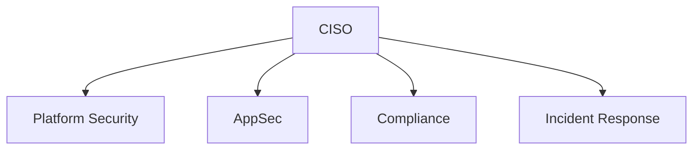
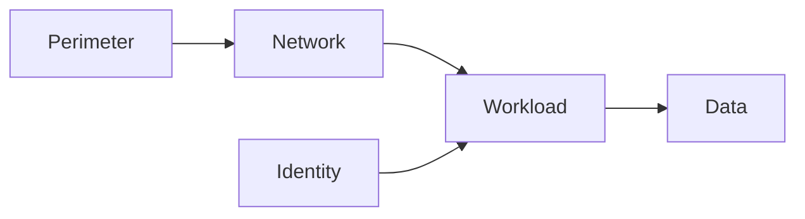
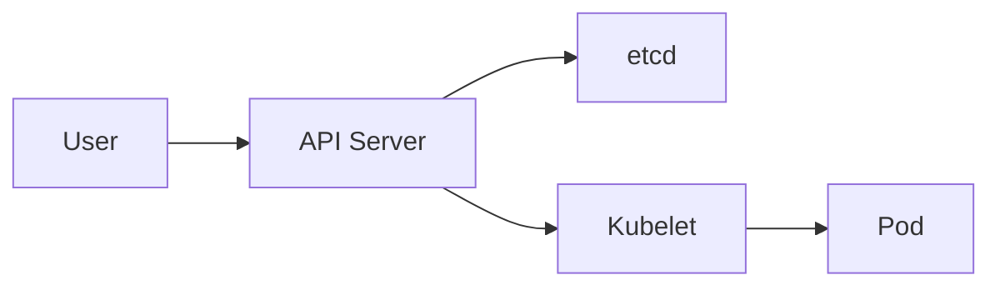

# Security Mastery

Comprehensive Kubernetes and cloud-native security learning track. Covers identity, network, supply chain, runtime, policy-as-code, zero-trust, and compliance — from kindergarten analogies to architect-level program design.

## Files in this folder

| File | Audience | Purpose |
|------|----------|---------|
| `README.md` | All | Index and orientation |
| `architect-qa.md` | Senior/Staff/Architect | 60+ Q&A on multi-tenant, supply chain, SLSA L3, OIDC, secret rotation, runtime detection, zero-trust, compliance, IR |
| `eli10.md` | Beginners | Security explained for 10-year-olds with analogies and hands-on commands |
| `visual-flows.md` | All | 10 mermaid flowcharts of decision paths and trust flows |

## Sibling folders (deep-dive modules)

```
06-security/
  01-rbac-deep-dive/
  02-pod-security-admission/
  03-network-policies/
  04-secrets-management/
  05-image-security/
  06-policy-as-code/
  07-runtime-security/
  08-supply-chain/
  09-cluster-hardening/
  10-secrets-in-ci/
  11-zero-trust-mesh/
  12-compliance/
  cheatsheet.md
```

## Org chart



## Learning path

1. Start with `eli10.md` to build mental models for RBAC, NetworkPolicy, secrets, mTLS, admission control, SLSA.
2. Walk through `visual-flows.md` to internalize how requests flow through authn, authz, admission, network, and supply chain.
3. Drill the deep-dive folders (01 through 12) for hands-on labs and YAML.
4. Finish with `architect-qa.md` to convert hands-on knowledge into program-level decisions.

## Core domains

- Identity and access: RBAC, ABAC, OIDC, ServiceAccounts, IRSA, Workload Identity, SPIFFE/SPIRE
- Network: NetworkPolicy, Cilium, service mesh mTLS, egress gateways, zero-trust
- Workload: Pod Security Admission, seccomp, AppArmor, capabilities, read-only root
- Supply chain: signed images, SBOMs, SLSA, in-toto attestations, admission verification
- Secrets: External Secrets Operator, Vault, KMS, sealed-secrets, rotation pipelines
- Runtime: Falco, Tetragon, eBPF, audit logs, behavioral detection
- Policy as code: OPA Gatekeeper, Kyverno, validating/mutating admission webhooks
- Compliance: PCI DSS, HIPAA, SOC 2, FedRAMP, ISO 27001, CIS benchmarks
- Incident response: detection, containment, eradication, recovery, postmortem

## Defense-in-depth model



## Quick command reference

```bash
# RBAC inspection
kubectl auth can-i --list --as=system:serviceaccount:ns:sa
kubectl get rolebindings,clusterrolebindings -A -o wide

# Pod Security
kubectl label ns app pod-security.kubernetes.io/enforce=restricted

# Network policies
kubectl get netpol -A
kubectl describe netpol default-deny -n app

# Image signing and verification
cosign sign --key cosign.key registry/app:tag
cosign verify --key cosign.pub registry/app:tag

# SBOM and CVEs
syft registry/app:tag -o spdx-json > sbom.json
trivy image --severity CRITICAL,HIGH registry/app:tag
grype registry/app:tag

# Runtime
kubectl logs -n falco -l app=falco --tail=200
tetra getevents -o compact

# Policy
kubectl get constrainttemplates
kubectl get clusterpolicies   # kyverno

# Secrets
kubectl get externalsecrets -A
vault kv list secret/app
```

## Threat model summary

| Threat | Control |
|--------|---------|
| Stolen kubeconfig | Short-lived OIDC tokens, audit, MFA on IdP |
| Container escape | seccomp default, drop CAP_SYS_ADMIN, gVisor/Kata for untrusted |
| Supply chain attack | Signed images, SLSA L3 build, admission verify, SBOM scan in CI |
| Lateral movement | Default-deny NetworkPolicy, mTLS, namespace isolation |
| Secret leak | External Secrets, no plaintext in git, rotation, KMS-encrypted etcd |
| Privilege escalation | PSA restricted, no hostPath, no privileged, RBAC least privilege |
| Cryptojacking | Falco rules for crypto-mining, egress controls, resource limits |
| Data exfiltration | Egress gateways, DLP, audit logging, anomaly detection |

## Trust boundaries



## Compliance crosswalk

| Control area | PCI DSS | HIPAA | SOC 2 |
|--------------|---------|-------|-------|
| Access control | 7, 8 | 164.312(a) | CC6.1 |
| Encryption | 3, 4 | 164.312(e) | CC6.7 |
| Logging | 10 | 164.312(b) | CC7.2 |
| Vuln mgmt | 6, 11 | 164.308(a)(8) | CC7.1 |
| IR | 12.10 | 164.308(a)(6) | CC7.3 |

## How to use this folder

- New engineer: read README, eli10, visual-flows, then 01 through 04.
- Platform engineer: focus on 02, 03, 06, 09, 11.
- AppSec engineer: focus on 05, 08, 10, 12.
- Architect: read architect-qa end to end, then map answers to your org context.
- On call: keep cheatsheet.md plus visual-flows.md open during incidents.

## Maturity model

| Level | Signals |
|-------|---------|
| L1 ad-hoc | RBAC mostly default, no NetworkPolicy, secrets in git |
| L2 managed | RBAC reviewed, namespace isolation, External Secrets |
| L3 defined | PSA enforced, default-deny netpol, signed images |
| L4 measured | Runtime detection live, SLSA L2, SBOM in CI, audit pipeline |
| L5 optimized | SLSA L3, zero-trust mesh, automated IR, continuous compliance |

## Next steps

Open `eli10.md` to start the learning track.

## Glossary

| Term | Meaning |
|------|---------|
| RBAC | Role-Based Access Control — who can do what on which resource |
| ABAC | Attribute-Based Access Control — policies on attributes, less common in K8s |
| OIDC | OpenID Connect — federated identity tokens, used for human and workload auth |
| IRSA | IAM Roles for Service Accounts — EKS feature mapping K8s SA to AWS IAM |
| SPIFFE | Universal workload identity spec |
| SPIRE | Reference implementation of SPIFFE |
| SVID | SPIFFE Verifiable Identity Document — X.509 or JWT |
| SLSA | Supply-chain Levels for Software Artifacts — build integrity framework |
| SBOM | Software Bill of Materials — list of components in an artifact |
| CVE | Common Vulnerabilities and Exposures — public vuln IDs |
| PSA | Pod Security Admission — built-in K8s standard |
| OPA | Open Policy Agent — policy engine, often via Gatekeeper |
| eBPF | Kernel programmability used by Cilium, Falco, Tetragon |
| mTLS | Mutual TLS — both sides present certs |
| KMS | Key Management Service — cloud key custody |
| WORM | Write Once Read Many — tamper-evident log storage |

## Recommended reading order

1. README (this file)
2. eli10.md
3. visual-flows.md
4. 01-rbac-deep-dive
5. 03-network-policies
6. 04-secrets-management
7. 02-pod-security-admission
8. 05-image-security
9. 06-policy-as-code
10. 07-runtime-security
11. 08-supply-chain
12. 09-cluster-hardening
13. 10-secrets-in-ci
14. 11-zero-trust-mesh
15. 12-compliance
16. architect-qa.md

## Common interview themes

- Walk me through what happens when I run kubectl apply
- How would you design multi-tenant isolation
- Describe SLSA L3 and how to reach it
- Explain mTLS handshake and SPIFFE identity
- How do you rotate secrets without downtime
- Detect vs prevent — which controls are which
- What is the blast radius of a compromised node
- How do you do forensics on a deleted pod
- Compare Kyverno vs Gatekeeper vs PSA
- Explain defense in depth in your last cluster

## Anti-patterns to call out

- Running `kubectl apply` in CI with cluster-admin
- Mounting hostPath for "just one debugging tool"
- Long-lived static cloud credentials in CI
- NetworkPolicy in audit mode forever
- Vault tokens with `*` policy
- Image scanning at deploy only, never continuously
- One ServiceAccount used by multiple apps
- Mutating webhooks editing resources without audit trail
- `imagePullPolicy: Always` with mutable tags (no digest pinning)
- Self-hosted GitHub runners with persistent state

## Tooling map

| Layer | Tools |
|-------|-------|
| RBAC review | rbac-tool, rakkess, kubectl-who-can |
| Policy | Kyverno, Gatekeeper, Polaris |
| Image | Trivy, Grype, Snyk, Clair |
| Sign/Attest | Cosign, Notary v2, Rekor |
| SBOM | Syft, CycloneDX, SPDX |
| Runtime | Falco, Tetragon, Tracee |
| Network | Cilium, Calico, Istio, Linkerd |
| Secrets | Vault, External Secrets, Sealed Secrets |
| Compliance | Drata, Vanta, Secureframe, kube-bench |
| Forensics | sysdig, kube-forensics, kubectl debug |
