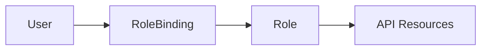
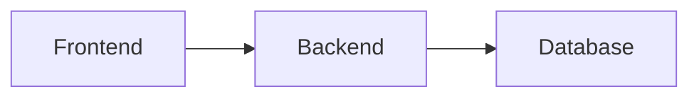
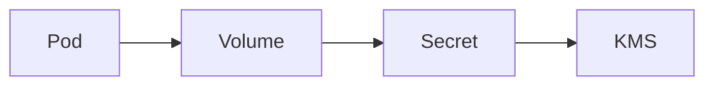
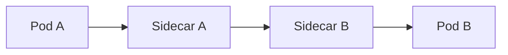
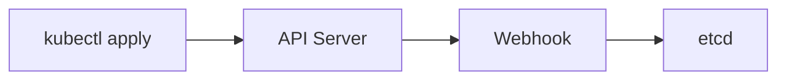
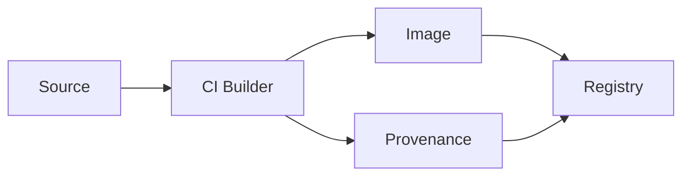
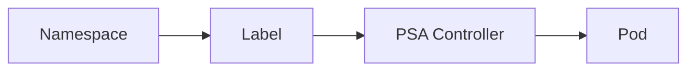
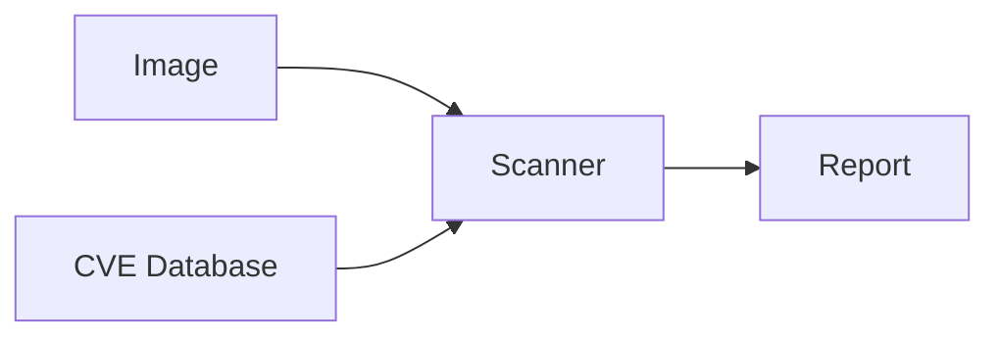
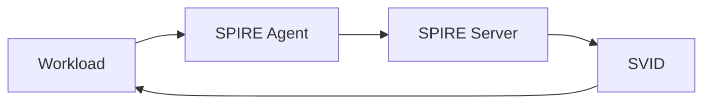
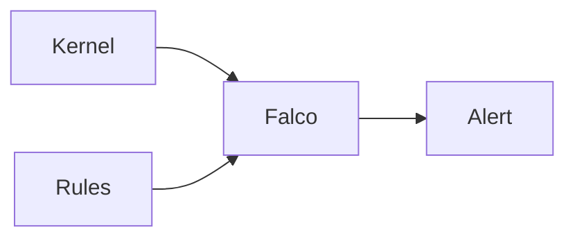

# Security for 10-Year-Olds (ELI10)

Security stuff explained like you're 10. Each idea has an analogy, the real thing, a tiny diagram, and commands you can actually run.

---

## 1. RBAC = different keys for different rooms

### Analogy
Imagine a school. The art teacher has a key to the art room. The science teacher has a key to the science lab. The principal has a master key. Nobody walks around with every key — that would be dangerous if they lost it.

### Real thing
RBAC (Role-Based Access Control) gives each person or robot a small set of permissions. A "Role" is the keyring. A "RoleBinding" hands the keyring to someone.

### Diagram


### Try it
```bash
# Make a role that can only read pods
kubectl create role pod-reader --verb=get,list --resource=pods -n demo

# Give it to a user
kubectl create rolebinding read-pods --role=pod-reader --user=alice -n demo

# Check what alice can do
kubectl auth can-i list pods --as=alice -n demo   # yes
kubectl auth can-i delete pods --as=alice -n demo # no
```

### Trap
Never make someone `cluster-admin` "just for now". That's the master key. They'll keep it forever.

---

## 2. NetworkPolicy = list of friends who can talk to you

### Analogy
You're at lunch. You have a rule: only kids from your class can sit at your table. Everyone else has to sit somewhere else. That rule is a NetworkPolicy.

### Real thing
NetworkPolicy says: "pods with this label can receive traffic only from pods with that label, on these ports." Without one, every pod talks to every pod.

### Diagram


### Try it
```bash
# Default deny: nobody talks to anyone in the namespace
kubectl apply -f - <<EOF
apiVersion: networking.k8s.io/v1
kind: NetworkPolicy
metadata:
  name: default-deny
  namespace: demo
spec:
  podSelector: {}
  policyTypes: [Ingress, Egress]
EOF

# Allow frontend to call backend
kubectl apply -f - <<EOF
apiVersion: networking.k8s.io/v1
kind: NetworkPolicy
metadata:
  name: front-to-back
  namespace: demo
spec:
  podSelector:
    matchLabels: { app: backend }
  ingress:
  - from:
    - podSelector:
        matchLabels: { app: frontend }
    ports:
    - port: 8080
EOF
```

### Trap
You need a CNI that supports NetworkPolicy (Calico, Cilium). On a CNI that ignores it, the rules do nothing — silently.

---

## 3. Secret = locked diary

### Analogy
Your diary has a tiny lock. You write your feelings inside. Your sister can see the diary on the shelf, but she cannot read it without the key. The key is hidden.

### Real thing
A Secret holds passwords or tokens. K8s base64-encodes it (not secure!) and stores it. Encryption-at-rest in etcd is the real lock.

### Diagram


### Try it
```bash
# Make a secret
kubectl create secret generic db-pass --from-literal=password=hunter2 -n demo

# Mount and read it
kubectl run app -n demo --image=busybox --command -- sleep 3600
kubectl set volume pod/app -n demo --add --name=pwd --type=secret --secret-name=db-pass --mount-path=/etc/db
kubectl exec -n demo app -- cat /etc/db/password
```

### Trap
Never put a Secret in a git repo as plain YAML. Use SealedSecrets or External Secrets.

---

## 4. mTLS = secret handshake

### Analogy
Two friends in a club have a secret handshake. When one walks up, they do the handshake. If you don't know the handshake, you don't get in. And both sides check — it's not just a one-way thing.

### Real thing
mTLS (mutual TLS) means both server and client show certificates. The server proves it's the real server. The client proves it's an allowed client. A service mesh does this for every pod-to-pod call automatically.

### Diagram


### Try it
```bash
# Install Linkerd (simplest mesh)
linkerd install --crds | kubectl apply -f -
linkerd install | kubectl apply -f -

# Inject sidecars into a namespace
kubectl annotate ns demo linkerd.io/inject=enabled

# Roll deployments to pick up the sidecar
kubectl rollout restart deploy -n demo

# See the traffic with mTLS
linkerd viz tap deploy/frontend -n demo
```

### Trap
Probes from kubelet are not in the mesh. Either use exec probes or allow probe traffic to bypass.

---

## 5. Admission webhook = bouncer at the door

### Analogy
A nightclub has a bouncer. Before you go in, the bouncer checks your ID, your shoes, your shirt. If anything's off, you don't get in. The bouncer can also hand you a wristband (mutate you) before letting you through.

### Real thing
A ValidatingWebhook says yes/no to every API request. A MutatingWebhook can change the request before it's stored. OPA Gatekeeper and Kyverno are popular bouncers.

### Diagram


### Try it
```bash
# Install Kyverno
kubectl create -f https://github.com/kyverno/kyverno/releases/latest/download/install.yaml

# Block any pod without resource limits
kubectl apply -f - <<EOF
apiVersion: kyverno.io/v1
kind: ClusterPolicy
metadata: { name: require-limits }
spec:
  validationFailureAction: Enforce
  rules:
  - name: check-limits
    match:
      any:
      - resources: { kinds: [Pod] }
    validate:
      message: Containers must set resource limits.
      pattern:
        spec:
          containers:
          - resources:
              limits: { memory: ?*, cpu: ?* }
EOF
kubectl run nolimit --image=nginx   # should fail
```

### Trap
Webhook down = API server slow or stuck. Always set `failurePolicy: Ignore` for non-critical, `Fail` only for must-have.

---

## 6. SLSA = tamper-evident packaging on cookies

### Analogy
You buy cookies at the store. The bag has a special seal. If someone opened it and put in something gross, the seal would be broken and you'd see. Also there's a sticker that says which factory made them.

### Real thing
SLSA (Supply-chain Levels for Software Artifacts) attaches signed proof (provenance) to every build. You can verify "this image was built by our trusted CI from this source commit, nothing else."

### Diagram


### Try it
```bash
# Sign keylessly with sigstore (uses your OIDC token)
cosign sign registry/myapp:v1

# Generate SBOM and attach as attestation
syft registry/myapp:v1 -o spdx-json > sbom.json
cosign attest --predicate sbom.json --type spdx registry/myapp:v1

# Verify before deploy
cosign verify --certificate-identity-regexp=.*@mycompany.com \
  --certificate-oidc-issuer https://accounts.google.com registry/myapp:v1

# Scan for known holes
trivy image --severity HIGH,CRITICAL registry/myapp:v1
```

### Trap
A signature only proves who signed it, not that the contents are good. Pair signing with vuln scanning and policy.

---

## 7. Pod Security = playground rules

### Analogy
The playground has rules. No running with scissors. No climbing the fence. No bringing matches. Some kids get a pass for the woodshop (they can use sharp things) but the regular playground has strict rules.

### Real thing
Pod Security Admission has three levels: privileged (anything goes — woodshop), baseline (no scissors), restricted (no scissors, no matches, helmet on). Apply per namespace.

### Diagram


### Try it
```bash
# Lock down a namespace
kubectl label ns demo pod-security.kubernetes.io/enforce=restricted

# Try a privileged pod (should be denied)
kubectl run -n demo bad --image=nginx --privileged
```

### Trap
`restricted` requires non-root, seccomp, dropped caps. Many off-the-shelf images break. Test before enforcing.

---

## 8. Image scanning = food safety inspector

### Analogy
A food inspector visits the bakery and checks every batch for problems before it ships to stores. If they find mold, they don't let it ship.

### Real thing
Trivy or Grype scans container images for known vulnerable libraries (CVEs). You run it in CI to fail bad builds and at runtime to find new problems in already-deployed images.

### Diagram


### Try it
```bash
trivy image nginx:1.21
grype nginx:1.21
trivy image --severity CRITICAL --exit-code 1 nginx:1.21   # fail CI on critical
```

### Trap
A scanner can only find what its database knows. Update the DB daily. Zero-day vulns are invisible.

---

## 9. SPIFFE = ID badge for robots

### Analogy
At a big office, every worker wears a badge. The badge has their name, what team they're on, and what floors they can visit. Robots (workloads) need badges too.

### Real thing
SPIFFE gives each workload a verifiable identity (SVID), like `spiffe://company/ns/payments/sa/api`. SPIRE issues and rotates these automatically.

### Diagram


### Try it
```bash
kubectl exec -n demo app -- /opt/spire/bin/spire-agent api fetch x509
```

### Trap
SPIRE setup is non-trivial. Most teams get SPIFFE for free via Istio or Linkerd.

---

## 10. Runtime detection = home alarm

### Analogy
Your house has motion sensors. If someone breaks a window or sneaks in at night, the alarm goes off. You can't prevent every break-in, but you can know fast.

### Real thing
Falco watches every process, file, and network event in your cluster. Rules say "alert if someone runs a shell inside a container."

### Diagram


### Try it
```bash
helm install falco falcosecurity/falco -n falco --create-namespace
kubectl run shell --image=busybox -- sh -c 'sleep 600'
kubectl exec shell -- sh
kubectl logs -n falco -l app.kubernetes.io/name=falco --tail=20
```

### Trap
Default rules will be noisy. Plan a tuning sprint in week two.

---

## What to do next

1. Run all the commands in a throwaway kind/minikube cluster.
2. Open `visual-flows.md` to see how requests travel through these pieces.
3. Read `architect-qa.md` when you start designing for a real org.
