# Visual Flows — Security

10 simple mermaid flowcharts showing how requests, decisions, and trust flow through Kubernetes and cloud-native security systems. Each chart has a brief explanation, follow-up notes, and the relevant kubectl/cosign commands.

---

## 1. kubectl request — authn to authz to admission to etcd

<!-- mermaid:rendered -->
<p align="center"></p>

<details><summary>Mermaid source</summary>

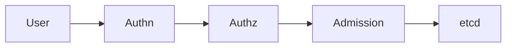

</details>

The full path of any `kubectl apply`. Authn proves who you are (cert, token, OIDC). Authz checks RBAC. Admission validates and mutates. Then store.

**Failure modes**
- Authn fails: 401 Unauthorized
- Authz fails: 403 Forbidden
- Admission denies: webhook error message
- etcd unavailable: 500

**Commands**
```bash
kubectl auth whoami
kubectl auth can-i create pods -n demo
kubectl get --raw /api/v1/namespaces/demo/pods --v=8
```

---

## 2. RBAC authorization decision

<!-- mermaid:rendered -->
<p align="center"></p>

<details><summary>Mermaid source</summary>

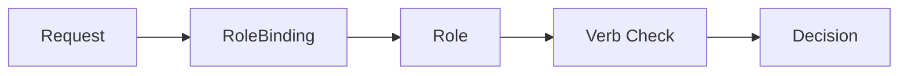

</details>

Every request maps to subject + verb + resource. RBAC walks every (Cluster)RoleBinding for the subject and unions the rules.

**Default**: deny. Explicit allow required.

**Commands**
```bash
kubectl auth can-i --list --as=system:serviceaccount:demo:app
kubectl get clusterrolebindings -o wide | grep alice
kubectl describe role pod-reader -n demo
```

---

## 3. Admission policy decision (Kyverno or Gatekeeper)

<!-- mermaid:rendered -->
<p align="center"></p>

<details><summary>Mermaid source</summary>

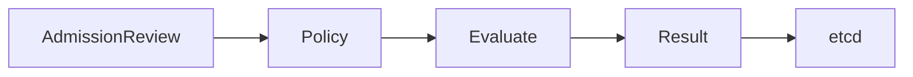

</details>

API server sends AdmissionReview to webhook. Policy engine evaluates against rules. Allow/deny/mutate returned.

**Failure policy** decides what happens if the webhook is unreachable: `Ignore` (allow) or `Fail` (deny).

**Commands**
```bash
kubectl get clusterpolicies
kubectl get policyreports -A
kubectl get validatingwebhookconfigurations
```

---

## 4. NetworkPolicy traffic decision

<!-- mermaid:rendered -->
<p align="center"></p>

<details><summary>Mermaid source</summary>

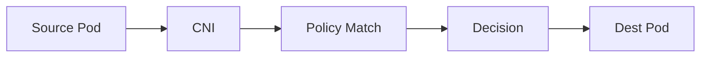

</details>

CNI evaluates ingress/egress rules per pod label. Default = allow if no policy targets the pod, deny if any policy selects it (without matching the rule).

**Common pattern**: apply default-deny to namespace, then allowlist intentional flows.

**Commands**
```bash
kubectl get netpol -A
kubectl describe netpol default-deny -n demo
kubectl exec -n demo client -- nc -zv backend 8080
```

---

## 5. Image signing flow (cosign keyless)

<!-- mermaid:rendered -->
<p align="center"></p>

<details><summary>Mermaid source</summary>

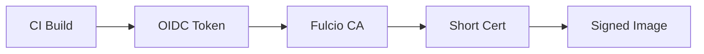

</details>

CI presents OIDC identity to Fulcio, gets a short-lived signing certificate, signs the image. Signature stored in registry next to image. Rekor logs the event for transparency.

**Commands**
```bash
cosign sign registry/app:v1
cosign verify --certificate-identity-regexp=.*@company.com \
  --certificate-oidc-issuer https://token.actions.githubusercontent.com \
  registry/app:v1
```

---

## 6. Image admission verification

<!-- mermaid:rendered -->
<p align="center"></p>

<details><summary>Mermaid source</summary>

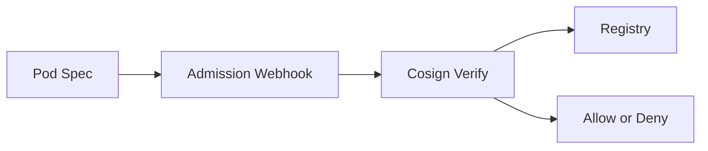

</details>

Sigstore policy controller (or Kyverno verifyImages) intercepts pod creates, fetches signature from registry, verifies against allowed identity, allows only if signed by expected builder.

**Commands**
```bash
kubectl get clusterimagepolicies
kubectl run unsigned --image=docker.io/random/unverified
```

---

## 7. Secret pull from external store (External Secrets Operator)

<!-- mermaid:rendered -->
<p align="center"></p>

<details><summary>Mermaid source</summary>

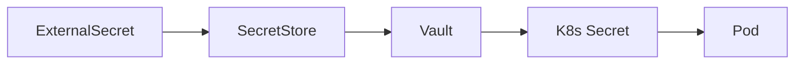

</details>

ExternalSecret references a SecretStore which holds connection + auth to Vault/AWS SM/etc. ESO polls or watches, writes a native K8s Secret, pod consumes via volume.

**Commands**
```bash
kubectl get externalsecrets -A
kubectl describe externalsecret app-creds -n demo
vault kv get secret/demo/app
```

---

## 8. SPIFFE attestation flow

<!-- mermaid:rendered -->
<p align="center"></p>

<details><summary>Mermaid source</summary>

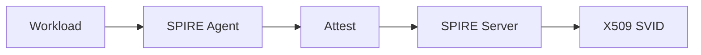

</details>

Agent on each node attests workload (via k8s_psat selector: namespace, SA, image). Server issues SVID. Workload uses SVID for mTLS or to authenticate to Vault, DB, mesh.

**Commands**
```bash
kubectl exec -n demo app -- /opt/spire/bin/spire-agent api fetch x509
kubectl logs -n spire spire-server-0
```

---

## 9. OIDC token exchange (workload to AWS via IRSA)

<!-- mermaid:rendered -->
<p align="center"></p>

<details><summary>Mermaid source</summary>

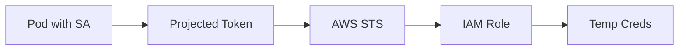

</details>

Pod has a projected SA token (audience = sts.amazonaws.com). SDK calls AssumeRoleWithWebIdentity, AWS validates token signature against cluster OIDC issuer JWKS, returns 1h credentials.

**Commands**
```bash
kubectl get sa app -n demo -o yaml
aws sts get-caller-identity
aws iam get-role --role-name eks-demo-app
```

---

## 10. Runtime detection alert pipeline

<!-- mermaid:rendered -->
<p align="center"></p>

<details><summary>Mermaid source</summary>

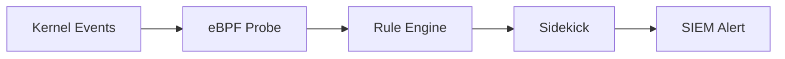

</details>

Falco/Tetragon hooks kernel via eBPF, evaluates rules in userspace (Falco) or in-kernel (Tetragon), forwards to falcosidekick which routes to SIEM, Slack, PagerDuty.

**Commands**
```bash
kubectl logs -n falco -l app.kubernetes.io/name=falco --tail=100
tetra getevents -o compact
curl -s http://falcosidekick:2801/healthz
```

---

## How to use these diagrams

- During design reviews, draw the flow for the proposed change. If you can't, the design is incomplete.
- During incidents, the flow tells you where to look. A 403 means stop at step 2 of flow 1.
- When teaching, walk left-to-right for each flow before showing YAML.

## Combined trust chain (everything together)

<!-- mermaid:rendered -->
<p align="center"></p>

<details><summary>Mermaid source</summary>

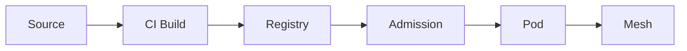

</details>

End-to-end: code goes to CI, CI builds and signs image, registry stores image plus signature plus attestations, admission verifies signature and policy at deploy, pod runs with workload identity and mTLS via mesh.

## Failure mapping

| Symptom | Likely flow | Where to look |
|---------|-------------|---------------|
| 401 from kubectl | Flow 1 step 2 | IdP, kubeconfig, cert expiry |
| 403 from kubectl | Flow 2 | RBAC bindings for subject |
| Pod denied at create | Flow 3 or 6 | webhook logs, policy reports |
| Pod cannot reach service | Flow 4 | netpol describe, CNI logs |
| Image rejected | Flow 6 | cosign verify locally |
| Secret missing | Flow 7 | ExternalSecret status, store auth |
| Cannot assume role | Flow 9 | STS errors, OIDC provider thumbprint |
| No alerts firing | Flow 10 | falco pod healthy, sidekick reachable |

## Suggested practice

Pick one flow per week. Draw it from memory on a whiteboard. Then run the commands to confirm each step is healthy in your cluster. After ten weeks, you can debug any security incident by mentally walking the flow.
