# Thanos Architecture

Thanos extends Prometheus with **infinite retention**, **global query**, and **deduplication** across HA pairs.

```mermaid
flowchart TB
    subgraph Cluster1
        P1[Prometheus] --- SC1[Thanos Sidecar]
    end
    subgraph Cluster2
        P2[Prometheus] --- SC2[Thanos Sidecar]
    end

    SC1 -->|2h blocks| S3[(Object Storage<br/>S3 / GCS / Azure)]
    SC2 -->|2h blocks| S3

    S3 --> COMPACT[Thanos Compactor<br/>downsample 5m, 1h]
    S3 --> STORE[Thanos Store Gateway<br/>fan-out reads]

    SC1 --> QUERIER[Thanos Querier<br/>StoreAPI fan-out]
    SC2 --> QUERIER
    STORE --> QUERIER
    QUERIER -->|dedup| GRAFANA[Grafana / API]

    QUERIER --> RULER[Thanos Ruler<br/>cross-cluster rules]
    RULER --> AM[Alertmanager]
```



## Components

| Component | Role |
|-----------|------|
| **Sidecar** | Runs next to each Prometheus. Uploads completed 2h TSDB blocks to object storage. Exposes recent data via StoreAPI for Querier. |
| **Store Gateway** | Reads historical blocks from object storage, exposes them via StoreAPI. |
| **Querier** | Stateless. Fans out PromQL to all StoreAPI endpoints, dedupes HA pairs by `external_labels`. |
| **Compactor** | Background process. Compacts blocks and **downsamples** (5m and 1h resolutions) for cheap long-range queries. |
| **Ruler** | Evaluates recording/alerting rules against the global view. |
| **Receive** | Optional. Accepts remote_write from Prometheus when sidecar isn't possible. |

## Why dedup matters

In HA you run **two identical Prometheus replicas** scraping the same targets. Without dedup, every query returns doubled series. The Querier sees their `replica` label differs and merges them.

Configure in Prometheus:
```yaml
global:
  external_labels:
    cluster: us-east-1
    replica: "0"   # one Prometheus is replica 0, the other is replica 1
```

Configure Querier:
```bash
thanos query --query.replica-label=replica
```

## Mimir comparison

| | Thanos | Mimir |
|---|--------|-------|
| Architecture | Bolt-on (Prometheus stays primary) | Replace storage; remote_write only |
| Ingest path | Sidecar uploads blocks every 2h | Synchronous remote_write |
| Multi-tenancy | Limited | First-class |
| Operational complexity | Medium | Higher (Cassandra-like) |
| Best for | Existing Prometheus fleet | Greenfield, SaaS-style |
