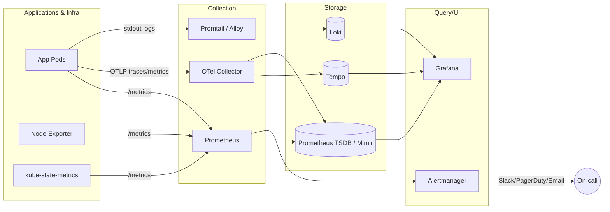

# 07 — Monitoring & Observability

Observability is the ability to ask **arbitrary questions** about your system **without shipping new code**. It rests on three pillars: **metrics, logs, traces** (plus events as a fourth signal).

## Why this matters

You cannot operate what you cannot see. Modern distributed systems fail in non-obvious ways — a slow database, a noisy neighbor, a partial outage. Observability turns "the site feels slow" into "p99 of `checkout` rose 4x because pod X is GC-thrashing."

## Architecture (data flow)

## Index

| # | Topic | Folder |
|---|-------|--------|
| 01 | Three Pillars: metrics, logs, traces, events; SLO/SLI/SLA | [01-three-pillars](./01-three-pillars/) |
| 02 | Prometheus: pull model, exporters, PromQL | [02-prometheus](./02-prometheus/) |
| 03 | Grafana: dashboards, panels, provisioning | [03-grafana](./03-grafana/) |
| 04 | Loki: log aggregation, LogQL | [04-loki](./04-loki/) |
| 05 | Tempo: distributed tracing | [05-tempo-tracing](./05-tempo-tracing/) |
| 06 | OpenTelemetry: SDK, collector, OTLP, semantic conventions | [06-opentelemetry](./06-opentelemetry/) |
| 07 | kube-prometheus-stack: full Helm bundle | [07-kube-prometheus-stack](./07-kube-prometheus-stack/) |
| 08 | Alerting: Alertmanager routing, silences, receivers | [08-alerting](./08-alerting/) |
| 09 | SLO Engineering: error budgets, burn rates | [09-slo-engineering](./09-slo-engineering/) |
| 10 | Cost & Cardinality: label hygiene, Thanos/Mimir | [10-cost-and-cardinality](./10-cost-and-cardinality/) |
| - | Quick reference | [cheatsheet.md](./cheatsheet.md) |

## Suggested learning path

1. Read `01-three-pillars` to internalize signals and SLO vocabulary.
2. Stand up Prometheus + Grafana from `02` and `03`.
3. Add logs (`04-loki`) and traces (`05-tempo-tracing`).
4. Replace ad-hoc instrumentation with OTel (`06`).
5. Productionize via `07-kube-prometheus-stack`, then layer alerting (`08`) and SLOs (`09`).
6. When bills hurt, return to `10-cost-and-cardinality`.
