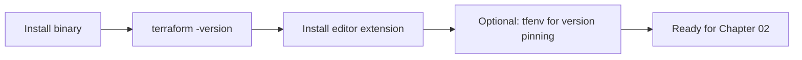

# 01 — Install Terraform

## macOS (Homebrew)
```bash
brew tap hashicorp/tap
brew install hashicorp/tap/terraform
terraform version
```

## Linux (apt)
```bash
wget -O- https://apt.releases.hashicorp.com/gpg | \
  sudo gpg --dearmor -o /usr/share/keyrings/hashicorp-archive-keyring.gpg
echo "deb [signed-by=/usr/share/keyrings/hashicorp-archive-keyring.gpg] \
  https://apt.releases.hashicorp.com $(lsb_release -cs) main" | \
  sudo tee /etc/apt/sources.list.d/hashicorp.list
sudo apt update && sudo apt install terraform
```

## Windows (Chocolatey)
```powershell
choco install terraform
terraform -version
```

## tfenv — manage multiple Terraform versions
Different projects often pin different TF versions. `tfenv` lets you switch.

```bash
brew install tfenv             # mac
# or: git clone https://github.com/tfutils/tfenv.git ~/.tfenv
#     export PATH="$HOME/.tfenv/bin:$PATH"

tfenv list-remote              # show available versions
tfenv install 1.9.8
tfenv install latest
tfenv use 1.9.8
tfenv list                     # installed versions
```

A `.terraform-version` file in your project pins the version automatically.

## OpenTofu (open-source fork)
```bash
brew install opentofu          # mac
# Linux: https://opentofu.org/docs/intro/install/
tofu version
```
`tofu` is a drop-in replacement for `terraform`. Same HCL, same providers, same registry. The only command difference is the binary name.

## Verify the install
```bash
terraform -help
terraform -version
# Terraform v1.9.8 on darwin_arm64
```

## Editor setup
- **VS Code:** install `HashiCorp Terraform` extension (HCL syntax, fmt-on-save, IntelliSense via `terraform-ls`).
- **Vim/Neovim:** `hashivim/vim-terraform` plugin.

<!-- mermaid:rendered -->
<p align="center"></p>

<details><summary>Mermaid source</summary>



</details>
## Troubleshooting
| Symptom | Fix |
|---|---|
| `command not found: terraform` | Binary not on `$PATH`. Re-open shell or `export PATH="$PATH:/path/to/terraform"`. |
| `Error: Failed to query available provider packages` | Network/proxy issue or wrong `required_providers` version. |
| `tfenv use X` does nothing | Run `tfenv install X` first. |
