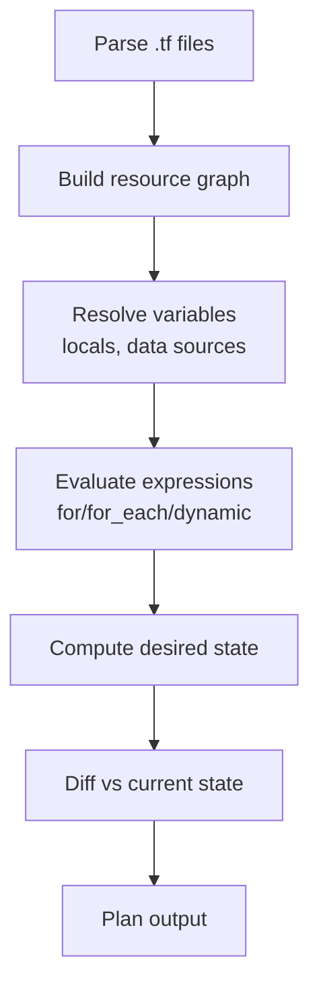

# 03 — HCL Language Basics

HashiCorp Configuration Language (HCL2) is a declarative DSL. You describe *what* you want; Terraform figures out *how*.

## The five core constructs

| Construct | Purpose | Example |
|---|---|---|
| **Block** | Named container | `resource "aws_s3_bucket" "x" { ... }` |
| **Argument** | `name = value` inside a block | `bucket = "my-data"` |
| **Expression** | Produces a value | `var.env`, `"prefix-${var.name}"`, `[for x in list : x*2]` |
| **Type** | string, number, bool, list, set, map, object, tuple | `list(string)`, `map(number)` |
| **Meta-argument** | Modifies any resource | `count`, `for_each`, `depends_on`, `provider`, `lifecycle` |

## Mermaid: how a configuration is evaluated

<!-- mermaid:rendered -->
<p align="center"></p>

<details><summary>Mermaid source</summary>



</details>
## Looping: `count` vs `for_each`
- `count = 3` → creates indexed resources (`aws_instance.web[0]`, `[1]`, `[2]`). Use for **identical** copies.
- `for_each = toset([...])` or `for_each = { ... }` → creates keyed resources. Use when items have **different identities** (safer — adding/removing one item won't reshuffle the others).

## `for` expressions
```hcl
locals {
  upper_names = [for n in var.names : upper(n)]
  by_id       = { for u in var.users : u.id => u.name }
  evens       = [for x in range(10) : x if x % 2 == 0]
}
```

## `dynamic` blocks
Generate nested blocks programmatically:
```hcl
resource "aws_security_group" "web" {
  dynamic "ingress" {
    for_each = var.allowed_ports
    content {
      from_port   = ingress.value
      to_port     = ingress.value
      protocol    = "tcp"
      cidr_blocks = ["0.0.0.0/0"]
    }
  }
}
```

## Conditionals
```hcl
instance_type = var.env == "prod" ? "m5.large" : "t3.small"
```

## See [examples.tf](examples.tf)
Runnable — uses `random` + `local_file`, no cloud creds.

```bash
terraform init && terraform apply -auto-approve
ls *.txt
terraform destroy -auto-approve
```
