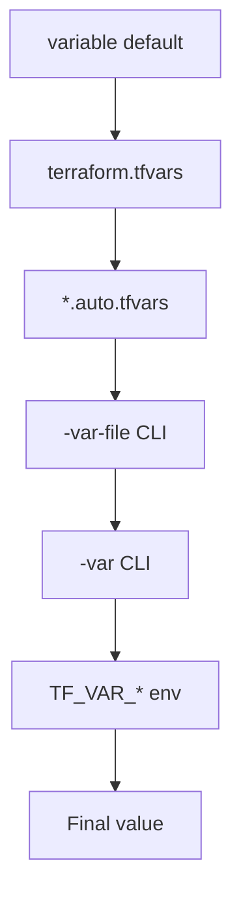

# 05 — Variables & Outputs

## Input variables
Inputs make a config reusable. Declare them once, override per environment.

```hcl
variable "env" {
  type        = string
  description = "Environment name."
  default     = "dev"

  validation {
    condition     = contains(["dev", "staging", "prod"], var.env)
    error_message = "env must be one of: dev, staging, prod."
  }
}
```

## Type constraints
```hcl
type = string
type = number
type = bool
type = list(string)
type = set(string)
type = map(number)
type = object({ name = string, port = number })
type = tuple([string, number, bool])
```

## Sensitive variables
```hcl
variable "db_password" {
  type      = string
  sensitive = true
}
```
Sensitive values are masked in CLI output but **still written to state** — protect your state file.

## Outputs
```hcl
output "bucket_arn" {
  value       = aws_s3_bucket.demo.arn
  description = "ARN of the data bucket."
  sensitive   = false
}
```
Outputs are visible after `apply` and are how **modules expose values to callers**.

## Variable input precedence (low → high)
1. Defaults in `variable {}` blocks
2. `terraform.tfvars` (auto-loaded)
3. `*.auto.tfvars` (auto-loaded, alphabetical)
4. `-var-file=...` CLI flag
5. `-var name=value` CLI flag
6. `TF_VAR_<name>` environment variable

<!-- mermaid:rendered -->
<p align="center"></p>

<details><summary>Mermaid source</summary>



</details>
## Files in this chapter
- [variables.tf](variables.tf) — declarations
- [outputs.tf](outputs.tf) — outputs
- [terraform.tfvars.example](terraform.tfvars.example) — copy to `terraform.tfvars` and edit

## Try it
```bash
cp terraform.tfvars.example terraform.tfvars
terraform init
terraform plan -var-file=terraform.tfvars
TF_VAR_env=staging terraform plan       # env override beats tfvars
```
