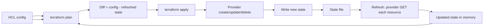
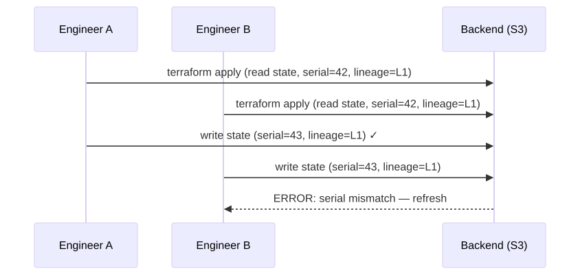
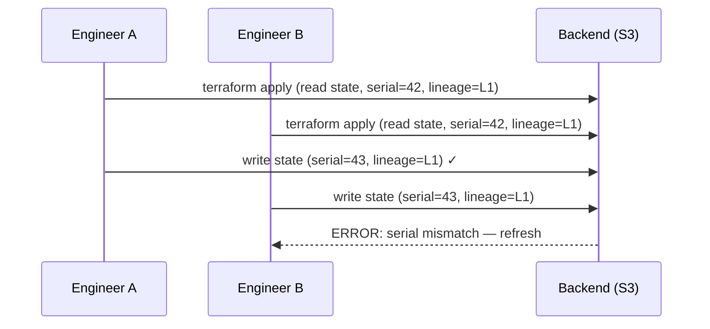
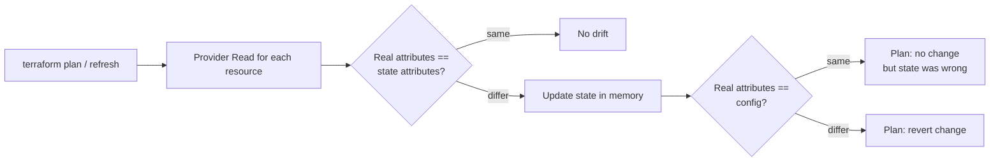
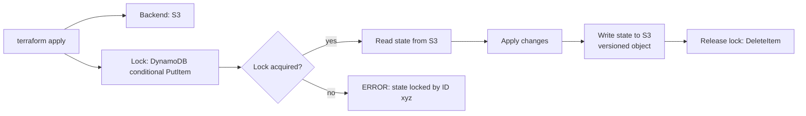

# Terraform State Internals Deep Dive

## Why this matters

Terraform's entire model — plan, apply, drift, destroy — depends on the state file being an accurate map between your HCL and real-world resources. Corrupt it, lose it, or skip locking, and you're staring at duplicate resources, "resource already exists" errors, or worse: two engineers simultaneously destroying production. Understanding the schema, lineage/serial mechanics, and remote backend locking is non-negotiable for anyone running TF in a team.

## Mental Model

State is a JSON document mapping `resource address → real-world ID + attributes`. On every `plan`/`apply`, Terraform:
1. **Refreshes** state by querying providers about each resource.
2. **Compares** refreshed state to desired config (the HCL).
3. **Diffs** to produce a plan.
4. **Applies** the plan, then **writes** new state.

<!-- mermaid:rendered -->
<p align="center"></p>

<details><summary>Mermaid source</summary>



</details>

## State Schema

```json
{
  "version": 4,
  "terraform_version": "1.7.0",
  "serial": 42,
  "lineage": "0c2c5e6f-9b3e-4f01-8a3a-3b1f8e9d2c4a",
  "outputs": {
    "vpc_id": { "value": "vpc-abc", "type": "string" }
  },
  "resources": [
    {
      "mode": "managed",
      "type": "aws_instance",
      "name": "web",
      "provider": "provider[\"registry.terraform.io/hashicorp/aws\"]",
      "instances": [
        {
          "schema_version": 1,
          "attributes": {
            "id": "i-0123abc",
            "ami": "ami-xyz",
            "instance_type": "t3.micro",
            "tags": { "Name": "web" }
          },
          "dependencies": ["aws_vpc.main"],
          "private": "..."
        }
      ]
    }
  ],
  "check_results": null
}
```

| Field | Purpose |
|-------|---------|
| `version` | State format version (currently 4). Bumped when schema changes. |
| `terraform_version` | TF version that wrote this state. Newer versions can read older; older usually CANNOT read newer. |
| `serial` | Monotonically incremented on every state write. Detects "you're operating on stale state." |
| `lineage` | UUID generated at first state creation. Detects "you're operating on a different state file entirely." |
| `outputs` | Module/root outputs cached for `terraform output` without provider calls. |
| `resources[*].instances` | One entry per `count` / `for_each` instance. |
| `attributes` | Provider's authoritative view of resource state. |

## Lineage and Serial

<!-- mermaid:rendered -->
<p align="center"></p>

<details><summary>Mermaid source</summary>



</details>

- **Serial** mismatch = you fetched state, someone else wrote a newer version. Refuse the write.
- **Lineage** mismatch = you're trying to push state from a totally different lineage (e.g. someone re-init'd from scratch and overwrote). Refuse to prevent obliterating history.

State **locking** prevents the race in the first place; serial/lineage is a second line of defense.

## Drift Detection

Drift = "real-world state diverged from what TF last wrote." Causes: console clicks, other tools, broken automations, manual `aws cli` interventions.

<!-- mermaid:rendered -->
<p align="center"></p>

<details><summary>Mermaid source</summary>



</details>

`terraform plan -refresh-only` reports drift WITHOUT proposing config changes — useful for daily drift dashboards.

## Remote Backends and Locking

<!-- mermaid:rendered -->
<p align="center"></p>

<details><summary>Mermaid source</summary>



</details>

### S3 + DynamoDB backend

```hcl
terraform {
  backend "s3" {
    bucket         = "acme-tfstate"
    key            = "prod/network/terraform.tfstate"
    region         = "us-east-1"
    encrypt        = true
    kms_key_id     = "alias/tfstate"
    dynamodb_table = "terraform-locks"
    # Optional: versioning enabled on bucket → state history
  }
}
```

DynamoDB locking uses a conditional `PutItem` on `LockID = "<bucket>/<key>"`. If the item exists, `PutItem` fails — that's the lock check. The lock entry contains who holds it, when, and the operation — surfaced in error messages.

### GCS backend

```hcl
terraform {
  backend "gcs" {
    bucket = "acme-tfstate"
    prefix = "prod/network"
    # Locking via GCS object generation preconditions — built-in, no extra resource needed
  }
}
```

GCS uses object generation preconditions (atomic compare-and-set) for locking — simpler than S3 (no separate DynamoDB table needed).

| Backend | Locking mechanism | Pros | Cons |
|---------|------------------|------|------|
| `s3` + DynamoDB | DynamoDB conditional PutItem | Mature, ubiquitous | Two AWS resources to manage |
| `gcs` | Object generation precondition | Single resource | GCP-only |
| `azurerm` | Blob lease | Native | Azure-only |
| Terraform Cloud / Enterprise | Server-side | Managed UI, RBAC, run history | Vendor lock-in |
| `consul`, `etcd`, `pg` | Native primitives | Self-hosted | Operational burden |

## Force-unlock

```bash
# Stale lock from a crashed run
terraform force-unlock <lock-id>
```

Only do this when you're 100% sure no one else is holding the lock — check the lock holder info first. Forcing past an active operation = corruption risk.

## Recovery scenarios

| Disaster | Recovery |
|----------|----------|
| State file deleted | Restore from backend versioning (S3/GCS keeps versions). Otherwise `terraform import` every resource — painful. |
| State file corrupted | Restore previous version from backend versioning. |
| State written from wrong workspace | Revert backend object to prior version. |
| Resource exists but not in state | `terraform import <addr> <real-id>`. |
| Resource in state but not in real world | `terraform state rm <addr>` (does not delete real resource — already gone). |
| Two states drifted into one | Manual surgery: `terraform state mv` or rebuild from scratch + import. |

## Best practices

- ALWAYS enable bucket versioning on the state backend bucket. This is your only backup.
- Encrypt state at rest (S3 SSE-KMS, GCS CMEK). State contains secrets in plaintext (passwords, keys).
- One state per environment per blast radius (per VPC, per cluster). Avoid mega-states.
- Separate read-only IAM roles for `plan` from write roles for `apply`.
- Never commit state to git. `*.tfstate*` belongs in `.gitignore` always.

## Common Interview Questions

> [!IMPORTANT]
> **Q1: What's in a Terraform state file and why is it sensitive?**
> A: A JSON map of `resource address → real-world ID + ALL attributes`. Attributes include sensitive values (passwords, RDS master creds, generated secrets) in plaintext. Always encrypt at rest and restrict access.
>
> **Q2: serial vs lineage?**
> A: Serial = monotonic write counter; mismatch means you're operating on stale state. Lineage = UUID assigned at state creation; mismatch means you're operating on a wholly different state's history. Both protect against race conditions and accidents.
>
> **Q3: How does S3+DynamoDB locking work?**
> A: TF does a conditional `PutItem` on DynamoDB with `LockID=<bucket>/<key>`. If the item exists, the put fails — TF reports who holds the lock. On apply success, TF deletes the item. The S3 bucket holds state; DynamoDB holds the lock.
>
> **Q4: How does Terraform detect drift?**
> A: During `refresh` (implicit in `plan`), TF calls provider Read on each resource and compares to state. Differences = drift. `terraform plan -refresh-only` shows drift without proposing config-driven changes.
>
> **Q5: Recovery from a deleted state file?**
> A: Restore from backend versioning (always enable). If unavailable, painstakingly `terraform import` each resource — long, error-prone. Hence: enable versioning + backups religiously.
>
> **Q6: When is `terraform force-unlock` safe?**
> A: ONLY when you're certain no other operation is in flight (CI run dead, engineer crashed). Check lock metadata first. Forcing during an active op risks state corruption.
>
> **Q7: Why split state across multiple files?**
> A: Blast radius. One state per environment per concern (network, k8s, app). Smaller states = faster plans, less locking contention, isolation between teams. Cross-state references via `terraform_remote_state` data source.
>
> **Q8: Difference between `state rm` and `destroy`?**
> A: `state rm` removes the resource from state ONLY — the real-world resource is untouched. Use after manually deleting outside TF, or to "forget" a resource. `destroy` deletes the real-world resource AND its state entry.

## Sources

- State documentation: https://developer.hashicorp.com/terraform/language/state
- Backend reference: https://developer.hashicorp.com/terraform/language/backend
- S3 backend: https://developer.hashicorp.com/terraform/language/backend/s3
- State locking: https://developer.hashicorp.com/terraform/language/state/locking
- Sensitive data in state: https://developer.hashicorp.com/terraform/language/state/sensitive-data
