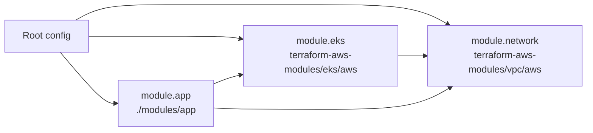

# 07 — Modules

A **module** is a reusable bundle of `.tf` files. Every Terraform configuration *is* a module (the **root module**); when you `module "x" { source = ... }` you're calling a **child module**.

## Anatomy
```
modules/vpc-stub/
├── main.tf        # resources
├── variables.tf   # inputs
├── outputs.tf     # outputs
└── README.md      # how to use it
```

## Module composition

<!-- mermaid:rendered -->
<p align="center"></p>

<details><summary>Mermaid source</summary>



</details>
## Sources

| Source | Example |
|---|---|
| Local path | `source = "./modules/vpc-stub"` |
| Public registry | `source = "terraform-aws-modules/vpc/aws"` (with `version`) |
| Git (HTTPS) | `source = "git::https://github.com/org/repo.git//modules/vpc?ref=v1.2.0"` |
| Git (SSH) | `source = "git::ssh://git@github.com/org/repo.git//modules/vpc?ref=main"` |
| GitHub shorthand | `source = "github.com/org/repo//modules/vpc?ref=v1.0.0"` |
| S3 / GCS | `source = "s3::https://s3.amazonaws.com/my-bucket/vpc.zip"` |
| Mercurial / HTTP archives | `hg::`, plain `http://...zip` |

> **Always pin a version/ref.** Without one, Terraform pulls "latest" → unreproducible.

## Calling a module
```hcl
module "vpc" {
  source = "./modules/vpc-stub"

  name        = "demo"
  cidr_block  = "10.0.0.0/16"
  subnet_count = 3
}

# Reference its outputs
output "vpc_id"   { value = module.vpc.vpc_id }
output "subnets"  { value = module.vpc.subnet_ids }
```

## Registry module example
```hcl
module "vpc" {
  source  = "terraform-aws-modules/vpc/aws"
  version = "~> 5.13"

  name = "demo-vpc"
  cidr = "10.0.0.0/16"
  azs  = ["eu-west-1a", "eu-west-1b", "eu-west-1c"]
  public_subnets  = ["10.0.101.0/24", "10.0.102.0/24", "10.0.103.0/24"]
  private_subnets = ["10.0.1.0/24",   "10.0.2.0/24",   "10.0.3.0/24"]
  enable_nat_gateway = true
}
```

## Versioning your own modules
- Tag releases (`v1.0.0`, `v1.1.0`) on git.
- Consumers pin via `?ref=v1.0.0`.
- Follow semver: breaking change → major bump.

## When to extract a module
- Repeated 3+ times across projects.
- Encapsulates a clear unit (a VPC, an ECS service, a static-site bucket).
- Has a stable, documented interface.

> **Don't** wrap a single resource in a module. **Do** wrap a logical group.

## See [modules/vpc-stub/](modules/vpc-stub/)
A no-cloud-creds stub that demonstrates the module structure using `random_pet` to simulate "subnet IDs".
