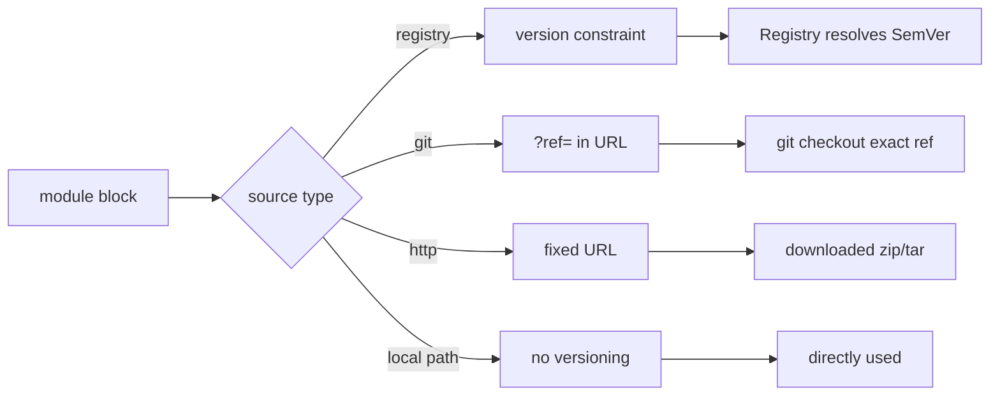
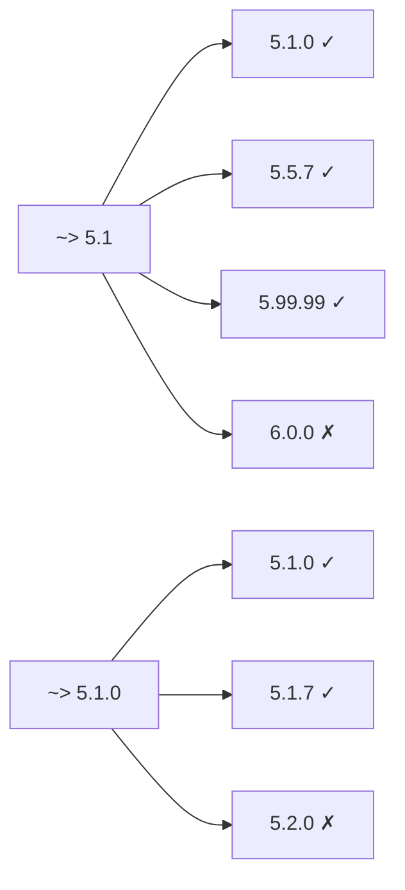
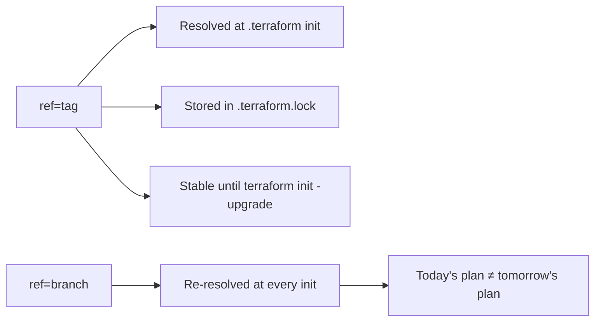
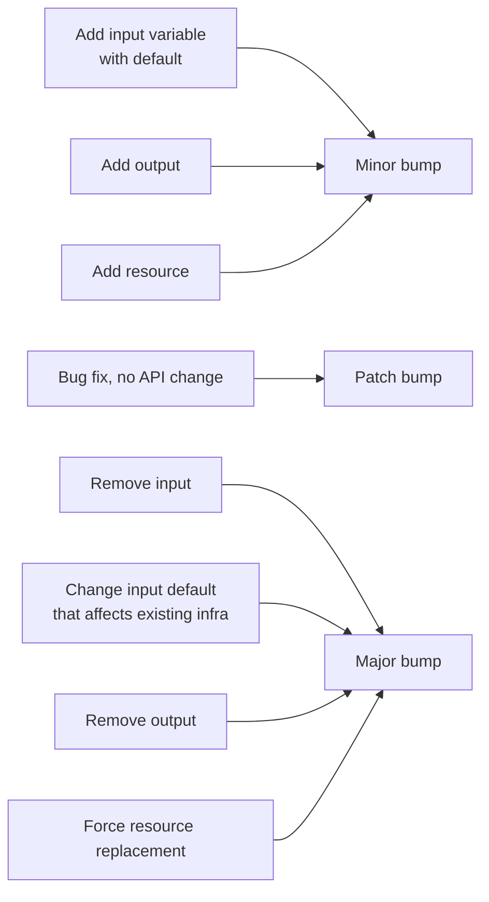

# Terraform Module Versioning Deep Dive

## Why this matters

Modules are the unit of reuse in Terraform — but unversioned modules pulled from `main` are a footgun: a colleague's commit silently changes your infrastructure plan. Understanding source addresses, semver constraints in the Registry, ref pinning vs version constraints, and private registries is what separates "we use modules" from "we use modules safely across hundreds of consumers."

## Mental Model

`source` tells Terraform WHERE to fetch the module. `version` tells Terraform WHICH version to fetch. `version` only works for Registry sources — for git/http/local sources, the version is encoded in the ref/URL itself. Registry pinning gives you SemVer constraint solving; ref pinning is exact-or-bust.

<!-- mermaid:rendered -->
<p align="center"></p>

<details><summary>Mermaid source</summary>



</details>

## Source Address Forms

| Form | Example | Versioning |
|------|---------|------------|
| Local path | `source = "./modules/vpc"` | None — file system state |
| Public Registry | `source = "terraform-aws-modules/vpc/aws"` | `version = "~> 5.0"` |
| Private Registry (TFC) | `source = "app.terraform.io/acme/vpc/aws"` | `version = "~> 5.0"` |
| GitHub HTTPS | `source = "github.com/acme/tf-vpc"` | `?ref=v1.2.0` |
| Generic git | `source = "git::https://gitlab.com/acme/tf-vpc.git?ref=v1.2.0"` | `?ref=` |
| git via SSH | `source = "git::ssh://git@github.com/acme/tf-vpc.git?ref=abc123"` | `?ref=` |
| HTTP archive | `source = "https://example.com/vpc.zip"` | URL-embedded |
| S3 / GCS | `source = "s3::https://s3.amazonaws.com/bucket/vpc.zip"` | URL-embedded |

## Registry Address Format

```text
[<HOSTNAME>/]<NAMESPACE>/<NAME>/<PROVIDER>
                                  ^
                          NOT the provider in YOUR config —
                          the cloud the module targets
```

Examples:
- `terraform-aws-modules/vpc/aws` → public registry, AWS VPC module
- `app.terraform.io/acme/networking/aws` → private registry on Terraform Cloud
- `gitlab.acme.com/acme/networking/aws` → self-hosted private registry

The registry does API resolution: given a SemVer constraint, returns a download URL for the matching version.

## Semver Constraints

```hcl
module "vpc" {
  source  = "terraform-aws-modules/vpc/aws"
  version = "~> 5.1.0"   # >= 5.1.0, < 5.2.0  (pessimistic, patch-only)
}
```

| Operator | Meaning | Example |
|----------|---------|---------|
| `=` | Exact | `= 5.1.2` |
| `!=` | Exclusion | `!= 5.1.3` (with another constraint) |
| `>`, `>=`, `<`, `<=` | Comparison | `>= 5.0.0, < 6.0.0` |
| `~>` | Pessimistic | `~> 5.1` allows 5.x; `~> 5.1.0` allows 5.1.x |

**Recommended pattern for production consumers:** `~> 5.1` — accept any 5.x patch/minor (bug fixes, additive features) but never auto-upgrade to 6.x (breaking changes).

<!-- mermaid:rendered -->
<p align="center"></p>

<details><summary>Mermaid source</summary>



</details>

## Git Ref Pinning

Git sources don't get SemVer resolution. The `?ref=` suffix specifies a tag, branch, or commit SHA.

```hcl
module "vpc" {
  source = "git::https://github.com/acme/tf-vpc.git?ref=v1.2.0"
}

module "iam" {
  source = "git::ssh://git@github.com/acme/tf-iam.git?ref=abc1234567890def"
}

module "experimental" {
  source = "git::https://github.com/acme/tf-x.git?ref=main"   # ⚠ DANGEROUS
}
```

| Ref type | Behavior | When to use |
|----------|----------|-------------|
| Tag (`v1.2.0`) | TF re-fetches and resolves to the commit at tag time | Production. Tags are conventionally immutable. |
| Commit SHA (`abc1234`) | Exactly that commit, forever | Maximum determinism. Verbose. |
| Branch (`main`, `develop`) | Whatever HEAD is at fetch time | NEVER for production. Creates "spooky action at a distance" — a colleague's merge changes your plan. |

<!-- mermaid:rendered -->
<p align="center"></p>

<details><summary>Mermaid source</summary>



</details>

## .terraform.lock.hcl

For PROVIDERS (not modules), TF maintains a lock file pinning provider versions and hashes:

```hcl
provider "registry.terraform.io/hashicorp/aws" {
  version     = "5.31.0"
  constraints = "~> 5.0"
  hashes = [
    "h1:abcdef...",
    ...
  ]
}
```

Commit this file. It guarantees every consumer (local devs + CI) uses the exact same provider binary, with verified checksums. Update via `terraform init -upgrade`.

**Note:** Modules do NOT participate in `.terraform.lock.hcl`. Module versions are re-resolved on every `terraform init` against your `version` constraint or `?ref=`. If you need stricter module pinning, use `= 5.1.2` or commit SHAs.

## Private Registries

Three options:
1. **Terraform Cloud / Enterprise** private registry — full SemVer support, integrates with VCS, RBAC.
2. **Self-hosted** Registry Protocol implementation (e.g. Artifactory, Cloudsmith).
3. **Git** — no registry, just `git::` sources. Cheapest; no SemVer resolution.

Authentication via `~/.terraformrc`:

```hcl
credentials "app.terraform.io" {
  token = "abc123..."
}
credentials "registry.acme.internal" {
  token = "def456..."
}
```

Or `TF_TOKEN_<host>` environment variable (TF 1.2+):
```bash
export TF_TOKEN_app_terraform_io="abc123..."
```

## Annotated module call

```hcl
module "vpc" {
  # WHERE to fetch
  source  = "terraform-aws-modules/vpc/aws"
  # WHICH version — accept patch/minor 5.x updates
  version = "~> 5.1"

  # Inputs (variables defined by the module)
  name = "prod-vpc"
  cidr = "10.0.0.0/16"

  azs             = ["us-east-1a", "us-east-1b"]
  private_subnets = ["10.0.1.0/24", "10.0.2.0/24"]
  public_subnets  = ["10.0.101.0/24", "10.0.102.0/24"]

  enable_nat_gateway = true
  single_nat_gateway = false

  tags = {
    Environment = "prod"
    Owner       = "platform"
  }
}

# Use module outputs
resource "aws_security_group" "app" {
  vpc_id = module.vpc.vpc_id
}
```

## Versioning Strategy for Module Authors

<!-- mermaid:rendered -->
<p align="center"></p>

<details><summary>Mermaid source</summary>



</details>

Treat module inputs/outputs like a public API. Anything that could break a consumer's plan = MAJOR. Any backward-compatible addition = MINOR. Bug fix = PATCH.

## Common Interview Questions

> [!IMPORTANT]
> **Q1: Why doesn't `version` work on git modules?**
> A: `version` is a Registry-protocol feature (semver constraint resolution via API). Git URLs don't have a registry — they have a repo. Use `?ref=` in the URL to pin instead.
>
> **Q2: `~> 5.1` vs `~> 5.1.0` — what's the difference?**
> A: `~> 5.1` allows ANY 5.x ≥ 5.1 (so 5.99 is fine). `~> 5.1.0` allows only 5.1.x patches (5.2.0 NOT allowed). Pessimistic constraint.
>
> **Q3: Should you pin to a branch or a tag?**
> A: Always tag (or commit SHA). Branch refs cause your plan to silently change when someone merges to that branch.
>
> **Q4: Does `.terraform.lock.hcl` lock module versions?**
> A: No, only provider versions and checksums. Modules are re-resolved on every `terraform init` against your `version` constraint. For exact module pinning use `= X.Y.Z` or commit SHAs.
>
> **Q5: What is the third part of `namespace/name/provider` in registry addresses?**
> A: The TARGET cloud the module manages — `aws`, `gcp`, `azurerm`, `kubernetes`. NOT a Terraform language concept; it's a Registry namespace organizer.
>
> **Q6: How do consumers authenticate to a private module registry?**
> A: `credentials` block in `~/.terraformrc` or `TF_TOKEN_<hostname>` env var (1.2+). Token is typically a Terraform Cloud team token or git-host PAT for git-backed modules.
>
> **Q7: What changes warrant a MAJOR module version bump?**
> A: Anything that breaks consumer compatibility: removing inputs/outputs, changing input defaults that affect existing infra, forcing resource replacement, removing supported providers, raising minimum TF version.
>
> **Q8: Why split a monolithic root config into modules at all?**
> A: Reuse, encapsulation, blast-radius reduction, faster plans (state still global per root, but modules are easier to test and version), team boundaries (each team owns its module).

## Sources

- Module sources: https://developer.hashicorp.com/terraform/language/modules/sources
- Module versions: https://developer.hashicorp.com/terraform/language/modules/syntax#version
- Version constraints: https://developer.hashicorp.com/terraform/language/expressions/version-constraints
- Public Registry: https://registry.terraform.io/
- Private Registry (TFC): https://developer.hashicorp.com/terraform/cloud-docs/registry
- Dependency lock file: https://developer.hashicorp.com/terraform/language/files/dependency-lock
