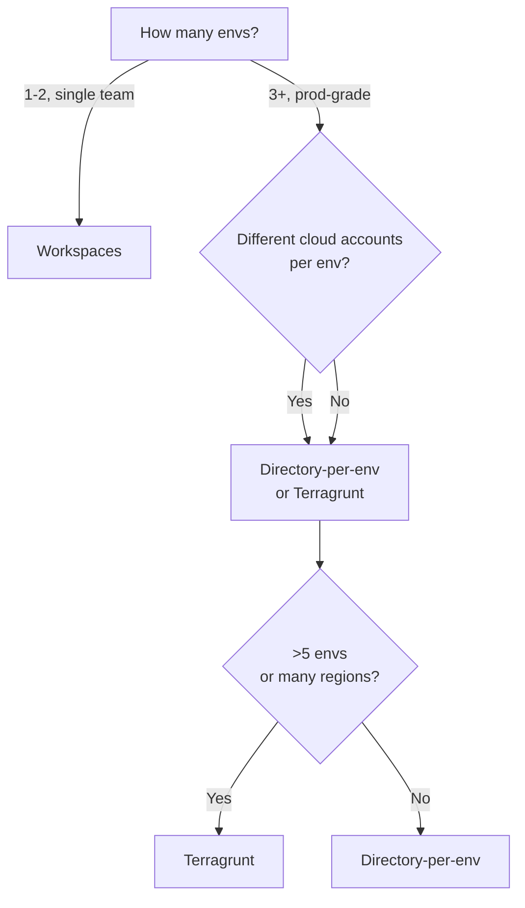

# 08 — Workspaces & Environment Strategies

You need separate dev / staging / prod infra. There are **three patterns** — pick one and stick with it across teams.

## Comparison

| Pattern | Code reuse | Blast radius | State separation | Complexity | Best for |
|---|---|---|---|---|---|
| **Workspaces** | Single config, switch with CLI | Medium (one typo can hit prod) | One backend, multiple state files keyed by workspace | Lowest | Quick & small projects, feature branches |
| **Directory-per-env** | Copy/paste of root dirs that call shared modules | Low — separate dirs, separate state | Fully separate backends per env | Medium | Most production setups |
| **Terragrunt** | DRY wrapper that generates backend + var files | Low — full isolation, less duplication | Fully separate | High (extra tool) | Many envs / many regions |

## 1. Workspaces

```bash
terraform workspace new dev
terraform workspace new prod
terraform workspace select dev
terraform apply
terraform workspace select prod
terraform apply
```

Reference the current workspace in code:
```hcl
locals {
  env = terraform.workspace          # "dev" or "prod"
  instance_type = local.env == "prod" ? "m5.large" : "t3.small"
}
```

**Pros:** trivial setup. **Cons:** same provider config for all envs (can't easily use different AWS accounts), risk of `apply` in the wrong workspace, state files share one backend prefix.

## 2. Directory-per-env (recommended for prod)

```
infra/
├── modules/
│   ├── network/
│   ├── eks/
│   └── app/
└── envs/
    ├── dev/
    │   ├── backend.tf      # different state path
    │   ├── main.tf         # calls modules with dev values
    │   └── terraform.tfvars
    ├── staging/
    └── prod/
```

`cd envs/prod && terraform apply` — completely isolated. Different AWS accounts? Different `provider {}` blocks per env.

## 3. Terragrunt
Generates the boilerplate so each env folder has only an `inputs = { ... }`. Worth it once you have 5+ envs.

```hcl
# envs/prod/terragrunt.hcl
include "root" { path = find_in_parent_folders() }
terraform { source = "../../modules/app" }
inputs = { env = "prod", instance_type = "m5.large" }
```

## Decision flowchart

<!-- mermaid:rendered -->
<p align="center"></p>

<details><summary>Mermaid source</summary>

<!-- mermaid:rendered -->
<p align="center"></p>

<details><summary>Mermaid source</summary>

<!-- mermaid:rendered -->
<p align="center"></p>

<details><summary>Mermaid source</summary>



</details>

</details>

</details>

See [examples.md](examples.md) for runnable workspace commands.
