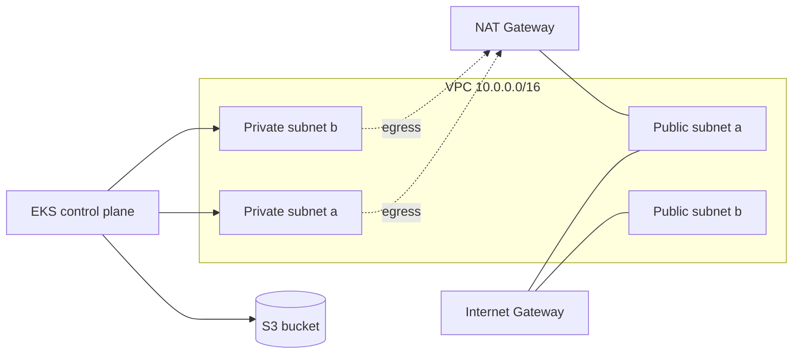

# 09 — AWS Examples

> **You'll need AWS credentials** for these labs. Configure via:
> - `aws configure` (writes `~/.aws/credentials`)
> - or env vars: `AWS_ACCESS_KEY_ID`, `AWS_SECRET_ACCESS_KEY`, `AWS_REGION`
> - or **best:** `aws sso login` + named profile (`AWS_PROFILE=...`)
> - in CI: **OIDC role assumption** (no static keys) — see chapter 13.

## Provider config
```hcl
terraform {
  required_providers {
    aws = { source = "hashicorp/aws", version = "~> 5.0" }
  }
}

provider "aws" {
  region = "eu-west-1"
  default_tags {
    tags = {
      managed_by = "terraform"
      project    = "demo"
    }
  }
}
```

`default_tags` apply to every resource that supports tagging — huge time-saver.

## Auth precedence (provider docs)
1. Static creds in provider block (don't!)
2. Env vars (`AWS_ACCESS_KEY_ID`, etc.)
3. Shared credentials file (`~/.aws/credentials`) + `AWS_PROFILE`
4. EC2 instance metadata / ECS task role / EKS IRSA
5. SSO

## Files
| File | Resource | Cost? |
|---|---|---|
| [01-s3-bucket.tf](01-s3-bucket.tf) | S3 bucket + versioning + encryption | Pennies |
| [02-vpc.tf](02-vpc.tf) | VPC, subnets, IGW, route tables | $0 (free) |
| [03-eks-cluster.tf](03-eks-cluster.tf) | EKS cluster via official module | **~$0.10/hr** for control plane + node costs |

> **Always** `terraform destroy` after each lab. EKS especially.

## Run order
```bash
cd 09-aws-examples
terraform init
terraform plan
terraform apply
# ... verify in AWS Console ...
terraform destroy
```

## Common resource types
| Resource | Module worth using |
|---|---|
| `aws_s3_bucket` | Direct |
| `aws_vpc`, `aws_subnet`, `aws_route_table` | `terraform-aws-modules/vpc/aws` |
| `aws_eks_cluster` | `terraform-aws-modules/eks/aws` |
| `aws_iam_role`, `aws_iam_policy` | `terraform-aws-modules/iam/aws` |
| `aws_instance` | Direct or `terraform-aws-modules/ec2-instance/aws` |
| `aws_db_instance` (RDS) | `terraform-aws-modules/rds/aws` |
| `aws_lambda_function` | `terraform-aws-modules/lambda/aws` |

## Mermaid: typical AWS stack

<!-- mermaid:rendered -->
<p align="center"></p>

<details><summary>Mermaid source</summary>



</details>
