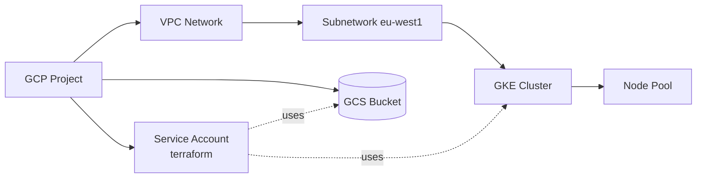

# 10 — GCP Examples

> **You'll need GCP credentials.** Easiest path:
> ```bash
> gcloud auth application-default login
> export GOOGLE_PROJECT=my-project-id
> export GOOGLE_REGION=europe-west1
> ```
> In CI: use **Workload Identity Federation** with OIDC (no JSON keys).

## Provider config
```hcl
terraform {
  required_providers {
    google = { source = "hashicorp/google", version = "~> 5.0" }
  }
}

provider "google" {
  project = var.project_id
  region  = var.region
}
```

## Files
| File | Resource | Cost? |
|---|---|---|
| [01-gcs-bucket.tf](01-gcs-bucket.tf) | GCS bucket + versioning | Pennies |
| [02-gke-cluster.tf](02-gke-cluster.tf) | GKE cluster via official module | Real $$ — destroy after testing |

## Mermaid: GCP project structure

<!-- mermaid:rendered -->
<p align="center"></p>

<details><summary>Mermaid source</summary>



</details>
## Useful modules
| Module | Use |
|---|---|
| `terraform-google-modules/network/google` | VPC + subnets |
| `terraform-google-modules/kubernetes-engine/google` | GKE |
| `terraform-google-modules/cloud-storage/google` | Buckets |
| `terraform-google-modules/iam/google` | Project / SA / role bindings |
| `terraform-google-modules/sql-db/google` | Cloud SQL |

## Run
```bash
cd 10-gcp-examples
terraform init
terraform apply -var="project_id=YOUR_PROJECT"
terraform destroy -var="project_id=YOUR_PROJECT"
```
