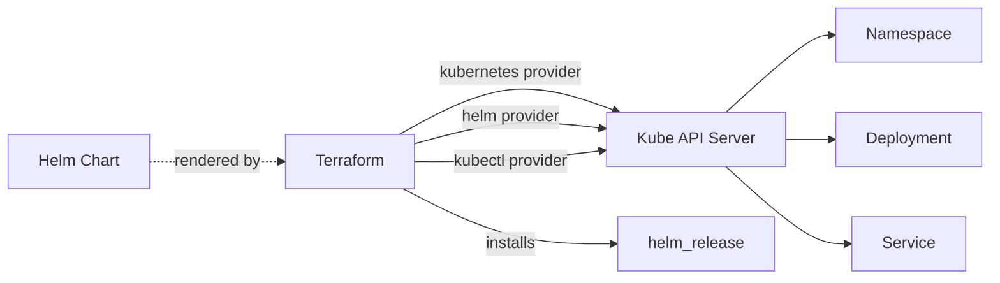

# 11 — Kubernetes & Helm Providers

Terraform can manage Kubernetes resources directly. Three providers do this:

| Provider | What it does |
|---|---|
| `hashicorp/kubernetes` | CRUD on K8s objects (`namespace`, `deployment`, `configmap`, etc.) |
| `hashicorp/helm` | Install/upgrade Helm charts |
| `gavinbunney/kubectl` | Apply raw YAML / CRDs without typed schemas |

## When to use TF vs Helm vs kubectl directly

| Situation | Use |
|---|---|
| Cluster + add-ons (cert-manager, ingress-nginx) bootstrapping | **Terraform `helm_release`** |
| Application Helm charts | **Helm CLI / Argo CD** (don't use TF for app deploys) |
| Bare CRDs / cluster-scoped objects | `kubectl_manifest` |
| Per-tenant namespace + quota provisioning | `kubernetes_namespace` + `kubernetes_resource_quota` |

> **Anti-pattern:** managing application Deployments in Terraform. Use Argo CD / Flux for app delivery; reserve TF for cluster + platform layer.

## Provider config — three options

### Option A: in-cluster (TF runs inside K8s)
```hcl
provider "kubernetes" { config_path = "~/.kube/config" }
```

### Option B: from EKS module outputs
```hcl
provider "kubernetes" {
  host                   = module.eks.cluster_endpoint
  cluster_ca_certificate = base64decode(module.eks.cluster_certificate_authority_data)
  exec {
    api_version = "client.authentication.k8s.io/v1beta1"
    command     = "aws"
    args        = ["eks", "get-token", "--cluster-name", module.eks.cluster_name]
  }
}
```

### Option C: from GKE
```hcl
data "google_client_config" "default" {}
provider "kubernetes" {
  host                   = "https://${google_container_cluster.demo.endpoint}"
  token                  = data.google_client_config.default.access_token
  cluster_ca_certificate = base64decode(google_container_cluster.demo.master_auth[0].cluster_ca_certificate)
}
```

## Lab — install Prometheus via Helm
See [main.tf](main.tf). Requires a working `kubectl` context (any cluster — kind/minikube/EKS/GKE).

```bash
# Quick local cluster:
kind create cluster --name tf-demo
kubectl cluster-info

cd 11-kubernetes-provider
terraform init
terraform apply
kubectl get pods -n monitoring
terraform destroy
kind delete cluster --name tf-demo
```

## Mermaid: how the providers compose

<!-- mermaid:rendered -->
<p align="center"></p>

<details><summary>Mermaid source</summary>



</details>
See [walkthrough.md](walkthrough.md) for line-by-line.
