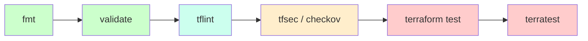

# 12 — Testing & Quality Gates

Five layers, run them in this order:

<!-- mermaid:rendered -->
<p align="center"></p>

<details><summary>Mermaid source</summary>



</details>
| Tool | What it catches | Speed | Needs cloud? |
|---|---|---|---|
| `terraform fmt` | Formatting | ms | No |
| `terraform validate` | Syntax + internal consistency | <1s | No |
| `tflint` | Best-practice / provider-specific lint (e.g. invalid AWS instance type) | seconds | No |
| `tfsec` / `checkov` | Security misconfigs (open SGs, unencrypted buckets) | seconds | No |
| `terraform test` | HCL-native unit + integration tests (since 1.6) | varies | Sometimes |
| `terratest` (Go) | Real apply/destroy + assertions | minutes | **Yes** |

## fmt + validate
```bash
terraform fmt -recursive -check
terraform init -backend=false   # no backend init needed for validate
terraform validate
```

## tflint
```bash
brew install tflint
tflint --init
tflint
```
With AWS plugin:
```hcl
# .tflint.hcl
plugin "aws" {
  enabled = true
  version = "0.32.0"
  source  = "github.com/terraform-linters/tflint-ruleset-aws"
}
```

## tfsec / checkov
```bash
brew install tfsec
tfsec .

pip install checkov
checkov -d .
```

## `terraform test` (built-in, TF >= 1.6)
Tests live in `*.tftest.hcl` files. See [tests/main.tftest.hcl](tests/main.tftest.hcl).

```bash
terraform init
terraform test
```

Each `run` block is a discrete test:
- `command = plan` — runs `plan` only (cheap, no resources created)
- `command = apply` — actually creates resources, asserts, then destroys

## terratest (Go, end-to-end)
```go
package test

import (
    "testing"
    "github.com/gruntwork-io/terratest/modules/terraform"
    "github.com/stretchr/testify/assert"
)

func TestVpcModule(t *testing.T) {
    opts := &terraform.Options{TerraformDir: "../"}
    defer terraform.Destroy(t, opts)
    terraform.InitAndApply(t, opts)
    assert.NotEmpty(t, terraform.Output(t, opts, "vpc_id"))
}
```

## In CI (see chapter 13)
Pre-merge gate: `fmt -check && validate && tflint && tfsec && terraform test`.
Post-merge: `terraform plan` artifact, manual approval for prod apply.
