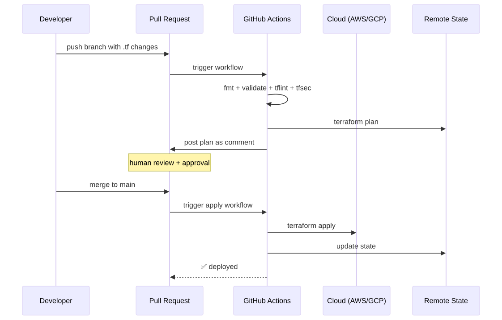
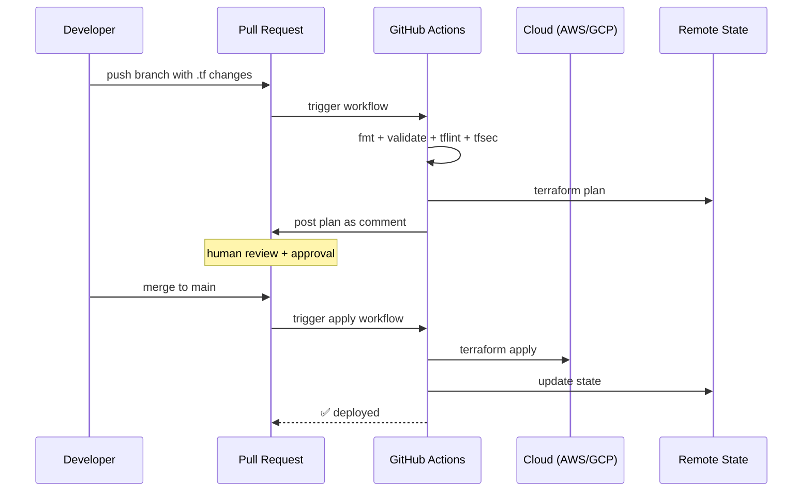

# 13 — Terraform in CI/CD

## The standard flow

<!-- mermaid:rendered -->
<p align="center"></p>

<details><summary>Mermaid source</summary>



</details>
## Auth: use OIDC, never long-lived keys

### AWS
1. Create an IAM OIDC provider for `token.actions.githubusercontent.com`.
2. Create a role with a trust policy scoped to your repo:
```json
{
  "Effect": "Allow",
  "Principal": { "Federated": "arn:aws:iam::ACCT:oidc-provider/token.actions.githubusercontent.com" },
  "Action": "sts:AssumeRoleWithWebIdentity",
  "Condition": {
    "StringEquals":   { "token.actions.githubusercontent.com:aud": "sts.amazonaws.com" },
    "StringLike":     { "token.actions.githubusercontent.com:sub": "repo:my-org/my-repo:*" }
  }
}
```
3. In the workflow:
```yaml
permissions:
  id-token: write   # needed for OIDC
  contents: read
- uses: aws-actions/configure-aws-credentials@v4
  with:
    role-to-assume: arn:aws:iam::ACCT:role/github-terraform
    aws-region: eu-west-1
```

### GCP
Use **Workload Identity Federation**:
```yaml
- uses: google-github-actions/auth@v2
  with:
    workload_identity_provider: projects/123/locations/global/workloadIdentityPools/gh/providers/gh
    service_account: terraform@my-project.iam.gserviceaccount.com
```

## Files
- [github-actions-terraform.yaml](github-actions-terraform.yaml) — drop-in workflow.

## Alternatives to GitHub Actions

| Tool | Niche |
|---|---|
| **Atlantis** | Self-hosted; auto-comments plans on PRs; locks state per workspace. |
| **Terraform Cloud / Enterprise** | Hosted state + runs + policy (Sentinel/OPA) + private module registry. |
| **Spacelift / env0 / Scalr** | TFC competitors with stronger drift detection / multi-stack DAGs. |
| **GitLab CI** | Has built-in HTTP state backend + merge-request integration. |

## Best practices
1. **PRs: plan only.** Apply only on merge to main (or manual workflow_dispatch).
2. **Pin everything**: TF version (`tfenv` / `terraform_version` in workflow), provider versions, module versions.
3. **Save the plan**: `terraform plan -out=tfplan`, then `terraform apply tfplan` — guarantees you apply exactly what was reviewed.
4. **Separate prod**: protected branch + required reviewers + manual approval gate.
5. **Drift detection**: scheduled nightly `terraform plan` — alert if non-zero diff.
6. **Concurrency**: GitHub Actions `concurrency:` to serialize per-environment.
