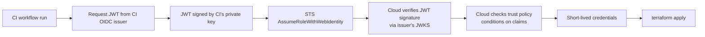
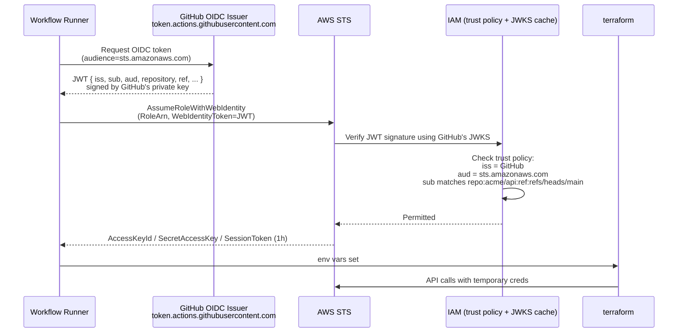
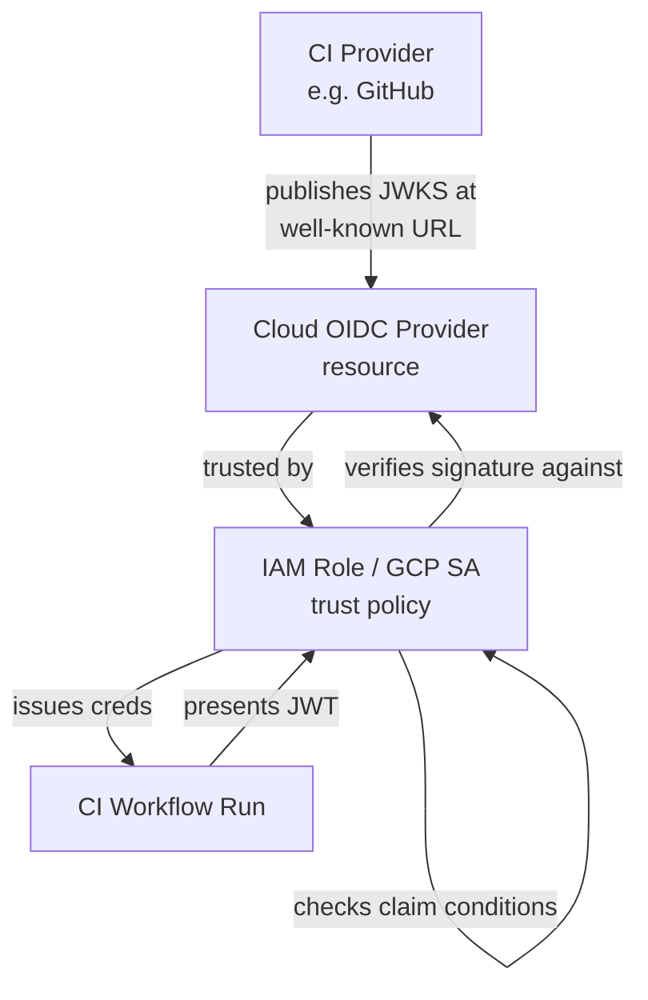
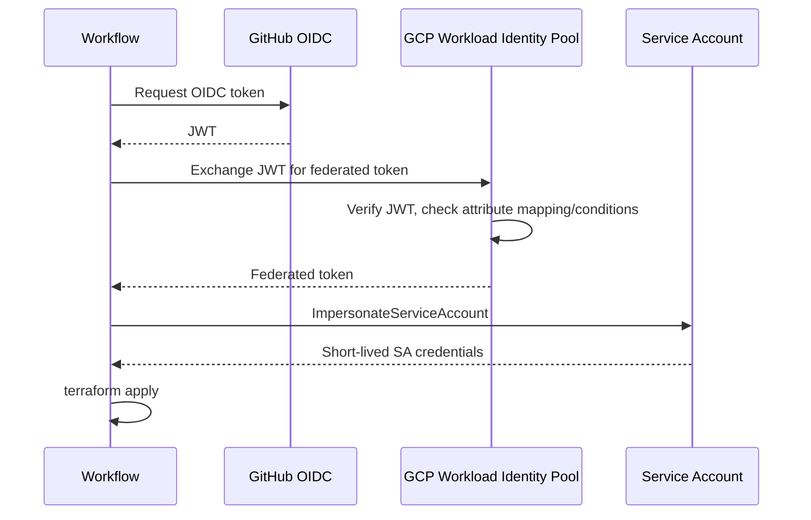

# Terraform CI/CD OIDC Flow Deep Dive

## Why this matters

Long-lived AWS access keys in GitHub secrets are the #1 cloud-credential leak vector. OIDC federation lets your CI runner exchange a short-lived JWT (issued by GitHub/GitLab/CircleCI) for short-lived cloud credentials — no static secrets ever, with cryptographically enforced trust constraints. Get the trust policy subject claim wrong and ANY repo on GitHub can assume your role; get it right and only your specific workflow on your specific branch can.

## Mental Model

OIDC federation is a triangle: the CI provider issues a JWT proving "this run is X by Y on Z", the cloud trusts that issuer's public keys, and a trust policy says "I'll mint creds IF the JWT's claims match these conditions." No shared secret — only public-key verification.



## Sequence — GitHub Actions to AWS



## The OIDC Trust Triangle



| Side | What it knows | What it does |
|------|--------------|--------------|
| CI provider (GitHub, GitLab, CircleCI) | Private key for signing JWTs | Issues short-lived JWTs on workflow request |
| Cloud (AWS/GCP/Azure) | Issuer's public JWKS URL + trust policy | Verifies JWT, checks claim conditions, mints creds |
| Workflow | Its own context (repo, branch, env) | Requests JWT with audience claim, exchanges for creds |

## AWS Setup — Annotated

### 1. Register GitHub as an OIDC provider (once per account)

```hcl
resource "aws_iam_openid_connect_provider" "github" {
  url             = "https://token.actions.githubusercontent.com"
  client_id_list  = ["sts.amazonaws.com"]                # the audience JWTs must have
  thumbprint_list = ["6938fd4d98bab03faadb97b34396831e3780aea1"]  # GitHub's CA thumbprint
}
```

### 2. Create the IAM role with a tightly scoped trust policy

```hcl
data "aws_iam_policy_document" "trust" {
  statement {
    actions = ["sts:AssumeRoleWithWebIdentity"]
    principals {
      type        = "Federated"
      identifiers = [aws_iam_openid_connect_provider.github.arn]
    }
    # Audience must match — defense against confused-deputy
    condition {
      test     = "StringEquals"
      variable = "token.actions.githubusercontent.com:aud"
      values   = ["sts.amazonaws.com"]
    }
    # Subject claim — the most important constraint
    # Format: repo:<owner>/<repo>:<context>
    # Context: ref:refs/heads/<branch>, ref:refs/tags/<tag>,
    #          environment:<env>, pull_request
    condition {
      test     = "StringLike"
      variable = "token.actions.githubusercontent.com:sub"
      values   = [
        "repo:acme/infra:ref:refs/heads/main",
        "repo:acme/infra:environment:production"
      ]
    }
  }
}

resource "aws_iam_role" "tf_apply" {
  name               = "github-actions-tf-apply"
  assume_role_policy = data.aws_iam_policy_document.trust.json
  max_session_duration = 3600
}
```

### 3. GitHub Actions workflow

```yaml
name: terraform-apply
on:
  push:
    branches: [main]

permissions:
  id-token: write       # MUST be set to allow OIDC token request
  contents: read

jobs:
  apply:
    runs-on: ubuntu-latest
    environment: production    # GitHub env — required for environment:production sub claim
    steps:
      - uses: actions/checkout@v4

      - uses: aws-actions/configure-aws-credentials@v4
        with:
          role-to-assume: arn:aws:iam::123456789012:role/github-actions-tf-apply
          aws-region: us-east-1
          # No access keys! credentials come from STS via OIDC

      - uses: hashicorp/setup-terraform@v3
      - run: terraform init
      - run: terraform apply -auto-approve
```

## The Subject Claim — your security perimeter

The JWT `sub` claim from GitHub is structured:

```
repo:<owner>/<repo>:ref:refs/heads/<branch>
repo:<owner>/<repo>:ref:refs/tags/<tag>
repo:<owner>/<repo>:environment:<env-name>
repo:<owner>/<repo>:pull_request
repo:<owner>/<repo>:job_workflow_ref:<owner>/<repo>/.github/workflows/<file>@<ref>
```

| Common mistake | Result |
|----------------|--------|
| `sub: "repo:acme/*"` (no constraint past repo) | Any branch / PR can assume the role |
| Wildcard owner `repo:*` | ANY GitHub repo can assume — catastrophic |
| Forgetting `aud` condition | Confused-deputy: another AWS account could trick yours |
| `StringLike` with `repo:acme/infra:*` | PRs from forks can trigger the workflow with this sub — review carefully |

**Recommended pattern:** Pin the subject to a specific environment + branch combination, and use GitHub Environments with required reviewers for production:

```
repo:acme/infra:environment:production
```

This requires manual approval in GitHub UI before the JWT is issued at all.

## GCP Workload Identity Federation



GCP uses a two-step exchange: JWT → federated token → impersonated SA token. Trust is defined on a Workload Identity Pool + Provider with **attribute conditions**:

```hcl
resource "google_iam_workload_identity_pool_provider" "github" {
  workload_identity_pool_id          = google_iam_workload_identity_pool.github.workload_identity_pool_id
  workload_identity_pool_provider_id = "github-provider"
  attribute_mapping = {
    "google.subject"             = "assertion.sub"
    "attribute.repository"       = "assertion.repository"
    "attribute.ref"              = "assertion.ref"
  }
  # Reject anything that doesn't match
  attribute_condition = "assertion.repository == 'acme/infra' && assertion.ref == 'refs/heads/main'"
  oidc {
    issuer_uri = "https://token.actions.githubusercontent.com"
  }
}
```

`attribute_condition` is the GCP equivalent of AWS's trust-policy conditions. Without it, ANY repo can use this provider.

## Common Interview Questions

> [!IMPORTANT]
> **Q1: Why use OIDC instead of long-lived access keys?**
> A: Long-lived keys leak (logs, screenshots, repo commits). OIDC creds are short-lived (≤1h), bound to a specific workflow run, and require no static secret in the CI provider. Removes an entire class of credential breaches.
>
> **Q2: What's in the JWT GitHub Actions issues?**
> A: Standard OIDC claims (iss, sub, aud, exp) plus GitHub-specific claims: repository, ref, sha, environment, workflow, job_workflow_ref, actor, run_id. The `sub` claim is structured for trust-policy matching.
>
> **Q3: What does the `audience` claim do?**
> A: Prevents confused-deputy attacks. Each token requests a specific audience (e.g. `sts.amazonaws.com`); the trust policy requires that audience. A token minted for AWS can't be replayed against a service expecting a different audience.
>
> **Q4: Why is `permissions: id-token: write` required?**
> A: The default GITHUB_TOKEN permissions don't include the OIDC token endpoint. Without `id-token: write`, the runner cannot request a JWT.
>
> **Q5: What's the most common trust-policy mistake?**
> A: Subject claim wildcards too broad — e.g. `repo:acme/*` lets any repo in the org assume. Always pin to specific repo + branch/environment, NEVER wildcard the owner segment.
>
> **Q6: How do you scope a role for PR previews vs production?**
> A: Two separate roles with different trust subjects. PR role: `repo:acme/infra:pull_request` with read-only/plan-only IAM. Apply role: `repo:acme/infra:environment:production` with apply-level IAM and GitHub environment approval gate.
>
> **Q7: GCP Workload Identity Federation vs AWS OIDC — key difference?**
> A: AWS does direct `AssumeRoleWithWebIdentity` to get role creds. GCP does a two-step exchange: JWT → federated token → impersonated SA token. GCP uses `attribute_condition` for trust constraints; AWS uses IAM trust policy conditions.
>
> **Q8: How do you rotate the OIDC issuer's signing keys?**
> A: You don't — GitHub/GitLab handle their own JWKS rotation. Your cloud provider periodically refetches the JWKS from the well-known URL. AWS caches the thumbprint; if GitHub rotates their CA, you may need to update the `thumbprint_list` (rare).

## Sources

- GitHub Actions OIDC: https://docs.github.com/en/actions/deployment/security-hardening-your-deployments/about-security-hardening-with-openid-connect
- AWS OIDC for GitHub: https://docs.github.com/en/actions/deployment/security-hardening-your-deployments/configuring-openid-connect-in-amazon-web-services
- AWS configure-aws-credentials action: https://github.com/aws-actions/configure-aws-credentials
- GCP Workload Identity Federation: https://cloud.google.com/iam/docs/workload-identity-federation
- google-github-actions/auth: https://github.com/google-github-actions/auth
- OIDC RFC: https://openid.net/specs/openid-connect-core-1_0.html
