<p class="hero terraform"><h1>07 · Terraform &amp; <em>infrastructure-as-code</em></h1><p class="tagline">Twelve concepts that turn a cloud console into a git repo you can trust.</p></p>

> **Goal.** You stop clicking in the AWS console. You write HCL, run `plan`, read the diff like a senior reviewer, and ship infrastructure that a stranger can re-create in a different account from a clean checkout. Every concept below is a mechanical skill. Learn it, practise it on the labs in the numbered subfolders, and move on.

---

## Roadmap — your learning path

<div class="roadmap" markdown>

<div class="stop" data-step="1" markdown>
#### Declarative vs imperative
Desired state is the entire point. Imperative scripts rot; declarative converges.
</div>

<div class="stop" data-step="2" markdown>
#### Providers &amp; resources
One mental model — `provider` is a plugin, `resource` is a noun, `data` is a lookup.
</div>

<div class="stop" data-step="3" markdown>
#### State
The source of truth that maps HCL to real-world IDs. Remote backend, locking, surgery.
</div>

<div class="stop" data-step="4" markdown>
#### Variables, outputs, locals
Inputs, returns, private intermediates. Use each for exactly one job.
</div>

<div class="stop" data-step="5" markdown>
#### Modules
Functions for infra. Input/output contract. Versioned. Registry-published.
</div>

<div class="stop" data-step="6" markdown>
#### Workspaces vs separate state
Why workspaces are almost always the wrong answer for dev/staging/prod.
</div>

<div class="stop" data-step="7" markdown>
#### Plan discipline
Reading a diff at 03:00. Protecting prod from the one-character typo.
</div>

<div class="stop" data-step="8" markdown>
#### Drift detection
What happens when a human edits the cloud. How Terraform notices and reconciles.
</div>

<div class="stop" data-step="9" markdown>
#### Data sources
Read, never manage. The cleanest way to cross module and state boundaries.
</div>

<div class="stop" data-step="10" markdown>
#### CI/CD for Terraform
Atlantis, Terragrunt, environment isolation, OIDC — no more local `apply`.
</div>

<div class="stop" data-step="11" markdown>
#### Testing
`tflint`, `checkov`, `terratest`. Security-as-code blocks regressions at the PR.
</div>

<div class="stop" data-step="12" markdown>
#### Secrets
`sensitive = true` is not a secret store. KMS is. State file is plaintext — protect it.
</div>

</div>

---

## 1. Declarative vs imperative

<div class="concept" markdown>

<span class="stage reason">🧭 Reason</span>

**Why this exists.** At 02:47 on a Friday night, a junior engineer at an ad-tech startup ran a bash script that issued 120 `aws ec2 run-instances` calls. Halfway through, his laptop lost Wi-Fi. The script had no idempotency — no way to know which instances already existed — so on retry it created 60 duplicates. By 03:30 the on-call had to hand-terminate 180 instances across three regions. The root cause wasn't bash — it was imperative thinking. You tell the machine *how*. Terraform flips the model. You declare *what* (the desired state), and Terraform figures out the `how` — including idempotency, ordering, and retry. Runs are safe to re-execute because the end state is the contract.

<span class="stage thinking">🧠 Thinking</span>

**Mental model.** Imperative gives you a recipe; declarative gives you a photograph.

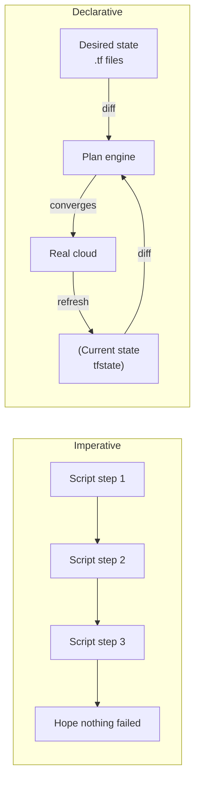

- Imperative: every rerun is a new history. Partial failures leave orphans.
- Declarative: every run converges toward the same end state. Reruns are safe.
- Terraform is the diff engine. You describe the photograph; it computes the brush strokes.
- The whole plan/apply loop only makes sense once you accept this reframe.
- Don't write HCL like a bash script. If you catch yourself reaching for `null_resource` with `local-exec`, stop — you've slipped into imperative.

<span class="stage execution">⚡ Execution</span>

**Run it yourself.**

```bash
# Imperative — feels familiar, breaks on retry
for i in 1 2 3; do
  aws s3api create-bucket --bucket "imperative-demo-$i" --region us-east-1
done
# Second run: BucketAlreadyOwnedByYou errors for all three.

# Declarative — same intent, safe to rerun
mkdir -p /tmp/tf-demo && cd /tmp/tf-demo
cat > main.tf <<'HCL'
terraform {
  required_providers {
    random = { source = "hashicorp/random", version = "~> 3.6" }
  }
}
resource "random_pet" "demo" { count = 3 }
output "pets" { value = random_pet.demo[*].id }
HCL

terraform init
terraform apply -auto-approve
terraform apply -auto-approve    # second run — no changes
```

<span class="stage simulation">🔮 Simulation — what you'll see</span>

<pre class="sim"><code><span class="prompt">$</span> terraform apply -auto-approve
<span class="comment"># random_pet.demo[0]: Creating...</span>
<span class="comment"># random_pet.demo[1]: Creating...</span>
<span class="comment"># random_pet.demo[2]: Creating...</span>
<span class="comment"># Apply complete! Resources: 3 added, 0 changed, 0 destroyed.</span>

<span class="prompt">$</span> terraform apply -auto-approve
<span class="comment"># No changes. Your infrastructure matches the configuration.</span>
<span class="comment"># Apply complete! Resources: 0 added, 0 changed, 0 destroyed.</span>
</code></pre>

<span class="stage output">✅ Output — state change</span>

<div class="flow" markdown>

<div class="state before" markdown>
##### Before
<span class="diff-del">imperative bash</span>
retries = duplicates
</div>

<div class="arrow">→</div>

<div class="state during" markdown>
##### During
<span class="diff-mod">plan engine</span>
reconciles intent vs state
</div>

<div class="arrow">→</div>

<div class="state after" markdown>
##### After
<span class="diff-add">idempotent applies</span>
rerun = zero changes
</div>

</div>

<span class="stage usecase">🌍 Real-world use case</span>

<div class="usecase-card" markdown>
**At HashiCorp**, the company that invented Terraform, the internal platform team runs the *same* HCL module to provision 40+ customer-facing demo environments every morning. When a demo VM is nuked mid-workshop, a single `terraform apply` rebuilds only the missing piece — leaving the rest untouched. Before Terraform, the same team kept a 2,000-line bash script that was rewritten every quarter because "it drifted." The declarative rewrite shrank the codebase 6× and cut demo-provisioning incidents to zero.
</div>

</div>

---

## 2. Providers &amp; resources

<div class="concept" markdown>

<span class="stage reason">🧭 Reason</span>

**Why this exists.** A platform engineer onboarding at a fintech in Singapore opened the Terraform repo and saw `aws_s3_bucket`, `google_storage_bucket`, `kubernetes_namespace`, and `datadog_monitor` in the same file — and panicked. Four different clouds, same grammar. The trick: Terraform Core doesn't know AWS. It doesn't know GCP. It ships with zero cloud logic. The knowledge lives in **providers** — plugins downloaded by `terraform init`. Every resource in the universe, from an AWS bucket to a Stripe customer to a Cloudflare DNS record, is just a typed object managed by a provider. One mental model scales to every SaaS with a registry entry. The engineer's panic turns into a superpower by lunchtime on day one.

<span class="stage thinking">🧠 Thinking</span>

**Mental model.** Core is the orchestrator. Providers are the translators. Resources are the nouns.

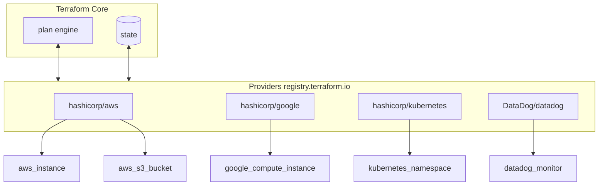

- **Provider** = a versioned binary that speaks one cloud/SaaS API. `hashicorp/aws v5.70.0` is a pinned contract.
- **Resource** = a managed, typed object. Terraform will create, update, or destroy it.
- **Data source** = the same typed object, read-only. Lookup, don't manage.
- Every resource has a schema. `terraform providers schema -json` dumps every attribute and type.
- Version providers the same way you version npm dependencies — pessimistic constraints (`~> 5.70`) with a lockfile (`.terraform.lock.hcl`) committed to git.

<span class="stage execution">⚡ Execution</span>

**Run it yourself.**

```bash
mkdir -p /tmp/tf-providers && cd /tmp/tf-providers
cat > providers.tf <<'HCL'
terraform {
  required_version = ">= 1.6"
  required_providers {
    aws        = { source = "hashicorp/aws",        version = "~> 5.70" }
    kubernetes = { source = "hashicorp/kubernetes", version = "~> 2.33" }
    random     = { source = "hashicorp/random",     version = "~> 3.6"  }
  }
}

provider "random" {}                 # no config needed
provider "aws"        { region = "us-east-1" }
provider "kubernetes" { config_path = "~/.kube/config" }

resource "random_id" "suffix" { byte_length = 4 }
HCL

terraform init                         # downloads the three providers
cat .terraform.lock.hcl | head -20     # the lockfile — commit this
terraform providers                    # tree of providers in use
```

<span class="stage simulation">🔮 Simulation — what you'll see</span>

<pre class="sim"><code><span class="prompt">$</span> terraform init
<span class="comment"># Initializing the backend...</span>
<span class="comment"># Initializing provider plugins...</span>
<span class="comment"># - Finding hashicorp/aws versions matching "~> 5.70"...</span>
<span class="comment"># - Installing hashicorp/aws v5.72.1...</span>
<span class="comment"># - Installing hashicorp/kubernetes v2.33.0...</span>
<span class="comment"># - Installing hashicorp/random v3.6.3...</span>
<span class="comment"># Terraform has been successfully initialized!</span>

<span class="prompt">$</span> terraform providers
<span class="comment"># Providers required by configuration:</span>
<span class="comment"># .</span>
<span class="comment"># ├── provider[registry.terraform.io/hashicorp/aws] ~> 5.70</span>
<span class="comment"># ├── provider[registry.terraform.io/hashicorp/kubernetes] ~> 2.33</span>
<span class="comment"># └── provider[registry.terraform.io/hashicorp/random] ~> 3.6</span>
</code></pre>

<span class="stage output">✅ Output — state change</span>

<div class="flow" markdown>

<div class="state before" markdown>
##### Before
<span class="diff-del">bare Terraform</span>
knows zero clouds
</div>

<div class="arrow">→</div>

<div class="state during" markdown>
##### During
<span class="diff-mod">init downloads</span>
three plugins pinned
</div>

<div class="arrow">→</div>

<div class="state after" markdown>
##### After
<span class="diff-add">multi-cloud ready</span>
AWS + GCP + K8s grammar
</div>

</div>

<span class="stage usecase">🌍 Real-world use case</span>

<div class="usecase-card" markdown>
**At Twilio**, one Terraform module provisions a new customer environment that spans AWS (VPC + RDS), Datadog (monitors + SLOs), PagerDuty (on-call schedule), and Cloudflare (TLS cert + WAF). Four providers, one `apply`. The provider abstraction means the platform team ships a single `customer_environment` module — and when Twilio switches its DNS vendor from Cloudflare to Route53, they swap a 30-line provider block, not a 3,000-line bash runbook.
</div>

</div>

---

## 3. State — the source of truth

<div class="concept" markdown>

<span class="stage reason">🧭 Reason</span>

!!! prod-danger "The Manual State Edit Anti-Pattern"
    **Never manually edit `terraform.tfstate` or run `terraform state rm` without a plan.**
    State is Terraform's source of truth. A corrupt state causes `plan` to recreate every resource — including your production database. Always use `terraform state mv`, `terraform import`, or `terraform refresh` instead. Lock state with `-lock=true` and enable versioning on your state backend.

**Why this exists.** Terraform cannot look at a `.tf` file and know which real-world resources exist. The HCL says "an S3 bucket named `app-logs`" — but AWS might have ten buckets, none of which Terraform manages, plus the one it created yesterday with a generated suffix. The mapping from HCL address (`aws_s3_bucket.logs`) to real-world ID (`arn:aws:s3:::app-logs-8f2c`) lives in the **state file**. Without it, every `plan` would have to query the entire cloud, can't know ownership, and couldn't detect drift. At 03:00 a Cruise engineer deleted `terraform.tfstate` by accident; next `plan` showed "create 417 resources." The team learned two things the hard way: state is precious, and state belongs in a remote backend with locking — not on a laptop.

<span class="stage thinking">🧠 Thinking</span>

**Mental model.** Three worlds, one mapping.

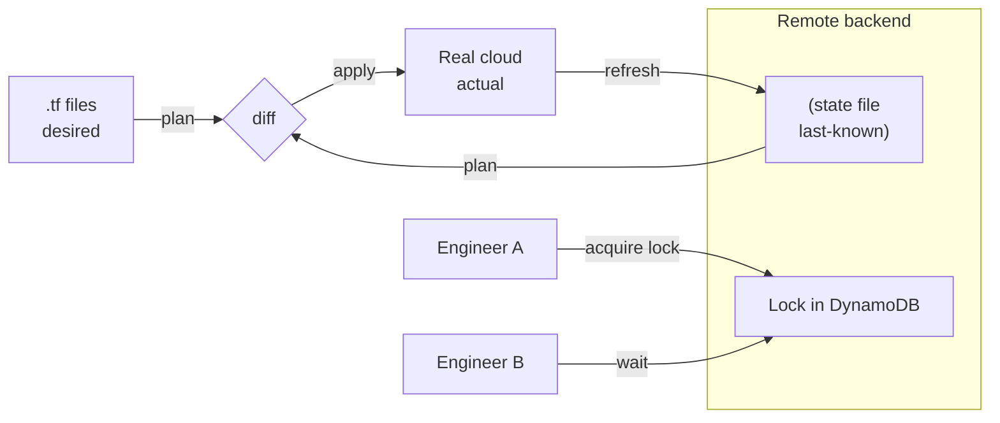

- The state file is a JSON map from `aws_s3_bucket.logs` → `{ id: "app-logs-8f2c", tags: {...} }`.
- `terraform refresh` asks the cloud for each resource's current attributes and updates the state.
- Remote backends (S3 + DynamoDB for AWS, GCS for GCP, Terraform Cloud) give locking, versioning, and shared access.
- Lock prevents two engineers from applying at the same time and corrupting state.
- `terraform state mv` is state surgery — rename a resource's *address* in state without touching the cloud. Critical when you refactor HCL.

<span class="stage execution">⚡ Execution</span>

**Run it yourself.**

```bash
# Remote backend: S3 for state, DynamoDB for lock
cat > backend.tf <<'HCL'
terraform {
  backend "s3" {
    bucket         = "acme-tfstate-prod"
    key            = "platform/app/terraform.tfstate"
    region         = "us-east-1"
    dynamodb_table = "acme-tf-locks"
    encrypt        = true
  }
}
HCL

terraform init                                      # migrates state to S3
terraform state list                                # resources under management
terraform state show aws_s3_bucket.logs             # one resource, all attrs
terraform state pull > /tmp/state-backup.json       # always backup before surgery
terraform state mv aws_s3_bucket.logs aws_s3_bucket.audit_logs
# rename in state only — the bucket itself is untouched
terraform plan                                      # should show "No changes"
```

=== ":material-aws: AWS"
    ```hcl
    resource "aws_s3_bucket" "state" {
      bucket = "my-terraform-state"

      versioning {
        enabled = true
      }

      server_side_encryption_configuration {
        rule {
          apply_server_side_encryption_by_default {
            sse_algorithm = "aws:kms"
          }
        }
      }
    }
    ```

=== ":material-google-cloud: GCP"
    ```hcl
    resource "google_storage_bucket" "state" {
      name          = "my-terraform-state"
      location      = "US"
      force_destroy = false

      versioning {
        enabled = true
      }
    }
    ```

<span class="stage simulation">🔮 Simulation — what you'll see</span>

<pre class="sim"><code><span class="prompt">$</span> terraform state list
<span class="comment"># aws_s3_bucket.logs</span>
<span class="comment"># aws_s3_bucket_versioning.logs</span>
<span class="comment"># aws_kms_key.state</span>

<span class="prompt">$</span> terraform state mv aws_s3_bucket.logs aws_s3_bucket.audit_logs
<span class="comment"># Move "aws_s3_bucket.logs" to "aws_s3_bucket.audit_logs"</span>
<span class="comment"># Successfully moved 1 object(s).</span>

<span class="prompt">$</span> terraform plan
<span class="comment"># No changes. Your infrastructure matches the configuration.</span>
</code></pre>

<span class="stage output">✅ Output — state change</span>

<div class="flow" markdown>

<div class="state before" markdown>
##### Before
<span class="diff-del">local .tfstate</span>
one laptop, zero locks
</div>

<div class="arrow">→</div>

<div class="state during" markdown>
##### During
<span class="diff-mod">S3 + DynamoDB</span>
versioned + locked
</div>

<div class="arrow">→</div>

<div class="state after" markdown>
##### After
<span class="diff-add">team-safe state</span>
concurrent runs blocked
</div>

</div>

<span class="stage usecase">🌍 Real-world use case</span>

<div class="usecase-card" markdown>
**At Cruise**, the self-driving company, a single Terraform monorepo manages 300+ AWS accounts. Every account has its own S3 + DynamoDB backend, encrypted with a per-account KMS key. When engineers refactor a module — say splitting `network` into `vpc` + `subnets` — they write a `terraform state mv` migration script that runs in CI *before* the new HCL lands. The discipline is simple: state surgery must ship in the same PR as the code change, and every `plan` must show "No changes" immediately after the move. This is how Cruise renames resources across hundreds of environments without a single outage.
</div>

</div>

---

## 4. Variables, outputs, locals

<div class="concept" markdown>

<span class="stage reason">🧭 Reason</span>

**Why this exists.** New Terraform users learn one tool — `variable` — and then use it for everything. They pass constants as variables. They compute derived values with string interpolation and hold the result in another variable. Readers can't tell what's configurable and what's fixed. Reviewers can't tell what a module exposes and what's private. At Airbnb, a 2020 internal audit found that 60% of declared variables in their platform modules were never set externally — they were just glorified locals. Terraform has three different tools for three different jobs. Learn the distinction once and your HCL reads like a typed function: `variable` = input parameter, `output` = return value, `local` = private `let` binding.

<span class="stage thinking">🧠 Thinking</span>

**Mental model.** A module is a function.

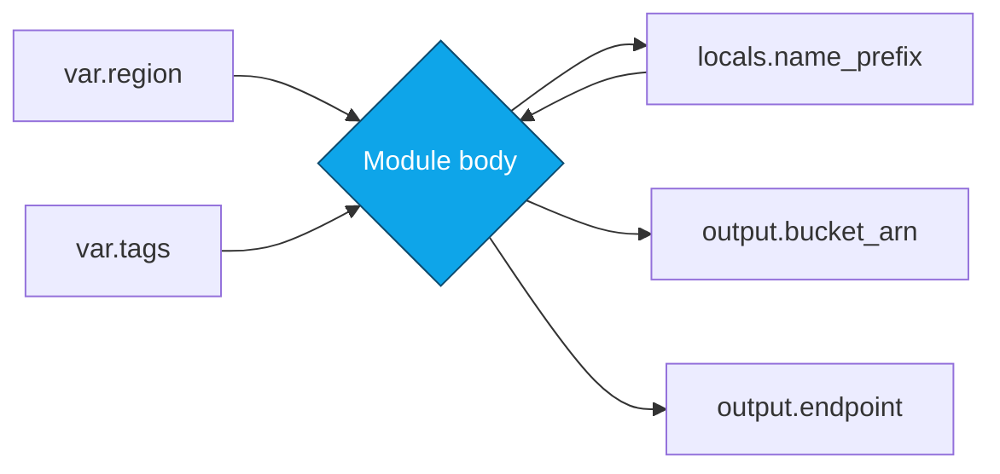

- **`variable`** — typed input. Can be set via `tfvars`, CLI, env, or a module call.
- **`output`** — typed return. Read by the root module or by a parent module's `module.x.output`.
- **`local`** — private `let`. Computed from variables and other locals. Never visible outside the module.
- If a value is never overridden externally, it is a `local`, not a `variable`.
- Use `sensitive = true` on outputs and variables that carry secrets — Terraform masks them in plan output (not a true secret store — see concept 12).

<span class="stage execution">⚡ Execution</span>

**Run it yourself.**

```hcl
# variables.tf — declared inputs
variable "env" {
  type        = string
  description = "Deployment environment (dev | staging | prod)"
  validation {
    condition     = contains(["dev", "staging", "prod"], var.env)
    error_message = "env must be dev, staging, or prod."
  }
}

variable "tags" {
  type    = map(string)
  default = {}
}

# locals.tf — private derived values
locals {
  name_prefix = "acme-${var.env}"
  default_tags = merge(
    { Env = var.env, ManagedBy = "terraform" },
    var.tags,
  )
}

# main.tf
resource "aws_s3_bucket" "logs" {
  bucket = "${local.name_prefix}-logs"
  tags   = local.default_tags
}

# outputs.tf — the module's public return
output "bucket_arn"  { value = aws_s3_bucket.logs.arn }
output "bucket_name" { value = aws_s3_bucket.logs.bucket }
```

```bash
terraform apply -var="env=prod" -var='tags={Team="platform"}'
terraform output -json | jq .
```

<span class="stage simulation">🔮 Simulation — what you'll see</span>

<pre class="sim"><code><span class="prompt">$</span> terraform apply -var="env=staging"
<span class="comment"># aws_s3_bucket.logs: Creating...</span>
<span class="comment"># aws_s3_bucket.logs: Creation complete after 2s</span>
<span class="comment"># Apply complete! Resources: 1 added</span>
<span class="comment"># Outputs:</span>
<span class="comment"># bucket_arn  = "arn:aws:s3:::acme-staging-logs"</span>
<span class="comment"># bucket_name = "acme-staging-logs"</span>

<span class="prompt">$</span> terraform apply -var="env=invalid"
<span class="comment"># Error: Invalid value for variable</span>
<span class="comment"># env must be dev, staging, or prod.</span>
</code></pre>

<span class="stage output">✅ Output — state change</span>

<div class="flow" markdown>

<div class="state before" markdown>
##### Before
<span class="diff-del">everything a variable</span>
unclear public API
</div>

<div class="arrow">→</div>

<div class="state during" markdown>
##### During
<span class="diff-mod">split roles</span>
input / private / return
</div>

<div class="arrow">→</div>

<div class="state after" markdown>
##### After
<span class="diff-add">typed function</span>
validated + documented
</div>

</div>

<span class="stage usecase">🌍 Real-world use case</span>

<div class="usecase-card" markdown>
**At Airbnb**, the platform team enforces a linter rule: every `variable` block must have a `description` and a `type`, and the PR will be rejected if more than 3 modules set the same default to the same value — the signal that the value should be hoisted into a `local` in a shared module. In the 2020 rewrite, this discipline dropped their `variables.tf` surface area from ~450 variables to ~120 — each one a real decision the consumer had to make. Reviewers now understand a module in one file instead of three.
</div>

</div>

---

## 5. Modules — reusable contracts

<div class="concept" markdown>

<span class="stage reason">🧭 Reason</span>

**Why this exists.** Copy-pasting a VPC block across 40 services sounds cheap until you need to change the default `enable_flow_logs` to `true`. Now you edit 40 files, and three services have drift. At Gruntwork — the team that literally wrote the Terraform module book — modules replaced copy-paste with *function calls*: a versioned, documented block of HCL with a clear input/output contract. `source = "git::https://github.com/acme/modules.git//vpc?ref=v2.3.1"` means every consumer pins the version, the module author can release v2.4.0 safely, and consumers bump when ready. Registry, git tag, local path — the source format is a superpower and a footgun. Pin or perish.

<span class="stage thinking">🧠 Thinking</span>

**Mental model.** Modules compose like functions — inputs in, outputs out, versions pinned.

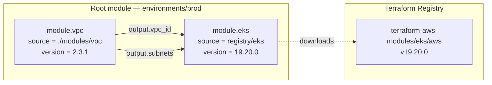

- A module is just a folder with `variables.tf`, `main.tf`, `outputs.tf`. That's it.
- Consumers use `module "name" { source = "..." }` — source can be local path, git URL, or a registry address.
- Always pin versions. `ref=v2.3.1` for git, `version = "~> 19.20"` for registry.
- `terraform-aws-modules/*` on the registry is the de-facto standard library — vpc, eks, rds, alb.
- Module versioning follows SemVer: major = breaking change to inputs/outputs, minor = new input with default, patch = bug fix.

<div class="file-tree" markdown>

📦 **terraform-aws-app/**  
┣ 📜 `main.tf` — primary resource definitions  
┣ 📜 `variables.tf` — input variable declarations  
┣ 📜 `outputs.tf` — exported values for other modules  
┣ 📜 `versions.tf` — `required_providers` + `terraform` block  
┣ 📂 **modules/**  
┃ ┣ 📂 **networking/** — VPC, subnets, security groups  
┃ ┗ 📂 **compute/** — EKS, EC2, ASG  
┣ 📂 **environments/**  
┃ ┣ 📂 **dev/** — `terraform.tfvars` with dev values  
┃ ┗ 📂 **prod/** — `terraform.tfvars` with prod values  
┗ 📜 `.terraform.lock.hcl` — provider version lock file *(commit this!)*

</div>

<span class="stage execution">⚡ Execution</span>

**Run it yourself.**

```hcl
# environments/prod/main.tf — the root
module "vpc" {
  source  = "terraform-aws-modules/vpc/aws"
  version = "~> 5.13"

  name            = "acme-prod"
  cidr            = "10.0.0.0/16"
  azs             = ["us-east-1a", "us-east-1b", "us-east-1c"]
  private_subnets = ["10.0.1.0/24", "10.0.2.0/24", "10.0.3.0/24"]
  public_subnets  = ["10.0.101.0/24", "10.0.102.0/24", "10.0.103.0/24"]

  enable_nat_gateway = true
  single_nat_gateway = false
  tags = { Env = "prod" }
}

module "eks" {
  source  = "terraform-aws-modules/eks/aws"
  version = "~> 20.24"

  cluster_name    = "acme-prod"
  cluster_version = "1.30"
  vpc_id          = module.vpc.vpc_id
  subnet_ids      = module.vpc.private_subnets
}
```

```bash
terraform init                   # downloads modules to .terraform/modules/
cat .terraform/modules/modules.json | jq '.Modules[] | {Key, Version}'
terraform plan
```

<span class="stage simulation">🔮 Simulation — what you'll see</span>

<pre class="sim"><code><span class="prompt">$</span> terraform init
<span class="comment"># Initializing modules...</span>
<span class="comment"># Downloading registry.terraform.io/terraform-aws-modules/vpc/aws 5.13.0</span>
<span class="comment"># Downloading registry.terraform.io/terraform-aws-modules/eks/aws 20.24.0</span>
<span class="comment"># Installed 2 modules</span>

<span class="prompt">$</span> terraform plan
<span class="comment"># module.vpc.aws_vpc.this[0] will be created</span>
<span class="comment"># module.eks.aws_eks_cluster.this[0] will be created</span>
<span class="comment"># Plan: 47 to add, 0 to change, 0 to destroy.</span>
</code></pre>

<span class="stage output">✅ Output — state change</span>

<div class="flow" markdown>

<div class="state before" markdown>
##### Before
<span class="diff-del">copy-paste VPC</span>
40 files, 3 drift
</div>

<div class="arrow">→</div>

<div class="state during" markdown>
##### During
<span class="diff-mod">module ~> 5.13</span>
bumps tracked in PR
</div>

<div class="arrow">→</div>

<div class="state after" markdown>
##### After
<span class="diff-add">versioned function</span>
one source, N consumers
</div>

</div>

<span class="stage usecase">🌍 Real-world use case</span>

<div class="usecase-card" markdown>
**At Gruntwork**, the team ships the open-source `terraform-aws-modules` library — downloaded ~300 million times a year from the Terraform Registry. Their rule: every module has a `examples/` folder that gets CI-tested on every commit. A breaking change to inputs is a **major** version bump, documented in the changelog with a migration snippet. Consumers upgrade on their own schedule. This is how a two-engineer team maintains a module used by every Fortune 500 AWS shop — the contract is the versioned API, and the registry is the delivery mechanism.
</div>

</div>

---

## 6. Workspaces vs separate state files

<div class="concept" markdown>

<span class="stage reason">🧭 Reason</span>

**Why this exists.** New users discover `terraform workspace new prod` and think they've found the environment-isolation feature. They haven't. Workspaces share the same backend bucket, the same credentials, the same HCL. They only switch the state file name. So a typo in the root module blows up every environment, because every environment runs *the same code*. At Cruise, an early attempt to use workspaces for dev/staging/prod was abandoned after a `terraform apply` in dev — with a stale `workspace` setting — mutated prod. The cure is separate directories, separate backends, separate credentials. Workspaces are for ephemeral experiments (a feature branch, a PR preview), not for the permanent environment boundary.

<span class="stage thinking">🧠 Thinking</span>

**Mental model.** Workspaces are cheap. Separate environments are safe.

```mermaid
flowchart TB
  subgraph wrong[&#x274C; Workspaces for environments]
    W1[terraform workspace select prod]
    W1 --> BE["(single backend<br/>prod.tfstate + dev.tfstate)"]
    W1 --> CRED[one IAM role]
  end
  subgraph right[&#x2705; Directory per environment]
    D1[environments/dev/] --> B1[(dev backend)]
    D2[environments/staging/] --> B2[(staging backend)]
    D3[environments/prod/] --> B3[(prod backend)]
    D1 --> C1[dev IAM role]
    D3 --> C3[prod IAM role]
  end
```

- Workspaces switch state-file keys — nothing else. Same code, same providers, same credentials.
- Typos in shared HCL break every workspace simultaneously. There is no blast-radius isolation.
- Prod and dev should live in separate AWS accounts, with separate backends and separate credentials.
- Use directory-per-environment: `environments/{dev,staging,prod}/main.tf`, each with its own backend block and its own `terraform.tfvars`.
- Valid uses for workspaces: short-lived per-branch or per-PR preview environments in a non-prod account.

**State isolation with workspaces:**

```diff
  # Bad: single workspace for all environments
  terraform workspace new dev
- # All envs share one state file path
- # Production changes visible alongside dev

  # Good: separate state backends per environment
+ # environments/prod/backend.tf
+ terraform {
+   backend "s3" {
+     bucket = "tf-state-prod"
+     key    = "prod/terraform.tfstate"
+   }
+ }
```

<span class="stage execution">⚡ Execution</span>

**Run it yourself.**

```bash
# ============ Anti-pattern: workspaces ============
terraform workspace new dev
terraform apply               # writes to dev.tfstate in same bucket
terraform workspace select prod
terraform apply               # same HCL, different state — typo blows up both

# ============ Correct: directory per env ============
tree environments/
# environments/
# ├── dev/      main.tf  backend.tf  terraform.tfvars
# ├── staging/  main.tf  backend.tf  terraform.tfvars
# └── prod/     main.tf  backend.tf  terraform.tfvars

# each directory pins its own backend + account
cat environments/prod/backend.tf
# terraform { backend "s3" {
#   bucket = "acme-prod-tfstate"   # different bucket
#   key    = "platform.tfstate"
#   region = "us-east-1"
# }}

cd environments/prod && terraform init && terraform plan
```

<span class="stage simulation">🔮 Simulation — what you'll see</span>

<pre class="sim"><code><span class="prompt">$</span> cd environments/prod && terraform init
<span class="comment"># Initializing the backend...</span>
<span class="comment"># Successfully configured the backend "s3"!</span>

<span class="prompt">$</span> aws sts get-caller-identity
<span class="comment"># {</span>
<span class="comment">#   "Account": "111122223333",       # prod account</span>
<span class="comment">#   "Arn": "arn:aws:iam::111122223333:role/tf-prod"</span>
<span class="comment"># }</span>

<span class="prompt">$</span> cd ../dev && terraform init
<span class="comment"># Account: "444455556666",           # dev account — different credentials</span>
</code></pre>

<span class="stage output">✅ Output — state change</span>

<div class="flow" markdown>

<div class="state before" markdown>
##### Before
<span class="diff-del">workspace prod</span>
shared backend + creds
</div>

<div class="arrow">→</div>

<div class="state during" markdown>
##### During
<span class="diff-mod">env/prod, env/dev</span>
separate backends
</div>

<div class="arrow">→</div>

<div class="state after" markdown>
##### After
<span class="diff-add">blast-radius isolation</span>
dev typo cannot hit prod
</div>

</div>

<span class="stage usecase">🌍 Real-world use case</span>

<div class="usecase-card" markdown>
**At Cruise**, after the workspace incident, the platform team standardised on directory-per-environment plus per-account OIDC roles. Each directory has a `.github/workflows/` that assumes a role scoped *only* to that account. A PR to `environments/dev/*` cannot assume the prod role — the GitHub Actions `id-token` subject claim doesn't match. The result: dev engineers iterate freely, prod changes require a second reviewer, and workspaces are reserved for ephemeral PR preview stacks that auto-destroy 48h after merge.
</div>

</div>

---

## 7. Plan discipline — reading the diff

<div class="concept" markdown>

<span class="stage reason">🧭 Reason</span>

**Why this exists.** `terraform plan` is the single most important output in this whole discipline. It is a diff. Not a prediction, not a suggestion — a contract between the HCL and the cloud. Reading it wrong is how prod dies. At 03:14 a Shopify engineer approved a PR whose plan contained `# forces replacement` on an RDS instance. She didn't scroll far enough. The `apply` destroyed the prod database. Recovery: 4h from backup, 2h of lost writes. The fix was cultural, not technical: every prod PR must post the full plan to the ticket, every `# forces replacement` must be acknowledged in a separate review comment, and `-refresh-only` is run before every `apply` to reveal hidden drift. The plan is your last off-ramp before something irreversible happens.

<span class="stage thinking">🧠 Thinking</span>

**Mental model.** Five symbols you must read on sight.

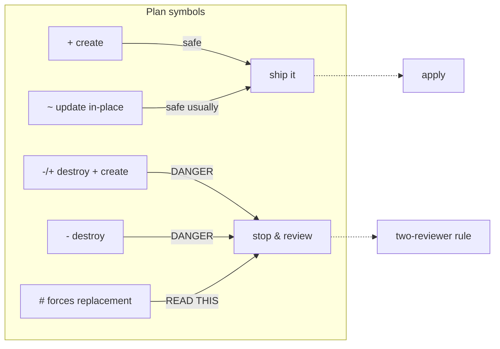

- `+` = create a new resource. Usually safe.
- `~` = update in-place. Safe unless the attribute is immutable.
- `-/+` = destroy then create. Downtime. For an RDS, it means data loss.
- `# forces replacement` next to an attribute tells you *why* it's `-/+`. Always scroll to find it.
- Use `terraform plan -out=tfplan` and `terraform apply tfplan` — the only way to guarantee the thing you reviewed is the thing that applies.

<span class="stage execution">⚡ Execution</span>

**Run it yourself.**

```bash
# save + show + apply the same plan
terraform plan \
  -var-file="environments/prod/terraform.tfvars" \ # (1)!
  -out=tfplan \                                     # (2)!
  -detailed-exitcode \                              # (3)!
  -lock=true                                        # (4)!
```
1. `-var-file` — loads variable values. Stack multiple `-var-file` flags; last value wins for conflicts.
2. `-out=tfplan` — saves the plan to a binary file. Pass to `terraform apply tfplan` for a guaranteed-identical apply.
3. `-detailed-exitcode` — exits 2 if there are changes (useful in CI: `if [ $? -eq 2 ]; then apply; fi`).
4. `-lock=true` — acquires state lock before reading. Default true; set `-lock=false` ONLY for read-only inspection.

```bash
terraform show tfplan                           # human-readable
terraform show -json tfplan | jq '.resource_changes[] |
  {addr: .address, actions: .change.actions}'   # machine-parseable

# catch the killer symbol before apply
terraform show -json tfplan | jq -r '
  .resource_changes[]
  | select(.change.actions | contains(["delete","create"]))
  | "REPLACEMENT: " + .address'

# refresh-only plan to see drift without changing anything
terraform plan -refresh-only
```

<span class="stage simulation">🔮 Simulation — what you'll see</span>

<pre class="sim"><code><span class="prompt">$</span> terraform plan -out=tfplan
<span class="comment"># Terraform will perform the following actions:</span>

<span class="comment">#   # aws_db_instance.main must be replaced</span>
<span class="comment"># -/+ resource "aws_db_instance" "main" {</span>
<span class="comment">#       ~ instance_class = "db.t3.medium" -> "db.m5.large" # forces replacement</span>
<span class="comment">#     }</span>

<span class="comment"># Plan: 1 to add, 0 to change, 1 to destroy.</span>

<span class="prompt">$</span> terraform show -json tfplan | jq -r '.resource_changes[]
  | select(.change.actions | contains(["delete","create"]))
  | .address'
<span class="comment"># aws_db_instance.main     &lt;-- PR blocked until human acknowledges</span>
</code></pre>

<span class="stage output">✅ Output — state change</span>

<div class="flow" markdown>

<div class="state before" markdown>
##### Before
<span class="diff-del">approve at a glance</span>
skim the plan
</div>

<div class="arrow">→</div>

<div class="state during" markdown>
##### During
<span class="diff-mod">grep -/+</span>
jq selector in CI
</div>

<div class="arrow">→</div>

<div class="state after" markdown>
##### After
<span class="diff-add">replacement gated</span>
two humans must ack
</div>

</div>

<span class="stage usecase">🌍 Real-world use case</span>

<div class="usecase-card" markdown>
**At Shopify**, after the RDS incident, every prod Terraform PR runs a CI step called `plan-guard` that parses the JSON plan for any `aws_db_instance`, `aws_rds_cluster`, or `aws_elasticache_cluster` with a `delete+create` action pair. If found, the PR status turns red and a label `needs-dba-review` is attached. Merge is blocked until a database SRE leaves an explicit `/approve-replacement` comment. The same pattern has since been copied by Stripe and Lyft. Plan discipline is the cheapest, highest-leverage Terraform policy any team can install.
</div>

</div>

---

## 8. Drift detection &amp; reconciliation

<div class="concept" markdown>

<span class="stage reason">🧭 Reason</span>

**Why this exists.** No matter how strictly you police the console, someone, somewhere, will click. A junior debugging at 02:00 disables a security-group rule. A vendor's support engineer flips a flag to "help." Six months later, `terraform apply` on an unrelated change tries to reconcile — and reverts the manual fix, or worse, reinstates an attack surface. This is **drift**: the real cloud diverging from the state-file view. Terraform's answer is a periodic `plan -refresh-only` that surfaces drift without applying anything. At Netflix and Airbnb, this plan runs hourly in CI against every prod backend — and if drift appears, a ticket fires. You don't manage what you can't see.

<span class="stage thinking">🧠 Thinking</span>

**Mental model.** Three things drift relative to each other. Keep them aligned.

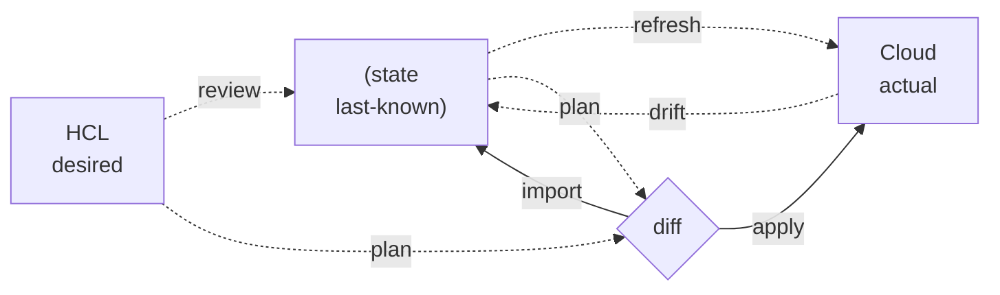

- `terraform plan` compares HCL vs state. It does not automatically refresh the cloud.
- `terraform plan -refresh-only` shows state vs cloud — the drift detector.
- `terraform apply -refresh-only` accepts the drift (updates state to match cloud) without touching the cloud.
- `terraform import` pulls an unmanaged real-world resource *into* state.
- Scheduled drift detection in CI catches the console click before the next real change fights it.

<span class="stage execution">⚡ Execution</span>

**Run it yourself.**

```bash
# Simulate a human edit in the AWS console: change a tag manually
aws s3api put-bucket-tagging \
  --bucket app-logs \
  --tagging 'TagSet=[{Key=Owner,Value=manual-edit}]'

# Detect the drift without changing anything
terraform plan -refresh-only
# Output: ~ aws_s3_bucket.logs  Owner: "platform" -> "manual-edit"

# Three responses to drift:
# 1) HCL is right, cloud is wrong -> normal apply reverts the edit
terraform apply

# 2) Cloud is right, HCL was outdated -> update HCL in git, then apply

# 3) You accept reality -> accept drift into state
terraform apply -refresh-only -auto-approve
```

<span class="stage simulation">🔮 Simulation — what you'll see</span>

<pre class="sim"><code><span class="prompt">$</span> terraform plan -refresh-only
<span class="comment"># Note: Objects have changed outside of Terraform</span>
<span class="comment"># ~ aws_s3_bucket.logs has been changed</span>
<span class="comment">#     tags = {</span>
<span class="comment">#       "Owner" = "platform" -> "manual-edit"</span>
<span class="comment">#     }</span>

<span class="prompt">$</span> terraform apply
<span class="comment"># ~ update in-place</span>
<span class="comment"># tags.Owner: "manual-edit" -> "platform"</span>
<span class="comment"># Apply complete! Resources: 0 added, 1 changed, 0 destroyed.</span>
</code></pre>

<span class="stage output">✅ Output — state change</span>

<div class="flow" markdown>

<div class="state before" markdown>
##### Before
<span class="diff-del">silent drift</span>
console edit invisible
</div>

<div class="arrow">→</div>

<div class="state during" markdown>
##### During
<span class="diff-mod">refresh-only plan</span>
delta visible
</div>

<div class="arrow">→</div>

<div class="state after" markdown>
##### After
<span class="diff-add">reconciled</span>
git = state = cloud
</div>

</div>

<span class="stage usecase">🌍 Real-world use case</span>

<div class="usecase-card" markdown>
**At Airbnb**, every prod Terraform backend is scanned hourly by an internal tool called `tfdrift` — a thin wrapper that runs `terraform plan -refresh-only` in each environment directory and posts diffs to a Slack channel. When the e-commerce team migrated their booking service in 2022, drift detection caught 1,200+ console-made tweaks that hadn't been codified. The team resolved 90% by `import` or HCL updates over three weeks. The remaining 10% were tagged `accept` and reconciled via `-refresh-only apply`. Drift detection is the mechanism that turns Terraform from a *deployment tool* into a *source of truth*.
</div>

</div>

---

## 9. Data sources — lookup, not manage

<div class="concept" markdown>

<span class="stage reason">🧭 Reason</span>

**Why this exists.** Not everything in your cloud should be managed by *this* Terraform root. The account's primary VPC is owned by the networking team's repo. The TLS cert for `*.acme.com` was bought via ClickOps in 2019 and isn't going anywhere. An AMI's latest ID changes weekly — you want to reference it, not re-declare it. For all of these, the right tool is a **data source**: a typed, read-only query against the provider. It pulls the current attributes at plan time and exposes them as if they were a resource. It never creates, never mutates, and costs nothing to use. `data "aws_ami" "ubuntu"` is how a consumer module gets the right AMI without writing "which AMI?" into a hardcoded variable.

<span class="stage thinking">🧠 Thinking</span>

**Mental model.** Two roles: one writer, many readers.

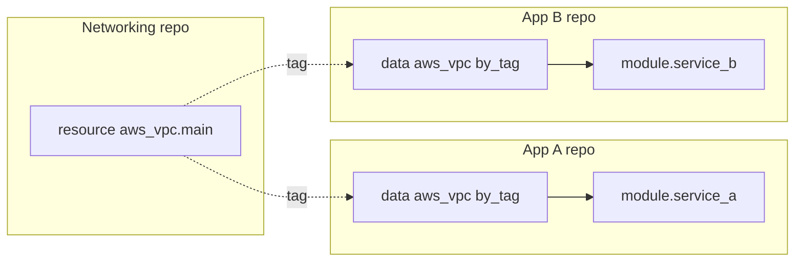

- `data "aws_vpc" "primary" { tags = { Name = "acme-prod" } }` resolves at plan time.
- Ownership: one module *creates* the VPC (`resource`); every other module *reads* it (`data`).
- Data sources are evaluated every `plan`, so they reflect the current cloud — no staleness risk.
- For cross-repo wiring, pair a data source with a well-known tag (`Name = "acme-prod"`) — no shared state required.
- `terraform_remote_state` is the heavier alternative — reads another module's state directly. Use only when tags aren't enough.

<span class="stage execution">⚡ Execution</span>

**Run it yourself.**

```hcl
# main.tf — read the primary VPC from the networking team
data "aws_vpc" "primary" {
  tags = { Name = "acme-prod" }
}

data "aws_subnets" "private" {
  filter {
    name   = "vpc-id"
    values = [data.aws_vpc.primary.id]
  }
  tags = { Tier = "private" }
}

# latest Ubuntu 22.04 AMI — resolved every plan
data "aws_ami" "ubuntu" {
  most_recent = true
  owners      = ["099720109477"]
  filter {
    name   = "name"
    values = ["ubuntu/images/hvm-ssd/ubuntu-jammy-22.04-amd64-server-*"]
  }
}

resource "aws_instance" "worker" {
  ami           = data.aws_ami.ubuntu.id
  subnet_id     = data.aws_subnets.private.ids[0]
  instance_type = "t3.small"
}

output "used_ami_id" { value = data.aws_ami.ubuntu.id }
```

```bash
terraform plan
terraform console <<< 'data.aws_ami.ubuntu.id'
```

<span class="stage simulation">🔮 Simulation — what you'll see</span>

<pre class="sim"><code><span class="prompt">$</span> terraform plan
<span class="comment"># data.aws_vpc.primary: Reading...</span>
<span class="comment"># data.aws_vpc.primary: Read complete after 1s [id=vpc-0a1b2c...]</span>
<span class="comment"># data.aws_ami.ubuntu:  Read complete after 2s [id=ami-0c55b159c...]</span>
<span class="comment"># aws_instance.worker will be created</span>
<span class="comment">#   ami       = "ami-0c55b159c..."</span>
<span class="comment">#   subnet_id = "subnet-0a1..."</span>

<span class="prompt">$</span> terraform console
<span class="prompt">&gt;</span> data.aws_ami.ubuntu.id
<span class="comment"># "ami-0c55b159c..."</span>
</code></pre>

<span class="stage output">✅ Output — state change</span>

<div class="flow" markdown>

<div class="state before" markdown>
##### Before
<span class="diff-del">hardcoded AMI</span>
stale in 7 days
</div>

<div class="arrow">→</div>

<div class="state during" markdown>
##### During
<span class="diff-mod">data lookup</span>
resolved each plan
</div>

<div class="arrow">→</div>

<div class="state after" markdown>
##### After
<span class="diff-add">always current</span>
no cross-repo coupling
</div>

</div>

<span class="stage usecase">🌍 Real-world use case</span>

<div class="usecase-card" markdown>
**At Twilio**, each product team owns its own Terraform repo, but they all share a single VPC owned by the networking team. The contract is a tag: `Name = "twilio-prod"`. Every product repo uses `data "aws_vpc" "primary"` plus `data "aws_subnets"` to discover the network layout — no shared state, no cross-repo writes, no tight coupling. When networking re-architected into dual-region in 2023, they added a second VPC with `Name = "twilio-prod-west"`. Product teams opted in by flipping a single variable in their data-source filter. Zero breakage, 40 teams migrated in a week.
</div>

</div>

---

## 10. CI/CD for Terraform

<div class="concept" markdown>

<span class="stage reason">🧭 Reason</span>

**Why this exists.** If a human can run `terraform apply` from their laptop, your audit trail is "I think so?". Credentials end up in shell history. Two engineers race to apply and corrupt state. Someone forgets to run `fmt` and the diff is half indentation. The fix is CI/CD: the PR is the only way in, and the CI runs `plan`, posts it as a comment, and only after approval does a merge trigger `apply` — with federated credentials (OIDC), no long-lived keys. The tool ecosystem splits into two camps: **Atlantis** (a dedicated PR-commenting bot) and **Terragrunt + vanilla GitHub Actions** (a thin DRY wrapper + generic runners). Pick one early. Both end the laptop-apply era.

<span class="stage thinking">🧠 Thinking</span>

**Mental model.** Four gates between a PR and production.

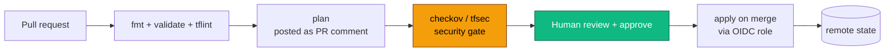

- Every PR must trigger `fmt -check`, `validate`, `tflint`, `plan`, and `checkov` automatically.
- The `plan` output is posted back as a PR comment — reviewers see exactly what will change.
- `apply` only runs on merge to the environment branch, and only with a short-lived OIDC token.
- Terragrunt handles the DRY problem: 40 environments × same backend config = one `terragrunt.hcl` generator.
- Atlantis runs as a server. Terragrunt + GitHub Actions runs as pure CI. Neither is better — pick on team preference.

<span class="stage execution">⚡ Execution</span>

**Run it yourself.**

```yaml
# .github/workflows/terraform.yml
name: terraform
on:
  pull_request:
    paths: ['environments/prod/**']
permissions:
  id-token: write      # OIDC
  contents: read
  pull-requests: write
jobs:
  plan:
    runs-on: ubuntu-latest
    defaults: { run: { working-directory: environments/prod } }
    steps:
      - uses: actions/checkout@v4
      - uses: aws-actions/configure-aws-credentials@v4
        with:
          role-to-assume: arn:aws:iam::111122223333:role/tf-prod-plan
          aws-region: us-east-1
      - uses: hashicorp/setup-terraform@v3
        with: { terraform_version: 1.9.8 }
      - run: terraform fmt -check -recursive
      - run: terraform init
      - run: terraform validate
      - run: terraform plan -out=tfplan -no-color | tee plan.txt
      - uses: bridgecrewio/checkov-action@master
        with: { directory: environments/prod }
      - uses: marocchino/sticky-pull-request-comment@v2
        with: { path: environments/prod/plan.txt }
```

<span class="stage simulation">🔮 Simulation — what you'll see</span>

<pre class="sim"><code><span class="prompt">#</span> On PR:
<span class="comment"># ✅ fmt          passed</span>
<span class="comment"># ✅ validate     passed</span>
<span class="comment"># ✅ plan         posted as comment (47 to add, 0 change, 0 destroy)</span>
<span class="comment"># ✅ checkov      no HIGH findings</span>
<span class="comment"># ⏸  apply        waits for merge</span>

<span class="prompt">#</span> On merge:
<span class="comment"># ✅ OIDC token for role/tf-prod-apply acquired</span>
<span class="comment"># ✅ terraform apply tfplan</span>
<span class="comment"># ✅ Apply complete! Resources: 47 added</span>
</code></pre>

<span class="stage output">✅ Output — state change</span>

<div class="flow" markdown>

<div class="state before" markdown>
##### Before
<span class="diff-del">laptop apply</span>
no audit, no gate
</div>

<div class="arrow">→</div>

<div class="state during" markdown>
##### During
<span class="diff-mod">PR → plan → review</span>
OIDC short-lived creds
</div>

<div class="arrow">→</div>

<div class="state after" markdown>
##### After
<span class="diff-add">merge-gated apply</span>
full audit trail in git
</div>

</div>

<span class="stage usecase">🌍 Real-world use case</span>

<div class="usecase-card" markdown>
**At HashiCorp**, internal teams moved to Terraform Cloud (their managed plan/apply service) in 2019. Before the move: ~30 incidents/year tied to bad local applies. After: zero. The same pattern — PR, plan as comment, human approval, short-lived creds — works identically with Atlantis (open-source) or Terragrunt + GitHub Actions. Gruntwork's Terragrunt approach is the reference for DRY multi-account setups; their public `terraform-infrastructure-live` template is the single most copied blueprint in regulated industries.
</div>

</div>

---

## 11. Testing — tflint, checkov, terratest

<div class="concept" markdown>

<span class="stage reason">🧭 Reason</span>

**Why this exists.** "It planned fine, so it must work." That sentence has caused every Terraform-induced outage in history. `terraform plan` proves the HCL is internally consistent. It does not prove the resulting infrastructure is correct, secure, or even compilable against your org's policy. The three-tier test stack — **tflint** (style + provider-specific lint), **checkov/tfsec** (security policy), **terratest** (actually-spin-it-up acceptance test) — fills the gap. At Gruntwork, every module ships with a `test/` folder that spins up a real VPC, asserts subnets are reachable, and tears it down — all in under 4 minutes. The PR cannot merge with a red test. Security-as-code isn't a slogan; it's a CI gate.

<span class="stage thinking">🧠 Thinking</span>

**Mental model.** Three layers, each catches what the others miss.

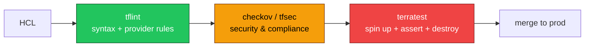

- `tflint` catches things like unused variables, invalid instance types, deprecated provider attributes.
- `checkov` and `tfsec` enforce rules like "S3 must be encrypted," "security group must not open 0.0.0.0/0 to port 22."
- `terratest` (Go library) does integration testing — apply, assert, destroy. Slow but thorough.
- `terraform test` (built in since v1.6) is a lighter-weight alternative for pure-HCL assertions.
- Gate the PR with all three. If a security rule is wrong, fix the rule in code, not the exception in Slack.

<span class="stage execution">⚡ Execution</span>

**Run it yourself.**

```bash
# 1. tflint — fast, catches provider-specific mistakes
brew install tflint
cat > .tflint.hcl <<'HCL'
plugin "aws" { enabled = true, version = "0.32.0", source = "github.com/terraform-linters/tflint-ruleset-aws" }
HCL
tflint --init && tflint

# 2. checkov — security + compliance
pip install checkov
checkov -d . --framework terraform --compact

# 3. terraform test (built-in, TF >= 1.6)
cat > tests/s3.tftest.hcl <<'HCL'
run "s3_bucket_is_encrypted" {
  command = plan
  assert {
    condition     = aws_s3_bucket.logs.server_side_encryption_configuration != null
    error_message = "S3 bucket must be encrypted"
  }
}
HCL
terraform test

# 4. terratest (Go) — for integration
# test/vpc_test.go
# terraform.InitAndApply(t, &terraform.Options{...})
# terraform.Destroy(t, &terraform.Options{...})
cd test && go test -v -timeout 30m
```

<span class="stage simulation">🔮 Simulation — what you'll see</span>

<pre class="sim"><code><span class="prompt">$</span> tflint
<span class="comment"># Warning: instance type "t3.nano" is deprecated for this AMI (main.tf:14)</span>

<span class="prompt">$</span> checkov -d . --compact
<span class="comment"># Passed checks: 42, Failed checks: 1, Skipped: 0</span>
<span class="comment"># FAILED for resource: aws_s3_bucket.logs</span>
<span class="comment"># File: /main.tf:3-10</span>
<span class="comment"># Check: CKV_AWS_18 "S3 Bucket has access logging enabled"</span>

<span class="prompt">$</span> terraform test
<span class="comment"># tests/s3.tftest.hcl... in progress</span>
<span class="comment"># run "s3_bucket_is_encrypted"... pass</span>
<span class="comment"># Success! 1 passed, 0 failed.</span>
</code></pre>

<span class="stage output">✅ Output — state change</span>

<div class="flow" markdown>

<div class="state before" markdown>
##### Before
<span class="diff-del">plan-only CI</span>
security assumed
</div>

<div class="arrow">→</div>

<div class="state during" markdown>
##### During
<span class="diff-mod">tflint + checkov</span>
policy enforced in PR
</div>

<div class="arrow">→</div>

<div class="state after" markdown>
##### After
<span class="diff-add">tested modules</span>
integration = proven
</div>

</div>

<span class="stage usecase">🌍 Real-world use case</span>

<div class="usecase-card" markdown>
**At Gruntwork**, every open-source module in the `terraform-aws-*` library ships with a `test/` folder that uses **terratest** to boot the module in an ephemeral AWS account, hit the endpoints or API, and destroy. They run ~400 such tests per day on their CI fleet. Bugs that would only surface in production — race conditions, IAM policy typos, region-specific quirks — are caught in a 4-minute PR check. Gruntwork's rule: no module ships without terratest coverage. The cost (a few dollars of EC2/RDS per month) is a rounding error vs the cost of one prod rollback.
</div>

</div>

---

## 12. Secrets in Terraform

<div class="concept" markdown>

<span class="stage reason">🧭 Reason</span>

**Why this exists.** `sensitive = true` feels like a seatbelt. It isn't. It only masks the value in the CLI output. The value itself still sits **in plaintext** inside the state file — and the state file is JSON. If your S3 backend bucket allows public read, every DB password in your org is one `aws s3 cp` away from a leak. This is the single biggest footgun in Terraform, and the reason the HashiCorp security team publishes a 30-page doc on it every year. The safe pattern: **never put the secret value in HCL at all**. Reference it by identifier from a dedicated secret store (AWS Secrets Manager, GCP Secret Manager, Vault), and let the consuming resource fetch it at runtime. State then holds the *reference*, not the secret.

<span class="stage thinking">🧠 Thinking</span>

**Mental model.** Separate the source of truth from the reference in Terraform.

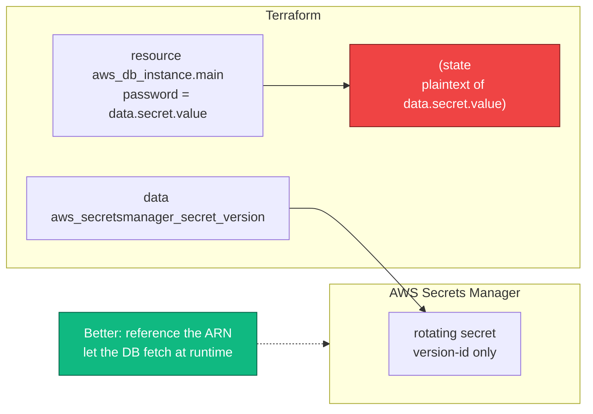

- `sensitive = true` hides the value in logs. The state file still contains it in plaintext.
- Any `data "aws_secretsmanager_secret_version"` pulls the secret into state on every plan.
- The safer pattern: pass the secret's **ARN or ID** to the resource (RDS supports `manage_master_user_password`, which auto-creates and rotates via Secrets Manager — no plaintext in state).
- Encrypt the state backend at rest (S3 SSE-KMS) and lock down bucket ACLs to a single role.
- `.gitignore` `*.tfstate`, `*.tfstate.backup`, `terraform.tfvars`, and `.terraform/`. Add a pre-commit hook.

<span class="stage execution">⚡ Execution</span>

**Run it yourself.**

```hcl
# ========== UNSAFE pattern (shown as an anti-example) ==========
# state now contains the DB password in plaintext
# data "aws_secretsmanager_secret_version" "db" { secret_id = "acme/db" }
# resource "aws_db_instance" "main" {
#   password = data.aws_secretsmanager_secret_version.db.secret_string
#   ...
# }

# ========== SAFE pattern ==========
resource "aws_db_instance" "main" {
  identifier               = "acme-prod"
  engine                   = "postgres"
  instance_class           = "db.m5.large"
  username                 = "admin"
  manage_master_user_password = true     # AWS auto-creates + rotates in Secrets Manager
  kms_key_id               = aws_kms_key.state.arn
  storage_encrypted        = true
  # no "password" attribute at all — never enters state
}

output "db_secret_arn" {
  value     = aws_db_instance.main.master_user_secret[0].secret_arn
  sensitive = true
}
```

```bash
# Lock down the state backend itself
aws s3api put-bucket-encryption --bucket acme-tfstate-prod \
  --server-side-encryption-configuration '{"Rules":[{"ApplyServerSideEncryptionByDefault":{"SSEAlgorithm":"aws:kms","KMSMasterKeyID":"alias/tfstate"}}]}'
aws s3api put-public-access-block --bucket acme-tfstate-prod \
  --public-access-block-configuration BlockPublicAcls=true,IgnorePublicAcls=true,BlockPublicPolicy=true,RestrictPublicBuckets=true

# Pre-commit hook to block .tfstate commits
cat > .git/hooks/pre-commit <<'SH'
#!/usr/bin/env bash
if git diff --cached --name-only | grep -qE '\.tfstate(\.backup)?$'; then
  echo "BLOCKED: never commit .tfstate files"; exit 1
fi
SH
chmod +x .git/hooks/pre-commit
```

<span class="stage simulation">🔮 Simulation — what you'll see</span>

<pre class="sim"><code><span class="prompt">$</span> terraform apply
<span class="comment"># aws_db_instance.main: Creating...</span>
<span class="comment"># aws_db_instance.main: Creation complete</span>
<span class="comment"># Outputs:</span>
<span class="comment"># db_secret_arn = &lt;sensitive&gt;</span>

<span class="prompt">$</span> terraform state show aws_db_instance.main | grep password
<span class="comment"># (no output — password never entered state)</span>

<span class="prompt">$</span> git add terraform.tfstate && git commit -m "oops"
<span class="comment"># BLOCKED: never commit .tfstate files</span>
</code></pre>

<span class="stage output">✅ Output — state change</span>

<div class="flow" markdown>

<div class="state before" markdown>
##### Before
<span class="diff-del">password in state</span>
plaintext JSON
</div>

<div class="arrow">→</div>

<div class="state during" markdown>
##### During
<span class="diff-mod">AWS-managed secret</span>
state holds ARN only
</div>

<div class="arrow">→</div>

<div class="state after" markdown>
##### After
<span class="diff-add">rotatable + auditable</span>
zero plaintext anywhere
</div>

</div>

<span class="stage usecase">🌍 Real-world use case</span>

<div class="usecase-card" markdown>
**At Twilio**, a 2021 internal review found 14 production state files in a shared S3 backend that contained plaintext database passwords — a legacy of early modules that used `data "aws_secretsmanager_secret_version"` directly. The security team spent six weeks migrating to `manage_master_user_password` (an AWS-managed rotation flag) and a per-team backend bucket with KMS + PAB. The lesson was codified as rule #1 in their Terraform style guide: **the state file is a secret**. Treat it like one — encrypt it, lock it, never commit it, never let it contain anything you wouldn't paste in public.
</div>

</div>

---

## Where to go next

You've seen twelve concepts. Now pick a track and go deep.

- Start writing real infrastructure: walk the numbered labs `01-install/` → `14-best-practices/`.
- Study state surgery at scale: `06-state/deep-dive-state-internals.md`.
- Build a production-grade module: `07-modules/deep-dive-module-versioning.md`.
- Ship through CI: `13-cicd/` — Atlantis &amp; GitHub Actions + OIDC.
- Prep for interviews: `_mastery/architect-qa.md` — every question a senior platform engineer has been asked about Terraform.
- Quick reference: [`commands.md`](commands.md) — the cheat sheet you keep open at 03:00.
