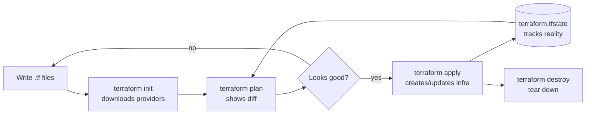

# 09 — Terraform: Infrastructure as Code

> **Goal:** Take a DevOps learner from zero IaC experience to multi-cloud Terraform proficiency. Every chapter ships runnable `.tf` files. Early labs need no cloud credentials — they use `random`, `null_resource`, and `local_file` providers.

---

## What is Infrastructure as Code (IaC)?

IaC means describing your infrastructure (servers, networks, databases, IAM, K8s clusters) as **declarative code** that lives in git, gets reviewed in PRs, and is applied by automation — not by clicking around a cloud console.

**Benefits:**
- **Reproducible** — same code → same infra in dev/staging/prod
- **Auditable** — every change is a git commit
- **Versioned** — rollback is `git revert` + `terraform apply`
- **Collaborative** — code review for infra changes
- **Drift detection** — `terraform plan` shows real vs desired state

---

## Terraform vs OpenTofu vs Pulumi

| Feature | Terraform | OpenTofu | Pulumi |
|---|---|---|---|
| Language | HCL (DSL) | HCL (DSL) | Real languages (TS, Python, Go, C#) |
| License | BSL 1.1 (since v1.6) | MPL 2.0 (true OSS) | Apache 2.0 |
| Provider ecosystem | Largest | Same registry as TF | Smaller but growing |
| State backend | S3/GCS/Azure/TFC | S3/GCS/Azure/local | Pulumi Cloud / S3 |
| CLI compatibility | `terraform` | drop-in `tofu` replacement | `pulumi` (different UX) |
| Best for | Industry standard | Open-source purists | Devs who hate DSLs |

**Recommendation:** Learn Terraform first (largest community, most jobs). OpenTofu is a near-identical fork — your skills transfer. Pulumi is a separate skill.

---

## High-level workflow

<!-- mermaid:rendered -->
<p align="center"></p>

<details><summary>Mermaid source</summary>



</details>
---

## Course Map

| Chapter | Topic | Cloud creds? |
|---|---|---|
| [01-install](01-install/) | Install Terraform / OpenTofu | No |
| [02-hello-world](02-hello-world/) | First init/plan/apply | No |
| [03-language-basics](03-language-basics/) | HCL syntax deep-dive | No |
| [04-providers](04-providers/) | Provider model & versioning | No |
| [05-variables-outputs](05-variables-outputs/) | Inputs / outputs / tfvars | No |
| [06-state](06-state/) | Local & remote state, locking | Optional |
| [07-modules](07-modules/) | Modules: build & consume | No |
| [08-workspaces-and-environments](08-workspaces-and-environments/) | dev/staging/prod patterns | No |
| [09-aws-examples](09-aws-examples/) | S3, VPC, EKS | **Yes (AWS)** |
| [10-gcp-examples](10-gcp-examples/) | GCS, GKE | **Yes (GCP)** |
| [11-kubernetes-provider](11-kubernetes-provider/) | TF for K8s + Helm | Kube context |
| [12-testing](12-testing/) | fmt, validate, tflint, tfsec, terraform test | No |
| [13-cicd](13-cicd/) | GitHub Actions + OIDC | Yes (in CI) |
| [14-best-practices](14-best-practices/) | Production patterns | No |
| [cheatsheet.md](cheatsheet.md) | Command reference | — |

---

## Quick install (mac)

```bash
brew install terraform        # or: brew install opentofu
terraform version
```

See [01-install](01-install/) for Linux, Windows, and `tfenv` (multi-version manager).

---

## How to use this course

1. Read each chapter's `README.md` first.
2. `cd` into the chapter folder, run `terraform init && terraform plan && terraform apply`.
3. Inspect `terraform.tfstate` (don't commit it!).
4. Run `terraform destroy` to clean up before moving on.
5. Take notes in your own `learnings.md`.

> **Rule #1:** never commit `*.tfstate`, `*.tfstate.backup`, `.terraform/`, or `*.tfvars` files containing secrets. A `.gitignore` template lives in [14-best-practices](14-best-practices/).
