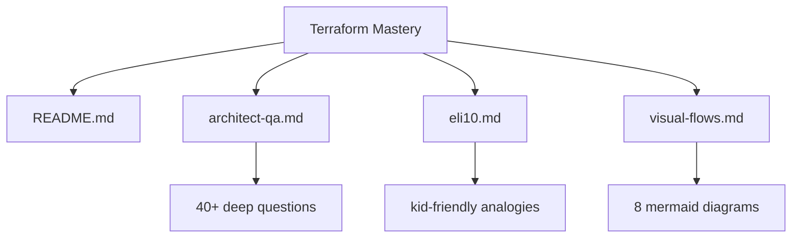

# Terraform Mastery

> The architect-grade pack for Terraform / OpenTofu. Four files, three audiences:
> deep architect Q&A, ELI10 explanations, and visual flows.

---

## Folder Org Chart

<!-- mermaid:rendered -->
<p align="center"></p>

<details><summary>Mermaid source</summary>



</details>

---

## File Index

| File | Audience | Purpose |
|------|----------|---------|
| `README.md` | All | Index + quick map |
| `architect-qa.md` | Senior engineers | Hard, opinionated answers |
| `eli10.md` | Newcomers | Plain-English analogies |
| `visual-flows.md` | Visual learners | Lifecycle and auth flows |

---

## What Terraform Actually Is

Terraform is a **declarative state-reconciler**. You write what you want
(desired state). It reads what exists (current state). It computes a plan
(diff). It executes the diff (apply). The state file is the source of truth
about what Terraform owns.

It is **not** a config management tool. It is **not** an imperative scripter.
It is **not** a magic drift-eraser. Drift only matters if you detect it.

---

## The Five Verbs You Will Type Daily

| Verb | What it does | Mental model |
|------|--------------|--------------|
| `init` | Pulls providers, sets backend | npm install for infra |
| `plan` | Computes diff vs state | Dry run |
| `apply` | Executes the diff | The commit |
| `destroy` | Reverse-apply everything | Nuke from orbit |
| `import` | Adopt an existing resource | Take ownership |

Plus the operational verbs you must know but use less:
`fmt`, `validate`, `state`, `taint`, `refresh`, `console`, `output`, `workspace`.

---

## The 80/20 Architect Rules

1. State is sacred. Lock it. Encrypt it. Back it up. Version it.
2. One state file per blast radius. Not per repo, not per service.
3. Modules are libraries. Version them. Tag them. Treat breaking
   changes like SemVer.
4. Never store secrets in `.tf` or `.tfvars`. Use a secret manager
   and reference it.
5. Use OIDC, not long-lived keys, in CI.
6. Plan in CI. Apply from CI only after human approval for prod.
7. Detect drift on a schedule. Alert. Don't auto-heal silently.
8. Pin provider versions. Pin module versions. Pin Terraform itself.
9. Outputs are your public API. Inputs are your contract.
10. Document the why in `README.md` next to every module.

---

## Quick Start

```bash
# pick a working directory
cd 07-terraform/02-hello-world

# fetch providers + init backend
terraform init

# inspect the plan (no changes made)
terraform plan -out=tfplan

# apply only what was planned
terraform apply tfplan

# tear it down when done
terraform destroy
```

---

## When To Read Each File

| If you are... | Read |
|---------------|------|
| Designing platform IaC | architect-qa.md |
| Onboarding a junior or explaining to leadership | eli10.md |
| Building a runbook or training deck | visual-flows.md |
| Just need a refresher | this file + cheatsheet.md |

---

## Reading Order Suggestion

1. `eli10.md` — get the mental model in five minutes
2. `visual-flows.md` — see the lifecycle once
3. `architect-qa.md` — go deep on the parts you'll own
4. Loop back to the parent `cheatsheet.md` for command lookup

---

## Glossary (one-liners)

- **Provider**: plugin that talks to a target API (AWS, GCP, Kyma, GitHub).
- **Resource**: a single managed object (an S3 bucket, a DNS record).
- **Data source**: a read-only lookup (no create/update/delete).
- **State**: JSON file mapping resources in your code to real-world IDs.
- **Backend**: where the state file lives (S3, GCS, Terraform Cloud).
- **Module**: reusable bundle of resources with inputs/outputs.
- **Workspace**: named state instance inside a backend.
- **Plan**: serialized diff between desired and current state.
- **Apply**: execution of a plan.
- **Drift**: real-world state diverged from Terraform state.
- **Refresh**: pull current state from providers without applying.
- **Import**: bring an existing real resource under Terraform management.
- **Lock**: mutex on the state file to prevent concurrent writes.

---

## Anti-Patterns to Avoid

| Anti-pattern | Why it hurts |
|--------------|--------------|
| One giant root module | Long plans, huge blast radius, slow CI |
| Sharing state across teams | Lock contention, accidental writes |
| Local-only state for shared infra | No collab, no lock, easy to lose |
| Storing secrets in tfvars | Leaks via git, leaks via state |
| Long-lived AWS keys in CI | Credential theft = full compromise |
| `terraform apply` from laptops | No audit, no review, no rollback |
| Unpinned providers | Random breakage on next init |
| Skipping plan in CI | You don't know what you're shipping |

---

## Related

- Parent cheatsheet: `../cheatsheet.md`
- Examples: `../09-aws-examples/`, `../10-gcp-examples/`
- CI patterns: `../13-cicd/`
- Module patterns: `../07-modules/`

---

## Versioning of This Pack

| Version | Date | Notes |
|---------|------|-------|
| 1.0 | 2026-04-26 | Initial mastery pack |

---

## Contribution Notes

- Keep mermaid diagrams under 6 nodes for readability.
- ELI10 must stay ELI10. Resist "well actually" creep.
- Architect Q&A: every answer must be opinionated. No "it depends"
  without a default recommendation.
- Visual flows: one concept per diagram. No mega-diagrams.
