# Terraform — Explained Like You're 10

> Imagine you want a big set of cloud toys. Instead of going to the store
> and picking each one yourself, you write a wishlist. A robot reads the
> wishlist and gets all the toys for you. That robot is Terraform.

---

## The Big Picture in One Sentence

Terraform is a wishlist for cloud toys, and it remembers exactly what it
bought you so it can change or return things later without making a mess.

---

## Concept 1: Terraform = The Wishlist

### Analogy
You're making a birthday wishlist. You write down every toy you want.
You don't go to the store. You don't pay. You just say what you want.

### Real Meaning
Terraform reads `.tf` files. Those files describe what cloud resources you
want. Terraform doesn't run code or click buttons; it just turns your
wishlist into actions.

### Diagram

<!-- mermaid:rendered -->


Mermaid source

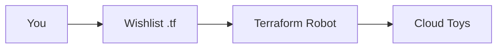

### Steps
1. Write a `main.tf` file
2. Describe what you want (a server, a database, a bucket)
3. Save the file
4. The wishlist is done — no toys yet

---

## Concept 2: Provider = The Toy Store

### Analogy
There are different toy stores. Toys-R-Us has dolls. LEGO Store has
bricks. Each store has its own rules. You pick which store to use.

### Real Meaning
A provider is a plugin that knows how to talk to one cloud (AWS, Google,
Azure, Kubernetes). You declare which providers you need, and Terraform
downloads them.

### Diagram

<!-- mermaid:rendered -->


Mermaid source

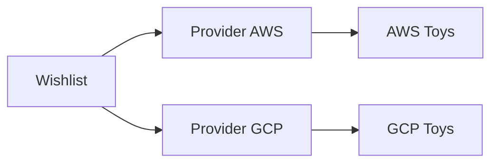

### Steps
1. Add a `provider "aws" {}` block
2. Run `terraform init`
3. Terraform downloads the AWS provider
4. Now Terraform can buy AWS toys

---

## Concept 3: Resource = One Toy

### Analogy
A resource is one specific toy on your wishlist. Not "toys" — one toy.
"A red LEGO castle." "A blue teddy bear." Each toy has a name and details.

### Real Meaning
A resource is one cloud thing: one S3 bucket, one VM, one DNS record.
You give it a type (`aws_s3_bucket`) and a local name (`my_bucket`).

### Diagram

<!-- mermaid:rendered -->


Mermaid source

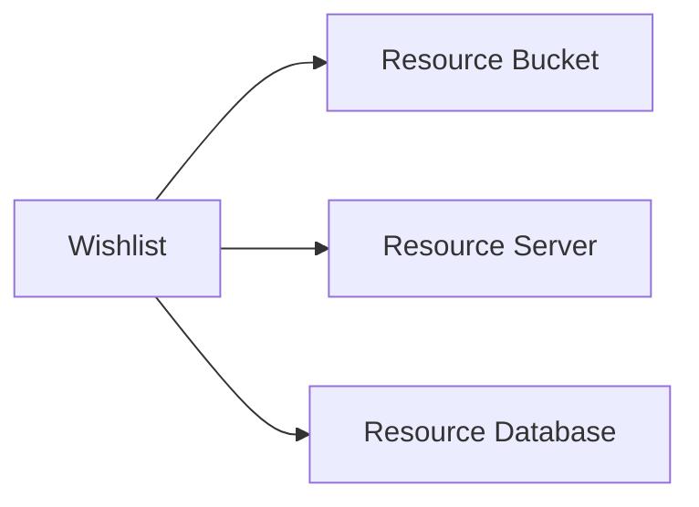

### Steps
1. Write `resource "aws_s3_bucket" "my_bucket" {}`
2. Fill in the details inside the braces
3. Each resource = one cloud object you'll get

---

## Concept 4: State = The Receipt

### Analogy
After the robot buys your toys, it gives you a receipt. The receipt lists
every toy it bought, when, and the serial number. If you lose the receipt,
the robot doesn't know what's yours anymore.

### Real Meaning
The state file (`terraform.tfstate`) is a JSON file that maps your code to
real cloud resource IDs. Without it, Terraform thinks nothing exists and
tries to buy everything again.

### Diagram

<!-- mermaid:rendered -->


Mermaid source

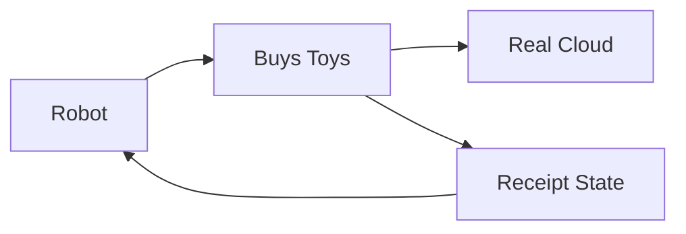

### Steps
1. After `apply`, Terraform writes `terraform.tfstate`
2. Store it safely (in S3, GCS, or Terraform Cloud)
3. Lock it so two people can't write at once
4. Never delete it; never edit it by hand

---

## Concept 5: Plan = What You're About To Buy

### Analogy
Before the robot leaves for the store, it shows you a list:
"I'll buy 3 LEGO sets and return 1 teddy bear." You read it, nod, and
say "yes, do it." That preview is the plan.

### Real Meaning
`terraform plan` compares your wishlist to the receipt and shows the
difference. Plus signs = create. Minus signs = destroy. Tilde = change.

### Diagram

<!-- mermaid:rendered -->


Mermaid source

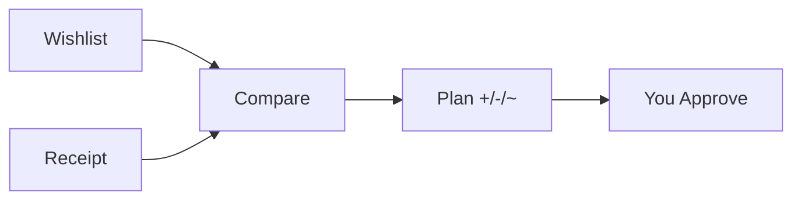

### Steps
1. Run `terraform plan`
2. Read every line
3. If it looks right, save it: `terraform plan -out=tfplan`
4. If it looks wrong, edit your wishlist and try again

---

## Concept 6: Apply = Actually Buy It

### Analogy
You said "yes" to the plan. Now the robot drives to the store and buys
everything on the plan. When it comes back, it updates the receipt.

### Real Meaning
`terraform apply` executes the plan. It calls cloud APIs to create,
change, or delete resources, then writes the new state.

### Diagram

<!-- mermaid:rendered -->


Mermaid source

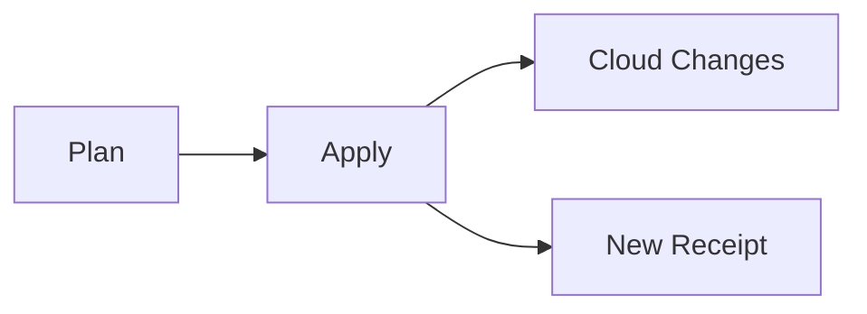

### Steps
1. Run `terraform apply tfplan`
2. Wait while resources are created
3. Check the new state file is saved
4. Run `terraform output` to see useful info (like URLs)

---

## Concept 7: Module = Pre-Built LEGO Kit

### Analogy
You could build a castle from individual LEGO bricks, but it takes hours.
Or you could buy a kit that already has the castle pieces grouped. Modules
are pre-built kits for cloud stuff.

### Real Meaning
A module is a folder of `.tf` files you can reuse. You give it inputs
(color, size) and it gives you outputs (the URL of what it built).

### Diagram

<!-- mermaid:rendered -->


Mermaid source

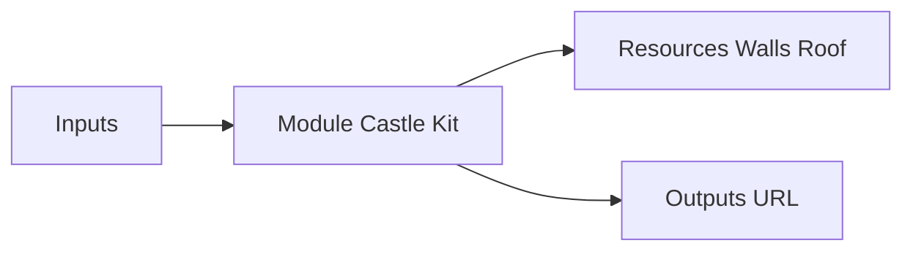

### Steps
1. Find or write a module folder
2. Use `module "my_castle" { source = "./castle" }` in your wishlist
3. Pass inputs in the braces
4. Read outputs with `module.my_castle.url`

---

## Concept 8: Destroy = Return Everything

### Analogy
You finished your birthday party. The robot takes every toy back to the
store. The receipt becomes empty. Your room is clean.

### Real Meaning
`terraform destroy` deletes every resource in the current state. It's
useful for tearing down test environments. It's terrifying in production.

### Diagram

<!-- mermaid:rendered -->


Mermaid source

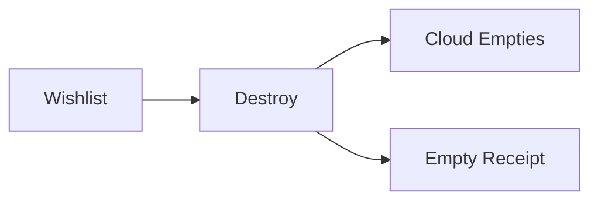

### Steps
1. Run `terraform plan -destroy` first
2. Read every minus sign carefully
3. Run `terraform destroy`
4. Type "yes" only if you really mean it

---

## Concept 9: Variables = Sticky Notes

### Analogy
Instead of writing "red" everywhere on your wishlist, you put a sticky
note that says "favorite color = red" at the top. Change the sticky note
and everything updates.

### Real Meaning
Variables let you parameterize your code. Define once, use everywhere.
Set them via `.tfvars` files, environment variables, or CLI flags.

### Diagram

<!-- mermaid:rendered -->


Mermaid source

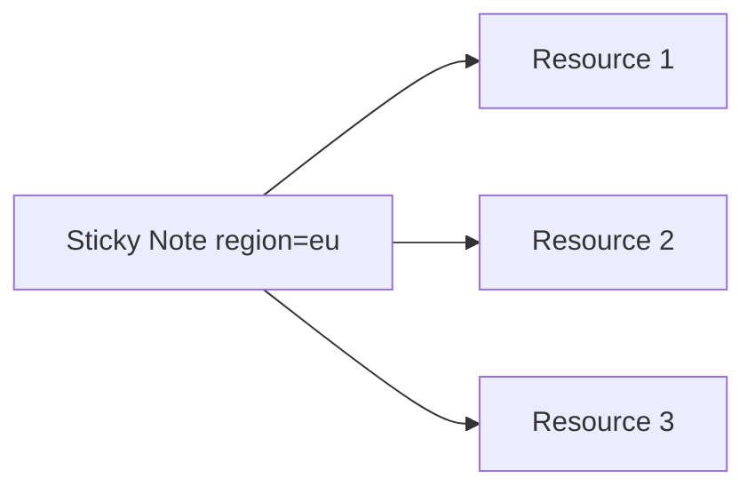

### Steps
1. Add `variable "region" { default = "eu-west-1" }`
2. Reference it: `region = var.region`
3. Override with `-var region=us-east-1` or a `.tfvars` file

---

## Concept 10: Outputs = The Note Robot Leaves

### Analogy
After the robot puts the toys in your room, it leaves a note: "Your new
castle is on the top shelf, your teddy is on the bed." Outputs are that
note.

### Real Meaning
Outputs expose useful values from your state — URLs, IPs, IDs — so other
configs or humans can read them.

### Diagram

<!-- mermaid:rendered -->


Mermaid source

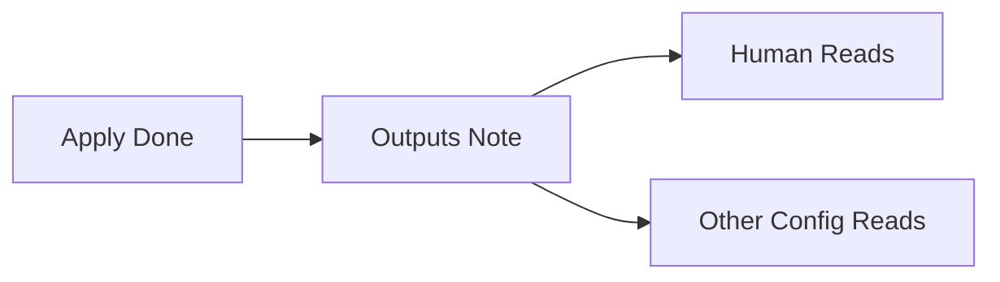

### Steps
1. Add `output "url" { value = aws_lb.main.dns_name }`
2. Run `terraform output` to see all of them
3. Run `terraform output url` to see one

---

## Concept 11: Workspace = Different Toy Boxes

### Analogy
You have a "play" toy box and a "show-off" toy box. Same shelf, same
toys allowed, but they're separate. A workspace is a separate toy box for
the same wishlist.

### Real Meaning
Workspaces let one config produce multiple isolated states. Useful for
PR previews. Risky for prod-vs-staging because the code path is identical.

### Diagram

<!-- mermaid:rendered -->


Mermaid source

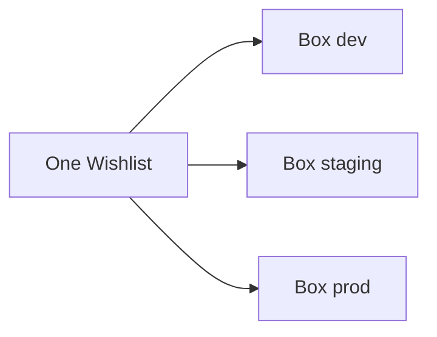

### Steps
1. `terraform workspace new dev`
2. `terraform workspace select dev`
3. `terraform apply` — only affects this box
4. Switch boxes with `terraform workspace select staging`

---

## Concept 12: Drift = Someone Touched Your Toys

### Analogy
You went to school. When you came home, your little sister moved your
LEGO castle and stole the roof. The toys don't match the receipt anymore.
That mismatch is drift.

### Real Meaning
Drift = real cloud state diverged from Terraform state. Caused by manual
console clicks, autoscalers, or other tools. Detect with `terraform plan`.

### Diagram

<!-- mermaid:rendered -->


Mermaid source

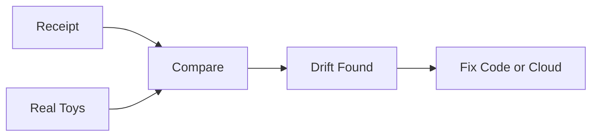

### Steps
1. Run `terraform plan` regularly (daily in CI)
2. If it shows changes you didn't make, that's drift
3. Decide: update code to match reality, or apply to fix reality
4. Block manual console access to prevent more drift

---

## The Whole Story in One Diagram

<!-- mermaid:rendered -->


Mermaid source

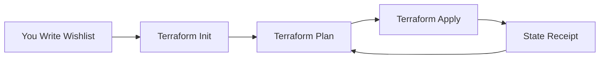

You loop forever between editing the wishlist and applying changes. The
receipt keeps you honest. The plan keeps you safe. The robot does the work.

---

## Five Rules a 10-Year-Old Can Remember

1. Never lose the receipt.
2. Always look at the plan before you say yes.
3. Don't touch toys behind the robot's back.
4. Sticky notes are easier than rewriting.
5. Pre-built kits save time.
