# Visual Flows — Terraform Lifecycle Diagrams

> Eight focused mermaid flowcharts. Each one isolates a single concept.
> All diagrams capped at 6 nodes for readability.

---

## Flow 1: `terraform init`

What happens when you run init on a fresh directory.

<!-- mermaid:rendered -->
<p align="center"></p>

<details><summary>Mermaid source</summary>

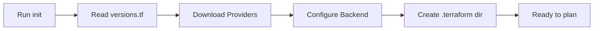

</details>

### What each step does
- **Read versions.tf**: parse required_providers and required_version
- **Download Providers**: fetch plugins to `.terraform/providers/`
- **Configure Backend**: connect to S3/GCS/remote, verify access
- **Create .terraform dir**: local cache and lock file
- **Ready to plan**: directory is initialized

### Common failures
| Symptom | Cause | Fix |
|---------|-------|-----|
| Provider not found | Wrong source path | Check registry URL |
| Backend access denied | Bad credentials | Refresh OIDC or keys |
| Lock file conflict | Mixed CI runs | Delete `.terraform.lock.hcl` and re-init |

---

## Flow 2: `terraform plan`

What happens when you ask for a plan.

<!-- mermaid:rendered -->
<p align="center"></p>

<details><summary>Mermaid source</summary>

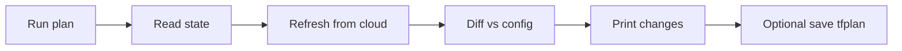

</details>

### Reading the plan output
- `+` create
- `-` destroy
- `~` update in place
- `-/+` destroy and recreate (red flag, look closer)

### Pro tips
- Always pass `-out=tfplan` in CI so apply uses the exact plan.
- Use `-detailed-exitcode` for drift detection: `0` no changes, `2` changes.
- Use `-target=resource.name` only for emergency fixes; never as routine.

---

## Flow 3: `terraform apply`

What happens when you commit the plan.

<!-- mermaid:rendered -->
<p align="center"></p>

<details><summary>Mermaid source</summary>

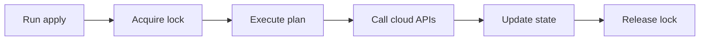

</details>

### What can go wrong mid-apply
- API throttling: Terraform retries, eventually fails — re-run
- Resource conflict: another tool created the same name — import or rename
- State write failure: backend down — state may be inconsistent, restore
  from backend versioning

### Atomicity
Each resource apply is atomic. The whole apply is **not** atomic. A failure
mid-apply leaves you with partial changes. Always plan again after a
failure to see the new state.

---

## Flow 4: `terraform destroy`

What happens when you tear down everything.

<!-- mermaid:rendered -->
<p align="center"></p>

<details><summary>Mermaid source</summary>

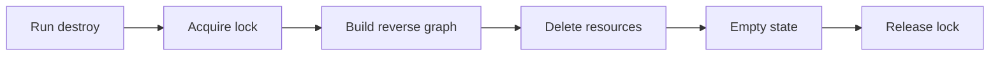

</details>

### Safety checklist before destroy
1. Are you in the right workspace?
2. Are you in the right directory?
3. Did `plan -destroy` show only what you expect?
4. Are stateful resources protected with `prevent_destroy`?
5. Did the on-call approve?

### Reverse dependency graph
Terraform destroys in reverse order of creation. A VPC is destroyed last
because subnets, route tables, and gateways depend on it.

---

## Flow 5: State Locking

How concurrent runs are prevented.

<!-- mermaid:rendered -->
<p align="center"></p>

<details><summary>Mermaid source</summary>

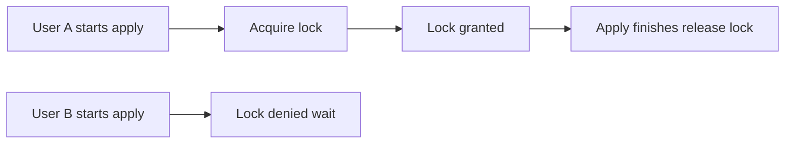

</details>

### Lock backends
- **S3 + DynamoDB**: DynamoDB table holds the lock row
- **GCS**: native object lock
- **Terraform Cloud**: built-in, queue-based

### Force-unlock — when and how
Only when you've confirmed no apply is running. Get the lock ID from the
error message. Run `terraform force-unlock <ID>`. Confirm with `yes`.
Never force-unlock an active apply — state corruption guaranteed.

---

## Flow 6: OIDC Auth to AWS from GitHub Actions

How CI gets ephemeral creds without long-lived keys.

<!-- mermaid:rendered -->
<p align="center"></p>

<details><summary>Mermaid source</summary>

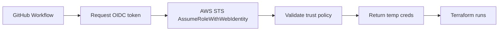

</details>

### Trust policy essentials
- Federated principal: `token.actions.githubusercontent.com`
- Audience: `sts.amazonaws.com`
- Subject condition: `repo:org/repo:ref:refs/heads/main`
- Use separate roles for plan (read-mostly) and apply (write)

### Why this beats static keys
- No secret to leak or rotate
- Short-lived (default 1 hour)
- Scoped per workflow, branch, or environment
- Full audit trail in CloudTrail with the OIDC sub claim

---

## Flow 7: Module Composition

How a root config consumes a module that consumes resources.

<!-- mermaid:rendered -->
<p align="center"></p>

<details><summary>Mermaid source</summary>

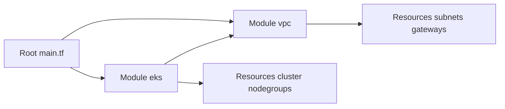

</details>

### Composition rules
- Root passes inputs in, reads outputs out — no other coupling
- Modules never write the backend; only the root does
- One module = one cohesive unit (VPC + subnets, not VPC alone)
- Pass IDs between modules, not whole objects

### Versioning the source
```hcl
module "vpc" {
  source  = "git::https://github.com/org/tf-modules.git//vpc?ref=v2.3.1"
  # or registry style:
  # source = "app.terraform.io/org/vpc/aws"
  # version = "~> 2.3"
}
```

---

## Flow 8: Refresh and Drift Detection

How drift is found and surfaced.

<!-- mermaid:rendered -->
<p align="center"></p>

<details><summary>Mermaid source</summary>

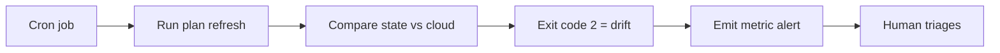

</details>

### What `refresh` actually does
Reads every resource from the provider API and updates the in-memory state
to match. It does **not** change cloud resources. Use `terraform plan
-refresh-only` to apply the refresh to disk.

### Drift triage decision tree
1. Is the change expected (autoscaling, tag automation)? Add to
   `ignore_changes`.
2. Was it a manual fix? Update the code to match.
3. Was it malicious? Roll back via apply, then audit IAM.
4. Is it provider noise? File a bug, add `ignore_changes` temporarily.

---

## The Whole Lifecycle in One View

<!-- mermaid:rendered -->
<p align="center"></p>

<details><summary>Mermaid source</summary>

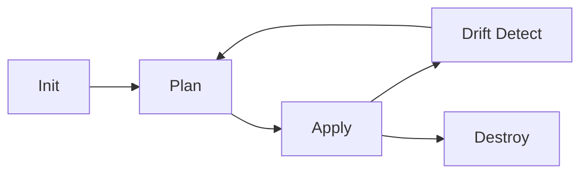

</details>

You spend 90% of your career in the Plan -> Apply -> Drift loop. Init
happens once per directory per machine. Destroy happens rarely and
deliberately.

---

## Reading These Diagrams in Reviews

- Print Flow 5 (state locking) when explaining why prod feels slow.
- Print Flow 6 (OIDC) when justifying killing static keys.
- Print Flow 7 (modules) when proposing a refactor.
- Print Flow 8 (drift) when proposing the drift detection program.

---

## Diagram Conventions Used Here

- All flows are left-to-right (`flowchart LR`) for screen-reading.
- Max 6 nodes per diagram — anything more belongs in two diagrams.
- No newlines inside node labels (mermaid renderer quirks).
- No quoted special chars — keeps GitHub markdown happy.
- Node labels stay under 30 characters.

---

## Where These Map to Files in This Repo

| Flow | Related folder |
|------|----------------|
| Init / Plan / Apply | `../02-hello-world/` |
| State locking | `../06-state/` |
| OIDC auth | `../13-cicd/` |
| Modules | `../07-modules/` |
| Workspaces | `../08-workspaces-and-environments/` |
| Drift | `../14-best-practices/` |

---

## Final Note

Diagrams are conversation starters, not specifications. Use them in
design reviews, training sessions, and runbooks. Pair every diagram with
the runbook text and the actual `.tf` example so the reader can connect
picture, prose, and code.
