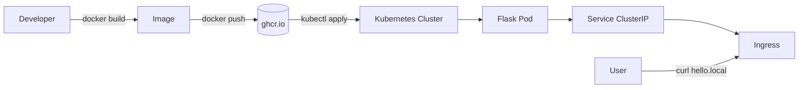

# Project 01 — Hello World End-to-End

Containerize a Python Flask app, push it to GHCR, deploy to Kubernetes, and expose via Ingress.

## What you'll build

<!-- mermaid:rendered -->
<p align="center"></p>

<details><summary>Mermaid source</summary>



</details>
## Prerequisites
- Docker daemon running — see [`../../02-docker/`](../../02-docker/)
- Local Kubernetes (kind/minikube/k3d) or remote cluster — see [`../../03-kubernetes-core/01-cluster-setup/`](../../03-kubernetes-core/)
- `kubectl` configured (`kubectl get nodes` works)
- An ingress controller installed (`ingress-nginx`) — see [`../../03-kubernetes-core/05-ingress/`](../../03-kubernetes-core/)
- A GitHub Personal Access Token with `write:packages` scope

## Step 1 — Build the app

Files are in `app/`. The app exposes:
- `GET /` → `Hello, world!`
- `GET /healthz` → `ok` (for liveness probe)

```bash
cd 01-hello-world-end-to-end
docker build -t hello-world:0.1.0 .
docker run --rm -p 8080:8080 hello-world:0.1.0 &
curl -s http://localhost:8080/        # -> Hello, world!
curl -s http://localhost:8080/healthz  # -> ok
kill %1
```

## Step 2 — Push to GHCR

```bash
export GH_USER=<your-github-user>
export CR_PAT=<your-token>
echo $CR_PAT | docker login ghcr.io -u $GH_USER --password-stdin

docker tag hello-world:0.1.0 ghcr.io/$GH_USER/hello-world:0.1.0
docker push ghcr.io/$GH_USER/hello-world:0.1.0
```

Make the package public from the GitHub UI (Packages → hello-world → Settings → Change visibility → Public) — otherwise create an `imagePullSecret` (see [`../../03-kubernetes-core/06-secrets/`](../../03-kubernetes-core/)).

## Step 3 — Deploy to Kubernetes

Edit `k8s/deployment.yaml` and replace `GHCR_USER` with your GitHub username, then:

```bash
kubectl create namespace proj01
kubectl -n proj01 apply -f k8s/deployment.yaml
kubectl -n proj01 apply -f k8s/service.yaml
kubectl -n proj01 apply -f k8s/ingress.yaml
kubectl -n proj01 rollout status deploy/hello-world
```

## Step 4 — Verify

```bash
kubectl -n proj01 get pods,svc,ingress
# Add hello.local to /etc/hosts pointing at your ingress IP:
INGRESS_IP=$(kubectl -n ingress-nginx get svc ingress-nginx-controller -o jsonpath='{.status.loadBalancer.ingress[0].ip}')
echo "$INGRESS_IP hello.local" | sudo tee -a /etc/hosts

curl -s http://hello.local/        # -> Hello, world!
curl -s http://hello.local/healthz # -> ok
```

Expected output: `Hello, world!` from a pod whose name starts with `hello-world-`.

## Cleanup

```bash
kubectl delete namespace proj01
sudo sed -i '' '/hello.local/d' /etc/hosts
docker rmi hello-world:0.1.0 ghcr.io/$GH_USER/hello-world:0.1.0
```

## What you learned
- End-to-end image lifecycle: build → registry → cluster
- Kubernetes Deployment, Service, Ingress basics
- Liveness probes and rolling updates
- Working with GHCR as a private registry

## Stretch goals
- Add HPA (Horizontal Pod Autoscaler) — see [`../../04-kubernetes-strategies/02-autoscaling/`](../../04-kubernetes-strategies/)
- Add TLS via cert-manager + Let's Encrypt
- Replace the `latest` tag with image digest pinning
- Bake the image with multi-stage Dockerfile and distroless base
