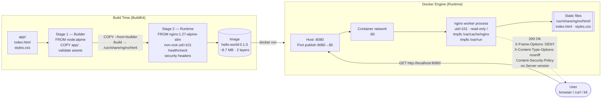

# Architecture Deep-Dive — Project 01 · Hello World on Docker

> One container, two stages, five security controls, and a request path that mirrors production.

---

## One-diagram summary



---

## Request path — 7 hops of a GET /

```
1. curl http://localhost:8080/
   └─ TCP SYN to host port 8080

2. Docker port publish (iptables DNAT on Linux, vpnkit on macOS)
   └─ forwards SYN → container network namespace port 80

3. nginx master process accepts the connection
   └─ master runs as root just long enough to bind :80
   └─ immediately forks worker at uid=101 (nginx)

4. Worker matches `location /` in nginx.conf
   └─ resolves path → /usr/share/nginx/html/index.html

5. sendfile() — zero-copy path
   └─ kernel copies file bytes directly from page cache → socket buffer
   └─ no userland buffer, no copy — this is why nginx is fast

6. Response headers are injected
   └─ X-Frame-Options: DENY
   └─ X-Content-Type-Options: nosniff
   └─ Content-Security-Policy: default-src 'self'; ...
   └─ Server: nginx  (no version — server_tokens off)

7. TCP FIN
   └─ connection closes (or kept alive for 30s)
   └─ nothing was written to disk anywhere
```

---

## Layer-by-layer image anatomy

```
hello-world:0.1.0
├── layer 1  nginx:1.27-alpine-slim base        ~8.5 MB
│            (nginx binary, alpine libc, ssl, pcre)
└── layer 2  project assets + config             ~14 KB
             ├── /usr/share/nginx/html/index.html
             ├── /usr/share/nginx/html/styles.css
             └── /etc/nginx/nginx.conf
```

**Rebuild economics:**

| Change | Layers rebuilt | Time |
|--------|---------------|------|
| Edit `styles.css` | Layer 2 only | ~0.3 s |
| Edit `nginx.conf` | Layer 2 only | ~0.3 s |
| Bump `nginx:1.27` to `nginx:1.28` | Both layers | ~8 s (base pull) |

---

## Security controls map

| Control | Where | What it prevents |
|---------|-------|-----------------|
| Multi-stage build | Dockerfile | Build tools (npm, gcc) never reach the shipped image |
| `nginx:alpine-slim` base | Dockerfile `FROM` | ~110 MB fewer packages = smaller CVE surface |
| Non-root process (uid=101) | `USER nginx` + worker | Compromised worker cannot write to OS paths |
| Read-only rootfs | `docker run --read-only` | File-write exploits have nowhere to land |
| tmpfs mounts | `--tmpfs /var/cache/nginx` | Nginx gets writable temp space without a writable rootfs |
| `server_tokens off` | nginx.conf | Hides `nginx/1.27.x` from attackers scanning for CVEs |
| `X-Frame-Options: DENY` | nginx.conf | Prevents clickjacking via `<iframe>` |
| `X-Content-Type-Options: nosniff` | nginx.conf | Prevents MIME-type confusion attacks |
| `Content-Security-Policy` | nginx.conf | Blocks inline scripts and unexpected origins |
| `--cap-drop=ALL` | `docker run` | Removes all Linux capabilities from the container |
| `--security-opt=no-new-privileges` | `docker run` | Prevents privilege escalation via setuid binaries |

---

## Key design decisions

### Why multi-stage and not `FROM nginx:alpine COPY app/ ...`?

A single-stage build works — but it bakes every `RUN` and `COPY` into the same image. A second stage starts clean. For this project the builder is trivial (copy + validate). When you add a build step — sass, esbuild, a Hugo site — the pattern already exists: build in stage 1, copy only the output into stage 2. The runtime image stays identical.

### Why `nginx:1.27-alpine-slim` and not `nginx:latest`?

- `nginx:latest` tracks Debian stable — ~140 MB, 200+ packages, broader CVE surface.
- `nginx:alpine-slim` is ~8 MB, ships only what nginx needs, no shell by default.
- Smaller image = faster pulls at scale. On a 3-node Kubernetes cluster with 10 replicas rolling at once, a 130 MB savings means 1.3 GB less network per rollout.

### Why uid=101 instead of a custom user?

`nginx:alpine-slim` already ships a `nginx` user at UID 101. Creating a custom user (UID 1001) works equally well — it's a style choice. The important constraint: **any UID ≠ 0 achieves the goal**. UID 101 avoids an extra `RUN adduser` layer.

### Why `--cap-drop=ALL` with selective adds?

Linux capabilities are a fine-grained privilege system. The default Docker capability set includes `NET_BIND_SERVICE` (bind ports < 1024), `CHOWN`, `SETUID`, `SETGID`, and `DAC_OVERRIDE`. Dropping all and re-adding only what nginx needs means a compromised process cannot, e.g., use `CAP_NET_RAW` to craft raw packets. Principle of least privilege, applied at the OS call level.

### Why `STOPSIGNAL SIGQUIT`?

`SIGTERM` tells nginx to exit immediately. `SIGQUIT` triggers a graceful shutdown — nginx finishes in-flight requests before stopping. A 100 ms in-flight request during a `docker stop` returns 200 OK instead of a connection reset. Zero-downtime deploys depend on this.

---

## Failure modes and fixes

| Failure | Symptom | Detection | Fix |
|---------|---------|-----------|-----|
| Port 8080 in use | `Bind for 0.0.0.0:8080 failed` | `make run` output | `lsof -i :8080` then kill, or `make run HOST_PORT=9090` |
| tmpfs mounts missing | `nginx: [emerg] open() "/var/run/nginx.pid" failed (30: Read-only file system)` | `docker logs hello` | Add `--tmpfs /var/run:rw,size=4m` to run command |
| Security headers missing from sub-locations | Header absent for `/styles.css` | `curl -I http://localhost:8080/styles.css` | Re-add `add_header` inside every `location {}` block (nginx does not inherit headers into child locations) |
| Image > 10 MB | `make size` fails | CI output | Verify only `COPY` instructions touch the runtime stage — no `RUN apk add` |
| Healthcheck stuck `starting` | `docker ps` shows `(health: starting)` | `docker inspect --format='{{.State.Health}}'` | Check `wget -q -O- --spider http://127.0.0.1/` manually inside the container |

---

## Extensions — what to try next

| Extension | Skill gained |
|-----------|-------------|
| Replace nginx with [Caddy](https://caddyserver.com/) | Auto-TLS in one line |
| Sign the image with `cosign` | Supply-chain security |
| Push to `ghcr.io`, pull on a second machine | Immutable artifact delivery |
| Add a Kubernetes `Deployment` + `Service` | See [02 — three-tier-app](../02-three-tier-app/) |
| Add `docker scout cves` to CI | Automated CVE gating |
| Use BuildKit `--cache-from` with GHCR | Layer caching in CI (saves 8 s per build) |

---

## Further reading

- [Nginx Beginner's Guide](https://nginx.org/en/docs/beginners_guide.html)
- [OWASP Secure Headers Project](https://owasp.org/www-project-secure-headers/)
- [Docker security best practices](https://docs.docker.com/engine/security/)
- [Mozilla CSP reference](https://developer.mozilla.org/en-US/docs/Web/HTTP/CSP)
- [Linux capabilities man page](https://man7.org/linux/man-pages/man7/capabilities.7.html)
