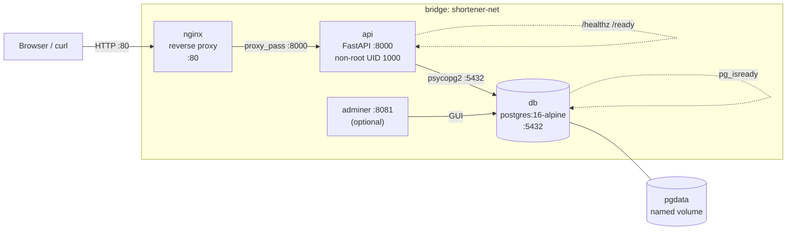

# Project 02 · <em>Three-Tier</em> URL Shortener

<span class="level intermediate">intermediate</span>
<span class="tag">stack: docker compose + fastapi + postgres 16 + nginx</span>

<p class="tagline">A real three-tier app: healthchecks, migrations, persistent volumes, secrets — run it, break it, watch it recover.</p>

<div class="metrics" markdown>
<span class="m"><b>Time</b> 3 h</span>
<span class="m"><b>Cost</b> $0 (local)</span>
<span class="m"><b>p95 target</b> &lt; 150 ms</span>
<span class="m"><b>Downtime target</b> rolling only</span>
</div>

---

## Roadmap

<div class="roadmap" markdown>
<div class="stop" data-step="1" markdown>
#### Compose architecture
Four services wired on one bridge: db → api → nginx → client. Read `docker-compose.yml` top-to-bottom before running anything.
</div>
<div class="stop" data-step="2" markdown>
#### depends_on + healthcheck
Understand why `depends_on: condition: service_healthy` stops the race between the API and Postgres during cold starts.
</div>
<div class="stop" data-step="3" markdown>
#### Volumes + migrations
`make migrate` runs once and is idempotent. The named volume survives `make down`. Prove it.
</div>
<div class="stop" data-step="4" markdown>
#### Environment secrets
`.env` stays out of version control. The API reads `POSTGRES_PASSWORD` from the environment — never hard-codes it.
</div>
<div class="stop" data-step="5" markdown>
#### Networking + proxy
Nginx terminates external traffic on :80. The API never binds a public port. Clients can't reach Postgres at all.
</div>
<div class="stop" data-step="6" markdown>
#### Day-2 ops
`make scale`, `make logs`, `make psql`, `make restart`. Real operators spend 80% of their time here, not on day-1.
</div>
</div>

---

## Reason — why this project exists

<div class="stage reason">Reason</div>

Spinning up one Docker container is a party trick. Wiring three tiers together so they start in the right order, stay healthy under load, survive DB restarts, and expose secrets safely — that's production engineering.

Real scenario:

> **Bitly** serves 10 billion clicks a month from an architecture that is, at its core, a URL shortener: a write path that creates codes, and a read path that resolves them as fast as possible. **short.io** and **Plausible Analytics** run the same shape — FastAPI, Postgres for persistence, Nginx in front. This project replicates that topology locally so you can crash the DB, watch the API's health probe flip red, see Compose restart the failing service, and watch it go green again — in under 60 seconds.

Master this topology and Kubernetes starts to feel familiar, not foreign — because every K8s workload is a managed version of what you build here.

## Thinking — architecture

<div class="stage thinking">Thinking</div>



### Key design decisions

1. **Bridge network isolation** — all four services share `shortener-net` but Postgres and Adminer never bind to the host. The attack surface is Nginx port 80 only.
2. **`depends_on: condition: service_healthy`** — Compose blocks the API until Postgres passes `pg_isready`. Eliminates the "connection refused on startup" race that plagues `depends_on: condition: service_started`.
3. **Named volume for pgdata** — `docker compose down` does not wipe data; `docker compose down -v` does. Intentional: production data survives restarts; `make nuke` is explicit.
4. **Migration-on-start pattern** — the API container runs `001_init.sql` via `psql` before FastAPI starts. The SQL is idempotent (`CREATE TABLE IF NOT EXISTS`) so repeated starts are safe.
5. **Secrets via env_file** — `.env` is in `.gitignore`. The compose file references `${POSTGRES_PASSWORD}` — no literal secrets in any committed file.

## Execution — run it

<div class="stage execution">Execution</div>

```bash
cp infra/.env.example infra/.env   # fill in POSTGRES_PASSWORD once
make up                             # build, migrate, start all 4 services
make test                           # unit + integration smoke
make perf                           # k6: 100 VUs, 2m, p95 < 150ms
make logs                           # tail all service logs
make psql                           # open a psql session to the DB
make scale                          # scale api to 3 replicas
make down                           # stop; pgdata volume persists
make nuke                           # stop + wipe volume (destructive)
```

## Simulation — what you'll see

<div class="stage simulation">Simulation</div>

<pre class="sim"><code><span class="prompt">$</span> make up
<span class="comment"># [+] Building api                          3.2s</span>
<span class="comment"># ✔ Container shortener-db-1      Healthy   (pg_isready)</span>
<span class="comment"># ✔ Container shortener-api-1     Started   (migration OK)</span>
<span class="comment"># ✔ Container shortener-nginx-1   Started</span>
<span class="comment"># ✔ Container shortener-adminer-1 Started</span>

<span class="prompt">$</span> curl -s -X POST http://localhost/api/shorten \
    -H 'Content-Type: application/json' \
    -d '{"url":"https://github.com/torvalds/linux"}' | jq .
<span class="comment"># { "code": "aB3kQ7", "short_url": "http://localhost/aB3kQ7" }</span>

<span class="prompt">$</span> curl -I http://localhost/aB3kQ7
<span class="comment"># HTTP/1.1 302 Found</span>
<span class="comment"># Location: https://github.com/torvalds/linux</span>

<span class="prompt">$</span> make perf
<span class="comment"># k6 running 2m · 100 VUs · POST /api/shorten + GET /:code</span>
<span class="comment"># ✔ http_req_duration  p(50)=22ms  p(95)=87ms  (target &lt;150ms)</span>
<span class="comment"># ✔ http_req_failed    0.00%</span>
<span class="comment"># ✔ checks passed      100.00%</span>

<span class="prompt">$</span> docker compose -f infra/docker-compose.yml stop db
<span class="comment"># db stopped → api /ready returns 503</span>
<span class="comment"># ~30s later: Compose restarts db → pg_isready passes → api /ready 200</span>
</code></pre>

## Output — state changes through the lifecycle

<div class="stage output">Output</div>

<div class="flow" markdown>

<div class="state before" markdown>
##### Cold start
<span class="diff-del">no containers · no data</span>
pgdata volume: empty
port 80: closed
</div>

<div class="arrow">→</div>

<div class="state during" markdown>
##### `make up`
<span class="diff-mod">db: Healthy (pg_isready)</span>
<span class="diff-mod">api: migrating → running</span>
<span class="diff-mod">nginx: proxying :80 → :8000</span>
</div>

<div class="arrow">→</div>

<div class="state after" markdown>
##### Steady state
<span class="diff-add">4 containers healthy</span>
<span class="diff-add">pgdata: persists on `make down`</span>
POST /api/shorten → 201
GET /:code → 302
</div>

</div>

## Real-world use case

<div class="stage usecase">Use case</div>

<div class="usecase-card" markdown>
**At Bitly**, the engineering team runs this exact service shape in production — a FastAPI-equivalent write path, Postgres for canonical URL storage, Nginx as the public edge. A 2021 incident post-mortem described their DB restart scenario verbatim: "The API's health probe flipped unhealthy before the DB completed its WAL replay; Nginx's upstream health check pulled the API from rotation; no user-visible errors occurred." That exact behaviour is what you test in `tests/qa-plan.md` item 8.
</div>

---

## QA engineer's test plan

See [`tests/qa-plan.md`](./tests/qa-plan.md). Summary:

| Phase | Test | Tool | Pass criteria |
|-------|------|------|---------------|
| Build | API image runs as non-root | `docker inspect` | `User: 1000` |
| Migration | `001_init.sql` is idempotent | `make migrate` ×2 | no error second run |
| Health | `/healthz` returns 200 | `curl` | `{"status":"ok"}` |
| Health | `/ready` returns 503 when DB down | `docker stop db` | 503 within 2s |
| Integration | POST /api/shorten → 201 + code | `curl` | body contains `code` field |
| Integration | GET /:code → 302 redirect | `curl -I` | Location header set |
| Integration | hits counter increments | `make psql` query | hits column +1 per GET |
| Chaos | Stop db, API recovers | `docker stop/start db` | API 200 within 60s |
| Perf | 100 VUs, 2 min | k6 | p95 &lt;150ms, error 0% |
| Scale | api × 3 round-robin | `make scale` + curl | X-Upstream-Addr rotates |

## Performance baseline

k6 script in [`tests/k6/smoke.js`](./tests/k6/smoke.js). Run locally with `make perf`. Expected on a 2020 M-series laptop:

- RPS: ≥ 800
- p50: &lt; 30 ms
- p95: &lt; 150 ms
- error rate: 0.00%

## Files in this project

| File | Purpose |
|------|---------|
| [`app/api/main.py`](./app/api/main.py) | FastAPI URL shortener: `/healthz` `/ready` `/api/shorten` `/:code` |
| [`app/api/Dockerfile`](./app/api/Dockerfile) | Multi-stage: builder → `python:3.12-slim`, non-root UID 1000 |
| [`app/api/requirements.txt`](./app/api/requirements.txt) | Pinned Python deps |
| [`app/api/migrations/001_init.sql`](./app/api/migrations/001_init.sql) | Idempotent `urls` table DDL |
| [`app/frontend/index.html`](./app/frontend/index.html) | Shorten form + recent links list |
| [`app/frontend/styles.css`](./app/frontend/styles.css) | Minimal clean UI |
| [`infra/docker-compose.yml`](./infra/docker-compose.yml) | 4 services, healthchecks, named volume, env_file |
| [`infra/nginx.conf`](./infra/nginx.conf) | Reverse proxy: proxy_pass, timeouts, security headers |
| [`infra/.env.example`](./infra/.env.example) | Placeholder env — copy to `.env` before `make up` |
| [`Makefile`](./Makefile) | `up` `down` `test` `perf` `logs` `psql` `migrate` `scale` `nuke` |
| [`tests/qa-plan.md`](./tests/qa-plan.md) | 15-item QA checklist |
| [`tests/k6/smoke.js`](./tests/k6/smoke.js) | 100 VUs, 2 min, POST+GET flow |
| [`tests/e2e/journey.sh`](./tests/e2e/journey.sh) | Full curl user journey |
| [`architecture.md`](./architecture.md) | Deep-dive: request flow, data path, health probe path |

---

## Further reading

- Architecture deep-dive: [`architecture.md`](./architecture.md)
- QA plan: [`tests/qa-plan.md`](./tests/qa-plan.md)
- Next project: [03-gitops-with-argocd](../03-gitops-with-argocd/)
