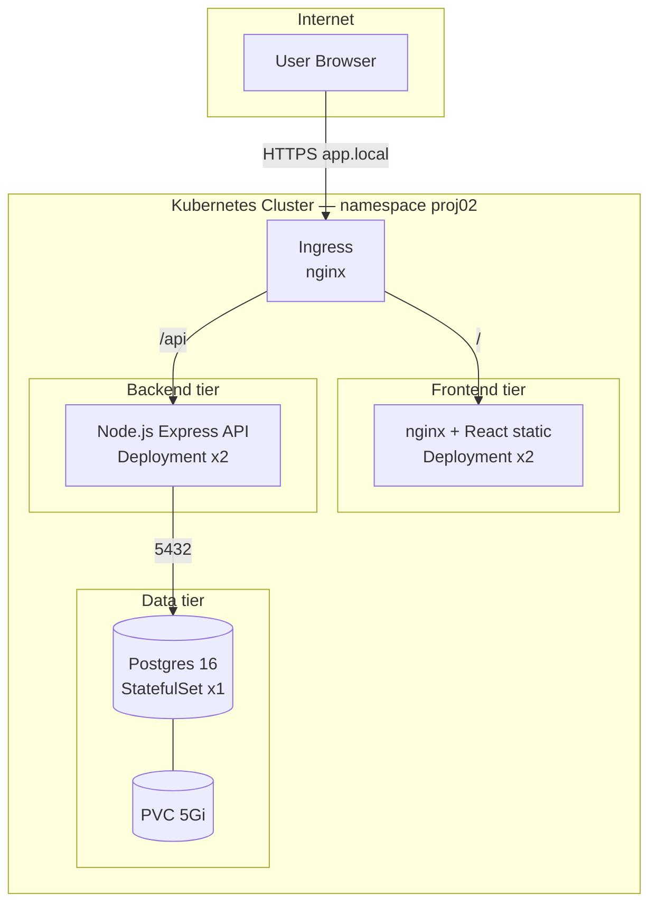
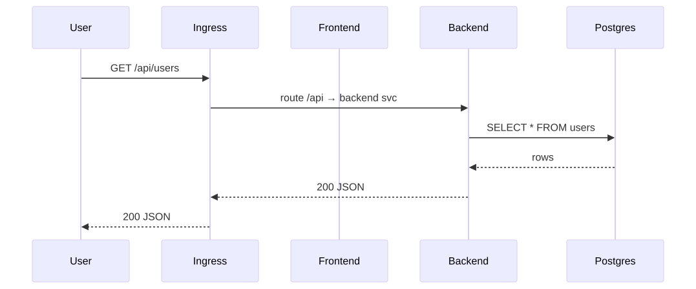
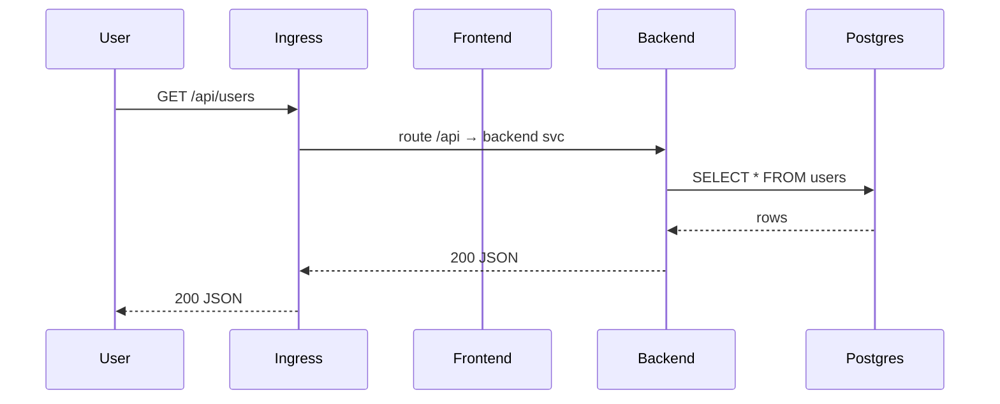

# Architecture — Three-Tier App

## C4 — Container view

<!-- mermaid:rendered -->

Mermaid source

## Decisions

| Decision | Why |
|----------|-----|
| StatefulSet for Postgres | Stable network ID + per-replica PVC |
| ClusterIP services | Internal only; ingress is the public edge |
| Single ingress host with path routing | Simpler DNS; no CORS |
| Secrets via Helm values | Demo only — production must use ESO/Vault |
| `topologySpreadConstraints` on FE/BE | Survive single-node failure |

## Request flow (sequence)

<!-- mermaid:rendered -->

Mermaid source

## Resource targets

| Component | CPU req | Mem req | CPU lim | Mem lim |
|-----------|---------|---------|---------|---------|
| Frontend  | 50m     | 32Mi    | 200m    | 128Mi   |
| Backend   | 100m    | 128Mi   | 500m    | 512Mi   |
| Postgres  | 250m    | 256Mi   | 1000m   | 1Gi     |
