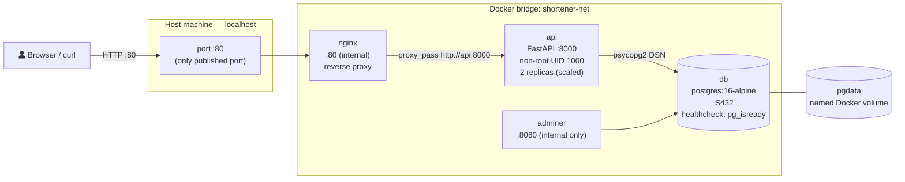
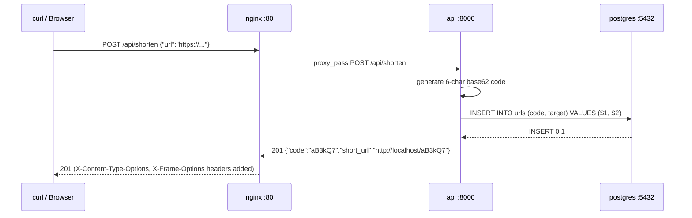
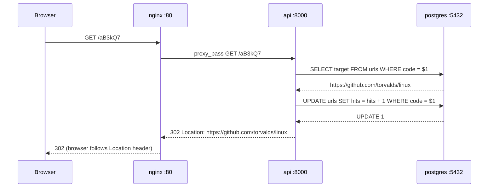
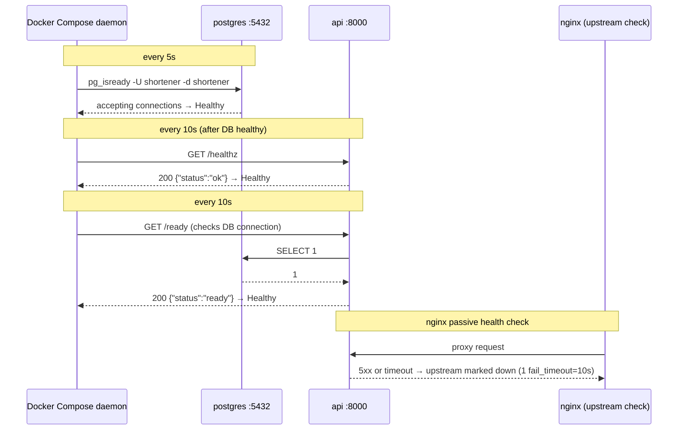
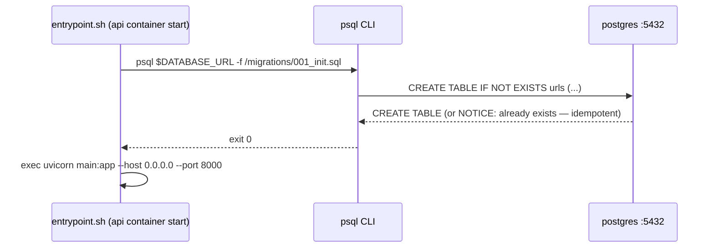
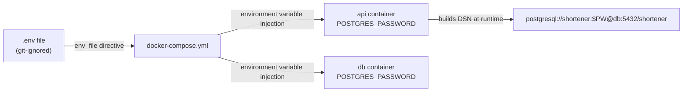

# Architecture — Three-Tier URL Shortener

Deep-dive on the Docker Compose topology: request flow, data path, and health probe path for `02-three-tier-app`.

---

## 1. Full topology

---

## 2. Request flow — POST /api/shorten

---

## 3. Request flow — GET /:code (redirect)

---

## 4. Health probe path

---

## 5. Data path — migrations

---

## 6. Secret injection path

---

## 7. Network security model

| Source | Destination | Port | Allowed? |
|--------|-------------|------|----------|
| Host / internet | nginx | 80 | Yes — only published port |
| nginx | api | 8000 | Yes — same bridge |
| api | db | 5432 | Yes — same bridge |
| adminer | db | 5432 | Yes — same bridge |
| Host | api | 8000 | No — not published |
| Host | db | 5432 | No — not published |
| Host | adminer | 8080 | No — not published |
| Internet | db | any | No |

---

## 8. Volume lifecycle

| Command | pgdata volume |
|---------|---------------|
| `make up` | Created if absent; mounted at `/var/lib/postgresql/data` |
| `make down` | Volume persists — data safe |
| `make restart` | Volume persists |
| `make nuke` (`docker compose down -v`) | Volume deleted — data gone |

Named volumes survive container removal because Docker manages them independently of container lifecycle. This mirrors production behaviour where a database PersistentVolumeClaim outlives a pod restart.

---

## 9. Resource footprint

| Service | Image | Approx RAM |
|---------|-------|-----------|
| db | postgres:16-alpine | ~50 MB idle |
| api | python:3.12-slim (custom) | ~80 MB |
| nginx | nginx:1.27-alpine | ~8 MB |
| adminer | adminer:4 | ~30 MB |

Total stack: ~170 MB RAM on a laptop. Suitable for any 8 GB machine.
