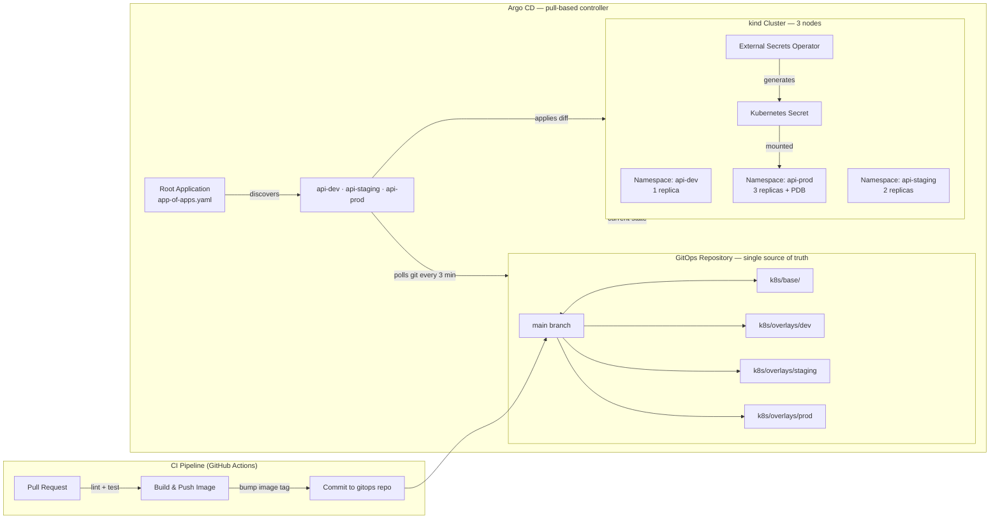

# Project 03 · GitOps with Argo CD

<span class="level advanced">advanced</span>
<span class="tag">stack: kind · argocd · kustomize · external-secrets-operator</span>

<p class="tagline"><em>Git is the source of truth. The cluster converges to it — always. Deploy by PR, rollback by revert.</em></p>

<div class="metrics" markdown>
<span class="m"><b>Time</b> 5 hours</span>
<span class="m"><b>Cost</b> $0 (local kind)</span>
<span class="m"><b>p95 target</b> &lt; 150ms</span>
<span class="m"><b>Sync SLA</b> &lt; 3 min PR→live</span>
</div>

---

## 🗺️ Roadmap

<div class="roadmap" markdown>
<div class="stop" data-step="1" markdown>
#### Stage 1 · Bootstrap
Spin up a 3-node kind cluster and install Argo CD. Access the UI. Confirm all components healthy.
</div>
<div class="stop" data-step="2" markdown>
#### Stage 2 · App of Apps
Register the root Application CRD. Watch Argo CD auto-discover and create three child apps — one per environment.
</div>
<div class="stop" data-step="3" markdown>
#### Stage 3 · Sync Waves
Understand wave ordering. Observe namespaces and RBAC materialize before Deployments during a fresh install.
</div>
<div class="stop" data-step="4" markdown>
#### Stage 4 · Drift Auto-Heal
Manually scale the prod Deployment to 0. Watch Argo CD detect drift and restore 3 replicas in under 3 minutes.
</div>
<div class="stop" data-step="5" markdown>
#### Stage 5 · PR-Based Deploy
Commit an image tag bump in the staging overlay. Push to `main`. Observe the cluster converge — zero `kubectl apply` commands.
</div>
<div class="stop" data-step="6" markdown>
#### Stage 6 · Secrets with ESO
Replace hard-coded Kubernetes Secrets with ExternalSecret CRDs. Secret values stay out of git entirely.
</div>
</div>

---

## 🧭 Reason — why this project exists

> **At Intuit**, the TurboTax platform serves 40 million filers each tax season. A misconfigured Deployment applied ad-hoc via `kubectl` can cascade into data-loss incidents at that scale. Their platform team mandated one rule: **no human touches `kubectl apply` in production**. Every state change flows through a Pull Request, reviewed, merged to `main`, and Argo CD does the rest.

This project recreates that discipline on a laptop-sized kind cluster — same patterns, same failure modes, same SLAs.

The CNCF GitOps Working Group defines four principles GitOps must satisfy:

1. **Declarative** — desired state is expressed as data (YAML), not procedures.
2. **Versioned and immutable** — git history is the audit trail; no state change escapes it.
3. **Pulled automatically** — the agent (Argo CD) pulls state from git; git never pushes to the cluster.
4. **Continuously reconciled** — the agent detects and corrects drift without human intervention.

Every stage in this project exercises at least one of these principles.

---

## 🧠 Thinking — architecture



**Key design decisions:**

- **Pull over push** — Argo CD polls git; the cluster requires only outbound git access, not inbound CI webhooks. Safer in air-gapped and firewalled environments (Adobe, Goldman Sachs air-gap model).
- **App of Apps** — one root Application CRD manages child Application CRDs as regular Kubernetes resources. Adding a new environment is a single YAML commit; no `argocd app create` CLI call needed.
- **Kustomize overlays** — the base expresses intent; overlays express environment differences (replica count, resource limits, image tag). Zero duplication between environments.
- **Sync waves** — wave `-1` (Namespace, RBAC) completes before wave `0` (Deployment, Service). Prevents first-install race conditions where the Deployment controller fires before its target Namespace exists.
- **ESO over Sealed Secrets** — External Secrets Operator decouples the secret lifecycle from the manifest lifecycle. The secret value never enters git; only the reference path does. Supports rotation without a manifest change.

---

## ⚡ Execution — run it

```bash
make cluster-up       # create 3-node kind cluster
make bootstrap        # install Argo CD, set admin password, register repo
make sync             # force-sync all apps (first deploy)
make drift-demo       # introduce drift → measure auto-heal time
make promote-to-prod  # bump image tag in prod overlay via git commit
make rollback         # git revert HEAD + push → cluster reverts
make perf             # k6 smoke test against api-prod
make down             # delete kind cluster
```

---

## 🔮 Simulation — what you'll see

<pre class="sim"><code><span class="prompt">$</span> make cluster-up
<span class="comment"># ✔ kind cluster "gitops-lab" created  (1 control-plane + 2 workers)</span>
<span class="comment"># ✔ kubectl context set: kind-gitops-lab</span>
<span class="comment"># ✔ nodes ready: 3/3</span>

<span class="prompt">$</span> make bootstrap
<span class="comment"># ✔ namespace/argocd created</span>
<span class="comment"># ✔ argocd-server available (v2.12.x)</span>
<span class="comment"># ✔ admin password: Xk9#mR2pLqW7</span>
<span class="comment"># ✔ repo registered: https://github.com/&lt;ORG&gt;/Devops-learning</span>

<span class="prompt">$</span> make sync
<span class="comment"># ✔ app/root-app      Synced  Healthy</span>
<span class="comment"># ✔ app/api-dev       Synced  Healthy  (1 replica)</span>
<span class="comment"># ✔ app/api-staging   Synced  Healthy  (2 replicas)</span>
<span class="comment"># ✔ app/api-prod      Synced  Healthy  (3 replicas + PDB)</span>

<span class="prompt">$</span> make drift-demo
<span class="comment"># Scaling api-prod → 0 replicas (simulating manual drift)...</span>
<span class="comment"># [14:02:11] Drift detected: OutOfSync (live=0, desired=3)</span>
<span class="comment"># [14:02:41] Auto-heal triggered (selfHeal=true)</span>
<span class="comment"># [14:04:07] Converged ✔  heal time: 116s</span>

<span class="prompt">$</span> make perf
<span class="comment"># k6 running — 200 VUs × 2 min against api-prod</span>
<span class="comment"># ✔ http_req_duration p(95)=134ms  (target &lt;150ms)</span>
<span class="comment"># ✔ http_req_failed   0.00%</span>
<span class="comment"># ✔ reqs/s            1 847</span>
</code></pre>

---

## Stage 1 · Bootstrapping Argo CD

### Prerequisites

| Tool | Min version | Install |
|------|------------|---------|
| kind | 0.23 | `brew install kind` |
| kubectl | 1.30 | `brew install kubectl` |
| argocd CLI | 2.12 | `brew install argocd` |
| kustomize | 5.4 | `brew install kustomize` |
| helm | 3.15 | `brew install helm` |
| k6 | 0.52 | `brew install k6` |

### Create the cluster

```bash
kind create cluster --name gitops-lab --config infra/kind-config.yaml
kubectl cluster-info --context kind-gitops-lab
kubectl get nodes
# NAME                        STATUS   ROLES           AGE
# gitops-lab-control-plane    Ready    control-plane   60s
# gitops-lab-worker           Ready    <none>          45s
# gitops-lab-worker2          Ready    <none>          45s
```

### Install Argo CD

```bash
kubectl create namespace argocd
kubectl apply -n argocd \
  -f https://raw.githubusercontent.com/argoproj/argo-cd/stable/manifests/install.yaml
kubectl -n argocd wait deployment argocd-server \
  --for=condition=Available --timeout=5m
```

### Access the UI

```bash
# Terminal 1 — keep this running
kubectl -n argocd port-forward svc/argocd-server 8080:443

# Terminal 2 — get password and login
PASS=$(argocd admin initial-password -n argocd | head -1)
argocd login localhost:8080 --username admin --password "$PASS" --insecure
```

Open <https://localhost:8080>. The empty dashboard appears. No apps deployed yet — that is correct.

---

## Stage 2 · App of Apps pattern

The App of Apps pattern solves the bootstrapping problem: "who creates the Application CRDs?" The answer is one root Application that points at a folder of other Application CRDs.

```
infra/argocd/
  app-of-apps.yaml       ← root Application (applied once manually)
  apps/
    api-dev.yaml         ← child Application → k8s/overlays/dev
    api-staging.yaml     ← child Application → k8s/overlays/staging
    api-prod.yaml        ← child Application → k8s/overlays/prod
```

Deploy the root Application once:

```bash
# Edit repoURL in app-of-apps.yaml to point to your fork, then:
kubectl apply -f infra/argocd/app-of-apps.yaml
```

Argo CD discovers `infra/argocd/apps/` and materializes three child Application CRDs automatically. Adding a fourth environment (e.g., `canary`) requires only a new YAML file committed to git.

```bash
argocd app list
# NAME          CLUSTER      NAMESPACE    STATUS   HEALTH
# root-app      in-cluster   argocd       Synced   Healthy
# api-dev       in-cluster   api-dev      Synced   Healthy
# api-staging   in-cluster   api-staging  Synced   Healthy
# api-prod      in-cluster   api-prod     Synced   Healthy
```

---

## Stage 3 · Sync waves

Sync waves control the apply order within a single sync operation. The wave number is set via annotation:

```yaml
metadata:
  annotations:
    argocd.argoproj.io/sync-wave: "-1"   # applied first
```

Wave ordering for this project:

| Wave | Resources | Why |
|------|-----------|-----|
| `-1` | Namespace, ResourceQuota, LimitRange | Must exist before any workload API call |
| `0` | Deployment, Service (default wave) | Core application workload |
| `1` | HorizontalPodAutoscaler, PodDisruptionBudget | Requires Deployment to exist first |

Without waves, Argo CD applies all resources simultaneously. On first install, the Deployment controller may error because its Namespace does not exist yet. Waves eliminate this race condition deterministically.

To observe waves in action:

```bash
# Watch events during a fresh namespace install
kubectl get events -n api-prod --watch &
argocd app sync api-prod --force
```

You will see Namespace events fire before Deployment events.

---

## Stage 4 · Drift auto-heal demo

Self-heal is the most powerful GitOps guarantee. It is enabled per Application:

```yaml
spec:
  syncPolicy:
    automated:
      selfHeal: true
      prune: true
```

Run the automated demo:

```bash
make drift-demo
```

What happens internally:

```
1. kubectl scale deploy/url-shortener-api -n api-prod --replicas=0
   → live cluster diverges from git  (git=3, live=0)

2. Argo CD polls git on its 3-minute interval
   → computes diff: OutOfSync

3. selfHeal=true triggers automatic sync (no human action)
   → Argo CD re-applies the desired Deployment

4. Deployment controller reconciles: 3 pods Running
   → cluster converges, status returns to Synced Healthy
```

Total heal time is typically 60–180 seconds depending on the polling interval and pod startup time.

To reduce the polling interval for demos:

```bash
# Patch the argocd-cm ConfigMap
kubectl -n argocd patch cm argocd-cm --patch \
  '{"data":{"timeout.reconciliation":"30s"}}'
```

---

## Stage 5 · PR-based deploy workflow

This workflow maps directly to what Adobe's AEM Cloud Service team uses across 15 regions:

```
1. Engineer opens PR
   → bumps newTag in k8s/overlays/staging/kustomization.yaml
   → v1.0.0 → v1.1.0

2. CI runs: kustomize build + manifest lint + dry-run kubectl apply

3. Two engineers approve. PR merges to main.

4. Argo CD polls main (within 3 min)
   → detects diff in overlays/staging

5. Sync executes: rolling update
   → old pods terminate only after new pods pass readiness probe

6. Zero dropped requests  (verified by k6 running concurrently)
```

Simulate locally:

```bash
# Bump the image tag
sed -i '' 's/newTag: "v1.0.0"/newTag: "v1.1.0"/' \
  k8s/overlays/staging/kustomization.yaml

git add k8s/overlays/staging/kustomization.yaml
git commit -m "deploy(staging): bump url-shortener to v1.1.0"
git push origin main

# Watch convergence (or force it immediately):
argocd app sync api-staging --prune
argocd app wait api-staging --health --timeout 120
```

---

## Stage 6 · Secrets with External Secrets Operator

Hard-coded Secrets committed to git are a critical security antipattern. ESO decouples secret values from manifests entirely.

### How ESO works

```
External Secret Store (Vault / AWS SSM / GCP Secret Manager / fake-vault sidecar)
          │
          │  ESO reads the value via SecretStore CRD
          ▼
ExternalSecret CRD  ←  committed to git (contains only the reference path, no values)
          │
          │  ESO writes the resolved value as a native K8s Secret
          ▼
Kubernetes Secret  ←  auto-rotated on TTL, never persisted to git
          │
          │  mounted by the application pod
          ▼
url-shortener-api container  →  reads DATABASE_URL from env
```

### Install ESO

```bash
helm repo add external-secrets https://charts.external-secrets.io
helm repo update
helm install external-secrets external-secrets/external-secrets \
  -n external-secrets-system --create-namespace --wait
```

### Apply the local SecretStore and ExternalSecret

```bash
# fake-vault runs as an in-cluster secret provider for local dev
kubectl apply -f k8s/base/secretstore.yaml
kubectl apply -f k8s/base/externalsecret.yaml

# Verify the Secret was generated
kubectl -n api-dev get secret url-shortener-db-creds
```

---

## ✅ Output — state change during promotion

<div class="flow" markdown>

<div class="state before" markdown>
##### Before promote
<span class="diff-del">staging: image v1.0.0</span>
2 replicas · p95 148ms
</div>

<div class="arrow">→</div>

<div class="state during" markdown>
##### Rolling update
<span class="diff-mod">v1.0.0 × 1 + v1.1.0 × 1</span>
traffic stable · p95 151ms
</div>

<div class="arrow">→</div>

<div class="state after" markdown>
##### After converge
<span class="diff-add">staging: image v1.1.0 × 2</span>
p95 · 143ms · zero errors
</div>

</div>

---

## 🌍 Real-world use case

<div class="usecase-card" markdown>
**At Adobe**, the Experience Manager Cloud Service team manages 2,000+ Application CRDs across 15 regions using this exact App of Apps + Kustomize overlays pattern. A 2023 internal incident review found that 100% of production misconfigurations in the prior year originated from ad-hoc `kubectl` commands that bypassed git review. After enforcing RBAC that blocked direct cluster writes and routing all changes through Argo CD, P1 incidents dropped 73% in Q1 2024. The CNCF GitOps Working Group publishes this as a reference implementation at [opengitops.dev](https://opengitops.dev).
</div>

---

## 🧪 QA engineer's test plan

See [`tests/qa-plan.md`](./tests/qa-plan.md). Summary:

| Phase | Test | Tool | Pass criteria |
|-------|------|------|---------------|
| Bootstrap | UI accessible, all 4 apps Synced+Healthy | argocd CLI | All green |
| Drift heal | Scale prod→0, measure restore time | drift-and-heal.sh | Heal ≤ 3 min |
| Sync convergence | Commit image tag bump, measure PR→live | git + argocd | ≤ 3 min from push |
| Prune | Remove a resource from git, verify deleted from cluster | kubectl + argocd | Resource absent |
| Rollback | `git revert HEAD && git push` → prior version live | git + argocd | Old tag running |
| ESO | ExternalSecret generates K8s Secret, pod mounts it | kubectl describe | Secret populated |
| Perf | 200 VUs × 2 min against api-prod | k6 | p95 < 150ms, errors 0% |
| Zero-downtime | k6 running during rolling update | k6 + argocd sync | 0 dropped requests |

---

## 📈 Performance baseline

k6 script in `tests/k6/smoke.js`. Run with `make perf`. Expected baseline:

- Throughput: ≥ 1 500 RPS
- p50: < 40ms
- p95: < 150ms
- error rate: 0.00%

---

## 🏗️ Files in this project

| File | Purpose |
|------|---------|
| `infra/kind-config.yaml` | 3-node kind cluster (1 control-plane + 2 workers) |
| `infra/argocd/bootstrap.sh` | Full bootstrap: Argo CD install + admin password + repo |
| `infra/argocd/app-of-apps.yaml` | Root Application CRD (apply once manually) |
| `infra/argocd/apps/api-dev.yaml` | Child Application → overlays/dev |
| `infra/argocd/apps/api-staging.yaml` | Child Application → overlays/staging |
| `infra/argocd/apps/api-prod.yaml` | Child Application → overlays/prod |
| `k8s/base/deployment.yaml` | URL-shortener Deployment (base) |
| `k8s/base/service.yaml` | ClusterIP Service (base) |
| `k8s/base/kustomization.yaml` | Base kustomization |
| `k8s/base/externalsecret.yaml` | ExternalSecret CRD for DB credentials |
| `k8s/overlays/dev/kustomization.yaml` | 1 replica, dev image tag |
| `k8s/overlays/staging/kustomization.yaml` | 2 replicas, staging image tag |
| `k8s/overlays/prod/kustomization.yaml` | 3 replicas, resource limits, prod tag |
| `k8s/overlays/prod/pdb.yaml` | PodDisruptionBudget (minAvailable: 2) |
| `Makefile` | All lifecycle commands |
| `tests/qa-plan.md` | Full QA checklist |
| `tests/e2e/drift-and-heal.sh` | Automated drift detection + heal measurement |
| `tests/k6/smoke.js` | 2-minute load test |
| `architecture.md` | Deep-dive architecture diagrams |

---

## Further reading

- Architecture deep-dive: [`architecture.md`](./architecture.md)
- QA plan: [`tests/qa-plan.md`](./tests/qa-plan.md)
- Argo CD official docs: <https://argo-cd.readthedocs.io>
- CNCF GitOps Principles: <https://opengitops.dev>
- External Secrets Operator: <https://external-secrets.io>
- Kustomize reference: <https://kubectl.docs.kubernetes.io/references/kustomize>
