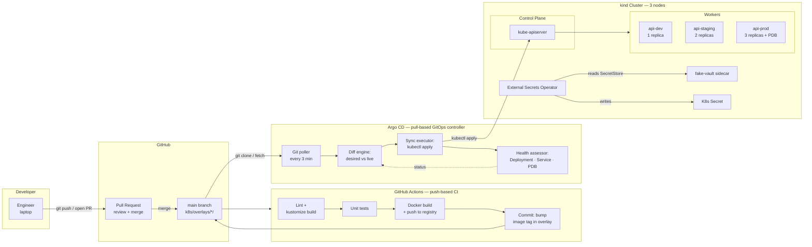
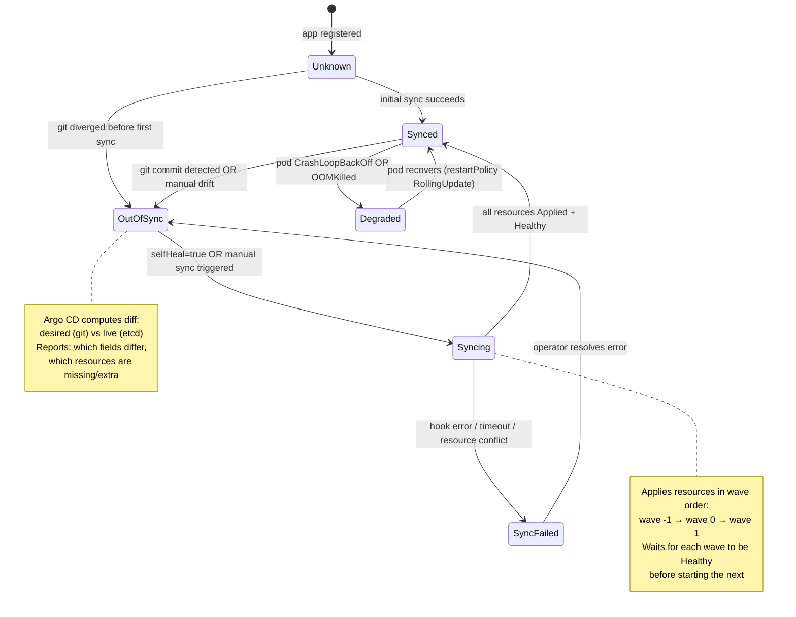
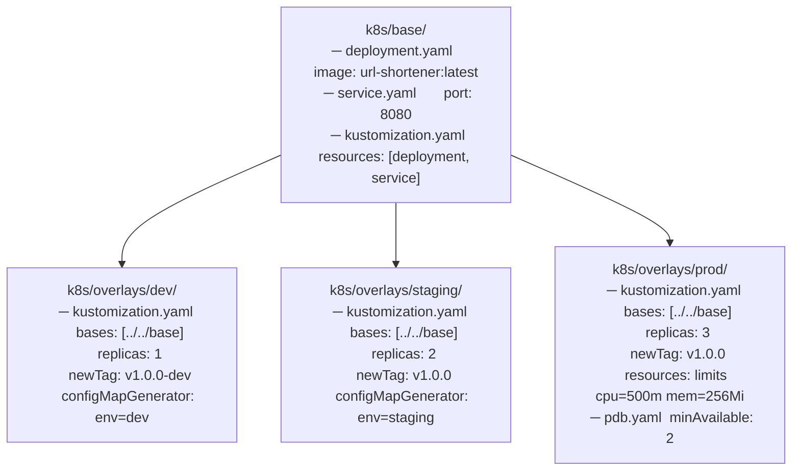
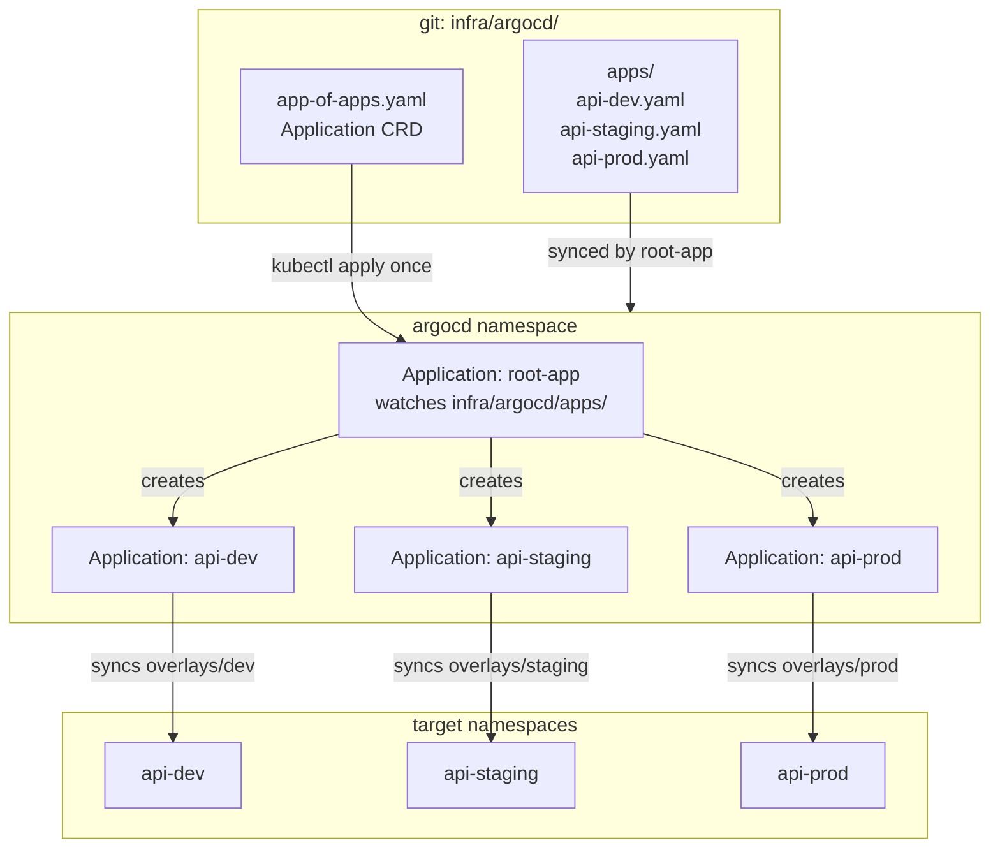
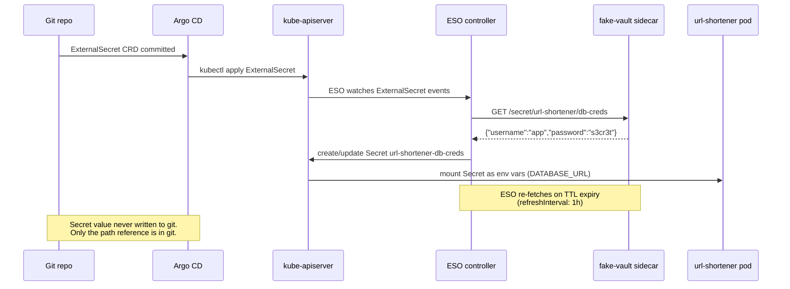
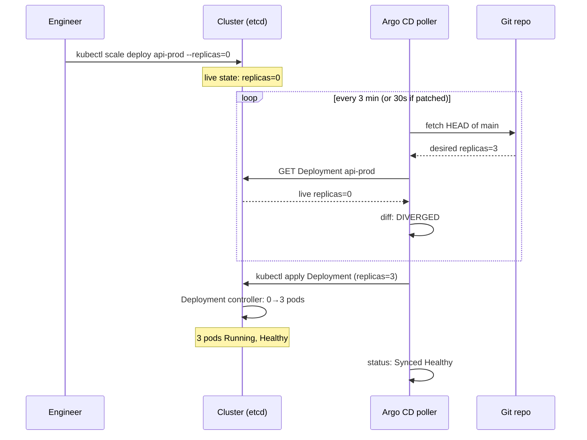

# Architecture — Project 03 · GitOps with Argo CD

## Push-based CI → Git → Argo pull → cluster



---

## Argo CD sync state machine



---

## Kustomize overlay inheritance



---

## App of Apps topology



---

## External Secrets Operator data flow



---

## Sync wave execution order

```mermaid
gantt
  title Sync Wave Execution — api-prod fresh install
  dateFormat  ss
  axisFormat %Ss

  section Wave -1 (infra)
  Create Namespace api-prod       :done, w1a, 00, 2s
  Apply ResourceQuota             :done, w1b, 02, 1s
  Apply LimitRange                :done, w1c, 03, 1s

  section Wave 0 (workload)
  Apply Deployment (3 replicas)   :done, w2a, 04, 8s
  Apply Service                   :done, w2b, 04, 2s
  Wait: 3/3 pods Running          :active, w2c, 06, 6s

  section Wave 1 (policy)
  Apply PodDisruptionBudget       :done, w3a, 12, 1s
  Apply HorizontalPodAutoscaler   :done, w3b, 13, 1s

  section Health check
  All resources Healthy           :milestone, done, 14, 0s
```

---

## Drift detection and heal timeline



---

## Node layout (kind cluster)

```text
┌─────────────────────────────────────────────────────────────────┐
│  kind cluster: gitops-lab                                       │
│                                                                 │
│  ┌─────────────────────────┐                                    │
│  │  gitops-lab-control-plane                                    │
│  │  kube-apiserver                                              │
│  │  etcd                                                        │
│  │  argocd namespace (all components)                           │
│  │  external-secrets-system namespace                           │
│  └─────────────────────────┘                                    │
│                                                                 │
│  ┌──────────────────────┐  ┌──────────────────────┐            │
│  │  gitops-lab-worker   │  │  gitops-lab-worker2  │            │
│  │                      │  │                      │            │
│  │  api-dev (1 pod)     │  │  api-staging (2 pods)│            │
│  │  api-prod (pod 1/3)  │  │  api-prod (pod 2,3)  │            │
│  └──────────────────────┘  └──────────────────────┘            │
└─────────────────────────────────────────────────────────────────┘
```
