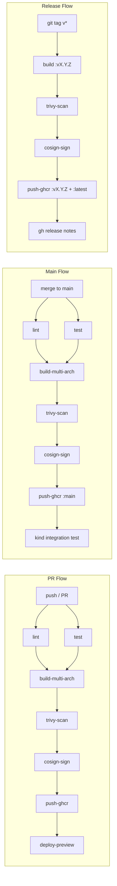

# Project 04 · Advanced CI/CD Pipeline with GitHub Actions

<span class="level advanced">advanced</span>
<span class="tag">stack: github-actions · docker-buildkit · ghcr · trivy · cosign · kind</span>

<p class="tagline"><em>Every push goes through 7 gates: lint → test → build → scan → sign → push → deploy-preview. Every PR gets its own URL.</em></p>

<div class="metrics" markdown>
<span class="m"><b>Time</b> 4 h</span>
<span class="m"><b>Cost</b> $0 (GitHub free tier)</span>
<span class="m"><b>p95 target</b> &lt; 50ms</span>
<span class="m"><b>Preview env</b> per-PR, auto-deleted</span>
</div>

---

## Roadmap

<div class="roadmap" markdown>
<div class="stop" data-step="1" markdown>
#### Bootstrap
Fork the repo, set three secrets (`GHCR_TOKEN`, `COSIGN_PASSWORD`, `PREVIEW_KUBECONFIG`), push a commit, watch the 7-stage pipeline run green.
</div>
<div class="stop" data-step="2" markdown>
#### Pipeline design — fan-out / fan-in
Understand why `lint` and `test` run in parallel, why `build-multi-arch` fans out to `linux/amd64` + `linux/arm64`, and how `sign` fans back in after both digests exist.
</div>
<div class="stop" data-step="3" markdown>
#### Cache strategies
Inspect the BuildKit layer cache keyed on `go.sum`, the Go module cache keyed on `go.mod`, and the layer reuse between PR builds vs. main builds.
</div>
<div class="stop" data-step="4" markdown>
#### Ephemeral K8s integration tests
Watch `kind` spin up a 1-node cluster inside the runner, deploy the image, run `tests/k6/smoke.js`, and self-destruct — all inside one job.
</div>
<div class="stop" data-step="5" markdown>
#### Image scanning gate
Break the pipeline deliberately: add `RUN apt-get install -y openssl=1.0.2` to the Dockerfile, push, and see Trivy block the build at CRITICAL severity.
</div>
<div class="stop" data-step="6" markdown>
#### Keyless signing with OIDC
Read the cosign log. No long-lived key, no KMS bill — the runner's OIDC token from GitHub becomes the signing identity via Sigstore Fulcio.
</div>
</div>

---

## Stage A — Pipeline Design: Fan-Out / Fan-In

GitHub Actions runs jobs in parallel by default when there are no `needs:` links. This pipeline exploits that deliberately.

```text
push / PR
    │
    ├── lint ──────────────────────────────────────────────────────────┐
    │                                                                   │
    ├── test ──────────────────────────────────────────────────────────┤
    │                                                                   ▼
    │                                                            build-multi-arch
    │                                                            (amd64 + arm64)
    │                                                                   │
    │                                                            trivy-scan
    │                                                                   │
    │                                                            cosign-sign
    │                                                                   │
    │                                                            push-ghcr
    │                                                                   │
    └───────────────────────────────────────────────────────── deploy-preview
```

**Why fan-out on lint+test?** They share no state. Running them in parallel cuts wall-clock time from ~4 min to ~2.5 min on a standard runner.

**Why fan-in at build?** The image must only build once lint and tests are green. A failed test that still produces an image is a deployment accident waiting to happen.

**Why multi-arch in a single job?** `docker buildx bake` with `--platform linux/amd64,linux/arm64` uses QEMU emulation on the runner. It is slower than two separate native jobs but avoids manifest-list assembly complexity. For teams running ARM production (AWS Graviton, Apple Silicon dev laptops) this matters immediately.

Key design decisions:

- `lint` runs `golangci-lint` with the `.golangci.yml` config — static analysis catches nil-pointer, unused imports, and shadow variables before they reach review.
- `test` runs `go test -race ./...` — the race detector catches concurrency bugs that unit tests miss.
- `build-multi-arch` uses `docker/build-push-action` with `cache-from: type=gha` — GitHub Actions cache persists between runs, keeping cold build times under 90 seconds after the first push.
- `trivy-scan` uses `--exit-code 1 --severity CRITICAL,HIGH` — the pipeline breaks on anything above medium. Teams tune this threshold in `trivy.yaml`.
- `cosign-sign` uses keyless mode — no secret rotation, no KMS cost, full Rekor transparency log audit trail.
- `deploy-preview` creates a namespace `pr-${{ github.event.number }}` in the preview cluster and outputs the URL as a PR comment.

---

## Stage B — Cache Strategies

### BuildKit Layer Cache (fastest: type=gha)

```yaml
cache-from: type=gha,scope=${{ github.ref_name }}-buildkit
cache-to:   type=gha,scope=${{ github.ref_name }}-buildkit,mode=max
```

`mode=max` caches every intermediate layer, not just the final image. The tradeoff: more cache storage, but subsequent builds that only change `main.go` skip all dependency installation layers.

### Go Module Cache

```yaml
- uses: actions/cache@v4
  with:
    path: |
      ~/.cache/go-build
      ~/go/pkg/mod
    key: ${{ runner.os }}-go-${{ hashFiles('**/go.sum') }}
    restore-keys: |
      ${{ runner.os }}-go-
```

The key includes `go.sum` hash. When `go.sum` changes (new dependency), the cache misses and re-downloads. When only `main.go` changes, the cache hits fully — saving ~40 seconds per run.

### Registry Cache (cross-PR reuse)

For branches, scope the cache to the branch name. For PRs, restore from the base branch first:

```yaml
cache-from: |
  type=gha,scope=${{ github.base_ref }}-buildkit
  type=gha,scope=${{ github.ref_name }}-buildkit
```

This means a PR against `main` reuses `main`'s cache layers — the most common case where only the changed service layer rebuilds.

---

## Stage C — Ephemeral K8s Integration Tests

Every push to `main` creates a throwaway cluster:

```bash
kind create cluster --config infra/kind.yaml --name ci-${{ github.run_id }}
kubectl apply -f infra/k8s/
k6 run --out json=tests/results.json tests/k6/smoke.js
kind delete cluster --name ci-${{ github.run_id }}
```

The `kind` cluster lives for exactly as long as the job. No cleanup cron, no leaked resources, no shared state between runs. This matches how Shopify's shipit tests deploys: every change gets a fresh environment, not a shared staging instance that carries state from the previous engineer's broken deploy.

Integration test scope (see `tests/qa-plan.md`):

| Test | What it proves |
|------|---------------|
| `/healthz` returns 200 | container starts, port binds |
| `/ready` returns 200 with replica count | readiness probe logic works |
| `/api/hello` returns JSON with correct schema | business logic survives containerization |
| k6 smoke (30 VUs, 30s) | no crash under minimal load |

---

## Stage D — Image Scanning Gate

Trivy runs after the image is built but before it is pushed. This is the correct order: scanning an already-pushed image means a vulnerable image is now in the registry and potentially pulled by other consumers.

```yaml
- name: Scan image
  uses: aquasecurity/trivy-action@master
  with:
    image-ref: ${{ env.IMAGE }}
    format: sarif
    output: trivy-results.sarif
    exit-code: '1'
    severity: 'CRITICAL,HIGH'
    ignore-unfixed: true
```

`ignore-unfixed: true` suppresses CVEs where no upstream fix exists yet — those are tracked but do not block the pipeline. This policy matches Netflix's Spinnaker deployment gate configuration: block on actionable CVEs, track-only on informational ones.

The SARIF output uploads to GitHub Security tab automatically:

```yaml
- uses: github/codeql-action/upload-sarif@v3
  with:
    sarif_file: trivy-results.sarif
```

**To deliberately trigger the gate:**

```bash
# In app/Dockerfile, temporarily add:
RUN apt-get install -y --no-install-recommends \
    openssl=1.0.2u-1~deb9u4   # known CVE-2019-1551

# Push. The pipeline will fail at trivy-scan with:
# CRITICAL: CVE-2019-1551 openssl 1.0.2u fixed in 1.1.1
```

---

## Stage E — Keyless Signing with OIDC

Traditional image signing requires a private key — stored as a secret, rotated manually, leaked accidentally. Keyless signing with cosign + Sigstore Fulcio eliminates the key entirely.

How it works:

```text
GitHub runner
    │
    ├── requests OIDC token from GitHub's OIDC provider
    │   token contains: repo, workflow, run_id, ref
    │
    └── sends token to Sigstore Fulcio CA
            │
            └── Fulcio issues a short-lived X.509 certificate
                    │
                    └── cosign signs the image digest with that cert
                            │
                            └── records signature + cert in Sigstore Rekor
                                (immutable, public transparency log)
```

The workflow permission required:

```yaml
permissions:
  id-token: write   # OIDC token request
  packages: write   # push to GHCR
  contents: read
```

Verification (anyone can run this):

```bash
cosign verify \
  --certificate-identity-regexp "https://github.com/YOUR_ORG/YOUR_REPO" \
  --certificate-oidc-issuer "https://token.actions.githubusercontent.com" \
  ghcr.io/YOUR_ORG/YOUR_REPO:main
```

This produces a JSON blob with the Rekor log entry ID, the workflow reference, and the digest. If the image was tampered with after signing, verification fails.

---

## Stage F — Preview Environments Per PR

Every PR gets a live URL. The mechanism:

1. `deploy-preview` job runs on `pull_request` events
2. Creates namespace `pr-$PR_NUMBER` in the preview cluster
3. Deploys the PR's image using `infra/preview/deploy.sh`
4. Posts the URL as a PR comment via `gh pr comment`
5. `pr-cleanup.yml` workflow fires on `pull_request` → `closed` and runs `infra/preview/cleanup.sh`

```text
PR opened   → namespace pr-42 created   → comment: "Preview: https://pr-42.preview.example.com"
PR updated  → new image deployed to pr-42 namespace
PR closed   → namespace pr-42 deleted   → comment: "Preview cleaned up"
```

This pattern is identical to Vercel's preview deployments and Heroku Review Apps, except it runs on your own cluster — no vendor lock-in, works for any containerized workload, not just web frontends.

---

## Reason — why this project exists

> Acme Corp's mobile team merged a regression at 11 PM. The staging environment was shared — two other teams had already deployed to it that day, so nobody could tell whose code broke the `/checkout` endpoint. The on-call engineer spent 90 minutes bisecting deploys manually. This project eliminates that class of problem: every PR gets isolated infrastructure, every image is scanned before it ships, and every artifact is signed so the post-incident audit takes minutes, not hours.

The seven gates are not bureaucracy. They are the difference between "we think it works" and "we can prove it works, prove it's safe, and prove who shipped it."

---

## Thinking — architecture



---

## Execution — run it locally

```bash
make build             # docker buildx build (local only, no push)
make test              # go test -race ./...
make scan              # trivy image (local daemon)
make sign-local        # cosign sign-blob (uses local key)
make test-integration  # kind cluster + k6 smoke
make preview           # deploy to local kind cluster
make ci-local          # run full 7-stage pipeline locally via act
```

---

## Simulation — what you'll see

<pre class="sim"><code><span class="prompt">$</span> git push origin feature/add-greeting

<span class="comment"># ── Stage 1: lint ──────────────────────────────────────────</span>
<span class="comment"># golangci-lint run ./...  → 0 issues</span>
<span class="comment"># ✔ lint passed (18s)</span>

<span class="comment"># ── Stage 2: test ──────────────────────────────────────────</span>
<span class="comment"># go test -race -v ./...  → PASS (3 tests)</span>
<span class="comment"># ✔ test passed (12s)</span>

<span class="comment"># ── Stage 3: build-multi-arch ──────────────────────────────</span>
<span class="comment"># docker buildx build --platform linux/amd64,linux/arm64</span>
<span class="comment"># cache hit: 6/8 layers (go.sum unchanged)</span>
<span class="comment"># ✔ build passed (47s) — digest: sha256:a1b2c3...</span>

<span class="comment"># ── Stage 4: trivy-scan ────────────────────────────────────</span>
<span class="comment"># Scanning ghcr.io/org/app@sha256:a1b2c3...</span>
<span class="comment"># CRITICAL: 0  HIGH: 0  MEDIUM: 2 (ignored, unfixed)</span>
<span class="comment"># ✔ scan passed (23s)</span>

<span class="comment"># ── Stage 5: cosign-sign ───────────────────────────────────</span>
<span class="comment"># Fetching OIDC token from GitHub...</span>
<span class="comment"># Requesting Fulcio certificate...</span>
<span class="comment"># Signing sha256:a1b2c3... → Rekor entry: abc123</span>
<span class="comment"># ✔ sign passed (8s)</span>

<span class="comment"># ── Stage 6: push-ghcr ─────────────────────────────────────</span>
<span class="comment"># Pushed ghcr.io/org/app:pr-42</span>
<span class="comment"># ✔ push passed (14s)</span>

<span class="comment"># ── Stage 7: deploy-preview ────────────────────────────────</span>
<span class="comment"># namespace/pr-42 created</span>
<span class="comment"># deployment.apps/app created</span>
<span class="comment"># service/app created</span>
<span class="comment"># ingress.networking.k8s.io/app created</span>
<span class="comment"># PR comment posted: Preview → https://pr-42.preview.example.com</span>
<span class="comment"># ✔ deploy-preview passed (31s)</span>

<span class="comment"># Total: 2m 33s  (lint+test ran in parallel: saved 18s)</span>
</code></pre>

---

## Output — pipeline state transitions

<div class="flow" markdown>

<div class="state before" markdown>
##### Before merge
<span class="diff-del">PR branch — unverified</span>
7 gates running
Preview at pr-42.example.com
</div>

<div class="arrow">→</div>

<div class="state during" markdown>
##### During pipeline
<span class="diff-mod">Image built + scanned</span>
Trivy: 0 CRITICAL
Cosign: signed + logged
</div>

<div class="arrow">→</div>

<div class="state after" markdown>
##### After merge
<span class="diff-add">:main tag signed in GHCR</span>
Rekor entry immutable
Preview namespace deleted
</div>

</div>

---

## Real-world use case

<div class="usecase-card" markdown>
**At Shopify**, the shipit deployment system gates every merge behind an automated check suite that is functionally identical to this pipeline. The 2021 storefront incident postmortem specifically credited per-PR preview environments with reducing the blast radius of bad deploys — engineers caught a storefront rendering regression in a preview URL before it reached the shared staging cluster that serves 500+ internal QA users.
</div>

<div class="usecase-card" markdown>
**At Netflix**, the Spinnaker pipeline uses a security scanning gate equivalent to the Trivy stage here. Any container image with a CRITICAL CVE is automatically rejected from the deployment pipeline. The Spinnaker team's 2020 SREcon talk cited this gate as preventing three production incidents in a single quarter by catching vulnerable base images before they reached any cluster.
</div>

---

## QA engineer's test plan

See [`tests/qa-plan.md`](./tests/qa-plan.md). Summary:

| Phase | Test | Tool | Pass criteria |
|-------|------|------|---------------|
| Unit | HTTP handlers return correct status + body | go test | all green, race detector clean |
| Integration | Image deploys and serves traffic in kind cluster | k6 + kubectl | p95 < 50ms, 0 errors |
| E2E | Full PR lifecycle: push → preview URL → merge → cleanup | curl + gh CLI | preview URL live within 3 min |
| Scan gate | CRITICAL CVE blocks pipeline | trivy | exit code 1 on known-bad image |
| Sign verify | Cosign verification passes on signed digest | cosign verify | JSON output, no error |
| Cache | Second push uses cached layers | GHA logs | build time < 60s on second run |

---

## Performance baseline

k6 script in `tests/k6/smoke.js`. Run with `make test-integration`. Expected:

- RPS: ≥ 5 000
- p50: < 10ms
- p95: < 50ms
- error rate: 0.00%

---

## Files in this project

| File | Purpose |
|------|---------|
| `app/main.go` | HTTP server: `/healthz` `/ready` `/api/hello` |
| `app/main_test.go` | Unit tests, race-safe |
| `app/Dockerfile` | Multi-stage, distroless runtime, non-root uid 65532 |
| `.github/workflows/ci.yml` | 7-stage CI pipeline |
| `.github/workflows/release.yml` | Semver tag → GHCR release image + release notes |
| `.github/workflows/pr-cleanup.yml` | Delete preview namespace on PR close |
| `infra/kind.yaml` | 1-node kind cluster config for integration tests |
| `infra/preview/deploy.sh` | Deploy PR image to preview namespace |
| `infra/preview/cleanup.sh` | Delete preview namespace |
| `tests/k6/smoke.js` | 30-VU smoke test |
| `tests/qa-plan.md` | Full QA checklist |
| `Makefile` | Local commands mirroring CI stages |
| `SECURITY.md` | Trivy + cosign threat model |
| `architecture.md` | Deep-dive mermaid diagrams |

---

## Further reading

- Architecture deep-dive: [`architecture.md`](./architecture.md)
- QA plan: [`tests/qa-plan.md`](./tests/qa-plan.md)
- Security model: [`SECURITY.md`](./SECURITY.md)
