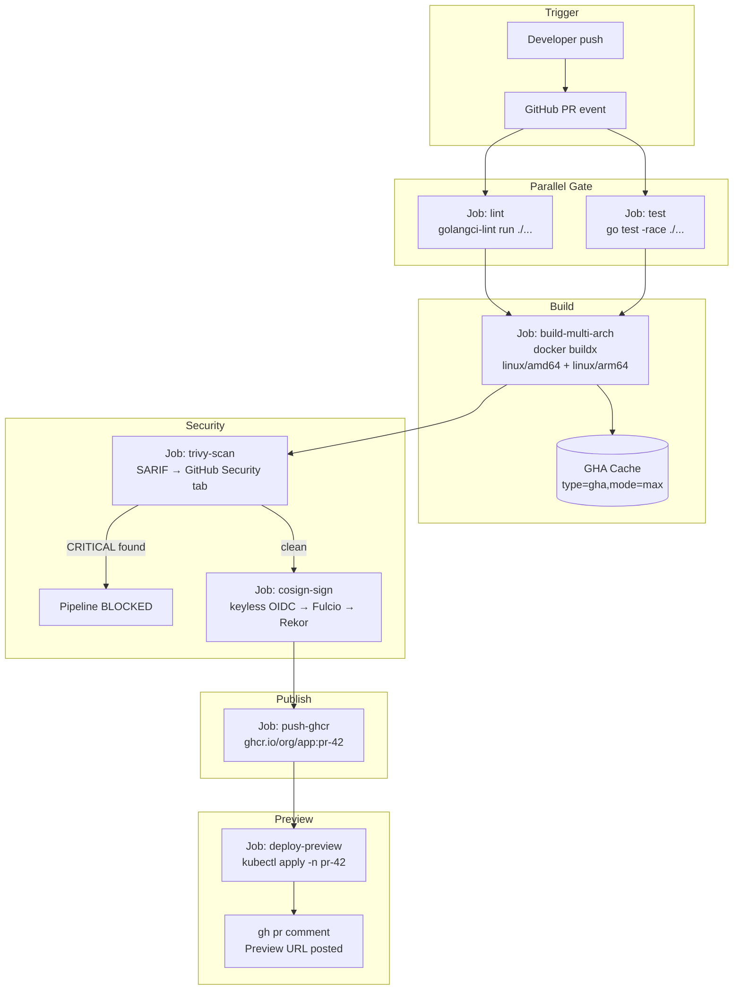
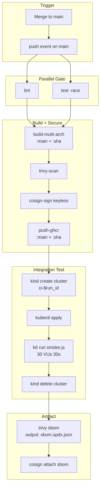
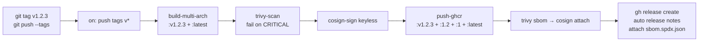
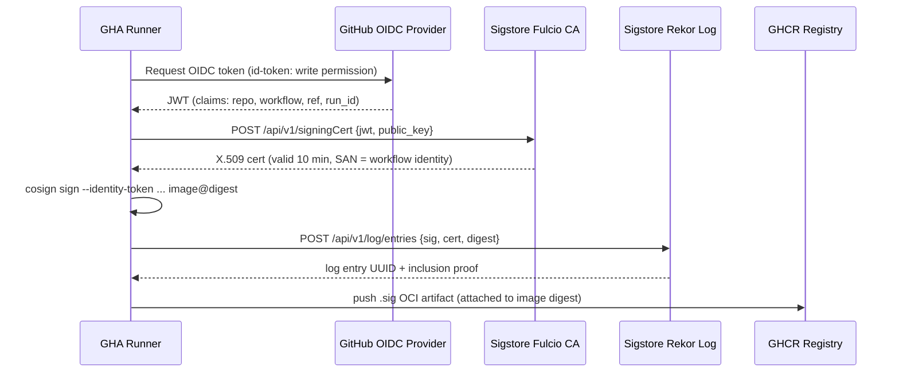
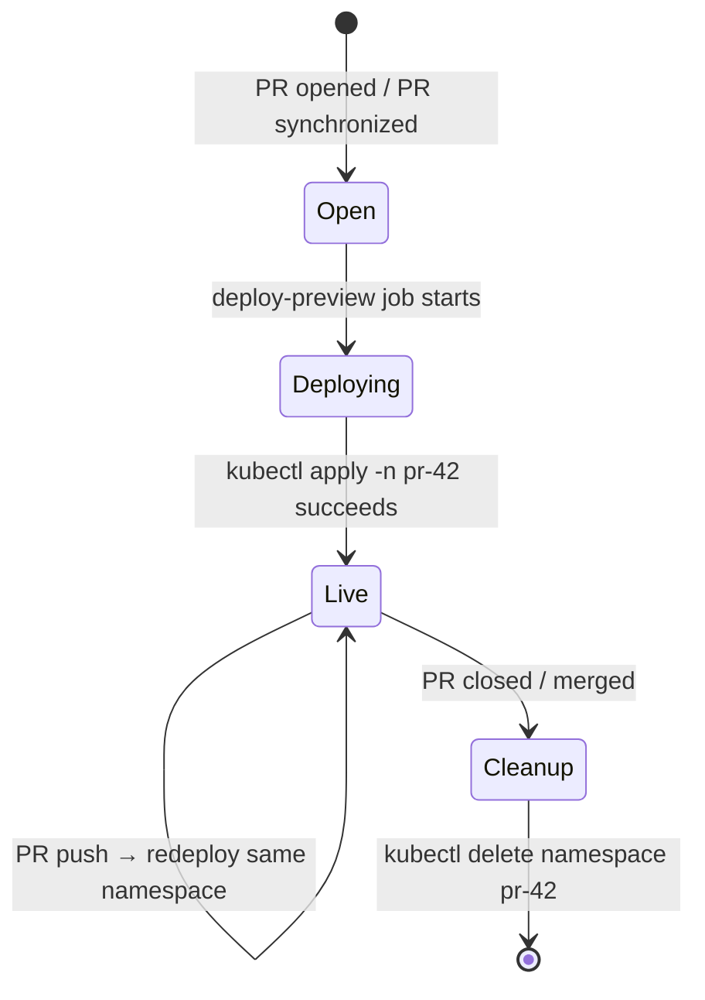

# Architecture Deep-Dive — Project 04 CI/CD Pipeline

## PR Flow (pull_request event)



---

## Main Branch Flow (push to main)



---

## Release Flow (git tag v*)



---

## Fan-Out Stage Details

```mermaid
gantt
  title Pipeline wall-clock time (approximate)
  dateFormat  s
  axisFormat  %Ss

  section Parallel
  lint          :0, 18s
  test          :0, 12s

  section Sequential (starts after max of above)
  build amd64   :18, 30s
  build arm64   :18, 42s
  trivy-scan    :60, 23s
  cosign-sign   :83, 8s
  push-ghcr     :91, 14s
  deploy-preview:105, 31s
```



Total: ~2m 16s vs ~4m 2s sequential. Fan-out saves ~1m 46s on every push.

---

## Keyless Signing Detail



---

## Preview Environment Lifecycle



---

## Image Tag Strategy

| Event | Tags pushed | Example |
|-------|------------|---------|
| PR push | `:pr-<number>` | `app:pr-42` |
| Main push | `:main`, `:sha-<short>` | `app:main`, `app:sha-a1b2c3` |
| Semver tag | `:v<major>.<minor>.<patch>`, `:v<major>.<minor>`, `:v<major>`, `:latest` | `app:v1.2.3`, `app:v1.2`, `app:v1`, `app:latest` |

This strategy is identical to the Docker Hub official image tagging convention and is understood natively by tools like Renovate and Dependabot.

---

## Cache Architecture

```bash
GHA Cache store (10 GB limit per repo)
├── go-<os>-<go.sum hash>          ← Go modules + build cache
│   ├── ~/go/pkg/mod/
│   └── ~/.cache/go-build/
├── main-buildkit                  ← BuildKit layers for main branch
│   └── all intermediate layers (mode=max)
├── feature-X-buildkit             ← BuildKit layers for branch X
│   └── differential from main (only changed layers)
└── pr-42-buildkit                 ← BuildKit layers for PR 42
    └── restored from main first, then PR-specific
```

**Cache invalidation rules:**
- `go.sum` changes → Go module cache misses, full `go mod download`
- `go.mod` changes without `go.sum` → cache restore-key fallback (`os-go-`) fetches nearest match
- `FROM` base image changes in Dockerfile → all layers above it rebuild, rest are cached
- `COPY go.mod go.sum` layer change → only dependency install layer rebuilds

---

## Security Gate Policy

```text
Image build output
    │
    ├── CRITICAL CVEs (fixable) ────── BLOCK pipeline, fail job exit 1
    ├── HIGH CVEs (fixable) ─────────── BLOCK pipeline, fail job exit 1
    ├── CRITICAL/HIGH (unfixed) ─────── WARN, upload SARIF, continue
    ├── MEDIUM CVEs ─────────────────── WARN, upload SARIF, continue
    └── LOW / NEGLIGIBLE ────────────── ignored (not reported)
```

SARIF uploads to GitHub Security → Code Scanning → appears in PR checks. Security engineers review MEDIUM/unfixed items on a weekly cadence, not per-commit.
