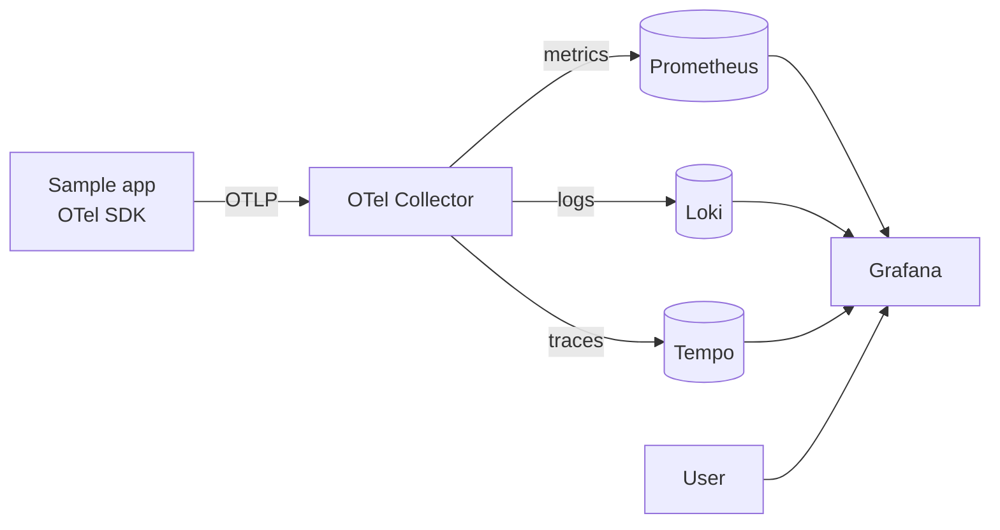

# Project 05 — Observability Stack (Metrics + Logs + Traces)

Deploy `kube-prometheus-stack`, Loki, and Tempo via Helm. Instrument a sample app with OpenTelemetry and see metrics, logs, and traces correlated in Grafana.

## What you'll build

<!-- mermaid:rendered -->
<p align="center"></p>

<details><summary>Mermaid source</summary>



</details>
## Prerequisites
- K8s cluster with at least 4 vCPU / 8 GiB free
- Helm — see [`../../06-helm/`](../../06-helm/)
- StorageClass with `WaitForFirstConsumer`
- Background reading: [`../../07-monitoring/`](../../07-monitoring/)

## Step 1 — Add Helm repos

```bash
helm repo add prometheus-community https://prometheus-community.github.io/helm-charts
helm repo add grafana              https://grafana.github.io/helm-charts
helm repo add open-telemetry       https://open-telemetry.github.io/opentelemetry-helm-charts
helm repo update
```

## Step 2 — Install kube-prometheus-stack

```bash
kubectl create namespace monitoring
helm -n monitoring install kps prometheus-community/kube-prometheus-stack \
  --version 62.6.0 \
  --set grafana.adminPassword='admin' \
  --set prometheus.prometheusSpec.retention=7d \
  --wait --timeout 10m
```

## Step 3 — Install Loki + Tempo (single-binary mode)

```bash
helm -n monitoring install loki grafana/loki \
  --version 6.16.0 \
  --set deploymentMode=SingleBinary \
  --set loki.commonConfig.replication_factor=1 \
  --set loki.storage.type=filesystem \
  --set loki.auth_enabled=false \
  --set singleBinary.replicas=1

helm -n monitoring install tempo grafana/tempo \
  --version 1.10.3
```

## Step 4 — Install the OTel Collector (deployment mode)

```bash
helm -n monitoring install otel open-telemetry/opentelemetry-collector \
  --version 0.108.0 \
  --set mode=deployment \
  --set image.repository=otel/opentelemetry-collector-contrib \
  -f - <<'EOF'
config:
  receivers:
    otlp:
      protocols:
        grpc:
          endpoint: 0.0.0.0:4317
        http:
          endpoint: 0.0.0.0:4318
  exporters:
    prometheus:
      endpoint: 0.0.0.0:8889
    otlphttp/loki:
      endpoint: http://loki:3100/otlp
    otlp/tempo:
      endpoint: tempo:4317
      tls:
        insecure: true
  service:
    pipelines:
      metrics: { receivers: [otlp], exporters: [prometheus] }
      logs:    { receivers: [otlp], exporters: [otlphttp/loki] }
      traces:  { receivers: [otlp], exporters: [otlp/tempo] }
EOF
```

## Step 5 — Open Grafana and add datasources

```bash
kubectl -n monitoring port-forward svc/kps-grafana 3000:80 &
# http://localhost:3000  — admin / admin
```

Loki and Tempo datasources should be auto-discovered; if not, add:
- Loki: `http://loki:3100`
- Tempo: `http://tempo:3100`

## Step 6 — Walk through

See [`walkthrough.md`](./walkthrough.md) for instrumenting the Project 01 app with OpenTelemetry, generating traffic, and exploring metrics → logs → traces correlation.

## Verify

```bash
kubectl -n monitoring get pods
# All Running

# Prometheus targets
kubectl -n monitoring port-forward svc/kps-prometheus 9090:9090 &
open http://localhost:9090/targets

# Sample query in Grafana Explore (Prometheus):
#   sum(rate(container_cpu_usage_seconds_total{namespace="proj01"}[5m]))
```

## Cleanup

```bash
helm -n monitoring uninstall otel tempo loki kps
kubectl delete namespace monitoring
```

## What you learned
- The three pillars: metrics, logs, traces
- OpenTelemetry Collector pipelines (receivers → processors → exporters)
- Prometheus Operator: ServiceMonitor / PodMonitor CRDs
- Datasource correlation in Grafana (TraceID linking logs ↔ traces)

## Stretch goals
- Add Alertmanager rules (`PrometheusRule` CR) for SLO burn-rate alerts
- Push Grafana dashboards via `grafana-dashboards` ConfigMap (sidecar mode)
- Replace single-binary Loki with the distributed mode + S3
- Wire up Pyroscope for continuous profiling
