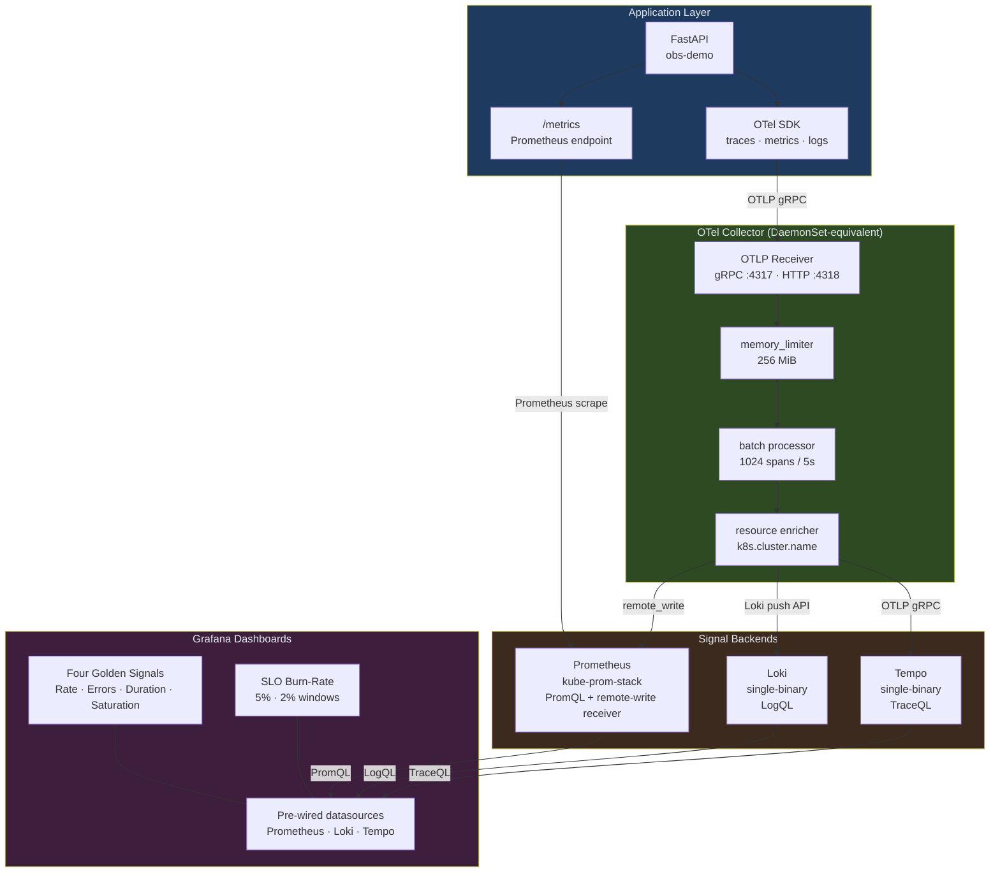
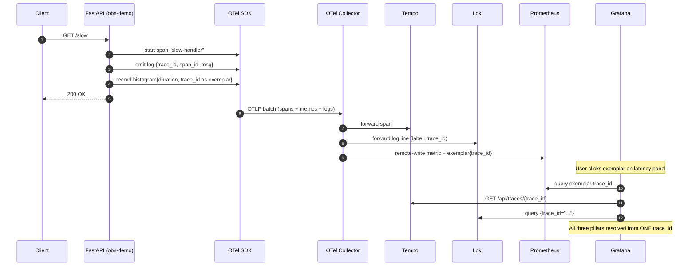

# Architecture — Project 05: Observability Stack

## Layered signal flow

## Exemplar link — the three-pillar correlation

## Design decisions

| Decision | Choice | Rationale |
|----------|--------|-----------|
| Signal transport | OTLP gRPC to OTel Collector | Vendor-neutral; Collector handles fan-out so the app has one dependency |
| Collector placement | Deployment (not DaemonSet) | Simpler in kind; upgrade to DaemonSet for node-level host metrics in production |
| Metrics path | OTel SDK → Collector → Prometheus remote-write AND direct Prometheus scrape | Dual path ensures metrics survive Collector restarts; exemplars only flow via remote-write |
| Log correlation | OTel LoggingInstrumentor patches Python `logging` to inject `trace_id` and `span_id` into every log record | Zero application code change needed; works with existing `logger.info()` calls |
| Exemplars | Histogram datapoints carry `trace_id` as an exemplar label | Enables click-to-trace from Grafana latency panels without manual search |
| Storage | Local filesystem (kind) | No object-store dependency for local development; swap to S3/GCS for production by changing `storage.type` in Tempo/Loki values |
| SLO model | Google SRE multi-window burn-rate (1h/5m + 6h/30m) | Catches both fast incident spikes and slow budget leaks; matches the Prometheus alerting standard |

## Port map

| Service | Port (forwarded) | Purpose |
|---------|-----------------|---------|
| obs-demo | 8000 | Application HTTP + `/metrics` |
| OTel Collector gRPC | 4317 | OTLP receive |
| OTel Collector HTTP | 4318 | OTLP receive (HTTP) |
| OTel Collector metrics | 8888 | Collector self-telemetry |
| Prometheus | 9090 | Query + remote-write |
| Loki | 3100 | Push + query |
| Tempo | 3200 | Trace query (Grafana) / 3100 trace ingest |
| Grafana | 3000 | Dashboards |

## Component versions

| Component | Version | Notes |
|-----------|---------|-------|
| FastAPI | 0.111.0 | ASGI, auto OTel instrumentation |
| OTel SDK (Python) | 1.24.0 | Latest stable |
| OTel Collector Contrib | 0.100.0 | Loki exporter only in contrib |
| Prometheus | 2.50+ | Via kube-prom-stack 58.x |
| Loki | 3.x | Via Helm chart 6.6.x |
| Tempo | 2.4.x | Via Helm chart 1.9.x |
| Grafana | 10.x | Via kube-prom-stack |
