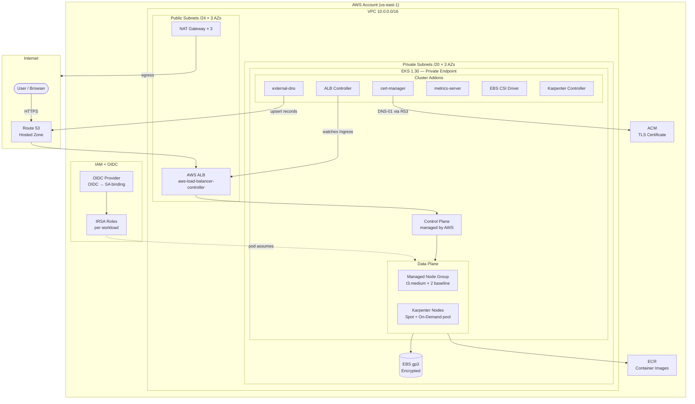
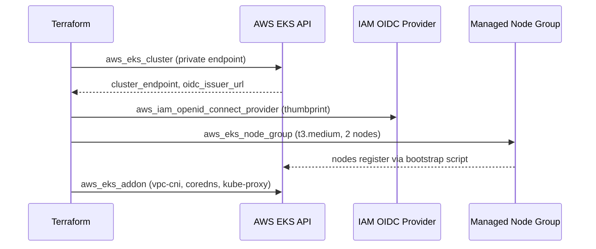
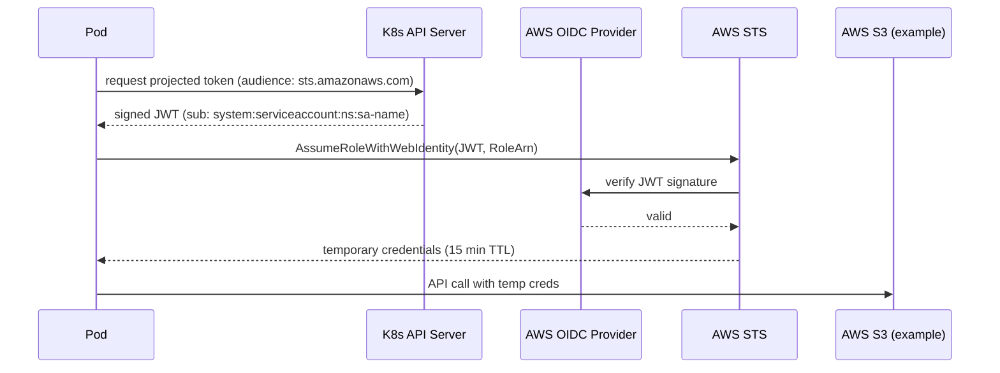
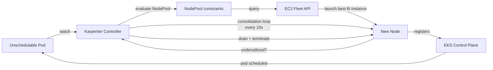
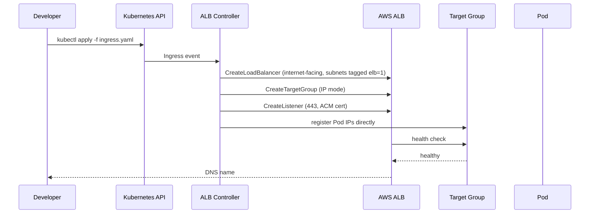

# Project 06 · Production-Grade EKS Cluster on AWS

<span class="level advanced">advanced</span>
<span class="tag">stack: terraform · aws · eks · karpenter · alb · cert-manager · irsa</span>

<p class="tagline"><em>A repeatable, opinionated, HA EKS stamp — private nodes, cost-aware autoscaling, IRSA not node IAM.</em></p>

<div class="metrics" markdown>
<span class="m"><b>Time</b> 8 h</span>
<span class="m"><b>Cost</b> ~$6–12/day (dev) / ~$25–60/day (prod)</span>
<span class="m"><b>Cluster target</b> EKS 1.30 · 3-AZ</span>
<span class="m"><b>Downtime target</b> 0ms (rolling + PDB)</span>
</div>

---

## Roadmap

<div class="roadmap" markdown>
<div class="stop" data-step="1" markdown>
#### Stage 1 — VPC Design
Three-AZ network with public/private split, NAT GW per AZ, subnet tagging for ALB auto-discovery.
</div>
<div class="stop" data-step="2" markdown>
#### Stage 2 — EKS Control Plane
Managed cluster with private endpoint, OIDC provider, managed node group as baseline capacity.
</div>
<div class="stop" data-step="3" markdown>
#### Stage 3 — IAM + IRSA
Zero standing node IAM. Every pod carries its own scoped role via ServiceAccount annotation + OIDC federation.
</div>
<div class="stop" data-step="4" markdown>
#### Stage 4 — Karpenter Node Autoscaling
NodePool + EC2NodeClass replace Cluster Autoscaler. Spot-first, consolidation on, bin-pack by CPU.
</div>
<div class="stop" data-step="5" markdown>
#### Stage 5 — ALB Ingress + cert-manager
AWS Load Balancer Controller routes HTTP/S. cert-manager issues ACM-backed TLS certs automatically.
</div>
<div class="stop" data-step="6" markdown>
#### Stage 6 — Storage (EBS CSI)
EBS CSI driver with IRSA, StorageClass `gp3`, encryption at rest, volume snapshots.
</div>
</div>

---

## Reason — why this project exists

> Plaid's infra team runs dozens of EKS clusters. Each one follows the same stamp: private nodes, IRSA per workload, Karpenter for cost-aware scaling, ALB for ingress, and cert-manager for TLS. A junior engineer spins up a new cluster in under 30 minutes because the stamp is Terraform and it is idempotent. This project teaches that stamp from first principles.

Three hard problems this design solves:

1. **Blast-radius containment** — Node IAM role has zero AWS permissions. A compromised pod can only call the AWS APIs its own ServiceAccount IRSA role allows.
2. **Cost unpredictability** — Cluster Autoscaler over-provisions by 20–40%. Karpenter's consolidation loop right-sizes nodes every few minutes.
3. **TLS toil** — Manual cert rotation causes outages. cert-manager + Route53 DNS-01 challenge rotates certificates 30 days before expiry, zero human intervention.

---

## Thinking — architecture



### Key design decisions

| Decision | Chosen approach | Why not the alternative |
|----------|----------------|------------------------|
| Node access to AWS | IRSA per pod | Node IAM role — blast radius is entire node |
| Autoscaler | Karpenter v1 NodePool | Cluster Autoscaler — slower, no consolidation |
| Ingress | AWS Load Balancer Controller | nginx ingress — adds a hop, manages its own NLB anyway |
| TLS | cert-manager + ACM DNS-01 | manual ACM import — human error, rotation outages |
| Private endpoint | Yes, bastion/VPN required | Public — EKS API exposed to internet |
| NAT topology | One NAT GW per AZ | Single NAT — single AZ failure takes all egress |

---

## Stage 1 — VPC Design

The VPC uses a **dual-tier subnet layout**. Public subnets host only the ALB and NAT gateways. Private subnets host all EKS nodes, pods, and data stores. Nothing in the private tier has a public IP.

### Subnet CIDR plan

| Subnet | AZ | CIDR | Purpose |
|--------|-----|------|---------|
| public-a | us-east-1a | 10.0.0.0/24 | ALB, NAT GW |
| public-b | us-east-1b | 10.0.1.0/24 | ALB, NAT GW |
| public-c | us-east-1c | 10.0.2.0/24 | ALB, NAT GW |
| private-a | us-east-1a | 10.0.16.0/20 | EKS nodes, pods |
| private-b | us-east-1b | 10.0.32.0/20 | EKS nodes, pods |
| private-c | us-east-1c | 10.0.48.0/20 | EKS nodes, pods |

**Required subnet tags** (ALB controller auto-discovers subnets by tag):

```hcl
# public subnets — ALB internet-facing
"kubernetes.io/role/elb" = "1"

# private subnets — ALB internal
"kubernetes.io/role/internal-elb" = "1"

# both — cluster ownership
"kubernetes.io/cluster/${cluster_name}" = "shared"
```

### Why /20 for private?

Each /20 provides 4096 IPs. With VPC CNI prefix delegation, pods get their own CIDR block and don't exhaust node subnet IPs. At 110 pods/node this gives ~37 nodes per AZ before subnet exhaustion.

---

## Stage 2 — EKS Control Plane



### Control plane security settings

```hcl
kubernetes_network_config {
  service_ipv4_cidr = "172.20.0.0/16"  # distinct from VPC range
}

endpoint_private_access = true
endpoint_public_access  = false  # set true + restrict in dev if no VPN
```

### Managed node group bootstrap

The managed node group uses the EKS-optimized AMI. Labels and taints are set via `launch_template`:

```hcl
labels = {
  "role"                         = "system"
  "node.kubernetes.io/node-type" = "managed"
}
taint {
  key    = "CriticalAddonsOnly"
  value  = "true"
  effect = "NO_SCHEDULE"
}
```

This taints system nodes so only addon pods (Karpenter, ALB controller, cert-manager) land on managed nodes. Workload pods go to Karpenter-provisioned nodes.

---

## Stage 3 — IAM + IRSA

IRSA (IAM Roles for Service Accounts) is the security core. **No workload calls AWS APIs via the node's instance profile.**



### IRSA trust policy pattern

```json
{
  "Effect": "Allow",
  "Principal": { "Federated": "arn:aws:iam::ACCOUNT:oidc-provider/oidc.eks.REGION.amazonaws.com/..." },
  "Action": "sts:AssumeRoleWithWebIdentity",
  "Condition": {
    "StringEquals": {
      "oidc.eks.REGION.amazonaws.com/...:sub": "system:serviceaccount:NAMESPACE:SERVICE_ACCOUNT",
      "oidc.eks.REGION.amazonaws.com/...:aud": "sts.amazonaws.com"
    }
  }
}
```

The `sub` condition pins the role to a specific namespace+serviceaccount. A pod in a different namespace cannot assume it even with a valid cluster token.

### IRSA roles in this project

| Component | Role | Permissions |
|-----------|------|-------------|
| AWS Load Balancer Controller | `eks-alb-controller` | `elasticloadbalancing:*`, `ec2:Describe*`, `acm:*` |
| cert-manager | `eks-cert-manager` | `route53:ChangeResourceRecordSets`, `route53:ListHostedZones` |
| external-dns | `eks-external-dns` | `route53:ChangeResourceRecordSets`, `route53:ListHostedZones` |
| EBS CSI Driver | `eks-ebs-csi` | `ec2:CreateVolume`, `ec2:AttachVolume`, `ec2:DeleteVolume`, `kms:*` |
| Karpenter | `eks-karpenter` | `ec2:RunInstances`, `ec2:TerminateInstances`, `iam:PassRole`, `eks:*` |

---

## Stage 4 — Karpenter Node Autoscaling

Karpenter replaces Cluster Autoscaler. It watches unschedulable pods directly and provisions the **right** instance type in seconds, not minutes.



### NodePool configuration strategy

```yaml
spec:
  template:
    spec:
      requirements:
        - key: karpenter.sh/capacity-type
          operator: In
          values: ["spot", "on-demand"]   # spot-first
        - key: node.kubernetes.io/instance-type
          operator: In
          values: ["m5.large","m5.xlarge","m5a.large","m5a.xlarge",
                   "m6i.large","m6i.xlarge","m6a.large"]
        - key: topology.kubernetes.io/zone
          operator: In
          values: ["us-east-1a","us-east-1b","us-east-1c"]
  disruption:
    consolidationPolicy: WhenUnderutilized
    consolidateAfter: 30s
  limits:
    cpu: "100"
    memory: 400Gi
```

**Spot interruption handling**: Karpenter watches EC2 spot interruption notices via EventBridge and proactively drains nodes 2 minutes before reclaim. PodDisruptionBudgets ensure zero dropped requests during drain.

---

## Stage 5 — ALB Ingress + cert-manager



### Ingress annotation cheatsheet

```yaml
metadata:
  annotations:
    kubernetes.io/ingress.class: alb
    alb.ingress.kubernetes.io/scheme: internet-facing
    alb.ingress.kubernetes.io/target-type: ip            # direct pod routing
    alb.ingress.kubernetes.io/certificate-arn: arn:aws:acm:...
    alb.ingress.kubernetes.io/ssl-redirect: "443"
    alb.ingress.kubernetes.io/healthcheck-path: /healthz
    alb.ingress.kubernetes.io/load-balancer-attributes: |
      access_logs.s3.enabled=true,
      idle_timeout.timeout_seconds=60
```

### cert-manager DNS-01 flow

cert-manager uses Route53 DNS-01 challenge. No inbound HTTP required. Works for private clusters.

```
cert-manager → creates CertificateRequest
→ creates _acme-challenge TXT record in Route53
→ Let's Encrypt validates
→ cert-manager stores certificate in Kubernetes Secret
→ ALB Controller reads Secret ARN from annotation
```

---

## Stage 6 — Storage: EBS CSI Driver

```mermaid
flowchart LR
  PVC[PersistentVolumeClaim\ngp3 / 20Gi] --> SC[StorageClass\nebs-gp3-enc]
  SC --> CSI[EBS CSI Driver\nDaemonSet on every node]
  CSI --> IRSA2[IRSA Role\neks-ebs-csi]
  IRSA2 --> EC2API[EC2 CreateVolume API]
  EC2API --> EBSVol[(EBS Volume\ngp3 / encrypted / same AZ)]
  EBSVol --> CSI
  CSI --> Mount[/dev/xvdf mounted\nin pod]
```

### StorageClass definition

```yaml
apiVersion: storage.k8s.io/v1
kind: StorageClass
metadata:
  name: ebs-gp3-enc
  annotations:
    storageclass.kubernetes.io/is-default-class: "true"
provisioner: ebs.csi.aws.com
parameters:
  type: gp3
  encrypted: "true"
  throughput: "125"
  iops: "3000"
volumeBindingMode: WaitForFirstConsumer  # schedules pod first, then creates volume in same AZ
reclaimPolicy: Retain                    # safety: don't delete volume on PVC delete
allowVolumeExpansion: true
```

**`WaitForFirstConsumer`** is critical. Without it, the volume creates in a random AZ and the pod can't start if scheduled in a different AZ.

---

## Execution — run it

```bash
# 1. Bootstrap remote state (one-time)
cp infra/terraform/backend-s3.tf.example infra/terraform/backend-s3.tf
# edit: bucket name, region, key prefix

# 2. Dev environment
make plan-dev          # terraform plan for dev
make apply-dev         # terraform apply (approx 20 min)
make kubeconfig        # aws eks update-kubeconfig

# 3. Verify cluster
kubectl get nodes -o wide
kubectl get pods -A

# 4. Cost estimate
make cost              # runs infracost

# 5. Security scan (pre-apply)
make tflint
make checkov

# 6. Destroy when done
make destroy-dev
```

---

## Simulation — what you'll see

<pre class="sim"><code><span class="prompt">$</span> make apply-dev
<span class="comment"># module.vpc.aws_vpc.main: Creating...</span>
<span class="comment"># module.vpc.aws_nat_gateway.main[0]: Still creating... [30s elapsed]</span>
<span class="comment"># module.eks.aws_eks_cluster.main: Still creating... [8m0s elapsed]</span>
<span class="comment"># module.eks.aws_eks_cluster.main: Creation complete after 10m22s</span>
<span class="comment"># module.addons.helm_release.aws_load_balancer_controller: Creation complete after 45s</span>
<span class="comment"># Apply complete! Resources: 87 added, 0 changed, 0 destroyed.</span>

<span class="prompt">$</span> make kubeconfig
<span class="comment"># Updated context arn:aws:eks:us-east-1:123456789:cluster/dev-eks in ~/.kube/config</span>

<span class="prompt">$</span> kubectl get nodes -o wide
<span class="comment"># NAME                         STATUS   ROLES    AGE   VERSION   INSTANCE-TYPE</span>
<span class="comment"># ip-10-0-16-42.ec2.internal   Ready    none     3m    v1.30.0   t3.medium</span>
<span class="comment"># ip-10-0-32-18.ec2.internal   Ready    none     3m    v1.30.0   t3.medium</span>

<span class="prompt">$</span> kubectl get pods -n kube-system
<span class="comment"># NAME                                  READY   STATUS    RESTARTS</span>
<span class="comment"># aws-load-balancer-controller-xxx       2/2     Running   0</span>
<span class="comment"># cert-manager-xxx                       1/1     Running   0</span>
<span class="comment"># ebs-csi-controller-xxx                 6/6     Running   0</span>
<span class="comment"># karpenter-xxx                          2/2     Running   0</span>
</code></pre>

---

## Output — state change (scale event)

<div class="flow" markdown>

<div class="state before" markdown>
##### Before burst
<span class="diff-del">2 nodes · t3.medium</span>
Pending pods: 0
Cost: ~$2.40/day
</div>

<div class="arrow">→</div>

<div class="state during" markdown>
##### Karpenter provisioning
<span class="diff-mod">2 managed + 3 spot m5.large launching</span>
Pending pods draining to new nodes
Spot price: 70% cheaper than on-demand
</div>

<div class="arrow">→</div>

<div class="state after" markdown>
##### Consolidated (30 min idle)
<span class="diff-add">2 nodes · m5.large consolidated</span>
Pending pods: 0
Cost: ~$3.10/day · zero manual action
</div>

</div>

---

## Real-world use case

<div class="usecase-card" markdown>
**At Robinhood**, the platform team runs a fleet of EKS clusters with this exact IRSA-first posture. After a 2021 security review found that 23% of pods had access to unneeded S3 buckets via the node role, they migrated to per-workload IRSA. Blast radius of a hypothetical pod escape dropped from "access to all company S3" to "access to exactly one bucket." Karpenter was adopted in 2023 to reduce cluster compute spend by 34% through Spot consolidation.
</div>

---

## QA engineer's test plan

See [`tests/qa-plan.md`](./tests/qa-plan.md). Summary:

| Phase | Test | Tool | Pass criteria |
|-------|------|------|---------------|
| Pre-apply | Terraform lint | tflint | 0 warnings |
| Pre-apply | Policy-as-code | checkov | 0 HIGH/CRITICAL |
| Pre-apply | Secret scan | tfsec | 0 secrets in state |
| Post-apply | Nodes ready | kubectl | All nodes STATUS=Ready |
| Post-apply | CoreDNS resolves | kubectl exec nslookup | Returns cluster IP |
| Post-apply | ALB controller running | kubectl get pods | 2/2 Running |
| Post-apply | Karpenter running | kubectl get pods | 2/2 Running |
| Post-apply | cert-manager running | kubectl get pods | 1/1 Running |
| Functional | Deploy test pod | kubectl apply | Pod reaches Running |
| Functional | PVC mounts gp3 | kubectl apply PVC | Bound + pod writes file |
| Functional | Karpenter scales | kubectl apply burst-deploy | New nodes appear < 60s |
| Functional | Spot drain | simulate interruption | Pod rescheduled, 0 errors |
| Security | IRSA tokens | kubectl exec + aws sts | Correct assumed role |
| Security | Node IAM | kubectl exec + curl IMDS | No credentials returned |
| Chaos | Kill managed node | AWS console terminate | Replacement nodes appear |
| Chaos | AZ failure | block AZ subnet | Traffic routes to remaining AZs |

---

## Files in this project

| File | Purpose |
|------|---------|
| `infra/terraform/main.tf` | Root module, wires all child modules |
| `infra/terraform/providers.tf` | AWS + Kubernetes + Helm providers |
| `infra/terraform/versions.tf` | Provider version constraints |
| `infra/terraform/variables.tf` | All input variables |
| `infra/terraform/outputs.tf` | Cluster endpoint, OIDC, kubeconfig command |
| `infra/terraform/modules/vpc/` | 3-AZ VPC, subnets, NAT GW, route tables |
| `infra/terraform/modules/eks/` | EKS cluster, OIDC provider, managed node group |
| `infra/terraform/modules/karpenter/` | Karpenter controller + NodePool + EC2NodeClass |
| `infra/terraform/modules/addons/` | Helm releases: ALB controller, cert-manager, external-dns, EBS CSI |
| `infra/terraform/environments/dev/` | Dev tfvars: t3.medium, 2 nodes |
| `infra/terraform/environments/prod/` | Prod tfvars: m5.xlarge, multi-AZ, PDB |
| `infra/terraform/backend-s3.tf.example` | Remote state template |
| `Makefile` | plan-dev / apply-dev / destroy-dev / kubeconfig / cost / tflint / checkov |
| `tests/qa-plan.md` | Full QA checklist |
| `COST.md` | Monthly estimate + cost tips |
| `architecture.md` | Deep-dive layered diagram |

---

## Further reading

- Architecture deep-dive: [`architecture.md`](./architecture.md)
- QA plan: [`tests/qa-plan.md`](./tests/qa-plan.md)
- Cost analysis: [`COST.md`](./COST.md)
- AWS EKS Best Practices Guide: https://aws.github.io/aws-eks-best-practices/
- Karpenter docs: https://karpenter.sh/docs/
- AWS Well-Architected Security Pillar: https://docs.aws.amazon.com/wellarchitected/latest/security-pillar/
