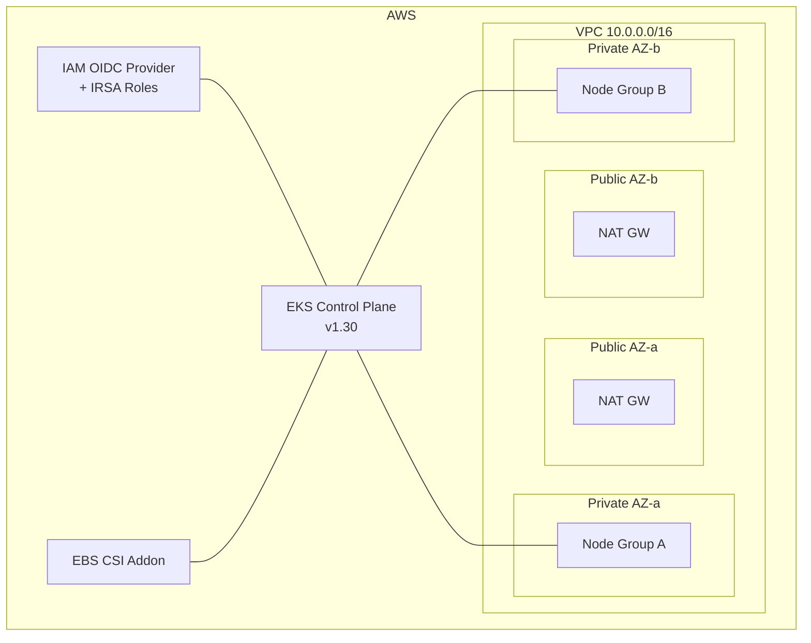

# Project 06 — Production-Grade Cluster on AWS (EKS via Terraform)

Stand up a real EKS cluster with Terraform: VPC, managed node groups, addons (vpc-cni, coredns, kube-proxy, ebs-csi), IRSA, then install ArgoCD and the observability stack via Helm.

## What you'll build

<!-- mermaid:rendered -->
<p align="center"></p>

<details><summary>Mermaid source</summary>

<!-- mermaid:rendered -->
<p align="center"></p>

<details><summary>Mermaid source</summary>

<!-- mermaid:rendered -->
<p align="center"></p>

<details><summary>Mermaid source</summary>



</details>

</details>

</details>

## Prerequisites
- AWS account + `aws configure` working (`aws sts get-caller-identity`)
- Terraform >= 1.6 — see [`../../09-terraform/`](../../09-terraform/)
- `kubectl`, `helm`, `eksctl` (optional)
- ~$1/hr while running. **Destroy when done.**

## Step 1 — Provision

```bash
cd 06-prod-grade-cluster-on-aws/terraform
terraform init
terraform plan -out tfplan
terraform apply tfplan
```

Takes 15-20 minutes. When done:

```bash
aws eks update-kubeconfig --region us-east-1 --name $(terraform output -raw cluster_name)
kubectl get nodes
# Should show 2-3 nodes Ready
```

## Step 2 — Verify addons

```bash
aws eks list-addons --cluster-name $(terraform output -raw cluster_name) --region us-east-1
# vpc-cni, coredns, kube-proxy, aws-ebs-csi-driver

kubectl -n kube-system get pods
kubectl get sc                     # gp3 should be present + default
```

## Step 3 — Post-install (ArgoCD + observability)

See [`post-install.md`](./post-install.md) for the full script. Quick:

```bash
# ArgoCD
kubectl create namespace argocd
kubectl apply -n argocd -f https://raw.githubusercontent.com/argoproj/argo-cd/v2.12.4/manifests/install.yaml

# Observability
helm repo add prometheus-community https://prometheus-community.github.io/helm-charts
helm install kps prometheus-community/kube-prometheus-stack \
  -n monitoring --create-namespace \
  --set grafana.adminPassword='admin' --wait
```

## Step 4 — IRSA test (pod assumes IAM role for S3)

```bash
# Already created by Terraform: an IAM role for the 'app-s3-reader' SA
kubectl apply -f - <<'EOF'
apiVersion: v1
kind: ServiceAccount
metadata:
  name: app-s3-reader
  namespace: default
  annotations:
    eks.amazonaws.com/role-arn: REPLACE_WITH_TF_OUTPUT
---
apiVersion: v1
kind: Pod
metadata: { name: aws-cli, namespace: default }
spec:
  serviceAccountName: app-s3-reader
  containers:
    - name: aws
      image: amazon/aws-cli:2.17.20
      command: ["sleep", "3600"]
EOF

kubectl exec -it aws-cli -- aws s3 ls   # works, no creds embedded
```

## Cleanup

```bash
# Helm + ArgoCD
helm -n monitoring uninstall kps
kubectl delete namespace argocd monitoring

# Critical: destroy AWS resources
cd terraform
terraform destroy -auto-approve
```

## What you learned
- Production VPC topology (public + private subnets, multi-AZ, NAT)
- EKS managed control plane + managed node groups
- EKS addon lifecycle (vpc-cni, coredns, kube-proxy, ebs-csi)
- IRSA: pods assume IAM roles via OIDC, no static creds
- Layered tooling: Terraform for infra, Helm/ArgoCD for apps

## Stretch goals
- Add Karpenter for autoscaling (replace MNG with NodePool CRDs)
- Use Fargate profiles for serverless pods
- Replace single VPC with hub-and-spoke + Transit Gateway
- Add private API endpoint + bastion host (Session Manager)
- Pin to a specific Kubernetes version and run an upgrade

## Related
- See [`../../09-terraform/02-modules/`](../../09-terraform/) for module patterns
- See [`../../05-kubernetes-advanced/01-irsa-and-oidc/`](../../05-kubernetes-advanced/) for IRSA deep-dive
