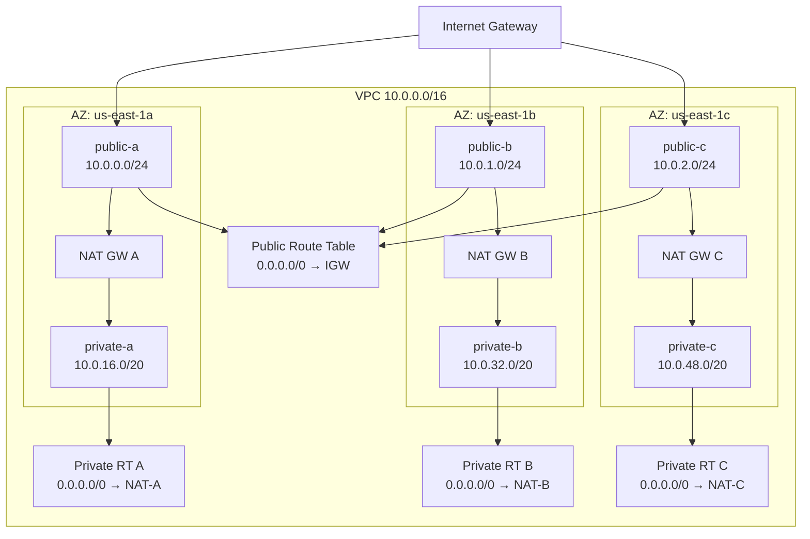
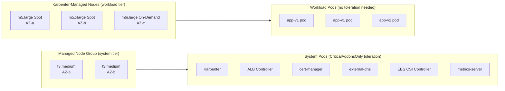
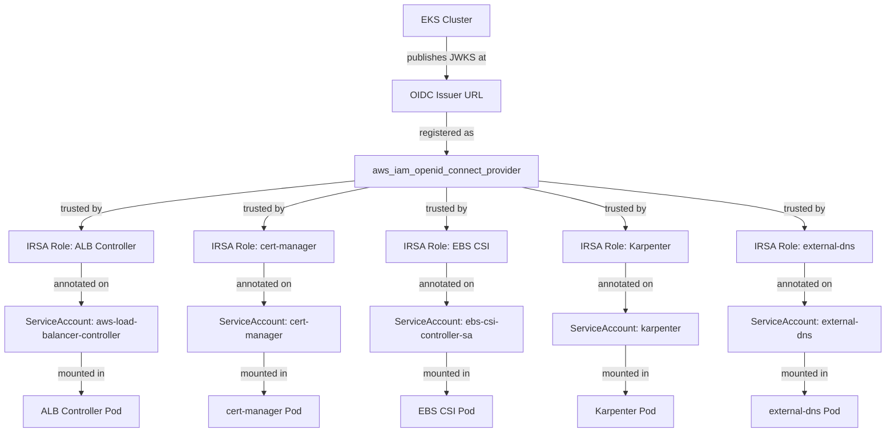
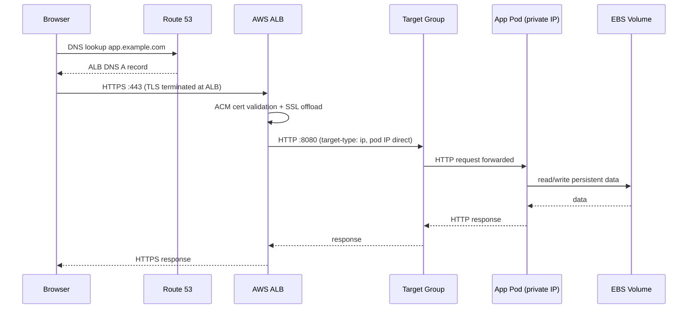
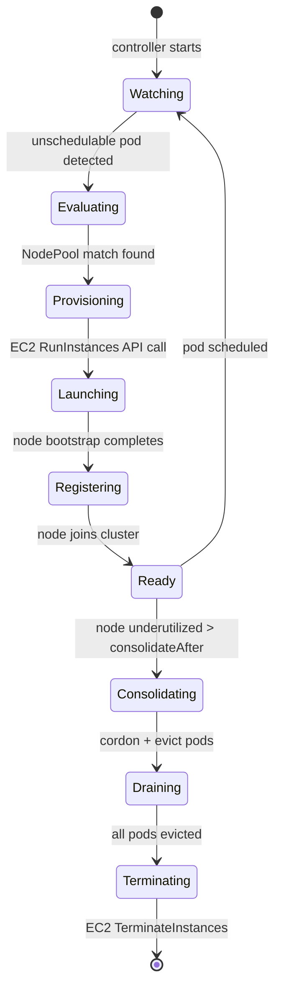
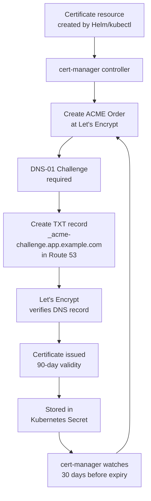
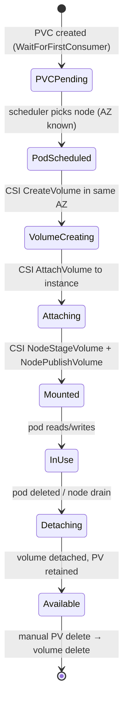

# Architecture Deep-Dive — Project 06: Production-Grade EKS

This document layers the architecture from the outermost boundary (AWS account) to the innermost (workload pod). Read top-to-bottom to understand how a request travels from a browser to a pod and back.

---

## Layer 1 — Network boundary (VPC)



**Design notes:**
- Three independent NAT Gateways — if AZ-A fails, AZ-B and AZ-C egress is unaffected.
- Private subnets use /20 (4096 IPs each) to support up to ~37 nodes at 110 pods/node with AWS VPC CNI default mode.
- Public subnets are /24 (256 IPs) — they only host ALB ENIs and NAT EIPs, which need few addresses.

---

## Layer 2 — EKS data plane topology



**Taint isolation**: managed nodes carry `CriticalAddonsOnly=true:NoSchedule`. Only pods with the matching toleration (addons) land there. Workload pods go exclusively to Karpenter nodes.

---

## Layer 3 — IAM + OIDC trust chain



---

## Layer 4 — Request path (browser → pod)



**No extra hops.** `target-type: ip` means the ALB routes directly to pod IPs. There is no NodePort or kube-proxy in the request path.

---

## Layer 5 — Karpenter provisioning loop



---

## Layer 6 — cert-manager TLS lifecycle



---

## Layer 7 — EBS CSI volume lifecycle



---

## Security boundaries summary

```text
┌──────────────────────────────────────────────────────────────────┐
│  AWS Account Boundary                                            │
│  ┌────────────────────────────────────────────────────────────┐  │
│  │  VPC Boundary — all EKS traffic is private                 │  │
│  │  ┌──────────────────────────────────────────────────────┐  │  │
│  │  │  EKS Cluster — private API endpoint                  │  │  │
│  │  │  ┌────────────────────┐  ┌──────────────────────┐   │  │  │
│  │  │  │  System Nodes      │  │  Workload Nodes      │   │  │  │
│  │  │  │  (managed, tainted)│  │  (Karpenter, spot)   │   │  │  │
│  │  │  │  • ALB Controller  │  │  • App pods          │   │  │  │
│  │  │  │  • cert-manager    │  │  • IRSA per pod      │   │  │  │
│  │  │  │  • Karpenter       │  │  • No node IAM       │   │  │  │
│  │  │  └────────────────────┘  └──────────────────────┘   │  │  │
│  │  │  Node IAM role: zero AWS permissions                  │  │  │
│  │  └──────────────────────────────────────────────────────┘  │  │
│  └────────────────────────────────────────────────────────────┘  │
└──────────────────────────────────────────────────────────────────┘
```

| Boundary | Control |
|----------|---------|
| Internet → VPC | Security Groups + NACLs |
| Public → Private subnet | No route except through NAT (outbound) / ALB (inbound) |
| Pod → AWS APIs | IRSA only — node instance profile has no permissions |
| Pod → Pod | Network Policy (recommend Calico or VPC CNI network policy) |
| Control plane → nodes | EKS-managed ENI in node subnet, port 443 + 10250 |
