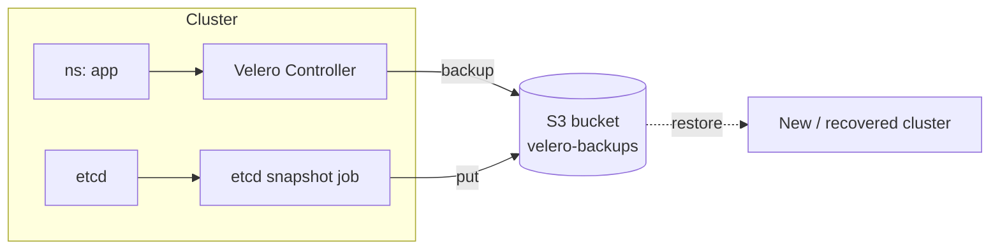

# Project 07 — Disaster Recovery (Velero + etcd snapshots + Multi-AZ)

Practice losing things. Back up cluster state with Velero, snapshot etcd, run in multi-AZ, and execute recovery drills.

## What you'll build

<!-- mermaid:rendered -->
<p align="center"></p>

<details><summary>Mermaid source</summary>

<!-- mermaid:rendered -->
<p align="center"></p>

<details><summary>Mermaid source</summary>

<!-- mermaid:rendered -->
<p align="center"></p>

<details><summary>Mermaid source</summary>



</details>

</details>

</details>

## Prerequisites
- Project 06 cluster running (or any EKS cluster)
- AWS CLI + S3 bucket creation rights
- Velero CLI: `brew install velero` (or download release)

## Step 1 — Create the backup bucket + IAM

```bash
export REGION=us-east-1
export BUCKET=velero-backups-$(date +%s)
aws s3api create-bucket --bucket $BUCKET --region $REGION

# Enable versioning (so a delete is recoverable)
aws s3api put-bucket-versioning --bucket $BUCKET \
  --versioning-configuration Status=Enabled
```

## Step 2 — Install Velero (with IRSA)

See [`velero-install.md`](./velero-install.md) for the full IAM/IRSA wiring. Quickstart with static credentials (dev only):

```bash
cat > credentials-velero <<EOF
[default]
aws_access_key_id=$AWS_ACCESS_KEY_ID
aws_secret_access_key=$AWS_SECRET_ACCESS_KEY
EOF

velero install \
  --provider aws \
  --plugins velero/velero-plugin-for-aws:v1.10.0 \
  --bucket $BUCKET \
  --backup-location-config region=$REGION \
  --snapshot-location-config region=$REGION \
  --secret-file ./credentials-velero \
  --use-node-agent

kubectl -n velero wait --for=condition=available deploy/velero --timeout=180s
```

## Step 3 — Take a backup

```bash
# Deploy something to back up
kubectl create ns proj07-demo
kubectl -n proj07-demo create deploy nginx --image=nginx:1.27-alpine
kubectl -n proj07-demo expose deploy nginx --port=80

velero backup create demo-1 --include-namespaces proj07-demo
velero backup describe demo-1 --details
velero backup logs demo-1
```

## Step 4 — Disaster drill: nuke and restore

```bash
kubectl delete namespace proj07-demo
kubectl get ns proj07-demo                    # NotFound

velero restore create --from-backup demo-1
velero restore describe demo-1-<TAB>

kubectl -n proj07-demo get all                # nginx is back
```

## Step 5 — Schedule recurring backups

```bash
velero schedule create daily-all \
  --schedule="0 2 * * *" \
  --ttl 168h \
  --exclude-namespaces kube-system,velero
velero schedule get
```

## Step 6 — etcd snapshot (self-managed clusters only)

EKS abstracts etcd — AWS handles snapshots. For kubeadm clusters:

```bash
ETCDCTL_API=3 etcdctl \
  --endpoints=https://127.0.0.1:2379 \
  --cacert=/etc/kubernetes/pki/etcd/ca.crt \
  --cert=/etc/kubernetes/pki/etcd/server.crt \
  --key=/etc/kubernetes/pki/etcd/server.key \
  snapshot save /var/backups/etcd-$(date +%F).db

# Restore (offline procedure)
etcdutl snapshot restore /var/backups/etcd-2025-04-26.db \
  --data-dir /var/lib/etcd-restore
```

## Step 7 — Multi-AZ verification

```bash
kubectl get nodes -L topology.kubernetes.io/zone
# At least 2 distinct zones

# Pod spread test
kubectl apply -f - <<'EOF'
apiVersion: apps/v1
kind: Deployment
metadata: { name: spread-test }
spec:
  replicas: 6
  selector: { matchLabels: { app: spread-test } }
  template:
    metadata: { labels: { app: spread-test } }
    spec:
      topologySpreadConstraints:
        - maxSkew: 1
          topologyKey: topology.kubernetes.io/zone
          whenUnsatisfiable: DoNotSchedule
          labelSelector: { matchLabels: { app: spread-test } }
      containers:
        - name: pause
          image: registry.k8s.io/pause:3.10
EOF

kubectl get pods -l app=spread-test -o wide
# Pods should distribute evenly across zones
```

## Cleanup

```bash
velero schedule delete daily-all --confirm
velero backup delete demo-1 --confirm
velero uninstall --force
kubectl delete deploy spread-test
aws s3 rb s3://$BUCKET --force
```

## What you learned
- Velero backup/restore lifecycle and scheduling
- etcd snapshot mechanics (and why EKS users don't worry about it)
- Topology spread for AZ-tolerant workloads
- Recovery drills as a first-class practice (not a one-time task)

## Stretch goals
- Cross-region backup replication (S3 CRR)
- Restore into a brand-new cluster (full DR rehearsal)
- Use Velero hooks for app-consistent DB snapshots (`pg_dump` pre-backup)
- Add chaos: kill a node group entirely (`aws autoscaling terminate-instance-in-auto-scaling-group`) and measure RTO

## Related
- See [`../../05-kubernetes-advanced/04-storage/`](../../05-kubernetes-advanced/) for CSI snapshots
- See [`../../07-monitoring/`](../../07-monitoring/) for backup-success alerting
