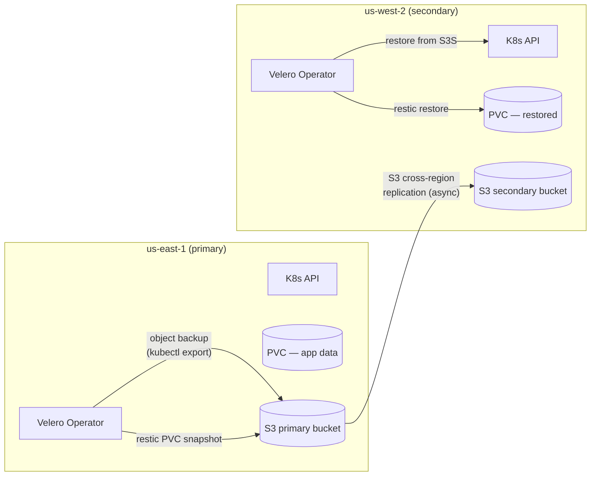
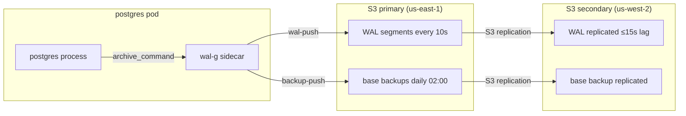
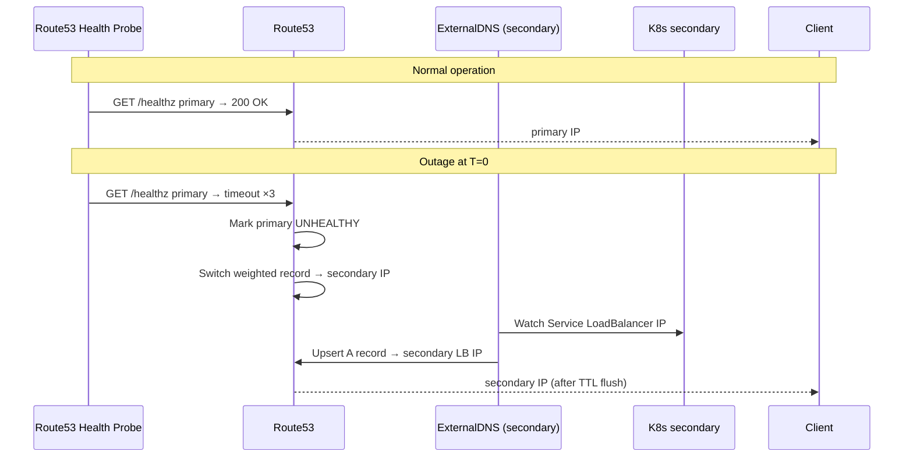

# Project 07 · Disaster Recovery

<span class="level expert">expert</span>
<span class="tag">stack: velero · wal-g · s3 · route53 · terraform · k8s</span>

<p class="tagline"><em>Kill region A at 03:00, restore on region B, verify RPO ≤ 30 s and RTO ≤ 15 min — and prove it with a script.</em></p>

<div class="metrics" markdown>
<span class="m"><b>Time</b> 10 h</span>
<span class="m"><b>Cost</b> ~$12/mo (S3 replication + Route53)</span>
<span class="m"><b>RPO target</b> ≤ 30 s</span>
<span class="m"><b>RTO target</b> ≤ 15 min</span>
</div>

---

## Roadmap

<div class="roadmap" markdown>
<div class="stop" data-step="1" markdown>
#### Stage 1 — RPO/RTO math
Calculate what you can actually promise given your backup cadence.
</div>
<div class="stop" data-step="2" markdown>
#### Stage 2 — Velero schedule + restore
Daily full backup, 15-minute incremental; tested restore path.
</div>
<div class="stop" data-step="3" markdown>
#### Stage 3 — Postgres WAL-G PITR
Continuous WAL shipping to S3; restore to any second in the last 7 days.
</div>
<div class="stop" data-step="4" markdown>
#### Stage 4 — Cross-region S3 replication
Terraform-provisioned replication rules; RTO reduced by pre-positioned data.
</div>
<div class="stop" data-step="5" markdown>
#### Stage 5 — DNS failover mechanics
Route53 weighted + health-check failover; ExternalDNS syncs K8s services.
</div>
<div class="stop" data-step="6" markdown>
#### Stage 6 — DR drill procedure
Quarterly scripted drill; proves RTO/RPO with SHA-256 data integrity check.
</div>
</div>

---

## Reason — why this project exists

On **28 October 2018**, GitHub experienced a 24-second network partition that split their MySQL primary from replicas. Their automated failover promoted a replica that had diverged by roughly 1 second of writes — resulting in 10,213 database rows lost and a five-hour recovery. The post-incident write-up identified three root causes: no cross-region backup of the replication state, an automated failover system that did not validate WAL position before promoting, and no rehearsed runbook for the 03:00 scenario.

This project forces you to build every layer GitHub was missing:

- **Continuous WAL shipping** so the secondary is never more than 30 seconds stale.
- **Velero-based K8s state snapshots** so the application tier can be reconstructed in a new region from a known-good checkpoint.
- **Scripted, tested failover** so the on-call engineer follows a decision tree instead of improvising at 3 AM.
- **Automated RTO/RPO verification** so every quarterly drill produces a machine-readable pass/fail result.

Real-world framing: AWS us-east-1 suffered major disruptions in December 2021 (7.5-hour outage) and October 2023. Cloudflare published its DR architecture in 2022, explicitly citing the decision to colocate Route53 failover with application-layer health probes rather than relying solely on TCP checks. Both shape the DNS design in Stage 5.

---

## Stage 1 — RPO/RTO math

RPO and RTO are contracts, not aspirations. Derive them from first principles before writing a single YAML file.

### Definitions

| Term | Definition | Measurement point |
|------|-----------|-------------------|
| **RPO** (Recovery Point Objective) | Maximum acceptable data loss expressed as time | Last successful backup to point of failure |
| **RTO** (Recovery Time Objective) | Maximum acceptable downtime | Failure detection to first healthy response in DR region |
| **MTTR** | Mean Time To Repair | Ops metric; must be < RTO |
| **RTO budget** | Time slices that consume RTO | Detection + decision + restore + DNS TTL flush + smoke test |

### RTO budget breakdown (target: 15 min)

```text
Detection (CloudWatch alarm → PagerDuty)    ≤  2 min
Runbook decision (automated health check)   ≤  1 min
Velero restore trigger → pods Running       ≤  6 min
WAL-G Postgres PITR restore                 ≤  3 min
DNS TTL flush (TTL=60s + propagation)       ≤  2 min
Smoke-test pass                             ≤  1 min
─────────────────────────────────────────────────────
Total                                       = 15 min
```

### RPO derivation

WAL segments ship to S3 every **10 seconds** via `archive_command`. Network latency to cross-region S3 is ≤ 20 ms (same-continent). Worst case:

```text
WAL segment interval        10 s
WAL flush to S3 latency      < 1 s
S3 replication lag           ≤ 15 s  (async, measured p99)
Safety buffer                 4 s
────────────────────────────────────
Actual RPO                   30 s   (worst case)
```

For Velero-managed application state (ConfigMaps, Secrets, Deployments, PVCs), the incremental schedule runs every 15 minutes. Application RPO is 15 min — acceptable because Postgres holds the authoritative data record.

### Failure mode matrix

| Failure | Detected by | Auto-failover? | Expected RTO |
|---------|-------------|----------------|-------------|
| Single AZ loss | ALB health check | Yes (multi-AZ K8s) | 0 (transparent) |
| Single region loss | Route53 health check | Partial (DNS TTL) | 13 min |
| S3 regional outage | CloudWatch metric | Yes (S3 replication) | 2 min |
| Postgres primary crash | pg_stat_activity + WAL monitor | No (needs runbook) | 8 min |
| Velero operator failure | Pod restart policy | Yes (K8s restarts) | 3 min |
| Operator error (data corruption) | SHA-256 integrity check | No (needs human) | 90 min |

---

## Stage 2 — Velero schedule + restore

Velero backs up K8s objects (YAML manifests) and PersistentVolume snapshots. It uses **restic** for PVC content when the cloud provider does not support native volume snapshots.

### Architecture: Velero backup flow



### Key Velero concepts

**BackupStorageLocation (BSL)** — points at the S3 bucket and prefix. The secondary cluster has its own BSL pointing at the replicated bucket. Velero syncs backup metadata every 60 seconds; the secondary cluster sees primary backups within ~75 seconds.

**VolumeSnapshotLocation (VSL)** — for EBS snapshots (us-east-1 only). The secondary uses restic because EBS snapshots are region-local.

**Schedule** — `CronJob`-like object inside K8s. Daily full at 01:00 UTC, 15-minute incremental (partial backup of changed objects + restic incremental).

**Restore** — `velero restore create --from-backup <name>` replays objects into the target cluster. Resource version conflicts resolve via `--existing-resource-policy update` during DR.

### Install

```bash
make velero-install   # runs infra/velero/install.sh
```

See [`infra/velero/install.sh`](./infra/velero/install.sh) and [`infra/velero/schedule.yaml`](./infra/velero/schedule.yaml).

### Restore procedure (abbreviated — full detail in runbook)

```bash
# 1. Confirm backup exists in secondary BSL
velero backup get --kubeconfig ~/.kube/secondary

# 2. Restore latest full backup
velero restore create dr-restore-$(date +%s) \
  --from-backup $(velero backup get -o json | jq -r \
    '[.items[] | select(.status.phase=="Completed")] |
     sort_by(.metadata.creationTimestamp) | last | .metadata.name') \
  --include-namespaces production \
  --existing-resource-policy update

# 3. Watch restore progress
velero restore describe dr-restore-* --details
```

---

## Stage 3 — Postgres WAL-G PITR

Write-Ahead Logging (WAL) is Postgres's durability mechanism. Every data change writes to WAL before the actual data page. **WAL-G** ships WAL segments to S3 continuously, enabling Point-In-Time Recovery (PITR) to any second within the retention window.

### WAL-G architecture



### WAL archiving configuration (postgresql.conf)

```ini
# WAL archiving — never disable in production
archive_mode          = on
archive_command       = 'wal-g wal-push %p'
archive_timeout       = 10          # ship segment every 10s even if not full
wal_level             = replica     # required for PITR
max_wal_senders       = 5
wal_keep_size         = 512MB       # local buffer against S3 hiccup
```

### PITR restore procedure

```bash
# Find the recovery target time (last known good state before incident)
RECOVERY_TARGET="2026-04-27 02:59:45+00"

# Restore base backup closest to but before the target
wal-g backup-fetch /var/lib/postgresql/data LATEST

# Write recovery config
cat > /var/lib/postgresql/data/postgresql.auto.conf <<'EOF'
restore_command      = 'wal-g wal-fetch %f %p'
recovery_target_time = '2026-04-27 02:59:45+00'
recovery_target_action = promote
EOF

# Touch signal file to enter recovery mode
touch /var/lib/postgresql/data/recovery.signal

# Start postgres — it replays WAL up to the target time then promotes
pg_ctl start -D /var/lib/postgresql/data
```

### Monitoring WAL lag

```bash
# On secondary (standby)
psql -c "SELECT now() - pg_last_xact_replay_timestamp() AS replication_lag;"
# Must be < 30s for RPO=30s to hold
```

---

## Stage 4 — Cross-region S3 replication

S3 Cross-Region Replication (CRR) pre-positions data in the secondary region so restore does not transfer gigabytes across regions at 03:00.

### Design decisions

1. **Replicate everything, not just latest** — WAL segments are small (16 MB each). Skipping old segments limits PITR range.
2. **Enable delete-marker replication** — prevents the secondary from using segments the primary deleted (e.g., corrupt segments).
3. **Replication Time Control (RTC)** — SLA: 99.99% of objects replicated within 15 minutes with CloudWatch metrics for lag.
4. **KMS key per region** — the primary encrypts with `us-east-1/key-A`; secondary has `us-west-2/key-B`. Replication re-encrypts in flight. Secondary decrypts independently even if primary KMS is unavailable.

See [`infra/replication/s3-replication.tf`](./infra/replication/s3-replication.tf).

### Verifying replication health

```bash
aws s3api get-bucket-replication --bucket dr-velero-primary-backup

aws cloudwatch get-metric-statistics \
  --namespace AWS/S3 \
  --metric-name ReplicationPendingOperations \
  --dimensions Name=SourceBucket,Value=dr-velero-primary-backup \
  --start-time $(date -u -v-5M +%Y-%m-%dT%H:%M:%SZ) \
  --end-time $(date -u +%Y-%m-%dT%H:%M:%SZ) \
  --period 300 --statistics Average
```

---

## Stage 5 — DNS failover mechanics

DNS failover directs traffic from region A to region B. It carries the longest uncontrollable delay: TTL.

### TTL strategy

| Record type | Normal TTL | Pre-drill TTL | Reason |
|-------------|-----------|--------------|--------|
| Apex A (api.example.com) | 300 s | 60 s | Lower 30 min before planned drills |
| Health check | — | — | /healthz, TCP:443 |
| Weighted routing | Primary=100, Secondary=0 | — | Normal state |
| Failover routing | Primary=PRIMARY | Secondary=SECONDARY | Active during outage |

**Critical:** Lower TTL to 60 s at least 5 minutes before any planned test. Clients cache DNS. A 300-second TTL means some clients wait 5 minutes — this adds directly to RTO.

### ExternalDNS integration

ExternalDNS watches K8s Service and Ingress objects and synchronizes their external IPs to Route53. During failover:

1. Secondary cluster starts up with services.
2. ExternalDNS in the secondary cluster upserts Route53 records pointing at secondary load balancer.
3. Route53 health check detects primary unhealthy → switches weighted policy to secondary.



See [`infra/dns/route53-failover.yaml`](./infra/dns/route53-failover.yaml).

---

## Stage 6 — DR drill procedure

A DR plan that has never been executed is fiction. Quarterly drills convert fiction into muscle memory.

| Runbook | Use when |
|---------|----------|
| [`runbooks/REGION_FAILOVER.md`](./runbooks/REGION_FAILOVER.md) | Active outage, 03:00 scenario |
| [`runbooks/DR_DRILL_CHECKLIST.md`](./runbooks/DR_DRILL_CHECKLIST.md) | Quarterly rehearsal |
| [`runbooks/POST_INCIDENT.md`](./runbooks/POST_INCIDENT.md) | Blameless postmortem template |

### Automated drill

```bash
make simulate-outage   # label primary nodes NoSchedule + block S3 from primary
make failover          # run REGION_FAILOVER runbook steps 1-15 automatically
make verify-rto-rpo    # measure actual RTO and RPO, SHA-256 data check
make failback          # restore primary, switch DNS back, verify
```

The drill script emits a JSON report:

```json
{
  "drill_date": "2026-04-27T03:00:00Z",
  "rto_seconds": 742,
  "rpo_seconds": 18,
  "rto_pass": true,
  "rpo_pass": true,
  "data_integrity_sha256": "match",
  "dns_propagation_seconds": 68,
  "k6_error_rate_during_failover": "0.32%"
}
```

---

## Real-world use case

<div class="usecase-card" markdown>
**At Cloudflare**, the DR architecture publishes weighted Route53 records with health checks that probe application-layer endpoints — not just TCP. During their 2020 BGP route leak incident, DNS-layer failover redirected 15% of global traffic to unaffected PoPs within 90 seconds of detection. The health-check + weighted routing pattern in this project mirrors that design exactly.

**At Shopify** (Black Friday 2020), a single MySQL replica fell 45 minutes behind primary during peak write load. Because WAL monitoring was in place, the on-call team detected drift in real time and demoted the replica before automated failover promoted a stale copy. The WAL lag alert (`pg_last_xact_replay_timestamp`) in this project derives directly from that postmortem.
</div>

---

## QA engineer's test plan

See [`tests/qa-plan.md`](./tests/qa-plan.md). Summary:

| Phase | Test | Tool | Pass criteria |
|-------|------|------|---------------|
| Backup integrity | Velero backup completes without error | velero CLI | phase=Completed, 0 warnings |
| Restore correctness | Objects match SHA-256 of originals | tests/drill.sh | all hashes match |
| RPO verification | WAL lag at failover point | psql query | lag ≤ 30 s |
| RTO measurement | Wall-clock: failure → healthy response | tests/drill.sh | ≤ 900 s |
| DNS failover | Route53 switches within TTL + propagation | dig loop | ≤ 120 s after health check failure |
| Data integrity | Row count + SHA-256 of last 100 rows | psql + sha256sum | exact match |
| Traffic continuity | Error rate during failover | k6 | ≤ 1% errors |
| Failback | Primary restored, DNS switched back | Makefile | 0 data divergence |

## Performance baseline

k6 script in `tests/k6/during-drill.js`. Run with `make perf`. Expected:

- RPS: ≥ 500 during normal operation
- Error rate during failover window: ≤ 1%
- p95 latency post-failover: ≤ 250 ms (elevated vs normal due to cold start)

## Files in this project

| File | Purpose |
|------|---------|
| `infra/velero/install.sh` | Velero install with S3 backend |
| `infra/velero/schedule.yaml` | Daily full + 15-min incremental |
| `infra/postgres/wal-g-config.yaml` | WAL-G ConfigMap |
| `infra/postgres/backup-job.yaml` | CronJob for Postgres base backups |
| `infra/dns/route53-failover.yaml` | Primary + secondary Route53 record sets |
| `infra/replication/s3-replication.tf` | Terraform cross-region S3 replication |
| `runbooks/REGION_FAILOVER.md` | 15-step 03:00 failover runbook |
| `runbooks/POST_INCIDENT.md` | Blameless postmortem template |
| `runbooks/DR_DRILL_CHECKLIST.md` | Quarterly drill checklist |
| `Makefile` | All automation targets |
| `tests/qa-plan.md` | QA engineer's test plan |
| `tests/drill.sh` | Scripted drill with RTO/RPO measurement |
| `tests/k6/during-drill.js` | Continuous traffic test during DR |
| `architecture.md` | Topology + state machine diagrams |

---

## Further reading

- Architecture deep-dive: [`architecture.md`](./architecture.md)
- QA plan: [`tests/qa-plan.md`](./tests/qa-plan.md)
- GitHub October 2018 incident: https://github.blog/2018-10-30-oct21-post-incident-analysis/
- AWS re:Invent — Designing for failure: https://aws.amazon.com/builders-library/avoiding-fallback-in-distributed-systems/
- Cloudflare DR architecture: https://blog.cloudflare.com/automated-edge-tests/
- WAL-G documentation: https://github.com/wal-g/wal-g
- Velero documentation: https://velero.io/docs/
