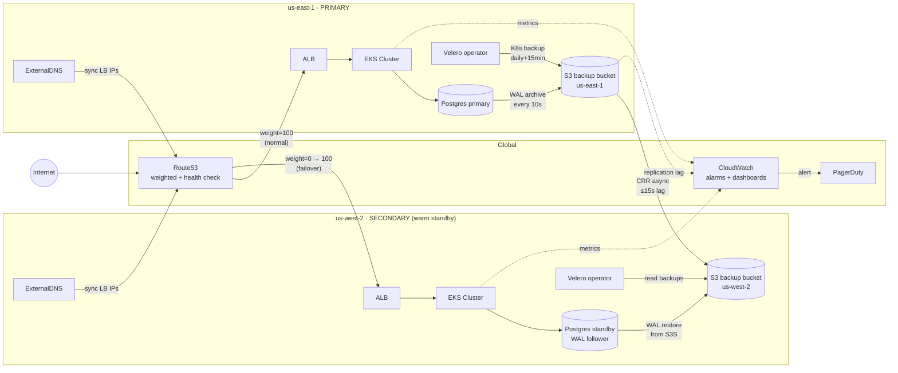
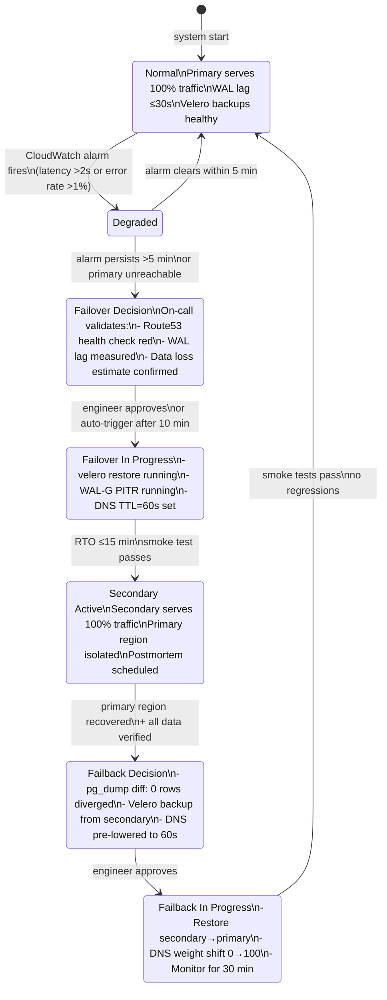
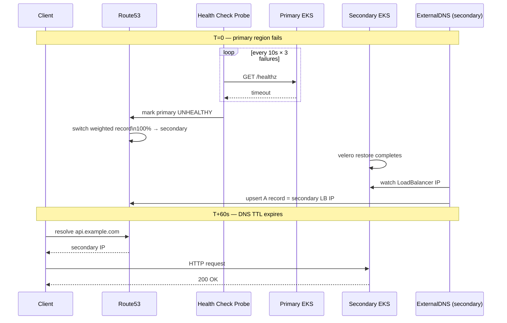

# Architecture — Project 07 Disaster Recovery

## Primary / Secondary topology



## Replication data paths

```mermaid
flowchart TB
  subgraph DataPlane["Data replication paths"]
    WAL["WAL segment (16 MB)\narchive_command every 10s"]
    S3P2["S3 us-east-1\n(source)"]
    CRR["S3 CRR\nasync ≤15s"]
    S3S2["S3 us-west-2\n(destination)"]
    PITR["PITR restore\nrestore_command"]
    PG2B["Postgres secondary\nreplication_lag ≤30s"]

    WAL --> S3P2
    S3P2 --> CRR
    CRR --> S3S2
    S3S2 --> PITR
    PITR --> PG2B
  end

  subgraph AppPlane["K8s state replication paths"]
    BACKUP["Velero backup\nobjects + PVCs"]
    S3PV["S3 us-east-1\nvelero/ prefix"]
    CRRV["S3 CRR\nasync ≤15s"]
    S3SV["S3 us-west-2\nvelero/ prefix"]
    RESTORE["velero restore\n--from-backup"]
    EKS2B["EKS secondary\nall namespaces restored"]

    BACKUP --> S3PV
    S3PV --> CRRV
    CRRV --> S3SV
    S3SV --> RESTORE
    RESTORE --> EKS2B
  end
```



## Failover state machine



## DNS failover sequence



## Component responsibility matrix

| Component | Primary role | Secondary role | Failover action |
|-----------|-------------|----------------|-----------------|
| Velero | Backup K8s state daily + 15 min | Read replicated backups | Restore latest backup |
| WAL-G | Archive WAL to S3 every 10s | Fetch WAL for standby | PITR restore to T-30s |
| S3 CRR | Source bucket | Destination bucket | Transparent (async) |
| Route53 | Primary A record (w=100) | Secondary A record (w=0) | Flip weight to 100 |
| ExternalDNS | Sync primary LB IPs | Sync secondary LB IPs | Upsert correct IPs |
| CloudWatch | Emit alarm on failure | Monitor restore progress | Alert PagerDuty |
| Postgres | Primary (read+write) | Standby (WAL follower) | Promote to primary |

## Network topology

```
┌─────────────────────────────────────────────────────────┐
│  Route53 (global)                                       │
│  api.example.com                                        │
│  ├── Primary record   weight=100  health-check-id=hc-1  │
│  └── Secondary record weight=0    health-check-id=hc-2  │
└─────────────┬───────────────────────────┬───────────────┘
              │                           │
   ┌──────────▼──────────┐   ┌────────────▼────────────┐
   │  us-east-1           │   │  us-west-2              │
   │  VPC 10.0.0.0/16    │   │  VPC 10.1.0.0/16        │
   │  EKS (3 AZs)        │   │  EKS (3 AZs)            │
   │  RDS Postgres        │   │  RDS Postgres (standby) │
   │  S3 primary bucket  │──▶│  S3 secondary bucket    │
   └─────────────────────┘   └─────────────────────────┘
```
