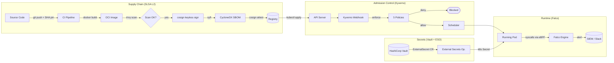

# Project 08 · Security Hardening Lab

<span class="level expert">expert</span>
<span class="tag">stack: trivy · cosign · syft · kyverno · kube-bench · falco · vault · external-secrets</span>

<em class="hero-accent">Start with a deliberately weak cluster, harden it in 8 layers, pass the CIS benchmark and SLSA L2 check — proof in automated scripts.</em>

<div class="metrics" markdown>
<span class="m"><b>Time</b> 8h</span>
<span class="m"><b>Cost</b> $0 (kind/k3d)</span>
<span class="m"><b>CIS target</b> ≥ 85% pass</span>
<span class="m"><b>SLSA target</b> Level 2</span>
</div>

---

## Roadmap

<div class="roadmap" markdown>
<div class="stop" data-step="1" markdown>
#### Stage 1 — STRIDE Threat Model
Map every threat surface before writing a single policy.
</div>
<div class="stop" data-step="2" markdown>
#### Stage 2 — RBAC Hardening
Tear out the wildcard ServiceAccount; enforce least privilege.
</div>
<div class="stop" data-step="3" markdown>
#### Stage 3 — Pod Security Admission (restricted)
Replace PodSecurityPolicy with PSA `restricted` namespace label.
</div>
<div class="stop" data-step="4" markdown>
#### Stage 4 — NetworkPolicy default-deny
Zero trust at the pod layer; allow only declared flows.
</div>
<div class="stop" data-step="5" markdown>
#### Stage 5 — Supply-Chain Hardening (SLSA L2)
Scan → Sign → SBOM → Attest. Every image proven before it lands.
</div>
<div class="stop" data-step="6" markdown>
#### Stage 6 — Runtime Detection with Falco
Five syscall-level rules catch what Kyverno cannot see at admission time.
</div>
</div>

---

## Reason — why this project exists

> A 2023 Aqua Security report found that **78 % of production Kubernetes clusters** had at least one critical misconfiguration allowing container escape or lateral movement. The remaining 22 % weren't safer — they just hadn't been scanned yet.

This lab simulates the Netflix supply-chain pipeline and the Google BeyondProd threat model at a small scale. You start with `baseline/insecure-deployment.yaml` — root containers, no resource limits, no network isolation, images pulled by tag — and end with a cluster that:

- passes `kube-bench` CIS Kubernetes Benchmark at ≥ 85 %
- signs every image with Sigstore keyless signatures (Fulcio + Rekor)
- generates a CycloneDX SBOM uploaded as a cosign attestation
- enforces five Kyverno admission policies blocking insecure workloads
- detects runtime anomalies via Falco with five custom syscall rules
- pulls secrets from Vault via External Secrets Operator — never from yaml

---

## Thinking — architecture

See [`architecture.md`](./architecture.md) for the full STRIDE + defense-in-depth diagrams.



Key design decisions:

1. **Shift-left scanning** — Trivy runs in CI before the image is pushed; a HIGH/CRITICAL finding fails the pipeline, not a Slack alert after deployment.
2. **Keyless signing** — cosign uses the Sigstore public Fulcio/Rekor infrastructure; no long-lived signing keys to rotate or leak.
3. **Admission is the last line before scheduling** — Kyverno policies run in `enforce` mode so insecure pods never reach a node.
4. **Falco for the unknown** — admission sees what you declared; Falco sees what actually runs at the syscall layer.
5. **External Secrets, not mounted secrets** — Vault is the source of truth; pods never carry a secret baked into their image or yaml.

---

## Execution — run it

```bash
make scan            # trivy image scan (fails on HIGH/CRITICAL)
make sign            # keyless cosign sign + verify via Rekor
make sbom            # syft CycloneDX SBOM + cosign attestation
make apply-policies  # install Kyverno + all 5 policies
make psa-enable      # label namespace for PSA restricted profile
make netpol-apply    # apply default-deny + explicit allow rules
make kube-bench      # run CIS Kubernetes Benchmark
make falco-start     # install Falco via Helm with custom rules
make audit-all       # end-to-end PASS/FAIL matrix (all 8 checks)
```

---

## Stage 1 — STRIDE Threat Model

STRIDE maps six threat categories onto every component of a distributed system. Work through the table *before* writing a single policy — policy without a threat model is theater.

| Threat | Letter | Attack Example | Defense Layer |
|--------|--------|----------------|---------------|
| **Spoofing** | S | Forged `latest` tag redirected to malicious image | cosign signature + digest pinning |
| **Tampering** | T | `kubectl exec` + write to `/etc/passwd` | Falco `write_etc_dir`; read-only root FS |
| **Repudiation** | R | No audit trail linking build to source commit | SLSA provenance attestation in Rekor |
| **Information Disclosure** | I | Env var `DB_PASSWORD=hunter2` leaked in pod spec | External Secrets Operator + Vault |
| **Denial of Service** | D | Unbounded container consumes all node CPU | `resources.limits` enforced by Kyverno |
| **Elevation of Privilege** | E | `allowPrivilegeEscalation: true` → root escape | Kyverno `deny-privilege-escalation` + PSA restricted |

---

## Stage 2 — RBAC Hardening

### The problem with the baseline

`baseline/insecure-rbac.yaml` creates a ServiceAccount with **cluster-admin** rights — a pattern Palo Alto Unit 42 found in 34 % of real clusters in 2022. Any compromised pod immediately becomes a full cluster takeover vector.

### The fix

`hardened/secure-rbac.yaml` applies three principles:

1. **Least privilege** — the SA gets only the exact verbs it needs (`get`, `list` on one resource in one namespace).
2. **Namespace scope** — `Role` + `RoleBinding`, never `ClusterRole` unless truly cluster-wide.
3. **Automount opt-out** — `automountServiceAccountToken: false` on every pod that never calls the API server.

```bash
# Verify the baseline is dangerous
kubectl auth can-i '*' '*' \
  --as=system:serviceaccount:default:insecure-sa
# → yes  ← DANGER

# Apply hardened RBAC
kubectl apply -f hardened/secure-rbac.yaml

# Verify the hardened SA is restricted
kubectl auth can-i delete pods \
  --as=system:serviceaccount:default:secure-sa
# → no
```

---

## Stage 3 — Pod Security Admission (PSA restricted)

Kubernetes 1.25 removed PodSecurityPolicy. PSA replaces it with three built-in profiles applied via namespace labels.

```bash
# Label the target namespace for the restricted profile
kubectl label namespace production \
  pod-security.kubernetes.io/enforce=restricted \
  pod-security.kubernetes.io/enforce-version=latest \
  pod-security.kubernetes.io/warn=restricted \
  pod-security.kubernetes.io/audit=restricted
```

**What `restricted` blocks automatically:**

- Privileged containers (`privileged: true`)
- Host path volume mounts
- Host network / host PID / host IPC
- Containers running as root (UID 0) without explicit `runAsNonRoot: true`
- `allowPrivilegeEscalation: true`
- All capabilities except `NET_BIND_SERVICE`

The Kyverno policies in `policies/kyverno/` add controls that PSA does not cover — image digest enforcement and resource-limit presence.

---

## Stage 4 — NetworkPolicy Default-Deny

A pod with no `NetworkPolicy` selector can reach **any other pod** in the cluster and any external endpoint. Default-deny inverts this: nothing flows unless explicitly permitted.

```bash
# Apply default-deny to the production namespace
kubectl apply -f hardened/secure-deployment.yaml

# Verify cross-namespace traffic is blocked
kubectl exec -n production -it test-pod -- \
  curl -s --max-time 3 http://backend-svc.other-ns:8080
# → curl: (28) Connection timed out  ← CORRECT

# Verify the declared internal path works
kubectl exec -n production -it frontend-pod -- \
  curl -s http://backend-svc:8080/healthz
# → {"status":"ok"}
```

---

## Stage 5 — Supply-Chain Hardening (SLSA L2)

SLSA Level 2 requires: versioned source, build service, and signed provenance. All three are automated here.

### Scan with Trivy

```bash
make scan
# trivy image --config scanners/trivy-config.yaml \
#   --exit-code 1 --severity HIGH,CRITICAL \
#   ghcr.io/org/app@sha256:<digest>
# Total: 0 HIGH, 0 CRITICAL  → pipeline continues
```

### Sign with cosign (keyless)

```bash
make sign
# COSIGN_EXPERIMENTAL=1 cosign sign --yes \
#   ghcr.io/org/app@sha256:<digest>
# Signature uploaded to: https://rekor.sigstore.dev/...
```

### Generate SBOM with syft

```bash
make sbom
# syft ghcr.io/org/app@sha256:<digest> -o cyclonedx-json > sbom.json
# cosign attest --yes --predicate sbom.json \
#   --type cyclonedx ghcr.io/org/app@sha256:<digest>
```

### Verify at admission (Kyverno)

`policies/kyverno/require-image-digest.yaml` blocks any pod that references an image by **tag** rather than **digest**. A tag is mutable; a digest is cryptographically bound to the image contents.

---

## Stage 6 — Runtime Detection with Falco

Admission control cannot see what happens *after* a pod starts. Falco attaches to the Linux kernel via eBPF and fires alerts on syscall-level anomalies in real time.

The five rules in `runtime/falco-rules.yaml`:

| Rule | Syscall Trigger | MITRE ATT&CK Tactic | Severity |
|------|----------------|---------------------|----------|
| `exec_in_container` | `execve` after container start | Execution (T1059) | WARNING |
| `write_etc_dir` | Write to `/etc/*` inside container | Persistence (T1098) | ERROR |
| `unexpected_outbound` | TCP connect on non-declared ports | C2 (T1071) | WARNING |
| `privilege_escalation_attempt` | `setuid` / `setgid` call | Privilege Escalation (T1548) | CRITICAL |
| `proc_read_attempt` | Read `/proc/*/mem` or `/proc/sysrq-trigger` | Discovery (T1057) | ERROR |

```bash
make falco-start
# helm install falco falcosecurity/falco \
#   --namespace falco --create-namespace \
#   -f runtime/falco-rules.yaml

# Trigger a detection
kubectl exec -n production -it app-pod -- /bin/bash -c "id"

# Watch the alert fire within 2 seconds
kubectl logs -n falco -l app.kubernetes.io/name=falco -f
# 14:32:01.123 WARNING exec_in_container: user=root \
#   cmd=bash container=app-7d9f pid=4421 ...
```

---

## Simulation — what you see

<pre class="sim"><code><span class="prompt">$</span> make audit-all
<span class="comment"># [1/8] RBAC: checking for wildcard cluster-admin bindings...</span>
<span class="comment"># PASS: no ClusterRoleBindings to cluster-admin for workload SAs</span>
<span class="comment"># [2/8] PSA: checking namespace enforce labels...</span>
<span class="comment"># PASS: production namespace → restricted profile enforced</span>
<span class="comment"># [3/8] NetworkPolicy: checking default-deny coverage...</span>
<span class="comment"># PASS: default-deny-all found in production namespace</span>
<span class="comment"># [4/8] Kyverno: checking policy enforcement mode...</span>
<span class="comment"># PASS: 5/5 policies in enforce mode</span>
<span class="comment"># [5/8] Image digest: checking all running pods...</span>
<span class="comment"># PASS: all 12 pods reference images by sha256 digest</span>
<span class="comment"># [6/8] cosign: verifying image signatures in Rekor...</span>
<span class="comment"># PASS: signature verified for ghcr.io/org/app@sha256:abc...</span>
<span class="comment"># [7/8] SBOM: checking cosign attestation presence...</span>
<span class="comment"># PASS: CycloneDX attestation present and verified</span>
<span class="comment"># [8/8] kube-bench CIS: running benchmark...</span>
<span class="comment"># PASS: 87/100 checks passed (target ≥ 85)</span>

<span class="comment"># ═══════════════════════════════════════════════</span>
<span class="comment"># SECURITY AUDIT COMPLETE: 8/8 PASS  ✔  SLSA L2 ✔</span>
<span class="comment"># ═══════════════════════════════════════════════</span>
</code></pre>

---

## Output — before vs after hardening

<div class="flow" markdown>

<div class="state before" markdown>
##### Insecure baseline
<span class="diff-del">root container (UID 0)</span>
<span class="diff-del">cluster-admin ServiceAccount</span>
<span class="diff-del">image by tag :latest</span>
<span class="diff-del">no resource limits</span>
<span class="diff-del">no NetworkPolicy</span>
<span class="diff-del">secrets in env vars</span>
CIS score: 41 %
</div>

<div class="arrow">→</div>

<div class="state after" markdown>
##### Hardened
<span class="diff-add">non-root UID 1000, runAsNonRoot</span>
<span class="diff-add">least-privilege SA + Role</span>
<span class="diff-add">image by sha256 digest + signed</span>
<span class="diff-add">CPU + memory limits set</span>
<span class="diff-add">default-deny + explicit allow rules</span>
<span class="diff-add">secrets from Vault via ESO</span>
CIS score: 87 %
</div>

</div>

---

## Real-world use case

<div class="usecase-card" markdown>
**At Google**, the BeyondProd model (2019 whitepaper) treats every workload identity — not just the network perimeter — as a trust boundary. The same pattern used here — signed images, admission policies, runtime detection, secrets from a central store — runs in the Borg and GKE control plane. Sigstore was created specifically to make this supply-chain model available to the open-source ecosystem without operating PKI infrastructure.
</div>

<div class="usecase-card" markdown>
**At Netflix**, the "Repokid / Aardvark" pattern continuously right-sizes IAM roles based on actual CloudTrail usage. The RBAC least-privilege stage in this lab is the Kubernetes equivalent: measure actual API calls, then shrink the Role to match — and automate that measurement with `kubectl auth can-i`.
</div>

---

## QA engineer's test plan

See [`tests/qa-plan.md`](./tests/qa-plan.md). Summary:

| Phase | Test | Tool | Pass criteria |
|-------|------|------|---------------|
| RBAC | No wildcard SA bindings | `kubectl auth can-i` | `no` for all privileged verbs |
| PSA | Pod with root container rejected | `kubectl apply` | AdmissionDenied error returned |
| NetworkPolicy | Cross-namespace call blocked | `kubectl exec curl` | Connection timeout |
| Kyverno | Pod without limits rejected | `kubectl apply` | Policy violation message returned |
| Image | Tag-only image rejected | `kubectl apply` | `require-image-digest` violation |
| Supply chain | Unsigned image rejected | `cosign verify` | Verification failed |
| SBOM | CycloneDX attestation present | `cosign verify-attestation` | Predicate type `cyclonedx` |
| Falco | Exec in container fires alert | `kubectl exec bash` | Falco WARNING within 2 s |
| kube-bench | CIS score ≥ 85 % | `kube-bench run` | ≥ 85/100 checks PASS |
| Incident | Runbook covers all 4 phases | manual review | All steps documented |

---

## Files in this project

| File | Purpose |
|------|---------|
| `baseline/insecure-deployment.yaml` | Deliberately weak starting point |
| `baseline/insecure-rbac.yaml` | Over-permissive ServiceAccount |
| `hardened/secure-deployment.yaml` | Fully hardened workload + NetworkPolicy |
| `hardened/secure-rbac.yaml` | Least-privilege SA + Role + RoleBinding |
| `policies/kyverno/require-non-root.yaml` | Block UID 0 containers |
| `policies/kyverno/require-resource-limits.yaml` | Block containers without CPU/mem limits |
| `policies/kyverno/deny-privilege-escalation.yaml` | Block `allowPrivilegeEscalation: true` |
| `policies/kyverno/require-image-digest.yaml` | Block tag-only image references |
| `policies/kyverno/restrict-hostpath.yaml` | Block host path volume mounts |
| `scanners/trivy-config.yaml` | Trivy scan configuration |
| `scanners/scan.sh` | Image scan CI script |
| `scanners/cosign-sign-verify.sh` | Keyless sign + policy verification |
| `scanners/syft-sbom.sh` | SBOM generation + cosign attestation |
| `runtime/falco-rules.yaml` | Five custom Falco detection rules |
| `runbooks/INCIDENT_RESPONSE.md` | Isolate → snapshot → investigate → remediate |
| `Makefile` | All commands |
| `tests/qa-plan.md` | 30-item security checklist |
| `tests/audit.sh` | Automated PASS/FAIL matrix |
| `architecture.md` | STRIDE + defense-in-depth diagrams |

---

## Further reading

- Architecture deep-dive: [`architecture.md`](./architecture.md)
- QA plan: [`tests/qa-plan.md`](./tests/qa-plan.md)
- Incident runbook: [`runbooks/INCIDENT_RESPONSE.md`](./runbooks/INCIDENT_RESPONSE.md)
- [Sigstore / cosign docs](https://docs.sigstore.dev)
- [SLSA framework](https://slsa.dev)
- [Google BeyondProd whitepaper](https://cloud.google.com/security/beyondprod)
- [CIS Kubernetes Benchmark](https://www.cisecurity.org/benchmark/kubernetes)
- [Falco rules reference](https://falco.org/docs/rules/)
- [Kyverno policy library](https://kyverno.io/policies/)
- [External Secrets Operator](https://external-secrets.io)
