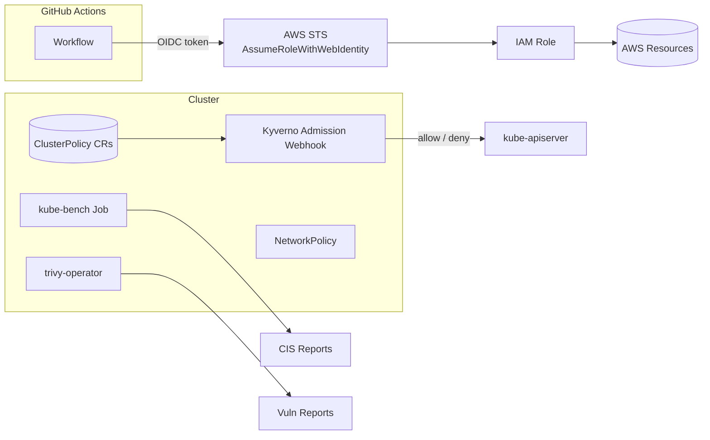

# Project 08 — Security Hardening Lab

Apply CIS Kubernetes Benchmark, deploy Kyverno admission policies, scan with Trivy, lock down with NetworkPolicies, and federate CI to AWS via OIDC (no static keys).

## What you'll build

<!-- mermaid:rendered -->
<p align="center"></p>

<details><summary>Mermaid source</summary>

<!-- mermaid:rendered -->
<p align="center"></p>

<details><summary>Mermaid source</summary>

<!-- mermaid:rendered -->
<p align="center"></p>

<details><summary>Mermaid source</summary>



</details>

</details>

</details>

## Prerequisites
- Project 06 cluster (or any reasonably current cluster)
- `helm`, `kubectl`, `gh`, `trivy` CLIs
- GitHub repo for the OIDC step

Walk through the [`checklist.md`](./checklist.md) as you go.

## Step 1 — Run CIS benchmark with kube-bench

```bash
kubectl apply -f https://raw.githubusercontent.com/aquasecurity/kube-bench/main/job-eks.yaml
kubectl wait --for=condition=complete job/kube-bench --timeout=120s
kubectl logs job/kube-bench | tee cis-report.txt
```

Expected: a long table with `[PASS]`, `[WARN]`, `[FAIL]`. Address all `FAIL`s before moving on.

## Step 2 — Install Kyverno + baseline policies

```bash
helm repo add kyverno https://kyverno.github.io/kyverno
helm install kyverno kyverno/kyverno -n kyverno --create-namespace \
  --version 3.2.6 --wait

# Pod Security Standards (baseline + restricted)
kubectl apply -f https://raw.githubusercontent.com/kyverno/policies/main/pod-security/baseline/disallow-host-namespaces/disallow-host-namespaces.yaml
kubectl apply -f https://raw.githubusercontent.com/kyverno/policies/main/pod-security/restricted/require-run-as-non-root-user/require-run-as-non-root-user.yaml
kubectl apply -f https://raw.githubusercontent.com/kyverno/policies/main/best-practices/disallow-latest-tag/disallow-latest-tag.yaml

kubectl get clusterpolicy
```

Test the policy:

```bash
kubectl run nope --image=nginx       # blocked: latest tag
kubectl run nope --image=nginx:1.27  # allowed
```

## Step 3 — Install trivy-operator

```bash
helm repo add aqua https://aquasecurity.github.io/helm-charts/
helm install trivy-operator aqua/trivy-operator \
  -n trivy-system --create-namespace \
  --version 0.24.1 \
  --set trivy.severity=HIGH,CRITICAL \
  --wait

# After 1-2 minutes:
kubectl get vulnerabilityreports -A
kubectl get configauditreports -A
```

## Step 4 — Default-deny NetworkPolicy

```bash
kubectl apply -f - <<'EOF'
apiVersion: networking.k8s.io/v1
kind: NetworkPolicy
metadata:
  name: default-deny-all
  namespace: proj01
spec:
  podSelector: {}
  policyTypes: [Ingress, Egress]
---
# Allow ingress from ingress-nginx namespace + DNS egress
apiVersion: networking.k8s.io/v1
kind: NetworkPolicy
metadata:
  name: allow-ingress-and-dns
  namespace: proj01
spec:
  podSelector: { matchLabels: { app: hello-world } }
  policyTypes: [Ingress, Egress]
  ingress:
    - from:
        - namespaceSelector:
            matchLabels: { kubernetes.io/metadata.name: ingress-nginx }
      ports:
        - port: 8080
          protocol: TCP
  egress:
    - to:
        - namespaceSelector:
            matchLabels: { kubernetes.io/metadata.name: kube-system }
      ports:
        - { port: 53, protocol: UDP }
        - { port: 53, protocol: TCP }
EOF

# Verify denial
kubectl -n proj01 run probe --image=busybox --restart=Never --rm -it -- \
  wget -qO- --timeout=3 http://1.1.1.1   # should TIMEOUT
```

## Step 5 — OIDC trust between GitHub Actions and AWS

```bash
# 1. One-time per AWS account: create the OIDC provider
aws iam create-open-id-connect-provider \
  --url https://token.actions.githubusercontent.com \
  --client-id-list sts.amazonaws.com \
  --thumbprint-list 6938fd4d98bab03faadb97b34396831e3780aea1

# 2. Trust policy that scopes to YOUR repo + branch
ACCOUNT=$(aws sts get-caller-identity --query Account --output text)
REPO=YOUR-USER/YOUR-REPO

cat > trust.json <<EOF
{
  "Version":"2012-10-17",
  "Statement":[{
    "Effect":"Allow",
    "Principal":{"Federated":"arn:aws:iam::${ACCOUNT}:oidc-provider/token.actions.githubusercontent.com"},
    "Action":"sts:AssumeRoleWithWebIdentity",
    "Condition":{
      "StringEquals":{"token.actions.githubusercontent.com:aud":"sts.amazonaws.com"},
      "StringLike":{"token.actions.githubusercontent.com:sub":"repo:${REPO}:ref:refs/heads/main"}
    }
  }]
}
EOF

aws iam create-role --role-name GhaDeployer --assume-role-policy-document file://trust.json
aws iam attach-role-policy --role-name GhaDeployer \
  --policy-arn arn:aws:iam::aws:policy/AmazonS3ReadOnlyAccess
```

In your workflow:

```yaml
permissions:
  id-token: write
  contents: read
jobs:
  deploy:
    steps:
      - uses: aws-actions/configure-aws-credentials@v4
        with:
          role-to-assume: arn:aws:iam::ACCOUNT:role/GhaDeployer
          aws-region: us-east-1
      - run: aws sts get-caller-identity
```

No more `AWS_ACCESS_KEY_ID` in repo secrets — ever.

## Verify (security smoke test)

```bash
# Kyverno blocks privileged pod
kubectl run priv --image=nginx:1.27 \
  --overrides='{"spec":{"containers":[{"name":"priv","image":"nginx:1.27","securityContext":{"privileged":true}}]}}'
# expect: blocked

# Trivy reports
kubectl get vulnerabilityreports -A | head

# CIS report
grep -c FAIL cis-report.txt
```

## Cleanup

```bash
helm -n trivy-system uninstall trivy-operator
helm -n kyverno      uninstall kyverno
kubectl delete clusterpolicy --all
kubectl delete -n proj01 networkpolicy --all
aws iam delete-role --role-name GhaDeployer    # only if no longer needed
```

## What you learned
- CIS Benchmark scoring with kube-bench
- Admission policies (Kyverno) as preventive controls
- Image + config CVE scanning with trivy-operator
- NetworkPolicy default-deny posture
- Keyless cloud auth with OIDC federation

## Stretch goals
- Add Falco for runtime security (eBPF-based)
- Sign images with `cosign` and verify in Kyverno (`verifyImages`)
- Implement Pod Security Admission via `pod-security.kubernetes.io/enforce` labels
- Wire CIS reports to Grafana / Slack alerts
- Move secrets to External Secrets Operator + AWS Secrets Manager

## Related
- See [`../../08-security/01-rbac/`](../../08-security/) for RBAC tightening
- See [`../04-ci-cd-pipeline/`](../04-ci-cd-pipeline/) — replace its PAT with this OIDC flow
