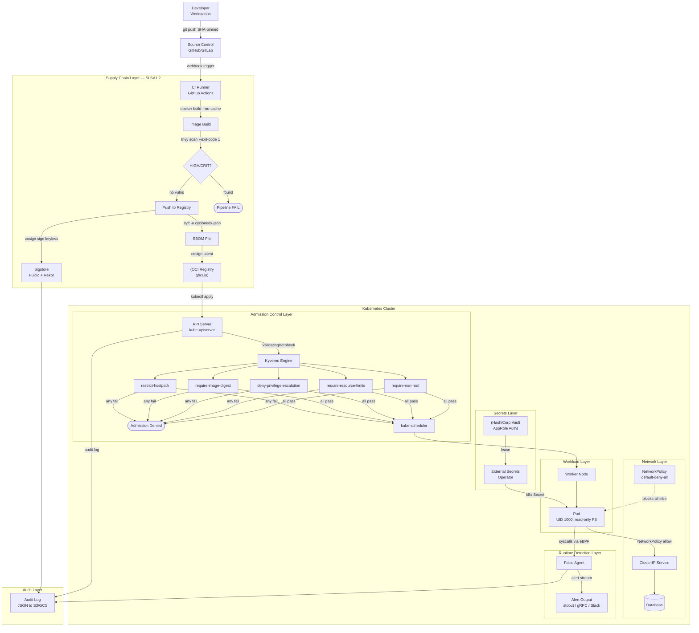
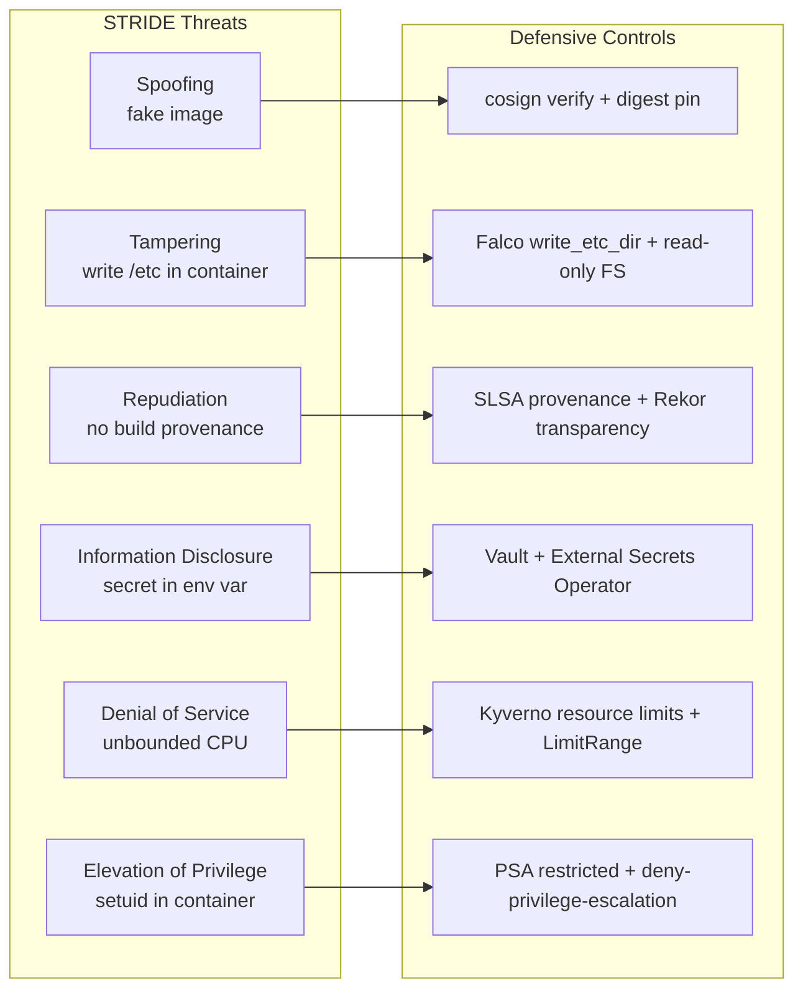

# Architecture — Security Hardening Lab

## STRIDE Threat Model

The diagram maps every component to its threat category and the defensive control that mitigates it.

---

## Defense-in-Depth: 8 Layers

Each layer is independent. An attacker must bypass all of them in sequence to achieve their goal.

```mermaid
flowchart LR
    L1["Layer 1<br/>Source Control<br/>Signed commits, branch protection"] -->
    L2["Layer 2<br/>CI/CD Hardening<br/>Ephemeral runners, OIDC, no static creds"] -->
    L3["Layer 3<br/>Image Hardening<br/>Trivy scan, distroless, non-root"] -->
    L4["Layer 4<br/>Supply Chain Integrity<br/>cosign keyless, SBOM, SLSA L2"] -->
    L5["Layer 5<br/>Admission Control<br/>Kyverno 5 policies + PSA restricted"] -->
    L6["Layer 6<br/>RBAC + Secrets<br/>Least-privilege SA, Vault + ESO"] -->
    L7["Layer 7<br/>Network Isolation<br/>NetworkPolicy default-deny"] -->
    L8["Layer 8<br/>Runtime Detection<br/>Falco eBPF, 5 custom rules"]
```

---

## STRIDE-to-Control Mapping

---

## Trust Boundaries

| Boundary | What crosses it | How it is enforced |
|----------|-----------------|-------------------|
| Developer → CI | Source code | Branch protection + required reviews |
| CI → Registry | OCI image | Trivy gate; no direct developer push |
| Registry → Cluster | Container image | cosign signature verification at admission |
| Cluster → Vault | Secret request | mTLS + Kubernetes auth + AppRole |
| Pod → Pod | API calls | NetworkPolicy + Service mesh mTLS (optional) |
| Pod → Kernel | syscalls | Falco eBPF monitor |
| Pod → API Server | K8s API calls | RBAC least-privilege + token auto-mount disabled |

---

## Key Design Decisions

| Decision | Rationale |
|----------|-----------|
| Keyless cosign over keypair cosign | No private key to rotate, leak, or lose; identity is OIDC-bound to CI run |
| Kyverno over OPA/Gatekeeper | Native Kubernetes API; generates/mutates resources; richer policy DSL |
| PSA + Kyverno (both) | PSA covers built-in baseline; Kyverno adds digest enforcement and custom rules that PSA cannot express |
| External Secrets over Vault Agent | ESO is a Kubernetes-native CRD controller; no sidecar injection required |
| Falco eBPF over kernel module | eBPF is safe to load in production; kernel module requires node reboot on kernel updates |
| CycloneDX over SPDX | Better toolchain support in cosign attest; richer VEX (vulnerability exploitability exchange) integration |
