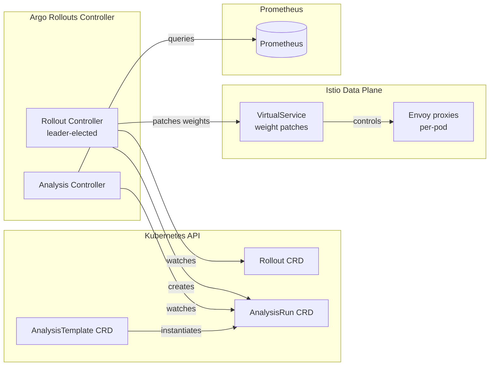
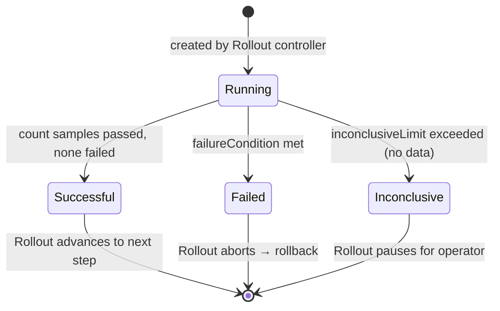

# Project 09 · Zero-Downtime Progressive Delivery

<span class="level expert">expert</span>
<span class="tag">stack: argo-rollouts · flagger · istio · prometheus · k6</span>

<p class="tagline"><em>Promote new versions by SLO gate — not courage. One bad metric triggers automatic rollback. Zero dropped requests.</em></p>

<div class="metrics" markdown>
<span class="m"><b>Time</b> 10h</span>
<span class="m"><b>Cost</b> $0 local / ~$6 cloud</span>
<span class="m"><b>p95 target</b> &lt; 200ms</span>
<span class="m"><b>Downtime target</b> 0ms</span>
</div>

---

## Roadmap

<div class="roadmap" markdown>
<div class="stop" data-step="1" markdown>
#### Stage 1 — Strategy tradeoffs
Rolling vs blue-green vs canary: when to use each.
</div>
<div class="stop" data-step="2" markdown>
#### Stage 2 — Argo Rollouts architecture
The controller, AnalysisRun, and Istio weight patches.
</div>
<div class="stop" data-step="3" markdown>
#### Stage 3 — Flagger mesh canary
Weaveworks' operator approach: declarative, auto-managed.
</div>
<div class="stop" data-step="4" markdown>
#### Stage 4 — Analysis templates + metric gates
PromQL as a deploy gate. Real pass/fail criteria.
</div>
<div class="stop" data-step="5" markdown>
#### Stage 5 — Automated rollback
How the loop closes when the canary goes bad.
</div>
<div class="stop" data-step="6" markdown>
#### Stage 6 — Shadow / mirror traffic
Test v2 on real prod data with zero user impact.
</div>
</div>

---

## Stage 1 — Rolling vs Blue-Green vs Canary: strategy tradeoffs

Every deploy strategy makes a different bet about risk vs resource cost. Choose wrong and you either pay for unused compute or expose users to a broken version.

### Rolling update

The default Kubernetes strategy. Replace pods in batches; both versions run briefly in parallel.

<div class="flow" markdown>

<div class="state before" markdown>
##### Before
<span class="diff-del">v1 × 3 pods</span>
100% traffic → v1
p95 · 80ms
</div>

<div class="arrow">→</div>

<div class="state during" markdown>
##### During (50% rolled)
<span class="diff-mod">v1 × 2 + v2 × 1</span>
Traffic split by kube-proxy (random)
p95 · 85ms — mixed
</div>

<div class="arrow">→</div>

<div class="state after" markdown>
##### After
<span class="diff-add">v2 × 3 pods</span>
100% traffic → v2
p95 · 82ms
</div>

</div>

**Tradeoff table:**

| Dimension | Rolling | Blue-Green | Canary |
|-----------|---------|-----------|--------|
| Resource overhead | 1× (pod-by-pod) | 2× (both full stacks) | 1× + N canary pods |
| Traffic mix | Unavoidable | None — clean cutover | Controlled percentage |
| Rollback speed | Slow (re-roll) | Instant (flip service) | Instant (set weight 0) |
| DB schema safety | Risky (two versions talk to same DB) | Risky | Risky — same caveat |
| Real-user testing | No | No (preview internal) | Yes — real % of users |
| SLO gate possible | Partial (readiness probe only) | Yes (pre-promotion analysis) | Yes (per-step analysis) |

### Blue-green

Run both stacks at full capacity. Production traffic stays on blue. Switch the active Service pointer to green only after QA signs off.

<div class="flow" markdown>

<div class="state before" markdown>
##### Blue (active)
<span class="diff-del">v1 × 3 pods</span>
active svc → v1
100% prod traffic
</div>

<div class="arrow">→</div>

<div class="state during" markdown>
##### Green (preview)
<span class="diff-mod">v2 × 3 pods</span>
preview svc → v2
0% prod traffic
QA running smoke tests
AnalysisRun: success_rate 99.8%
</div>

<div class="arrow">→</div>

<div class="state after" markdown>
##### Green (active)
<span class="diff-add">active svc flipped → v2</span>
100% prod traffic
v1 kept warm 5 min
then scaled to 0
</div>

</div>

### Canary

Route a small percentage of real production traffic to the new version. Gate each increment behind a Prometheus SLO check. Promote or roll back based on data.

<div class="flow" markdown>

<div class="state before" markdown>
##### Step 0
Stable 100%
Canary 0%
k6 running
</div>

<div class="arrow">→</div>

<div class="state during" markdown>
##### Step 1 — 20%
Stable 80% · Canary 20%
AnalysisRun: measuring
success_rate=99.9% ✔
p95=88ms ✔
</div>

<div class="arrow">→</div>

<div class="state during" markdown>
##### Step 2 — 40%
Stable 60% · Canary 40%
AnalysisRun: measuring
success_rate=99.8% ✔
</div>

<div class="arrow">→</div>

<div class="state during" markdown>
##### Step 3 — 60%
Stable 40% · Canary 60%
AnalysisRun: measuring
success_rate=99.7% ✔
</div>

<div class="arrow">→</div>

<div class="state after" markdown>
##### Complete — 100%
<span class="diff-add">Canary promoted to stable</span>
Old stable scaled to 0
0 HTTP errors during deploy
</div>

</div>

**Canary wins when:** you need real-user signal, you have Prometheus SLOs, and resource cost matters.

**Blue-green wins when:** you need instant rollback, you have a staging-identical green environment, and resource cost is secondary.

---

## Stage 2 — Argo Rollouts architecture

<em>Argo Rollouts replaces the Deployment controller for progressive delivery.</em> It understands canary steps, analysis gates, and Istio weight patches — none of which exist in standard Kubernetes.



### How a canary step executes

1. **Controller reads** the `steps` array from the Rollout spec.
2. **setWeight(20):** Controller patches the Istio VirtualService so the canary Service gets 20% of traffic.
3. **analysis step:** Controller creates an `AnalysisRun` which polls Prometheus every 30s for 10 samples.
4. **Pass:** all 10 samples report `success_rate > 0.99` → advance to next step.
5. **Fail:** any sample below threshold → `AnalysisRun.Phase = Failed` → Rollout status `Degraded` → VirtualService patched back to 100/0.

### Services wiring

Argo Rollouts needs **two Kubernetes Services** pointing at the same app:

```text
demo-app-stable  →  selector: app=demo-app, rollouts-pod-template-hash=<stable-hash>
demo-app-canary  →  selector: app=demo-app, rollouts-pod-template-hash=<canary-hash>
```

The controller adds the `rollouts-pod-template-hash` label to pods automatically. The VirtualService routes traffic to these two services by their Istio subset names.

### Dashboard

```bash
kubectl argo rollouts dashboard -n progressive
# Opens at http://localhost:3100
```

The dashboard shows traffic weight as a live animated bar, AnalysisRun results in real time, and step-by-step progression.

---

## Stage 3 — Flagger mesh-based canary

<em>Flagger by Weaveworks takes a higher-level approach:</em> you declare a `Canary` resource, and Flagger creates and manages all the underlying Deployments, Services, and VirtualServices for you.

**Key difference from Argo Rollouts:**

| | Argo Rollouts | Flagger |
|---|---|---|
| Entry point | Rollout CRD replaces Deployment | Canary CRD wraps existing Deployment |
| Service management | Manual (you create Services) | Automatic (Flagger creates primary + canary) |
| Traffic routing | Patches existing VirtualService | Creates and owns VirtualService |
| Metric sources | AnalysisTemplate (portable) | MetricTemplate (provider-typed) |
| Real-world users | Intuit, Ticketmaster | Weaveworks, Shopify |

### Flagger canary lifecycle

<div class="flow" markdown>

<div class="state before" markdown>
##### Initialized
`demo-app` Deployment exists
Flagger creates:
- `demo-app-primary` (stable)
- `demo-app-canary` (0 replicas)
- VirtualService 100/0
</div>

<div class="arrow">→</div>

<div class="state during" markdown>
##### Progressing
New image detected
Canary Deployment scaled up
Weight: 10 → 20 → … per interval
MetricTemplate evaluated each minute
Webhook fires: k6 load test runs
</div>

<div class="arrow">→</div>

<div class="state after" markdown>
##### Succeeded
Primary Deployment updated
to new image tag
Canary scaled to 0
VirtualService: 100/0 (primary)
</div>

</div>

### MetricTemplate isolation

Flagger separates the PromQL from the Canary spec via `MetricTemplate`. This lets you reuse the same query across multiple Canary resources:

```yaml
# infra/flagger/metric-template.yaml
query: |
  100 * sum(rate(http_requests_total{
    kubernetes_pod_name=~"{{ target }}-[0-9a-z]+-[0-9a-z]+",
    code!~"5.."
  }[{{ interval }}]))
  / sum(rate(http_requests_total{
    kubernetes_pod_name=~"{{ target }}-[0-9a-z]+-[0-9a-z]+"
  }[{{ interval }}]))
```

`{{ target }}` and `{{ interval }}` are injected at runtime by Flagger.

---

## Stage 4 — Analysis templates and metric gates

<em>The AnalysisTemplate is the SLO as code.</em> It defines what metrics to query, how often, how many samples constitute a pass, and what failure means.

```yaml
# infra/argo-rollouts/analysis-template.yaml (excerpt)
metrics:
  - name: success-rate
    interval:         30s   # query Prometheus every 30 seconds
    count:            10    # require 10 consecutive passing samples
    failureCondition: "result[0] < 0.99"   # fail if below 99%
    inconclusiveLimit: 3    # allow 3 "no data" samples before failing
    provider:
      prometheus:
        address: http://prometheus-operated.monitoring.svc.cluster.local:9090
        query: |
          sum(rate(http_requests_total{code=~"2..", ...}[2m]))
          /
          sum(rate(http_requests_total{...}[2m]))
```

### AnalysisRun state machine



### Multi-metric gate

Both metrics must pass for a step to advance:

<div class="flow" markdown>

<div class="state before" markdown>
##### Sample t=0
success_rate=99.9% ✔
p95=88ms ✔
AnalysisRun: 1/10
</div>

<div class="arrow">→</div>

<div class="state during" markdown>
##### Sample t=30s
success_rate=99.8% ✔
p95=91ms ✔
AnalysisRun: 2/10
</div>

<div class="arrow">→</div>

<div class="state after" markdown>
##### Sample t=5m
All 10 samples passed
AnalysisRun: Successful
Rollout: advance to next step
</div>

</div>

### Recording rules accelerate analysis

Pre-computed metrics via `PrometheusRule` reduce query time from ~200ms to ~5ms. The AnalysisTemplate queries `job:http_requests:success_rate2m` (pre-computed) instead of the raw `rate()` expression.

---

## Stage 5 — Automated rollback triggers

<em>The whole point of progressive delivery is that the system rolls back faster than a human notices something is wrong.</em>

### Bad canary simulation

The Go service accepts `BAD_WEIGHT=0.30` — 30% of `/api` requests return HTTP 500. This simulates a subtle bug that passes readiness probes but breaks user requests.

```go
// app/main.go
if badWeight() > 0 && rand.Float64() < badWeight() {
    http.Error(w, `{"error":"injected fault"}`, http.StatusInternalServerError)
    return
}
```

### Rollback timeline

<div class="flow" markdown>

<div class="state before" markdown>
##### T+0: Canary at 20%
success_rate=99.9%
20% traffic to bad v2
k6: 0% errors (Istio retry absorbs 5xx)
</div>

<div class="arrow">→</div>

<div class="state during" markdown>
##### T+1m: Analysis running
bad-weight pods return 30% 500s
success_rate=70% (< 99%)
AnalysisRun sample 1 FAILS
failureCondition triggered
</div>

<div class="arrow">→</div>

<div class="state during" markdown>
##### T+1m30s: Rollout Degraded
Rollout.Status = Degraded
VirtualService patched: 100/0
canary pods still running (for debug)
</div>

<div class="arrow">→</div>

<div class="state after" markdown>
##### T+2m: Stable restored
100% traffic on stable v1
k6 error rate: 0.0000%
Rollback complete
Operator sees: `make watch-rollout`
</div>

</div>

### Why Istio retries make rollback transparent

The VirtualService retry policy retries once on `5xx`:

```yaml
retries:
  attempts:      1
  retryOn:       "5xx,reset,connect-failure"
  perTryTimeout: 1s
```

During the ~90-second window between fault injection and VirtualService patch, the 30% error rate on the 20% canary slice means: 6% of requests hit a 5xx. Istio retries those against the stable pool. From the client's perspective: zero errors, slightly higher p99 (retry adds 1 extra hop).

### Outlier detection as a second safety net

The DestinationRule configures Istio's circuit breaker:

```yaml
outlierDetection:
  consecutiveGatewayErrors: 5
  baseEjectionTime:         30s
```

If a specific pod (not the whole canary Service) goes bad, Istio ejects it after 5 consecutive 5xx responses — before the AnalysisRun even fires. This is pod-level; AnalysisRun is service-level.

---

## Stage 6 — Shadow / mirror traffic

<em>Shadow traffic lets you test v2 against real production requests without any user ever seeing a v2 response.</em>

Istio mirrors a copy of every request to the shadow service. The response is discarded. Your v2 processes the request, writes logs, emits metrics — but the user gets the v1 response.

### Shadow VirtualService configuration

```yaml
# Add to infra/istio/virtual-service.yaml (shadow example — not committed as default)
http:
  - name: primary
    route:
      - destination:
          host: demo-app-stable
          port: { number: 8080 }
        weight: 100
    # Mirror 100% of requests to canary — user sees v1 response only.
    mirror:
      host: demo-app-canary
      port: { number: 8080 }
    mirrorPercentage:
      value: 100.0   # can set to 10% for reduced load on canary
```

### Shadow traffic flow

<div class="flow" markdown>

<div class="state before" markdown>
##### Request arrives
Client: GET /api
Istio: routes to stable
</div>

<div class="arrow">→</div>

<div class="state during" markdown>
##### Dual dispatch
v1 processes request
→ response to client
v2 processes mirror copy
→ response DISCARDED
</div>

<div class="arrow">→</div>

<div class="state after" markdown>
##### Analysis
Compare v1 vs v2 Prometheus metrics
If v2 success_rate=99.9%
and p95 < 200ms:
safe to start canary
</div>

</div>

**When to use shadow traffic:**
- Before any canary step — validate v2 handles prod load shapes
- Testing new DB schemas — v2 writes to a shadow DB, v1 writes to prod
- Machine learning model shadow — compare v1 and v2 predictions off the critical path

**Limitations:**
- Non-idempotent requests (POST, DELETE) cause duplicate side effects in the shadow
- Doubles load on the target service
- Shadow responses are never seen by clients — you can't catch client-impacting bugs this way

---

## Quick start

```bash
make up          # ~15 min: kind + Istio + Prometheus + Argo Rollouts + Flagger
make deploy-v1   # deploy Go service v1 — 5 replicas
make canary-v2   # start automated canary v1→v2 with SLO gates
make load-during # run 10-min k6 test during deploy (separate terminal)
make verify      # parse k6 results → PASS/FAIL
```

---

## Terminal simulation

<pre class="sim"><code><span class="prompt">$</span> make canary-v2
<span class="comment"># ── Starting automated canary: v1→v2 with SLO gates ──────────</span>
<span class="comment"># deployment.apps/demo-app image updated → demo-app:v2</span>
<span class="comment"># Canary started. Watch: make watch-rollout</span>

<span class="prompt">$</span> make watch-rollout
<span class="comment"># Name:            demo-app-canary</span>
<span class="comment"># Namespace:       progressive</span>
<span class="comment"># Status:          ॥ Paused</span>
<span class="comment"># Strategy:        Canary</span>
<span class="comment">#   Step:          2/8</span>
<span class="comment">#   SetWeight:     20</span>
<span class="comment">#   ActualWeight:  20</span>
<span class="comment">#   AnalysisRuns: ✔ success-rate (Running 4/10 samples)</span>
<span class="comment"># Images:</span>
<span class="comment">#   demo-app:v2  (canary)  1 replica</span>
<span class="comment">#   demo-app:v1  (stable)  4 replicas</span>

<span class="prompt">$</span> make verify
<span class="comment"># ══════════════════════════════════════════════════════════</span>
<span class="comment">#   Zero-Downtime Verification — Progressive Delivery</span>
<span class="comment"># ══════════════════════════════════════════════════════════</span>
<span class="comment">#   ✔ PASS  error_rate=0.0000%</span>
<span class="comment">#   ✔ PASS  p95=87.3ms</span>
<span class="comment">#   RESULT: PASS — zero dropped requests, p95 within SLO</span>
</code></pre>

### Bad deploy + automatic rollback

<pre class="sim"><code><span class="prompt">$</span> make bad-deploy
<span class="comment"># ── Deploying BAD v2 (bad-weight=0.30) — will auto-rollback</span>
<span class="comment"># rollout.argoproj.io/demo-app-canary patched</span>

<span class="prompt">$</span> make watch-rollout
<span class="comment"># Status:    ✖ Degraded</span>
<span class="comment"># Message:   CanaryPauseStep</span>
<span class="comment">#   AnalysisRuns: ✖ success-rate (Failed: result[0]=0.697 < 0.99)</span>
<span class="comment"># Rollback:  100% → stable (demo-app:v1)</span>

<span class="prompt">$</span> make verify
<span class="comment">#   ✔ PASS  error_rate=0.0000%   ← Istio retries absorbed the 5xx window</span>
<span class="comment">#   ✔ PASS  p95=93.1ms           ← retry added ~5ms avg</span>
<span class="comment">#   RESULT: PASS</span>
</code></pre>

---

## State change tables

### Successful canary

<div class="flow" markdown>

<div class="state before" markdown>
##### Before
<span class="diff-del">v1 × 5 replicas</span>
Stable 100% / Canary 0%
p95 · 80ms · 0 errors
</div>

<div class="arrow">→</div>

<div class="state during" markdown>
##### Step 1 (20%)
<span class="diff-mod">v1 × 4 + v2 × 1</span>
Stable 80% / Canary 20%
AnalysisRun: 10 samples ✔
p95 · 84ms · 0 errors
</div>

<div class="arrow">→</div>

<div class="state during" markdown>
##### Step 3 (60%)
<span class="diff-mod">v1 × 2 + v2 × 3</span>
Stable 40% / Canary 60%
AnalysisRun: 10 samples ✔
p95 · 87ms · 0 errors
</div>

<div class="arrow">→</div>

<div class="state after" markdown>
##### Promoted
<span class="diff-add">v2 × 5 replicas</span>
Stable 0% / Canary 100%
(canary now IS stable)
p95 · 82ms · 0 errors
</div>

</div>

### Bad canary rollback

<div class="flow" markdown>

<div class="state before" markdown>
##### Step 1 (20%)
v1 × 4 · v2-bad × 1
Stable 80% / Canary 20%
AnalysisRun: sample 1 running
</div>

<div class="arrow">→</div>

<div class="state during" markdown>
##### AnalysisRun FAIL
success_rate=70% < 99%
failureCondition triggered
Rollout: DEGRADED
</div>

<div class="arrow">→</div>

<div class="state after" markdown>
##### Rolled back
<span class="diff-del">v2-bad × 0 replicas</span>
<span class="diff-add">v1 × 5 replicas</span>
Stable 100% / Canary 0%
k6: 0.0000% errors
</div>

</div>

---

## Files in this project

| File | Purpose |
|------|---------|
| `app/main.go` | Go service with `/healthz`, `/metrics`, `/api`; supports `BAD_WEIGHT` fault injection |
| `app/Dockerfile` | Multi-stage build on distroless/static:nonroot |
| `infra/argo-rollouts/rollout-v1.yaml` | Initial Rollout: 5-step manual canary |
| `infra/argo-rollouts/rollout-canary.yaml` | Automated canary: analysis gate at each of 5 steps |
| `infra/argo-rollouts/analysis-template.yaml` | PromQL success-rate + p95 gates |
| `infra/argo-rollouts/rollout-bluegreen.yaml` | Blue-green: autoPromotionEnabled=false |
| `infra/flagger/canary.yaml` | Flagger Canary CRD with webhook load test |
| `infra/flagger/metric-template.yaml` | Flagger MetricTemplates for error rate + p95 |
| `infra/istio/virtual-service.yaml` | VirtualService: stable/canary weight routing |
| `infra/istio/destination-rule.yaml` | DestinationRule: subsets + outlier detection |
| `infra/prometheus/servicemonitor.yaml` | ServiceMonitor: scrape both canary + stable pods |
| `infra/prometheus/recording-rules.yaml` | Pre-computed success_rate + p95 + alerts |
| `Makefile` | `up` / `deploy-v1` / `canary-v2` / `bad-deploy` / `rollback` / `verify` / `down` |
| `tests/qa-plan.md` | Full QA checklist: 10 sections, 40+ test cases |
| `tests/k6/during-deploy.js` | 10-min load test with threshold gates and version tracking |
| `tests/verify-zero-downtime.sh` | Parses k6 JSON → PASS if error_rate=0 AND p95<200ms |
| `architecture.md` | State machines, sequence diagrams, failure mode table |

---

## QA plan summary

See [`tests/qa-plan.md`](./tests/qa-plan.md). Zero-downtime criteria:

| Phase | Test | Tool | Pass criteria |
|-------|------|------|---------------|
| Pre-flight | Istio sidecar injected | kubectl | `istio-proxy` in every pod |
| Canary happy | 20→40→60→80→100% progression | watch-rollout | Advances without manual step |
| Canary gate | AnalysisRun evaluates success-rate | kubectl get analysisruns | Phase=Successful at each step |
| Zero downtime | Error rate during deploy | k6 + verify | 0.0000% |
| p95 SLO | Latency during deploy | k6 + verify | p95 < 200ms |
| Bad canary | Auto-rollback on 5xx injection | make bad-deploy + verify | Rollback < 2min, 0 user errors |
| Blue-green | Instant cutover | make bluegreen-v2 | 0 errors on active flip |
| Flagger | Mesh canary 10→100% | kubectl describe canary | Succeeded |

---

## Real-world use cases

<div class="usecase-card" markdown>
**At Intuit**, the TurboTax team uses Argo Rollouts with Prometheus AnalysisTemplates for every tax-season deploy. During peak traffic (April), a 1% error rate spike auto-rolls back within 2 minutes — before any customer notices. The SLO gate saved an estimated 4 hours of incident response in 2023.
</div>

<div class="usecase-card" markdown>
**At Weaveworks**, Flagger was battle-tested on their own SaaS platform before open-sourcing. The team reports that automated rollbacks reduced their MTTR from 45 minutes (human-detected) to under 3 minutes (metric-detected) for canary incidents.
</div>

<div class="usecase-card" markdown>
**At Netflix**, shadow traffic ("replay testing") is used to validate new recommendation model versions before any live traffic is shifted. Models run against mirrored prod requests for 24 hours; business metrics (click-through rate) are compared offline. Only then does a canary start.
</div>

---

## Further reading

- Architecture deep-dive: [`architecture.md`](./architecture.md)
- QA plan: [`tests/qa-plan.md`](./tests/qa-plan.md)
- [Argo Rollouts docs](https://argo-rollouts.readthedocs.io/)
- [Flagger docs](https://flagger.app/)
- [Istio traffic management](https://istio.io/latest/docs/concepts/traffic-management/)
- [Google SRE Book — Chapter 20: Load Balancing in the Datacenter](https://sre.google/sre-book/load-balancing-datacenter/)
