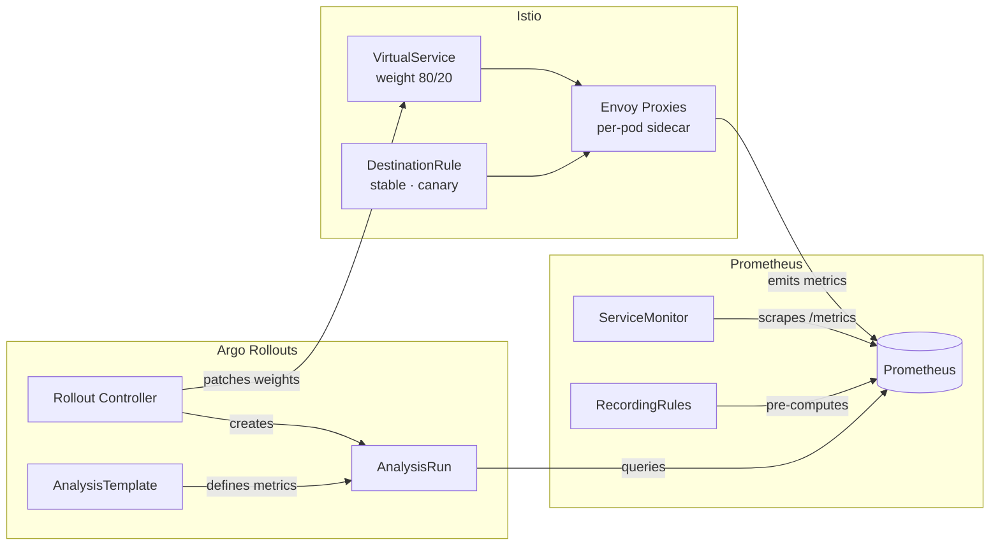
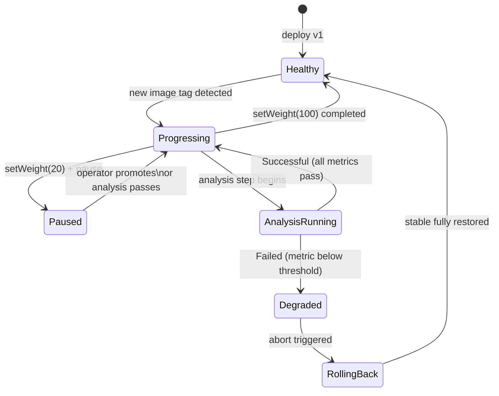
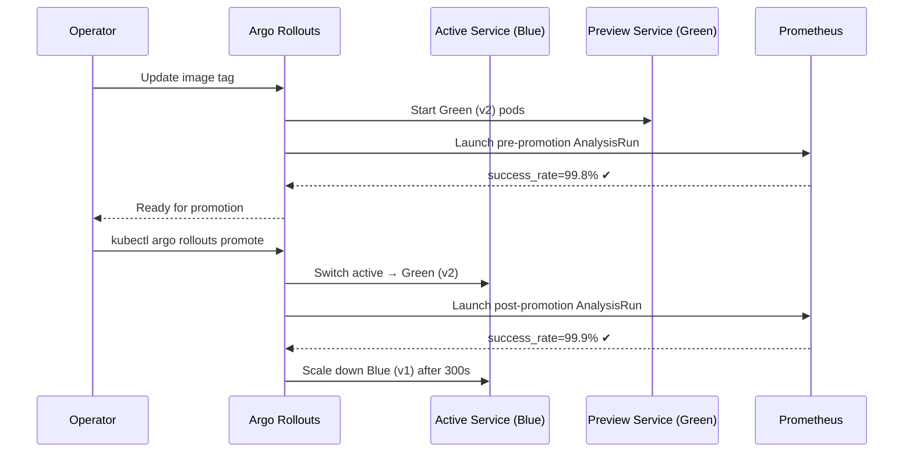
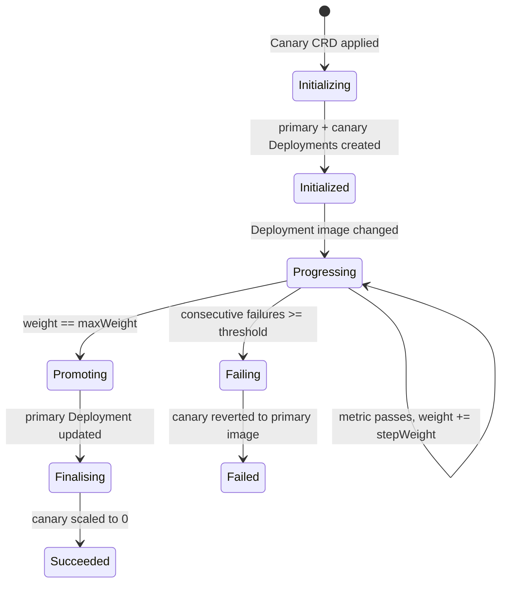
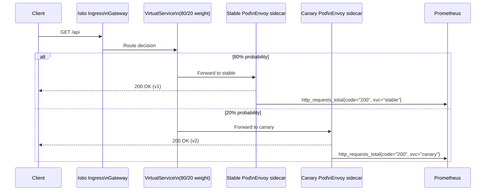

# Architecture — Zero-Downtime Progressive Delivery

Deep-dive on the control planes, state machines, and traffic mechanics.

---

## Control plane topology



---

## Rollout phase state machine



---

## Traffic weight timeline — canary promote

```
Time →     T+0m    T+5m    T+10m   T+15m   T+20m   T+25m
           ┌───────┬───────┬───────┬───────┬───────┐
Stable %   │  100  │  80   │  60   │  40   │  20   │  0 (promoted)
           ├───────┼───────┼───────┼───────┼───────┤
Canary %   │   0   │  20   │  40   │  60   │  80   │  100
           └───────┴───────┴───────┴───────┴───────┘
                   ↑       ↑       ↑       ↑
             Analysis   Analysis  Analysis  Analysis
             gate #1    gate #2   gate #3   gate #4
             (5m each — must pass before advancing)
```

---

## Traffic weight timeline — bad canary rollback

```
Time →     T+0m    T+5m    T+5m30s   T+6m
           ┌───────┬───────┬──────────┬──────────────
Stable %   │  100  │  80   │  80      │  100  ← snapped back
           ├───────┼───────┼──────────┼──────────────
Canary %   │   0   │  20   │  20      │   0   ← ejected
           └───────┴───────┴──────────┴──────────────
                           ↑
                    AnalysisRun failed
                    (success_rate < 0.99 for 10 samples)
                    → Rollout status: Degraded
                    → VirtualService patched 100/0
```

---

## Blue-green slot mechanics



---

## Flagger mesh canary lifecycle



---

## Request path during canary (Istio data plane)



---

## Key design decisions

| Decision | Chosen approach | Why not the alternative |
|----------|----------------|------------------------|
| Traffic splitting | Istio VirtualService weights | DNS-based splitting (k8s Services) only achieves ~50/50 without sticky sessions; VS gives exact percentages |
| Metric evaluation | Prometheus AnalysisTemplate | Datadog/NewRelic require external credentials; Prometheus is co-located, no latency |
| Rollout controller | Argo Rollouts (not ArgoCD Rollout plugin) | Rollouts is purpose-built for progressive delivery; ArgoCD is for GitOps sync |
| Canary vs Blue-Green | Both demonstrated | Canary saves 2× resource cost but has mixed traffic; Blue-Green costs 2× but enables clean smoke test |
| Image fault injection | BAD_WEIGHT env var | Chaos Mesh is more realistic but adds operator complexity for a learning project |
| Distroless base | `gcr.io/distroless/static:nonroot` | Alpine still has a shell; distroless shrinks attack surface to zero |

---

## Prometheus metric taxonomy

```
http_requests_total{code, path, kubernetes_service_name, kubernetes_pod_name}
http_request_duration_seconds_bucket{path, le, kubernetes_service_name}
app_build_info{version}

── Pre-computed (RecordingRules) ──
job:http_requests:success_rate2m{kubernetes_service_name}
job:http_request_duration_seconds:p95_2m{kubernetes_service_name}
job:http_requests:canary_traffic_ratio2m
```

---

## Failure modes and mitigations

| Failure | Detection | Mitigation |
|---------|-----------|-----------|
| Canary returns 5xx | AnalysisRun: success_rate < 0.99 | Auto-rollback within one analysis interval (30s) |
| Canary p95 > 200ms | AnalysisRun: p95_latency > 0.200 | Auto-rollback |
| Prometheus unavailable | AnalysisRun: inconclusiveLimit exceeded | Rollout paused (not failed) — operator decides |
| Istio sidecar crash | Envoy outlier detection | Pod ejected from load-balancing pool |
| k8s node failure | Pod rescheduling + readiness probes | New pod must pass readiness before receiving traffic |
| Config error (bad image) | Readiness probe fails | Pod never becomes Ready; Rollout stays at previous step |
