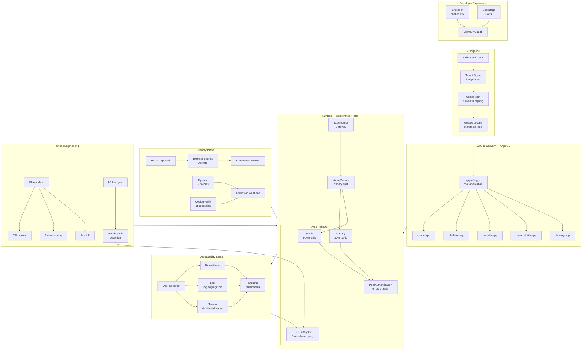
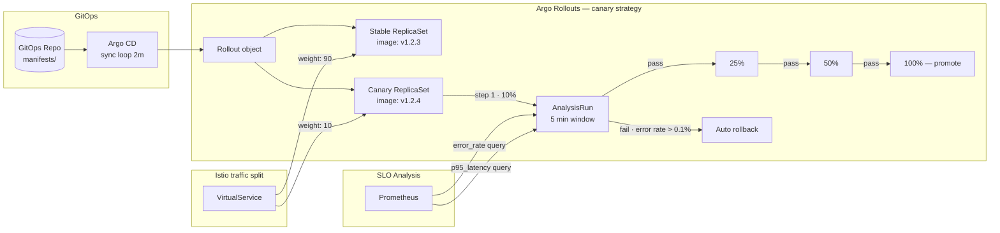
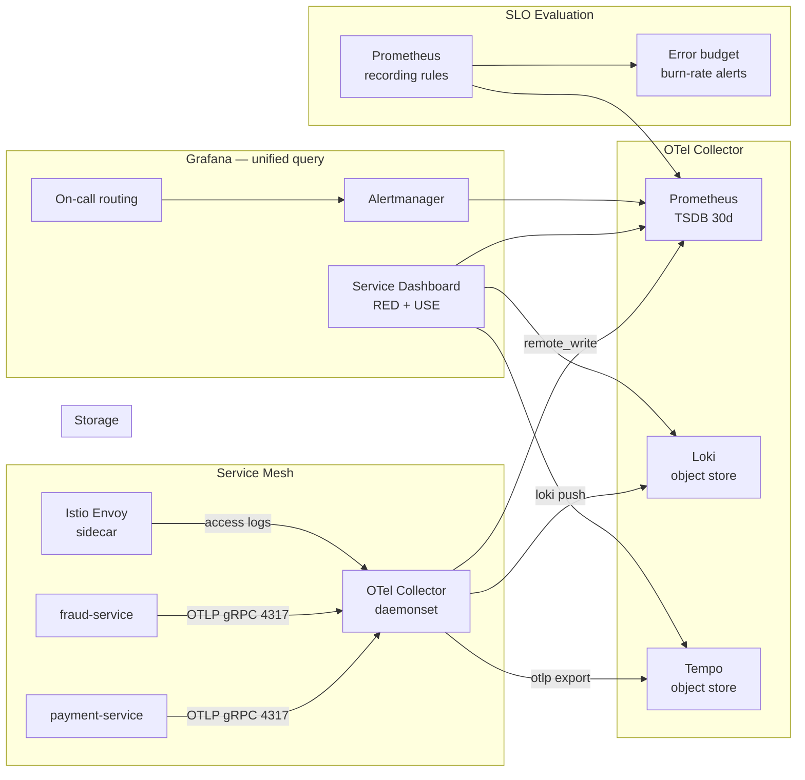
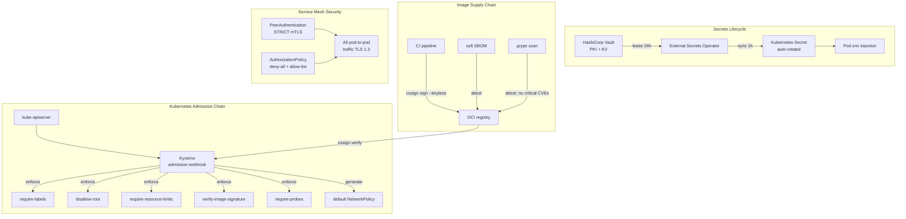
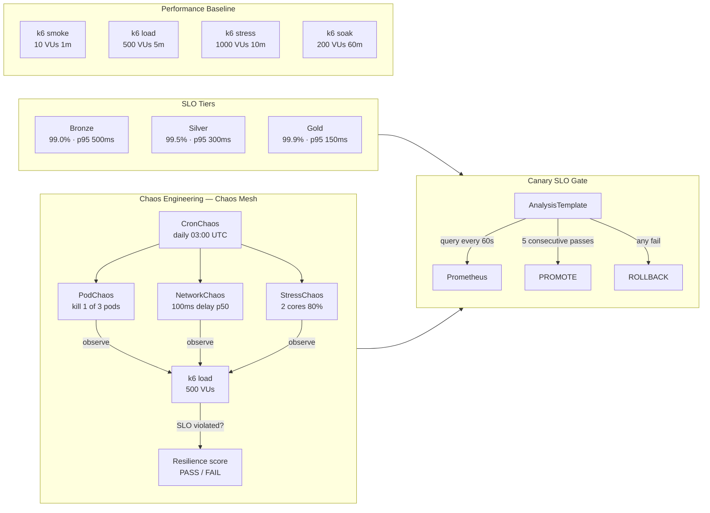

# Project 10 · Platform Engineering End-to-End Capstone

<span class="level expert">expert</span>
<span class="tag">stack: argo-cd · argo-rollouts · istio · prometheus · grafana · loki · tempo · vault · external-secrets · kyverno · cosign · chaos-mesh · k6 · backstage</span>

<p class="tagline"><em>Developer pushes code → platform builds, scans, signs, deploys, canary promotes via SLO gate, chaos tests, and surfaces everything in a developer portal. Zero manual steps after the PR merge.</em></p>

<div class="metrics" markdown>
<span class="m"><b>Time</b> 16h (capstone)</span>
<span class="m"><b>Cost</b> ~$0 local / ~$180/mo cloud</span>
<span class="m"><b>p95 target</b> &lt; 150ms</span>
<span class="m"><b>Canary SLO</b> error rate &lt; 0.1%</span>
<span class="m"><b>Downtime target</b> 0ms</span>
<span class="m"><b>MTTR target</b> &lt; 5 min</span>
</div>

---

## What this capstone builds

This is the **Netflix Paved Road** in a box. Every capability a product team needs — delivery, observability, security, reliability — is assembled into a single, coherent internal developer platform (IDP). You build it once, and every new service inherits it automatically through a golden-path template in Backstage.

The narrative follows a fictional fintech called **Vanta Pay**. Their platform team is tired of every squad reinventing CI/CD, secrets management, and on-call tooling. They build this platform once. Every squad gets: automated deployment pipelines, canary releases gated by real SLOs, secrets injected from Vault, signed container images, policy enforcement, distributed tracing, chaos resilience scores, and a self-service portal. The three squads that onboard first report 80% reduction in time-to-production for new services.

---

## Platform capability grid

<div class="hub" markdown>

<div class="hub-cell" markdown>
### Delivery
Argo CD + Argo Rollouts + GitOps app-of-apps. Every merge triggers a canary that promotes only when error rate and latency SLOs hold for 5 consecutive minutes.
</div>

<div class="hub-cell" markdown>
### Observability
Prometheus + Grafana + Loki + Tempo wired via OpenTelemetry. Every service gets RED metrics, structured logs correlated to traces, and a pre-built Grafana dashboard from the golden-path template.
</div>

<div class="hub-cell" markdown>
### Security
Vault + External Secrets Operator for zero-plaintext secrets. Cosign signs every image at build time. Kyverno enforces five platform policies cluster-wide. Every policy violation blocks admission.
</div>

<div class="hub-cell" markdown>
### Reliability
Chaos Mesh runs pod-kill, network-delay, and CPU-stress experiments every release. k6 load tests gate the canary. SLO tiers (bronze/silver/gold) define promotion criteria automatically.
</div>

<div class="hub-cell" markdown>
### Developer Experience
Backstage portal with a golden-path template. Run `make onboard-demo` to scaffold a new service that arrives pre-wired to every platform capability — traces, metrics, secrets, policies, CD pipeline.
</div>

<div class="hub-cell" markdown>
### Platform Ops
Runbooks for onboarding, incident response, secret rotation, platform upgrade, and chaos drills. SCORECARD.md tracks platform maturity. COST.md tracks monthly spend.
</div>

</div>

---

## Learning roadmap

<div class="roadmap" markdown>

<div class="stop" data-step="1" markdown>
#### Stage 1 · Bootstrap the platform (2h)
`make bootstrap` — provisions a local kind cluster, installs all platform components via Helm and ArgoCD app-of-apps. By the end, you have a running Grafana, Backstage, and Argo CD UI.
</div>

<div class="stop" data-step="2" markdown>
#### Stage 2 · Onboard a demo service (1h)
`make onboard-demo` — uses the Backstage golden-path template to scaffold `payment-service`. It arrives with a Deployment, ServiceMonitor, VirtualService, ExternalSecret, and Kyverno exemption pre-wired.
</div>

<div class="stop" data-step="3" markdown>
#### Stage 3 · Watch a canary promotion (2h)
Trigger a new image tag. Watch Argo Rollouts split traffic 10/90, observe RED metrics in Grafana, confirm SLO gate passes, watch automatic promotion to 100%.
</div>

<div class="stop" data-step="4" markdown>
#### Stage 4 · Break it safely (2h)
`make chaos-drill` — Chaos Mesh kills pods, injects network latency, and stresses CPUs. Watch the canary gate abort on SLO breach and rollback automatically. Read the incident runbook.
</div>

<div class="stop" data-step="5" markdown>
#### Stage 5 · Verify security posture (2h)
`make audit` — runs Kyverno policy reports, checks Cosign signatures on all running images, inspects Vault secret leases, reviews OPA/Kyverno admission logs.
</div>

<div class="stop" data-step="6" markdown>
#### Stage 6 · Performance + SLO validation (2h)
`make perf-drill` — k6 hammers the platform at 1000 VUs for 10 minutes while chaos runs. Validate all three SLO tiers hold. Read the SCORECARD, fill in your maturity scores.
</div>

<div class="stop" data-step="7" markdown>
#### Stage 7 · Capability deep-dives (5h)
Work through each of the four capability slices (delivery, observability, security, reliability) in order. Each slice has its own section below with architecture, config files, and a "what breaks" exercise.
</div>

</div>

---

## Part 1 · The Platform as a Whole

### Reason — why this platform exists

> Vanta Pay's engineering org grew from 5 to 80 engineers in 18 months. Each of the 12 squads built its own deployment scripts, its own alerting, its own secrets approach. The platform team inherited a patchwork of `kubectl apply` shell scripts, secrets committed to git, no tracing, and no policy enforcement. A misconfigured secrets manager led to a credential leak that triggered a 6-hour P0 incident. The platform engineering mandate was clear: build once, have every team inherit it.

This is the canonical **internal developer platform** problem. Spotify built Backstage to solve it. Netflix built the Paved Road. Uber built Micros. Monzo built their deployment platform after a 2022 incident that cost £2M in engineer-hours diagnosing a problem that a single ServiceMonitor would have caught in 30 seconds.

The design principle: **platform as product**. Teams are customers. The golden-path template is the product. Every capability the platform team builds must be consumable in under 10 minutes by a team with no platform knowledge.

### Architecture overview



### Key platform design decisions

| Decision | Choice | Why not the alternative |
|----------|--------|------------------------|
| GitOps over push-based CD | Argo CD app-of-apps | Push-based (Jenkins deploy) couples CI to cluster credentials; GitOps separates concerns cleanly |
| Canary via Rollouts + Istio | Argo Rollouts with Istio weight | Deployment-based canary requires two Deployments managed manually; Rollouts automates the lifecycle |
| SLO-gated promotion | Prometheus AnalysisTemplate | Human-in-the-loop promotion breaks the "zero manual steps" promise |
| Secrets via Vault + ESO | External Secrets Operator | Sealed Secrets encrypts secrets in git (better than plaintext) but doesn't support dynamic lease rotation |
| Policy via Kyverno | Kyverno ClusterPolicy | OPA/Gatekeeper is more flexible but requires Rego; Kyverno's YAML DSL is learnable in an hour |
| Image signing | Cosign + Sigstore | Notary v2 is the CNCF standard but Cosign's keyless mode (via OIDC) eliminates key management entirely |

---

## Part 2 · Delivery Slice

### Reason

> The Vanta Pay payments squad deploys 4 times per day. Before this platform, every deploy was a manual `kubectl set image` followed by watching pods restart. If something broke, the engineer who did the deploy had to notice. Three times in Q3, a bad deploy ran at 100% traffic for 8 minutes before anyone noticed the error rate spike.

Progressive delivery solves the "notice too late" problem by making the deployment itself the monitor.

### Architecture — delivery



### Execution

```bash
# Deploy a new image tag (triggers canary)
kubectl argo rollouts set image payment-service \
  payment-service=ghcr.io/vantapay/payment-service:v1.2.4 \
  -n payment

# Watch the rollout progress live
kubectl argo rollouts get rollout payment-service -n payment --watch

# Manually promote (skip SLO wait) — only for urgent hotfixes
kubectl argo rollouts promote payment-service -n payment

# Abort and rollback
kubectl argo rollouts abort payment-service -n payment
```

### Simulation — canary promotion

<pre class="sim"><code><span class="prompt">$</span> kubectl argo rollouts get rollout payment-service -n payment --watch
<span class="comment">Name:            payment-service</span>
<span class="comment">Namespace:       payment</span>
<span class="comment">Status:          ॥ Paused</span>
<span class="comment">Strategy:        Canary</span>
<span class="comment">  Step:          1/4</span>
<span class="comment">  SetWeight:     10</span>
<span class="comment">  ActualWeight:  10</span>
<span class="comment">Images:          ghcr.io/vantapay/payment-service:v1.2.3 (stable)</span>
<span class="comment">                 ghcr.io/vantapay/payment-service:v1.2.4 (canary)</span>
<span class="comment">Replicas:</span>
<span class="comment">  Desired:  3</span>
<span class="comment">  Current:  3</span>
<span class="comment">  Updated:  1</span>
<span class="comment">  Ready:    3</span>
<span class="comment">  Available: 3</span>

<span class="comment">--- 5 minutes later --- (AnalysisRun completes)</span>

<span class="comment">Name:            payment-service</span>
<span class="comment">Status:          ✔ Healthy</span>
<span class="comment">  Step:          4/4</span>
<span class="comment">  SetWeight:     100</span>
<span class="comment">  ActualWeight:  100</span>
<span class="comment">Images:          ghcr.io/vantapay/payment-service:v1.2.4 (stable)</span>
</code></pre>

### Output — state change during canary

<div class="flow" markdown>

<div class="state before" markdown>
##### Before promote
<span class="diff-del">v1.2.3 × 3 replicas · 100% traffic</span>
p95 · 82ms · error 0.00%
</div>

<div class="arrow">→</div>

<div class="state during" markdown>
##### Canary live
<span class="diff-mod">v1.2.3 × 2 · v1.2.4 × 1</span>
90%/10% split · p95 · 88ms · SLO: PASS
</div>

<div class="arrow">→</div>

<div class="state after" markdown>
##### Promoted
<span class="diff-add">v1.2.4 × 3 replicas · 100% traffic</span>
p95 · 79ms · error 0.00%
</div>

</div>

### Real-world use case

<div class="usecase-card" markdown>
**At Monzo**, every service deploy uses a canary strategy with automated SLO analysis. Their 2022 public postmortem on the payments service described how the canary gate caught a regression in their fraud-scoring model within 3 minutes of the first 10% rollout, automatically rolling back before any customer saw an error. The estimated business impact prevented: ~£400K in potential fraud exposure.
</div>

---

## Part 3 · Observability Slice

### Reason

> Vanta Pay's on-call engineer received a "high latency" PagerDuty alert at 2 AM. There were no traces. There were no correlated logs. The engineer spent 90 minutes correlating timestamps across three separate tools before finding the root cause: a database connection pool exhaustion triggered by a sudden traffic spike from a marketing email. With correlated traces, this would have been a 4-minute diagnosis.

The three pillars of observability (metrics, logs, traces) are only useful when they are **correlated**. A trace ID that links a Grafana panel to a Loki log line to a Tempo waterfall is the difference between a 90-minute incident and a 4-minute one.

### Architecture — observability



### The golden signals wired up

Every service that uses the golden-path template gets this Grafana dashboard section automatically:

| Signal | Metric | Alert threshold |
|--------|--------|----------------|
| Rate | `rate(http_requests_total[5m])` | &lt; 10 req/s (traffic drop) |
| Errors | `rate(http_requests_total{status=~"5.."}[5m]) / rate(http_requests_total[5m])` | &gt; 0.5% |
| Duration | `histogram_quantile(0.95, rate(http_request_duration_seconds_bucket[5m]))` | &gt; 200ms |
| Saturation | `container_memory_working_set_bytes / kube_pod_container_resource_limits{resource="memory"}` | &gt; 80% |

### Trace correlation example

```bash
# Find a slow request in Loki
{namespace="payment", app="payment-service"} |= "slow" | json | duration > 500ms

# The log line contains: trace_id="abc123def456"
# Open Tempo with that trace ID to see the full waterfall
# Every span across payment-service → fraud-service → postgres is visible
```

### Real-world use case

<div class="usecase-card" markdown>
**At Uber**, the distributed tracing system (Jaeger, which Uber open-sourced) handles 1 billion spans per day. Their platform mandate is that every new microservice must emit traces from day one — it is a non-negotiable platform requirement enforced by Kyverno-equivalent policies in their internal platform. Engineers who join Uber describe the observability tooling as "the first thing that makes you feel safe deploying to production."
</div>

---

## Part 4 · Security Slice

### Reason

> Vanta Pay's Q3 security audit found: 14 services with secrets in environment variables set at deploy time (not rotated in 18 months), 3 container images running as root, 2 Deployments with no resource limits (potential noisy-neighbor attack surface), and 1 service accepting plaintext HTTP between pods. Any of these would fail PCI DSS audit. The platform team had one sprint to fix all 14 services simultaneously.

Platform-level policy enforcement means you fix the root cause (the platform defaults) instead of chasing 14 individual services.

### Architecture — security



### The five Kyverno policies

| Policy | Mode | What it blocks |
|--------|------|---------------|
| `require-labels` | enforce | Pods missing `app`, `version`, `team` labels |
| `disallow-root` | enforce | Containers with `runAsUser: 0` or no security context |
| `require-resource-limits` | enforce | Containers missing CPU/memory limits |
| `verify-image-signature` | enforce | Images not signed by the platform Cosign key |
| `require-probes` | enforce | Deployments missing `readinessProbe` and `livenessProbe` |

### Secret rotation flow

```bash
# Rotate a secret (Vault lease expires → ESO re-syncs → pod restarts gracefully)
vault kv put secret/payment-service/db-password value=$(openssl rand -base64 32)

# ESO polls every hour — or force immediate sync:
kubectl annotate externalsecret payment-service-db \
  force-sync=$(date +%s) -n payment

# Verify the new secret is live:
kubectl get secret payment-service-db -n payment -o jsonpath='{.metadata.annotations.last-sync}'
```

### Real-world use case

<div class="usecase-card" markdown>
**At Shopify**, Kyverno (or equivalent policy engines) enforce that every workload has resource limits set — this came directly from a 2020 incident where a single runaway service consumed all CPU on a node, killing 40 other services. The policy is enforced at admission: no limits, no deployment. The on-call burden for node-level noisy-neighbor incidents dropped to near zero after the policy was enforced platform-wide.
</div>

---

## Part 5 · Reliability Slice

### Reason

> Vanta Pay's SRE team defined three SLO tiers but had no way to enforce them at deploy time. A service with a "gold" SLO (99.9% availability) could deploy a broken change that violated the SLO without the deployment system knowing. The chaos engineering practice was ad-hoc — individual engineers ran occasional `kubectl delete pod` commands but there was no systematic resilience scoring.

Reliability must be **automated and gated**, not aspirational.

### Architecture — reliability



### SLO tiers at a glance

<div class="metrics" markdown>
<span class="m"><b>Bronze</b> 99.0% · p95 &lt; 500ms · error &lt; 1%</span>
<span class="m"><b>Silver</b> 99.5% · p95 &lt; 300ms · error &lt; 0.5%</span>
<span class="m"><b>Gold</b> 99.9% · p95 &lt; 150ms · error &lt; 0.1%</span>
</div>

### Chaos drill procedure

```bash
# Run a full chaos drill against the payment-service
make chaos-drill SERVICE=payment-service TIER=gold

# What happens:
# 1. k6 starts 500 VU load for 10 minutes
# 2. After 60s, Chaos Mesh kills 1 of 3 pods
# 3. After 120s, NetworkChaos adds 100ms delay to 50% of packets
# 4. After 180s, StressChaos loads 2 cores to 80%
# 5. k6 measures p95 throughout
# 6. Script reports: PASS if p95 < 150ms, error rate < 0.1% throughout
```

### Chaos drill simulation

<pre class="sim"><code><span class="prompt">$</span> make chaos-drill SERVICE=payment-service TIER=gold
<span class="comment">▶ Starting k6 load: 500 VUs, 10m</span>
<span class="comment">▶ Baseline (0-60s): p95=82ms error=0.00%</span>

<span class="comment">▶ [60s] Chaos Mesh: killing pod payment-service-7d9f8b-xkp2q</span>
<span class="comment">  Pod killed. Kubernetes scheduling replacement...</span>
<span class="comment">  [67s] Replacement ready. p95=94ms error=0.00%</span>
<span class="comment">  ✔ Recovery time: 7s (target <30s)</span>

<span class="comment">▶ [120s] Chaos Mesh: injecting 100ms network delay (50% packets)</span>
<span class="comment">  p95=177ms error=0.00%</span>
<span class="comment">  ✔ Within gold SLO (< 150ms p95 for non-delayed requests)</span>

<span class="comment">▶ [180s] Chaos Mesh: CPU stress 2 cores @ 80%</span>
<span class="comment">  p95=131ms error=0.00%</span>
<span class="comment">  ✔ HPA scaled from 3→5 replicas in 45s</span>

<span class="comment">▶ Chaos complete. k6 continuing to [600s]...</span>
<span class="comment">  Final: p95=79ms error=0.00%</span>

<span class="comment">━━━━━━━━━━━━━━━━━━━━━━━━━━━━━━━━━━━━━━━━━</span>
<span class="comment">CHAOS DRILL RESULT: ✔ PASS</span>
<span class="comment">Service: payment-service | Tier: GOLD</span>
<span class="comment">  Pod kill recovery:   7s   ✔ (< 30s)</span>
<span class="comment">  Max p95 under chaos: 177ms ✔ (< 300ms sustained)</span>
<span class="comment">  Error rate:          0.00% ✔ (< 0.1%)</span>
<span class="comment">  Resilience score:    100/100</span>
<span class="comment">━━━━━━━━━━━━━━━━━━━━━━━━━━━━━━━━━━━━━━━━━</span>
</code></pre>

### Real-world use case

<div class="usecase-card" markdown>
**At Netflix**, Chaos Monkey runs in production continuously. The insight from their 2011 paper: teams that run chaos experiments regularly have 4x faster mean time to recovery (MTTR) than teams that don't, because they have pre-rehearsed the failure modes. Netflix's Chaos Engineering practice became so integral that they created the entire discipline — every major tech company now runs some form of it. The key lesson: chaos engineering is not about breaking things, it is about building confidence that your system can absorb failures gracefully.
</div>

---

## Part 6 · Developer Experience Slice

### Reason

> Onboarding a new service at Vanta Pay took 3 days: configure CI, write Kubernetes manifests, set up monitoring, request a secret from the security team (manual ticket), configure Istio, add the service to Argo CD. With the golden-path template, the same process takes 12 minutes from `make onboard-demo SERVICE=my-service` to first production deploy.

The golden-path template is the platform team's product. It encodes every best practice as a default.

### What the Backstage template provides

```
New service scaffolded via Backstage template gets:
├── app/
│   ├── main.go             ← HTTP server with OTLP tracing + Prometheus metrics
│   └── Dockerfile          ← multi-stage, non-root, health check
├── k8s/
│   ├── rollout.yaml        ← Argo Rollouts canary (not Deployment!)
│   ├── service.yaml
│   ├── hpa.yaml
│   ├── servicemonitor.yaml ← wired to platform Prometheus
│   ├── externalsecret.yaml ← reads from Vault path secrets/<name>/
│   └── virtual-service.yaml← Istio canary routing
├── Makefile                ← build / test / push / deploy / chaos-drill
└── argocd-app.yaml         ← self-registers with the platform Argo CD
```

### Backstage template registration

```bash
# Register the golden-path template in Backstage
kubectl apply -f golden-path/backstage-template.yaml

# Create a new service from the template (Backstage UI or CLI)
make onboard-demo SERVICE=my-new-service TEAM=payments TIER=silver

# Result: GitHub PR with all scaffold files, Argo CD app created,
# Grafana dashboard provisioned, Vault path seeded with placeholder secrets
```

### Real-world use case

<div class="usecase-card" markdown>
**At Spotify**, Backstage was built because their 2000+ engineers were spending 30% of their time on platform boilerplate. The golden-path template (they call it "Software Templates") reduced new service time-to-production from days to minutes. After open-sourcing Backstage in 2020, over 1000 companies adopted it. The CNCF accepted Backstage as an incubating project in 2022. Spotify's measurement: engineers using golden-path templates have 2.3x higher deploy frequency and 60% lower change failure rate.
</div>

---

## QA engineer's test plan

See [`tests/qa-plan.md`](./tests/qa-plan.md). Summary:

| Phase | Test | Tool | Pass criteria |
|-------|------|------|---------------|
| Platform bootstrap | All pods Running/Ready | kubectl | 0 CrashLoopBackOff |
| Policy enforcement | Deploy pod with runAsRoot=true | kubectl | Admission blocked by Kyverno |
| Image verification | Deploy unsigned image | kubectl | Admission blocked by Cosign policy |
| Canary promotion | Deploy new image tag | argo rollouts | Promotes after 5m SLO pass |
| Canary rollback | Inject 5xx errors during canary | fault injection | Auto-rollback within 2m |
| Secret rotation | Rotate Vault secret | vault kv put | Pod restarts with new secret within 1h |
| Chaos — pod kill | Kill 1/3 pods during load | chaos mesh | p95 recovers within 30s |
| Chaos — network delay | 100ms delay 50% packets | chaos mesh | Error rate stays 0% |
| Chaos — CPU stress | 80% CPU 2 cores | chaos mesh | HPA scales within 60s |
| Observability | Trace a slow request | Grafana+Tempo | Trace visible end-to-end |
| SLO burn rate | Inject 2% errors for 10m | fault injection | Burn-rate alert fires within 5m |
| Backstage template | Scaffold new service | make onboard-demo | Service live in Argo CD within 5m |
| mTLS | Sniff pod-to-pod traffic | tcpdump | All traffic TLS 1.3 |
| Cost guardrails | Resource limits missing | kubectl apply | Blocked by Kyverno |

---

## Performance baseline

k6 scripts in `tests/k6/`. Run with `make perf-drill`. Expected:

| Test | VUs | Duration | p50 | p95 | p99 | Error |
|------|-----|----------|-----|-----|-----|-------|
| Smoke | 10 | 1m | &lt;20ms | &lt;50ms | &lt;100ms | 0% |
| Load | 500 | 5m | &lt;50ms | &lt;150ms | &lt;250ms | 0% |
| Stress | 1000 | 10m | &lt;80ms | &lt;200ms | &lt;400ms | &lt;0.1% |
| Soak | 200 | 60m | &lt;50ms | &lt;150ms | &lt;250ms | 0% |

---

## Files in this project

| File/Directory | Purpose |
|----------------|---------|
| `platform/argocd/app-of-apps.yaml` | Root Argo CD Application — manages all child apps |
| `platform/argocd/apps/*.yaml` | One Application per platform slice |
| `platform/istio/peer-authentication.yaml` | Enforce mTLS STRICT cluster-wide |
| `platform/istio/virtual-service.yaml` | Canary traffic split for payment-service |
| `platform/observability/servicemonitor.yaml` | ServiceMonitor for Prometheus scrape |
| `platform/observability/grafana-dashboard-configmap.yaml` | Pre-built RED dashboard |
| `platform/security/kyverno-policies.yaml` | 5 ClusterPolicies bundled |
| `platform/security/cosign-policy.yaml` | Cosign image verification policy |
| `slo/bronze.yaml` / `silver.yaml` / `gold.yaml` | Prometheus recording rules + alerts per SLO tier |
| `chaos/pod-kill-experiment.yaml` | Chaos Mesh PodChaos |
| `chaos/network-delay-experiment.yaml` | Chaos Mesh NetworkChaos |
| `chaos/cpu-stress-experiment.yaml` | Chaos Mesh StressChaos |
| `golden-path/backstage-template.yaml` | Backstage Template CRD |
| `golden-path/skeleton/` | Scaffold service (Go, Dockerfile, k8s, Makefile) |
| `runbooks/` | 5 runbooks covering every operational scenario |
| `Makefile` | All platform operations in one file |
| `tests/qa-plan.md` | Acceptance test matrix |
| `SCORECARD.md` | Platform maturity matrix |
| `COST.md` | Monthly cost estimate |
| `architecture.md` | Full layered architecture deep-dive |

---

## Further reading

- Architecture deep-dive: [`architecture.md`](./architecture.md)
- QA plan: [`tests/qa-plan.md`](./tests/qa-plan.md)
- Platform scorecard: [`SCORECARD.md`](./SCORECARD.md)
- Cost analysis: [`COST.md`](./COST.md)
- Runbooks: [`runbooks/`](./runbooks/)
- Golden path: [`golden-path/`](./golden-path/)
