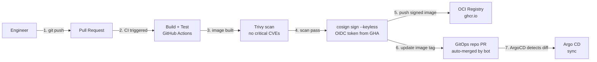
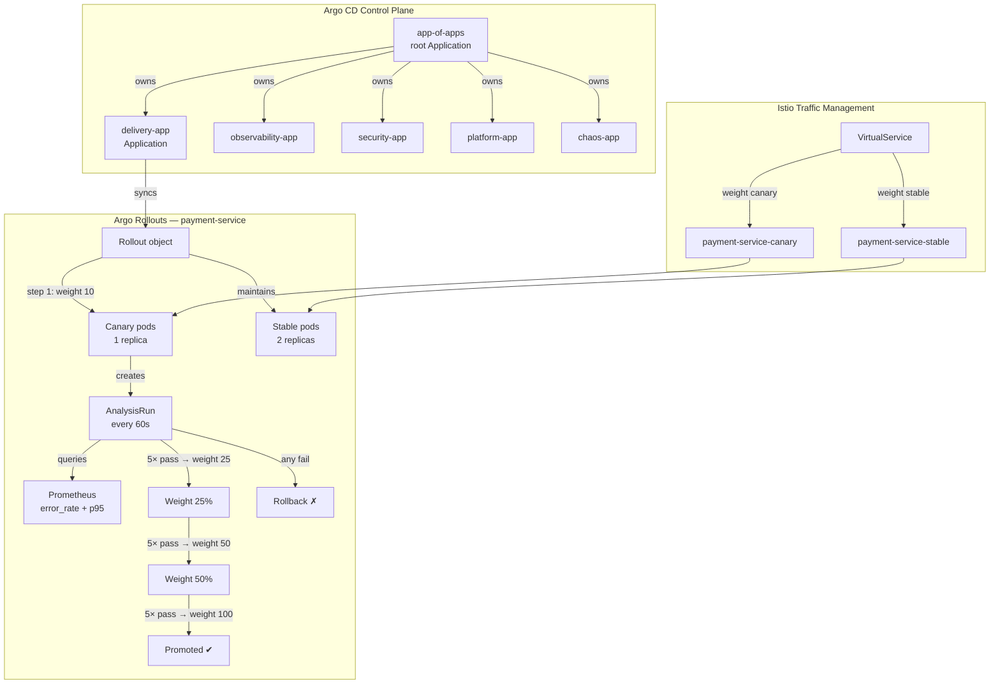
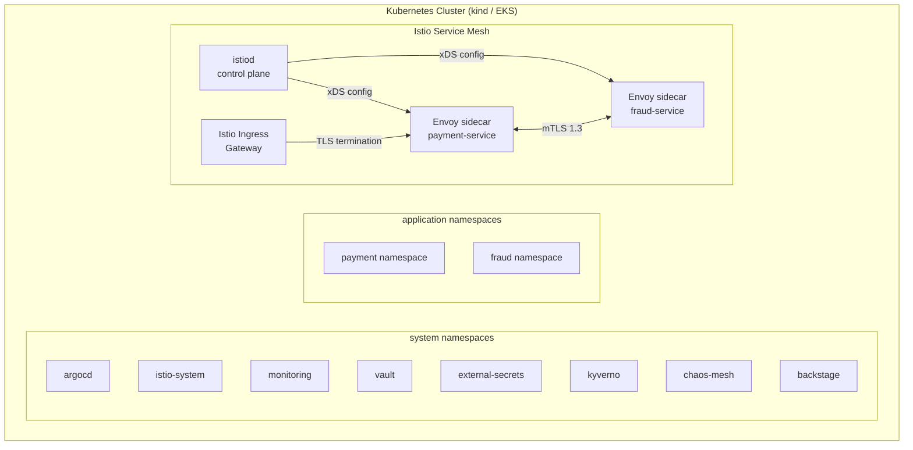
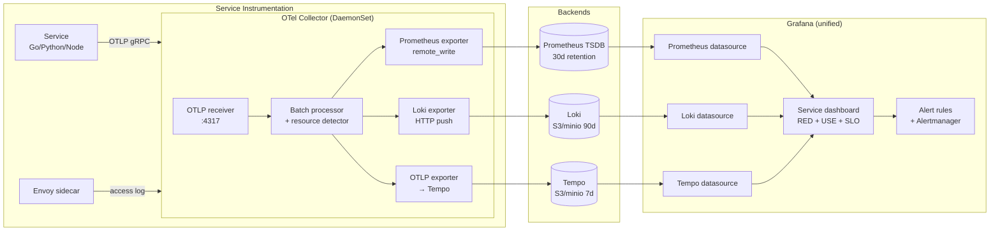
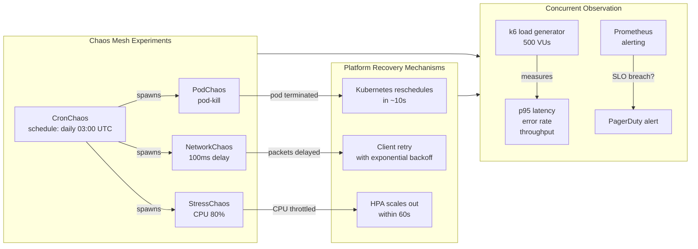

# Architecture Deep-Dive · Platform Engineering Capstone

This document traces every data path, control plane interaction, and failure mode across the six platform layers.

---

## Layer 1 · Developer Experience Layer



**Key decisions:**
- Keyless Cosign signing uses GitHub Actions OIDC token — no private key to manage or rotate
- GitOps PR is auto-merged only when the image scan attestation is present
- The engineer interacts with exactly one system: GitHub. Everything else is automated.

---

## Layer 2 · Delivery Layer (GitOps + Canary)



**Canary strategy parameters:**

| Parameter | Value | Rationale |
|-----------|-------|-----------|
| Initial canary weight | 10% | Low blast radius for first exposure |
| Step progression | 10→25→50→100 | Non-linear — jumps fast once confidence builds |
| Analysis interval | 60s | Fast feedback without noise from single-request spikes |
| Consecutive passes required | 5 | 5 minutes of clean data before promoting |
| Error rate threshold | 0.1% (gold), 0.5% (silver), 1% (bronze) | Tier-appropriate |
| Rollback trigger | Any single analysis failure | Fail-fast; do not wait for sustained failure |

---

## Layer 3 · Runtime Layer (Kubernetes + Istio)



**mTLS enforcement:**

```yaml
# PeerAuthentication: STRICT mode means:
# - All pod-to-pod communication MUST use mTLS
# - Plain HTTP connections are rejected
# - Istio sidecar handles certificate rotation automatically (every 24h)
# - Certificate authority: Istio's built-in CA (Citadel)
```

---

## Layer 4 · Observability Layer



**Trace correlation:** Every log line emitted by instrumented services includes `trace_id` and `span_id`. Loki's `derived fields` configuration detects these automatically and renders a "View in Tempo" link in Grafana, allowing one-click navigation from a log line to its trace waterfall.

**Recording rules pre-compute:**
- `job:http_requests:rate5m` — per-job request rate
- `job:http_errors:rate5m` — per-job error rate
- `job:http_request_duration_p95:5m` — p95 latency
- `job:slo_error_budget_remaining:ratio` — error budget burn

---

## Layer 5 · Security Layer

```mermaid
flowchart TB
    subgraph Supply["Supply Chain Security"]
        CODE[Source code] -->|git push| GHA[GitHub Actions]
        GHA -->|build| IMG[Container image]
        IMG -->|trivy scan| SCAN_RESULT{critical CVEs?}
        SCAN_RESULT -->|yes| BLOCK[Block push ✗]
        SCAN_RESULT -->|no| SYFT[syft SBOM]
        SYFT -->|cosign attest| REGISTRY[(OCI Registry)]
        GHA -->|cosign sign --keyless| REGISTRY
    end

    subgraph Admission["Admission Control"]
        REGISTRY -->|image ref| DEPLOY[kubectl apply]
        DEPLOY --> KYVER_WEBHOOK[Kyverno webhook<br/>validating]
        KYVER_WEBHOOK -->|cosign verify| SIG_CHECK{signature valid?}
        SIG_CHECK -->|no| REJECT[Reject admission ✗]
        SIG_CHECK -->|yes| POLICY_CHECK{all policies pass?}
        POLICY_CHECK -->|no| REJECT2[Reject admission ✗]
        POLICY_CHECK -->|yes| SCHEDULE[Schedule pod ✔]
    end

    subgraph Secrets["Secrets Management"]
        VAULT_SRV[HashiCorp Vault] -->|dynamic secret lease| ESO_CTRL[External Secrets<br/>Operator controller]
        ESO_CTRL -->|creates/rotates| K8S_SEC[Kubernetes Secret]
        K8S_SEC -->|envFrom| POD_ENV[Pod environment]
        VAULT_SRV -->|PKI cert| MTLS_CERT[mTLS certificate<br/>(via Istio CA)]
    end
```

**Defense layers:**

| Layer | Control | What it prevents |
|-------|---------|-----------------|
| Build | Trivy image scan | Known CVEs reaching production |
| Build | Cosign keyless sign | Supply chain tampering |
| Admission | Kyverno 5 policies | Misconfigured workloads deploying |
| Admission | Cosign verify policy | Unsigned/tampered images running |
| Runtime | Istio mTLS STRICT | Pod-to-pod traffic interception |
| Runtime | Istio AuthorizationPolicy | Lateral movement between namespaces |
| Secrets | Vault + ESO | Plaintext secrets in git |
| Secrets | 24h lease rotation | Long-lived credential compromise |

---

## Layer 6 · Chaos Engineering Layer



**Hypothesis format** (per game day):

```
Hypothesis: "When 1 of 3 payment-service pods is killed,
             p95 latency will remain below 150ms (gold SLO)
             and error rate will remain 0%
             within 30 seconds of the kill event."

Steady state:  p95=80ms, error=0%, 3/3 pods Running
Experiment:    Kill pod payment-service-7d9f8b-xxxxx
Expected:      Kubernetes reschedules; client retries succeed
Measured:      p95=94ms peak (14s), recovered to 82ms by 27s
Result:        PASS — hypothesis confirmed
```

---

## Failure mode analysis

| Failure | Detection | Automated response | Manual action if needed |
|---------|-----------|-------------------|------------------------|
| Canary SLO breach | AnalysisRun | Auto-rollback | `argo rollouts abort` |
| Pod crash | Kubernetes liveness probe | Restart + reschedule | Check logs: `kubectl logs` |
| Node failure | Node `NotReady` | Workloads reschedule | Drain node, investigate |
| Vault unreachable | ESO sync error | Existing secrets remain | Manual: `vault status` |
| Registry unreachable | Image pull failure | Pod stays on old image | Check registry health |
| Kyverno webhook timeout | Admission webhook timeout | Cluster configured `failOpen=false` → block all deployments | Disable webhook, fix, re-enable |
| Istio CA cert expiry | Envoy TLS handshake failure | Istiod auto-rotates certs | `istioctl check-inject` |
| Loki storage full | Log drops | Alert fires | Expand storage or reduce retention |

---

## Network topology

```
External traffic
       │
       ▼
[Cloud Load Balancer]  ← or kind NodePort for local
       │
       ▼
[Istio Ingress Gateway]  ← TLS termination, cert managed by cert-manager
       │  HTTPS→HTTP (within mesh, mTLS re-established by Envoy)
       ▼
[VirtualService]  ← canary weight split
  ├── [payment-service stable]  ← ClusterIP
  └── [payment-service canary]  ← ClusterIP

Internal (service mesh):
[payment-service] ──mTLS──► [fraud-service]  ← AuthorizationPolicy enforced
[payment-service] ──mTLS──► [postgres]       ← DB traffic also in mesh
```

---

## Data flow — secret injection

```
1. CI/CD writes: vault kv put secret/payment-service/db-password value=<generated>
2. ExternalSecret controller polls Vault every 3600s (or on-demand)
3. ESO creates/updates Kubernetes Secret: payment-service-db
   - Secret data is base64-encoded, stored in etcd (etcd should be encrypted at rest)
4. Pod spec uses: envFrom: - secretRef: name: payment-service-db
5. Kubelet injects secret as environment variable at pod start
6. When Vault lease expires (24h), ESO auto-rotates:
   a. Vault generates new value
   b. ESO updates Kubernetes Secret
   c. Kubernetes rolling restart (triggered by pod annotation hash change)
   d. New pods start with new secret; old pods terminate gracefully
```

---

## Deployment topology diagram

```
kind cluster (local) or EKS cluster (cloud)
│
├── Node 1 (control-plane)
│   ├── kube-apiserver
│   ├── etcd (encrypted at rest)
│   ├── kube-scheduler
│   └── kube-controller-manager
│
├── Node 2 (worker)
│   ├── argocd (argocd ns)
│   ├── vault (vault ns)
│   ├── external-secrets (external-secrets ns)
│   └── kyverno (kyverno ns)
│
├── Node 3 (worker)
│   ├── istiod (istio-system ns)
│   ├── istio-ingressgateway (istio-system ns)
│   ├── prometheus (monitoring ns)
│   └── grafana (monitoring ns)
│
└── Node 4 (worker)
    ├── loki (monitoring ns)
    ├── tempo (monitoring ns)
    ├── chaos-mesh (chaos-mesh ns)
    ├── backstage (backstage ns)
    └── payment-service (payment ns) ← application workloads
```
