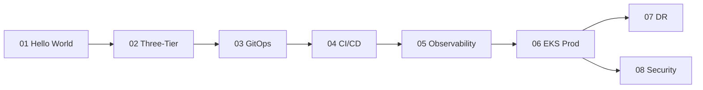

# 10 — Capstone Projects

End-to-end labs that combine everything from `01-linux` through `09-terraform` into integrated, real-world projects. Each project ships with copy-paste commands, working manifests, and verification steps.

## How to use this folder

1. Complete folders `01` through `09` first — projects assume you can run `kubectl`, `helm`, `docker`, and `terraform`.
2. Pick a project by difficulty. Each one is self-contained.
3. Follow the README top-to-bottom. Verify after every step.
4. Run the **Cleanup** section before moving on — these labs use cloud resources that cost money.

## Project Index

| # | Project | Difficulty | Time | Skills exercised |
|---|---------|------------|------|------------------|
| 01 | [Hello World End-to-End](./01-hello-world-end-to-end/) | Beginner | 1h | Docker, GHCR, kubectl, Ingress |
| 02 | [Three-Tier App on K8s](./02-three-tier-app/) | Intermediate | 3h | Helm, StatefulSets, Secrets, Services |
| 03 | [GitOps with ArgoCD](./03-gitops-with-argocd/) | Intermediate | 2h | ArgoCD, app-of-apps, sync policies |
| 04 | [CI/CD Pipeline](./04-ci-cd-pipeline/) | Intermediate | 2h | GitHub Actions, Trivy, GHCR, GitOps trigger |
| 05 | [Observability Stack](./05-observability-stack/) | Intermediate | 3h | Prometheus, Grafana, Loki, Tempo, OpenTelemetry |
| 06 | [Prod-Grade Cluster on AWS](./06-prod-grade-cluster-on-aws/) | Advanced | 4h | Terraform, EKS, IRSA, addons, helm |
| 07 | [Disaster Recovery](./07-disaster-recovery/) | Advanced | 3h | Velero, etcd snapshots, multi-AZ, restore drills |
| 08 | [Security Hardening Lab](./08-security-hardening-lab/) | Advanced | 4h | CIS benchmarks, Kyverno, NetworkPolicies, OIDC |

## Learning path

<!-- mermaid:rendered -->

Mermaid source

## Skill matrix

| Folder reference | Used by projects |
|------------------|------------------|
| `../01-linux/` | All |
| `../02-docker/` | 01, 02, 04 |
| `../03-kubernetes-core/` | 01, 02, 03, 05 |
| `../04-kubernetes-strategies/` | 02, 03, 07 |
| `../05-kubernetes-advanced/` | 06, 07, 08 |
| `../06-helm/` | 02, 03, 05, 06 |
| `../07-monitoring/` | 05, 06, 07 |
| `../08-security/` | 04, 06, 08 |
| `../09-terraform/` | 06 |

## Conventions
- All examples use namespace prefixed by project number, e.g. `proj01`, `proj02`.
- Container images pushed to `ghcr.io/<your-user>/<image>:<tag>`.
- Cloud examples use `us-east-1` and the `default` AWS profile unless stated.
