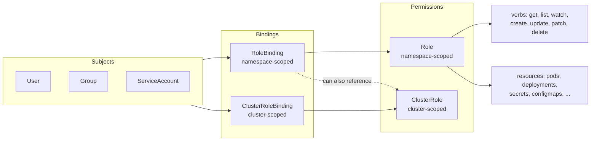

# 01 - RBAC Deep Dive

Kubernetes RBAC has four object types. Understand them or you will grant `cluster-admin` to a pod by accident.

## Mental Model



## Anatomy of a Rule

```yaml
rules:
  - apiGroups: [""]               # "" = core API
    resources: ["pods", "pods/log"]
    resourceNames: ["my-pod"]      # optional: restrict to specific names
    verbs: ["get", "list", "watch"]
```

## Core Verbs

| Verb | Meaning |
|------|---------|
| `get` / `list` / `watch` | Read |
| `create` / `update` / `patch` | Write |
| `delete` / `deletecollection` | Destroy |
| `*` | All — **avoid** |

`bind`, `escalate`, `impersonate` are special verbs — granting them lets a subject elevate.

## Aggregated ClusterRoles

Kubernetes supports composing ClusterRoles via labels — the controller merges all matching rules.

```yaml
apiVersion: rbac.authorization.k8s.io/v1
kind: ClusterRole
metadata:
  name: monitoring-aggregate
  labels:
    rbac.authorization.k8s.io/aggregate-to-view: "true"  # auto-merged into the built-in 'view' role
rules:
  - apiGroups: ["monitoring.coreos.com"]
    resources: ["servicemonitors", "prometheusrules"]
    verbs: ["get", "list", "watch"]
```

The four built-in user-facing roles: `cluster-admin`, `admin`, `edit`, `view`. They auto-aggregate from labelled CRs.

## Least Privilege Checklist

- [ ] Service accounts named per workload — never reuse `default`
- [ ] No `*` in `verbs` or `resources` outside of intentional admin roles
- [ ] No `cluster-admin` granted to humans except break-glass accounts
- [ ] `automountServiceAccountToken: false` on pods that don't talk to the API
- [ ] Audit policy enabled, sent to SIEM
- [ ] Quarterly access review

## Audit Workflow

See [audit-rbac.md](./audit-rbac.md).

## Files
- `role-developer.yaml` — namespace-scoped developer role (non-prod)
- `clusterrole-readonly.yaml` — cluster-wide read with sensitive resources excluded
